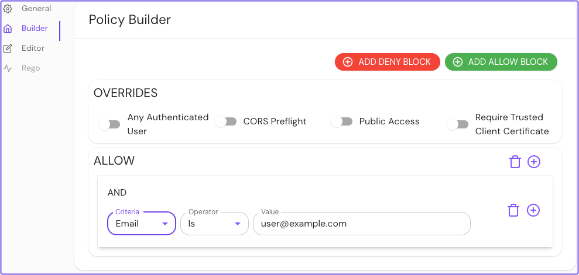
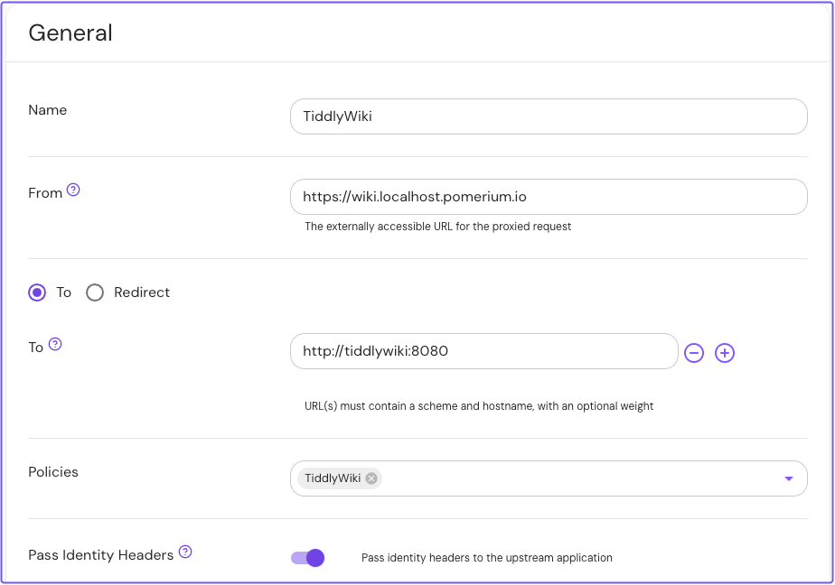
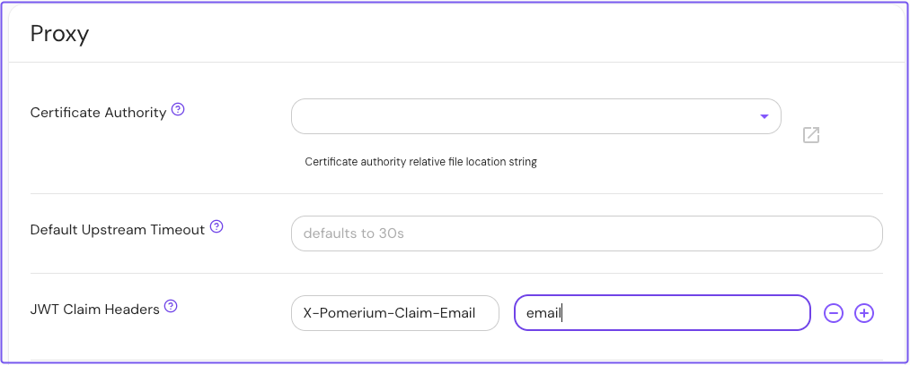
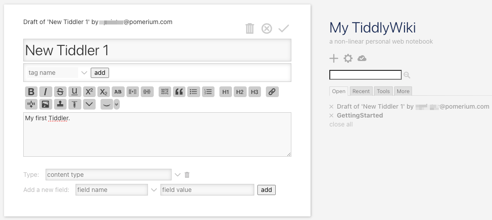

import Tabs from '@theme/Tabs';
import TabItem from '@theme/TabItem';

# TiddlyWiki

Learn how to add authentication and authorization to an instance of [TiddlyWiki on NodeJS](https://tiddlywiki.com/static/TiddlyWiki%2520on%2520Node.js.html) with Pomerium.

## What is TiddlyWiki on Node.js

TiddlyWiki is a personal wiki and a non-linear web notebook for organizing and sharing information.

It is available in two forms:

- As a single HTML page
- As a [Node.js application](https://www.npmjs.com/package/tiddlywiki)

In this guide, you will run Pomerium and your TiddlyWiki Node.js application in Docker containers.

## How you will secure TiddlyWiki

Securing access to TiddlyWiki involves two steps:

- Configuring Pomerium to forward specific user session data in an unsigned header to TiddlyWiki
- Configuring TiddlyWiki to accept a special request header for trusted authentication

In this way, you can implement single sign-on (SSO) for your TiddlyWiki instance, which means an authorized user only needs to authenticate once to access the application.

To configure TiddlyWiki, you'll set its [ListenCommand](https://tiddlywiki.com/static/ListenCommand.html) to use the `authenticated-user-header` parameter. You'll configure Pomerium to forward the user's `email` claim in an unsigned header to TiddlyWiki.

### Before you start

<Tabs>
<TabItem label="Core" value="Core">

If you completed our [Quickstart guide](/docs/get-started/quickstart), you should have a working Pomerium project with the following YAML files:

- `config.yaml`
- `docker-compose.yaml`

If you haven't completed the Quickstart:

- Install [Docker](https://www.docker.com/) and [Docker Compose](https://docs.docker.com/compose/install/)
- Create a `config.yaml` file for your Pomerium configuration
- Create a `docker-compose.yaml` file for your Docker configuration

### Set up Pomerium

Add the following code in your `config.yaml` file:

```yaml title="config.yaml"
authenticate_service_url: https://authenticate.pomerium.app

jwt_claims_headers:
  X-Pomerium-Claim-Email: email

routes:
  - from: https://wiki.localhost.pomerium.io
    to: http://tiddlywiki:8080
    pass_identity_headers: true
    policy:
      - allow:
          and:
            - email:
                # Replace with your email address
                is: user@example.com
```

Let's review the configuration file:

- The [`jwt_claims_headers`](/docs/reference/jwt-claim-headers) setting will forward the user's email address in an unsigned, HTTP request header. The header follows the custom format specified in the file (in this case, `X-Pomerium-Claim-Email`).
- The [`pass_identity_headers`](/docs/reference/routes/pass-identity-headers-per-route) setting tells Pomerium to forward all identity headers to the upstream application
- The attached policy authorizes users with a matching email address to access TiddlyWiki. Pomerium will forward the address specified in the policy to TiddlyWiki as an unsigned identity header.

### Set up Docker Compose services

Add the following code in your `docker-compose.yaml` file:

```yaml title="docker-compose.yaml"
services:
  pomerium:
    image: cr.pomerium.com/pomerium/pomerium:latest
    volumes:
      - ./config.yaml:/pomerium/config.yaml:ro
    ports:
      - 443:443

  tiddlywiki_init:
    image: elasticdog/tiddlywiki:latest
    volumes:
      - ./wiki:/tiddlywiki
    command: ['mywiki', '--init', 'server']

  tiddlywiki:
    image: elasticdog/tiddlywiki:latest
    ports:
      - 8080:8080
    volumes:
      - ./wiki:/tiddlywiki
    command:
      - mywiki
      - --listen
      - host=0.0.0.0
      - authenticated-user-header=X-Pomerium-Claim-Email
    depends_on:
      - tiddlywiki_init
```

Before you test your services, make sure the value of `authenticated-user-header` matches the value of the custom header defined in `config.yaml`.

**Run Docker Compose:**

```bash
docker compose up
```

</TabItem>
<TabItem label="Enterprise" value="Enterprise">

The Enterprise path to this guide requires a **Pomerium Enterprise** account and administrator access to an Enterprise Console instance.

It also assumes you are using [Docker](https://www.docker.com/) and [Docker Compose](https://docs.docker.com/compose/install/) to run your services.

## Set up TiddlyWiki

:::enterprise

The Docker Compose example below contains the minimal configuration required to run TiddlyWiki. It does not include the configuration for Pomerium Enterprise.

For an example Pomerium Enterprise configuration using Docker Compose, see the [**Enterprise Quickstart**](/docs/enterprise/quickstart) guide.

:::

In your `docker-compose.yaml` file, add the TiddlyWiki configuration:

```yaml title="docker-compose.yaml"
services:
  tiddlywiki_init:
    image: elasticdog/tiddlywiki:latest
    volumes:
      - ./wiki:/tiddlywiki
    command: ['mywiki', '--init', 'server']

  tiddlywiki:
    image: elasticdog/tiddlywiki:latest
    ports:
      - 8080:8080
    volumes:
      - ./wiki:/tiddlywiki
    command:
      - mywiki
      - --listen
      - host=0.0.0.0
      - authenticated-user-header=X-Pomerium-Claim-Email
    depends_on:
      - tiddlywiki_init
```

## Create a policy

1. In the **Builder** tab, select **ADD ALLOW BLOCK**
1. Select the **AND** operator
1. Select **Email** as the criteria and **Is** as the operator
1. Enter the email address you will authenticate with as the value

Save your policy.



## Create a route

1. Add a new route and enter a **Name**
1. In **From**, enter the externally accessible URL
1. In **To**, enter the internally accessible URL
1. Add the policy for this route (for example, `TiddlyWiki`)
1. Enable **Pass Identity Headers**

Save your route.



## Set identity headers

1. In the sidebar under **CONFIGURE**, select **Settings**
1. Select the **Proxy** tab
1. In **JWT Claim Headers**, enter the header and expected claim

Save your settings.



</TabItem>
</Tabs>

## Test TiddlyWiki

In your browser, navigate to your TiddlyWiki instance. Pomerium will prompt you to authenticate against its hosted identity provider.

After successful authentication, Pomerium will redirect you to your TiddlyWiki instance:



Great job! You successfully secured TiddlyWiki behind Pomerium.
