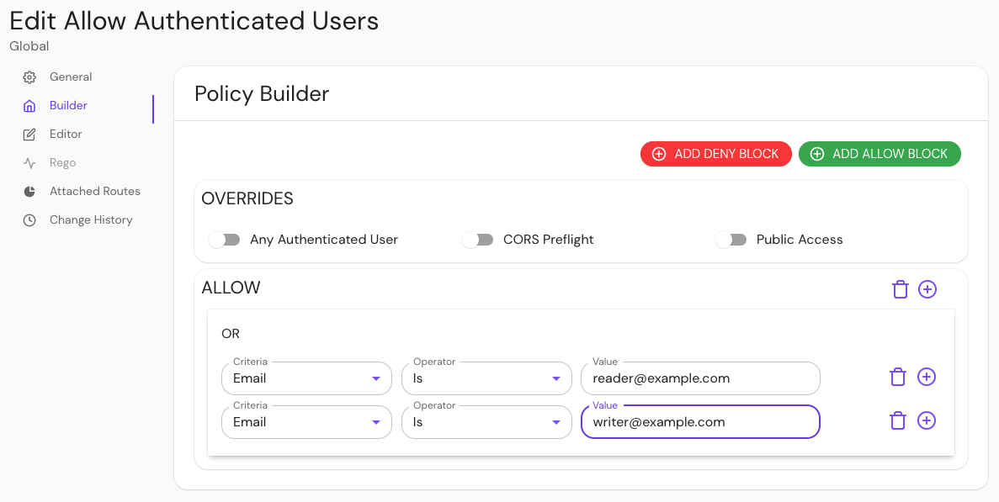
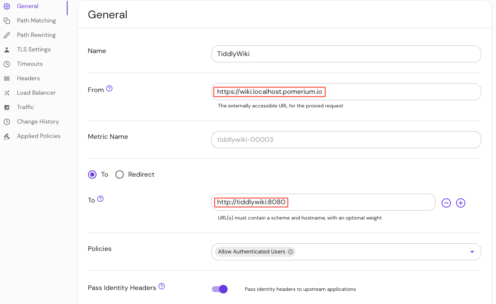
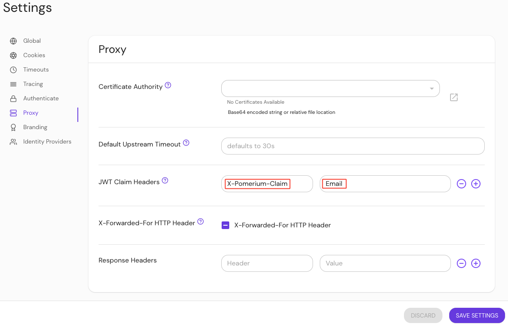

import DockerCompose from '../../examples/tiddlywiki/docker-compose.yaml.md';
import Tabs from '@theme/Tabs';
import TabItem from '@theme/TabItem';

# TiddlyWiki

Learn how to add authentication and authorization to an instance of [TiddlyWiki on NodeJS](https://tiddlywiki.com/static/TiddlyWiki%2520on%2520Node.js.html) with Pomerium.

## What is TiddlyWiki on Node.js

TiddlyWiki is a personal wiki and a non-linear notebook for organizing and sharing complex information. It is available in two forms:

- a single HTML page
- [a Node.js application](https://www.npmjs.com/package/tiddlywiki)

You will use the Node.js application in this guide.

## Authentication with Pomerium

TiddlyWiki allows you to authenticate users with the authenticated-user-header parameter of [listen command](https://tiddlywiki.com/static/ListenCommand.html). Pomerium provides the ability to login with well-known [identity providers](/docs/identity-providers#identity-provider-configuration) (IdP).

Pomerium can forward specific user session data to upstream applications. In the case of this guide, Pomerium will forward the email associated with your IdP to TiddlyWiki.

## Set up your environment

<Tabs>

<TabItem value="Core" label="Core">
</TabItem>

To complete this guide, you need:

- [Docker](https://www.docker.com/)
- [Docker Compose](https://docs.docker.com/compose/install/)

Refer to the [quick-start] guide for more information on how to run Pomerium Core with Docker and Docker Compose.

### Configure Pomerium

Add the following code in your `config.yaml` file:

```yaml title="config.yaml"
jwt_claims_headers: email
routes:
  - from: https://wiki.example.local
    to: http://tiddlywiki:8080
    policy:
      - allow:
          or:
            - email:
                is: reader@example.com
            - email:
                is: writer@example.com
```

The [`jwt_claims_header`](/docs/reference/jwt-claim-headers) forwards the email associated with your IdP in the HTTP request header to TiddlyWiki.

In the policy above, the emails specified (`reader@example.com` and `writer@example.com`) will be forwarded to TiddlyWiki.

### Configure Docker-Compose

Add the following code in your `docker-compose.yaml` file:

<DockerCompose />

Here is what the code is doing:
- `mywiki --listen host=0.0.0.0` starts the TiddlyWiki server, and maps ports `0.0.0.0` and `8080`
- `authenticated-user-header=x-pomerium-claim-email` enables Tiddlywiki to receive the user's email address from Pomerium
- `readers` and `writers` authorizes users to read and/or write to the TiddlyWiki server
- `username` and `password` specify which user can access TiddlyWiki in a session; excluding these variables will result in a `401` error

Run `docker-compose up`.


<TabItem value="Enterprise" label="Enterprise">

In your Console, create a policy: 

1. Enter a **Name** (e.g. 'Allow Authenticated Users')
2. Select **Builder**, **ADD ALLOW BLOCK**
3. Select **+** and add an **OR** operator
4. Under the **Criteria** dropdown, select **Email**
5. In the **Value** field, enter **reader@example.com**
6. Select **+** and repeat step 5, but enter **writer@example.com** instead. 

Save your policy. 




Create a route:

1. Enter a **Name** (e.g. 'TiddlyWiki')
2. In the **From** field, enter the externally accessible URL (e.g. `https://wiki.localhost.pomerium.io`)
3. In the **To** field, enter the host name (e.g. `http://tiddlywiki:8080`)
4. Under **Policies**, select **Add Authenticated Users**
5. Select **Pass Identity Headers**

Save your route. 



Configure your settings to send JWT claims headers to the upstream application:

1. Under **Settings**, select **Proxy**
2. In the **Header Key** field, enter **X-Pomerium-claim**
3. In the **JWT Claim** field, enter **Email**

Save your settings. 




</TabItem>

</Tabs>

### Test your routes

Navigate to your TiddlyWiki instance (e.g. `https://wiki.example.local`):

- If you log in as `reader@example.com`, you can only read tiddlers
- If you log in as `writer@example.com`, you can read and write tiddlers
- If you log in as `user@example.com`, you will receive a 401 error 

[quick-start]: /docs/quickstart
