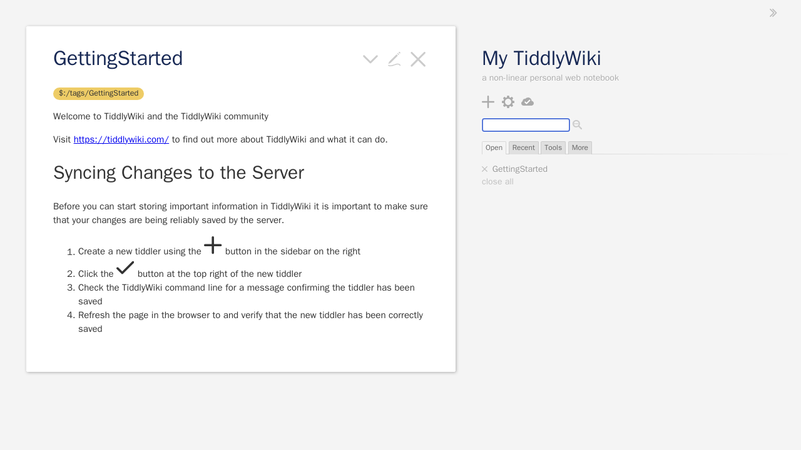

import TabItem from '@theme/TabItem';
import Tabs from '@theme/Tabs';

import Config from '/content/examples/guides/tiddlywiki/config.yaml.md';
import Compose from '/content/examples/guides/tiddlywiki/docker-compose.yaml.md';

# Secure TiddlyWiki with Pomerium

## What this guide does

You'll put [TiddlyWiki on Node.js](https://tiddlywiki.com/static/TiddlyWiki%2520on%2520Node.js.html) behind Pomerium so that Pomerium handles single sign-on and authorization. The TiddlyWiki Node.js server has no login of its own, so Pomerium also forwards the authenticated user's email in a request header. TiddlyWiki trusts that header as the logged-in user, which means edits are attributed to a real identity instead of an anonymous visitor.

## When to use this guide

Use it when you run the TiddlyWiki Node.js server (not the single-file HTML version) and want one authenticated front door for it with your existing identity. If you only need to reach a private TiddlyWiki over the network without browser SSO, a plain [TCP route](/docs/capabilities/non-http) is a simpler fit.

## Prerequisites

This guide assumes you've completed the [Quickstart](/docs/get-started/quickstart), so you already have Pomerium running and signing users in through the hosted authenticate service.

You also need:

- [Docker](https://docs.docker.com/install/) and [Docker Compose](https://docs.docker.com/compose/install/)
- A domain you control for the TiddlyWiki route (this guide uses `tiddlywiki.yourdomain.com`)

:::tip Prefer to self-host the identity provider?

This guide uses the hosted authenticate service so you don't have to run an identity provider (IdP). To run your own instead, follow [Keycloak + Pomerium](/docs/integrations/user-identity/oidc) and swap the `authenticate_service_url` / `idp_*` settings into the config below.

:::

## Configure Pomerium

<Tabs queryString="type">
<TabItem value="zero" label="Pomerium Zero" default>

In the [Zero Console](https://console.pomerium.app):

1. Create a **Route**. In **From**, enter `https://tiddlywiki.yourdomain.com`; in **To**, enter `http://tiddlywiki:8080`.
2. Set the policy to **Any Authenticated User**, or scope it to the people who should have access.
3. On the **Headers** tab, enable **Pass Identity Headers**, then add a JWT claim header that maps the `email` claim to `X-Pomerium-Claim-Email`. This is the header TiddlyWiki reads in the next section.

</TabItem>
<TabItem value="core" label="Pomerium Core">

Create a `config.yaml`. It routes `tiddlywiki.yourdomain.com` to the TiddlyWiki container, passes identity headers, and uses `jwt_claims_headers` to forward the user's email in an unsigned `X-Pomerium-Claim-Email` header.

<Config />

Replace `tiddlywiki.yourdomain.com` with your domain and `you@example.com` with your email. The [`jwt_claims_headers`](/docs/reference/jwt-claim-headers) setting forwards the email claim in the named header, and [`pass_identity_headers`](/docs/reference/routes/pass-identity-headers-per-route) tells Pomerium to attach the identity headers to every upstream request.

</TabItem>
</Tabs>

## Configure TiddlyWiki

The TiddlyWiki Node.js server is started with its [ListenCommand](https://tiddlywiki.com/static/ListenCommand.html). Two of its parameters matter here:

- `host=0.0.0.0` so the server accepts connections from the Pomerium container on the Docker network.
- `authenticated-user-header=x-pomerium-claim-email` so TiddlyWiki treats the email Pomerium forwards as the logged-in username. This value must match the header name from `jwt_claims_headers`.

The Compose file below runs a one-shot init step that creates the wiki folder with the `server` edition, then starts the listener with those parameters.

## Run the stack

The Compose file runs Pomerium Core and TiddlyWiki together (for Zero, drop the `pomerium` service and use the `compose.yaml` from the Quickstart with your `POMERIUM_ZERO_TOKEN`, keeping the `tiddlywiki` services below):

<Compose />

Start it:

```bash
docker compose up -d
```

## Verify the setup

1. **The route requires authentication.** In a fresh browser, open `https://tiddlywiki.yourdomain.com`. You should be redirected to sign in, not straight into the wiki.
2. **An allowed user gets in.** Sign in. Pomerium redirects you back to TiddlyWiki.
3. **TiddlyWiki recognizes the identity.** Open `https://tiddlywiki.yourdomain.com/status`. The JSON response should show your email as `username` and `anonymous: false`, confirming TiddlyWiki trusts the forwarded header.
4. **A disallowed user is blocked.** Sign in as a user your policy excludes and open `https://tiddlywiki.yourdomain.com`. Pomerium denies access, so no identity header is forwarded and you never reach the wiki.

Signed in, the wiki loads with your identity in place of an anonymous visitor:



## Common failure modes

- **TiddlyWiki always shows an anonymous user.** The header name on both sides doesn't match. Make sure `authenticated-user-header` equals the header in `jwt_claims_headers` (the comparison is case-insensitive, but the names must otherwise be identical), and that `pass_identity_headers` is enabled on the route.
- **`Wiki folder is not empty` on startup.** TiddlyWiki's `--init` fails against a folder that already contains a wiki. The Compose file guards against this so repeated `docker compose up` runs work; if you adapted the init step, only run it when `mywiki/tiddlywiki.info` is absent.
- **Redirect loop or certificate errors.** Make sure DNS for `tiddlywiki.yourdomain.com` points at Pomerium and that Pomerium can obtain a TLS certificate. On the Core path, `autocert` needs ports 80 and 443 reachable for Let's Encrypt; Zero manages certificates for you.

## Security considerations

TiddlyWiki blindly trusts whatever arrives in `authenticated-user-header`. It does not verify a signature, so the whole model rests on two things being true at once: Pomerium owns that header, and nothing else can reach TiddlyWiki.

- **Pomerium owns the header.** A client cannot impersonate someone by sending its own `X-Pomerium-Claim-Email`. Pomerium overwrites the inbound header with the authenticated identity before the request reaches the upstream, so a request that smuggles `attacker@evil.com` through Pomerium still arrives stamped with the real signed-in user. TiddlyWiki's `/status` keeps reporting the genuine identity.
- **Nothing else can reach TiddlyWiki.** Because the header is unsigned, a client that connects to TiddlyWiki directly could set the header to anyone. The Compose file puts TiddlyWiki on an `internal: true` network shared only with Pomerium and publishes no ports for it, so the only path in is through Pomerium. **Never publish the TiddlyWiki port.** If you need the upstream to cryptographically verify the identity itself rather than relying on network isolation, use a [signed JWT](/docs/capabilities/getting-users-identity) instead; TiddlyWiki's header auth does not check signatures.
- **Scope the route policy** (group or domain) to who should have access. Every allowed user becomes a named TiddlyWiki editor.

## Next steps

- [Build policies](/docs/get-started/fundamentals/zero/zero-build-policies)
- [Pass identity headers](/docs/reference/routes/pass-identity-headers-per-route)
- [Custom domains](/docs/capabilities/custom-domains)
