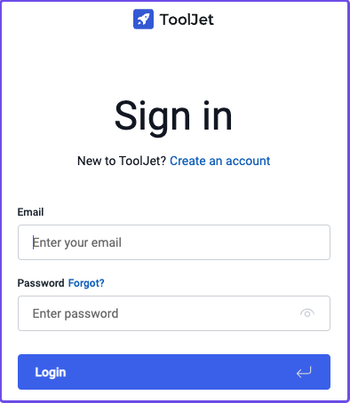

import ToolJetCompose from '../../examples/tooljet/docker-compose.yaml.md';
import PomeriumCompose from '../../examples/tooljet/docker-compose.yaml.md';
import PomeriumConfig from '../../examples/tooljet/config-tooljet.yaml.md';
import Tabs from '@theme/Tabs';
import TabItem from '@theme/TabItem';

# Run ToolJet with Docker

Run Pomerium with Docker Compose to secure your ToolJet application.

## What is ToolJet?

[ToolJet](https://www.tooljet.com/) is a self-hosted, low-code platform that helps you build and deploy internal developer tools.

## Why use Pomerium with ToolJet?

Pomerium can secure ToolJet by applying policy to your routes that only grants access to ToolJet by to certain users.

ToolJet provides its own RBAC-based [permissions](https://docs.tooljet.com/docs/org-management/permissions) and several [user authentication](https://docs.tooljet.com/docs/category/user-authentication) flows, so proxied requests will require users to sign in twice.

## Before you begin

To complete this guide, you need:

- [Docker](https://docs.docker.com/install/) and [Docker Compose](https://docs.docker.com/compose/install/)
- An [identity provider](/docs/identity-providers)

## Set up ToolJet

Set up your project to run ToolJet with Docker Compose:

```bash
curl -LO https://raw.githubusercontent.com/ToolJet/ToolJet/main/deploy/docker/docker-compose-db.yaml
mv docker-compose-db.yaml docker-compose.yaml
mkdir postgres_data
```

Add a `.env` file pre-populated with ToolJet's environment variables:

```bash
curl -LO https://raw.githubusercontent.com/ToolJet/ToolJet/main/deploy/docker/.env.example
mv .env.example .env
```

In your `.env` file, update `LOCKBOX_MASTER_KEY` and `SECRET_KEY_BASE` following ToolJet's [environment variable](https://docs.tooljet.com/docs/setup/env-vars) docs.

Keep the default values for `TOOLJET_HOSTNAME`, the database configuration, and the other environment variables.

## Run ToolJet

Run `docker compose up` to run your Pomerium and ToolJet containers.

In your terminal, wait until ToolJet is in a ready state:


In your browser, go to `localhost:80` to set up your workspace.

## Set up ToolJet workspace

Set up your admin account:


Set up your workspace:


Skip the prompts asking for your company information.

You should now be in your ToolJet dashboard.

Stop your containers.

## Set up Pomerium
<Tabs>
<TabItem value="Core" label="Core">

Create a `config.yaml` file and add the following code:

<PomeriumConfig />

Next, you need to:

- Update the IdP configuration variables with your own (See the [GitHub](/docs/identity-providers/github) guide for more information)
- Replace user@example.com with the email associated with your IdP
- Generate a signing key

To generate a [signing key](/docs/reference/signing-key), use the commands below:

```bash
# Generates a P-256 (ES256) signing key
openssl ecparam  -genkey  -name prime256v1  -noout  -out ec_private.pem
# Prints the base64 encoded value of the signing key
cat ec_private.pem | base64
```

Add the base64-encoded signing key to the `signing_key` variable in your `config.yaml` file.

## Add Pomerium services to Docker Compose

Update `docker-compose.yaml` with the following configuration:

<PomeriumCompose />

</TabItem>
<TabItem value="Enterprise" label="Enterprise">
Enterprise steps
</TabItem>
</Tabs>

### Update ToolJet hostname

To add a user to your ToolJet workspace, you must send them an invite link. ToolJet uses the `TOOLJET_HOSTNAME` value to create the link.

If you're following this guide using `localhost`, the link won't work. Replace `TOOLJET_HOSTNAME` with your Pomerium [external route](/docs/reference/routes/from) URL instead.

For example:

```env
TOOLJET_HOSTNAME=https://tooljet.localhost.pomerium.io
```

Go to your external route (`https://tooljet.localhost.pomerium.io`) to access ToolJet and sign in.



### Invite a user

To invite a user:

1. Select **Workspace settings**
2. In the **Users & Permissions** window, select **Invite new user**
3. Enter their details and select **Create User**
4. Copy their invite link


Open the link in a new tab:


Create a password and accept the invite to log in to the workspace.

From here, you can sign in as an admin and create apps within a workspace, create new workspaces, build apps within a given workspace, and configure workplace permissions to manage access and privileges for users and groups within ToolJet.


