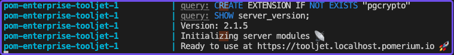
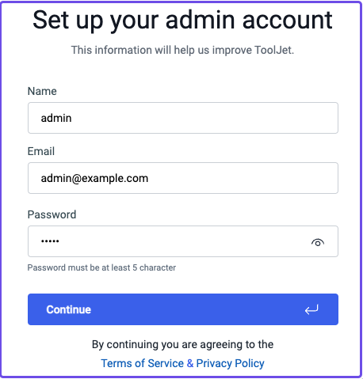
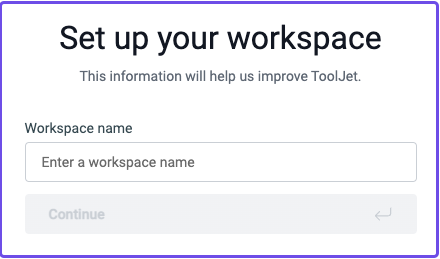

import ToolJetCompose from '../../examples/tooljet/docker-compose.yaml.md';
import PomeriumCompose from '../../examples/docker/basic.docker-compose.yml.md';
import PomeriumConfig from '../../examples/tooljet/config-tooljet.yaml.md';
import Tabs from '@theme/Tabs';
import TabItem from '@theme/TabItem';

# Run ToolJet with Docker

Run Pomerium with Docker Compose to secure your ToolJet application.

## What is ToolJet?

[ToolJet](https://www.tooljet.com/) is a self-hosted, low-code platform that helps you quickly build and deploy internal developer tools.


## Why use Pomerium with ToolJet?

ToolJet provides its own [permissions](https://docs.tooljet.com/docs/org-management/permissions) and several options for [user authentication](https://docs.tooljet.com/docs/category/user-authentication).

Pomerium can’t sign users into ToolJet itself, but you can apply an authorization policy that only grants access to certain users.

## Single sign-on (SSO) with GitHub

ToolJet supports SSO through GitHub and Google for free (you need a premium plan to use other identity providers that support OIDC).

This guide will use GitHub as the identity provider to authenticate users against Pomerium before granting access to a ToolJet workspace.

## Before you begin

To complete this guide, you need:

- [Docker](https://docs.docker.com/install/) and [Docker Compose](https://docs.docker.com/compose/install/)
- [GitHub](/docs/identity-providers/github) as an identity provider

## Set up Pomerium

<Tabs>
<TabItem value="Core" label="Core">

Create a `config.yaml` file and add the following code:

<PomeriumConfig />

Next, you need to:

- Update the identity provider configuration variables with your own (See the [GitHub](/docs/identity-providers/github) guide for more information)
- Replace user@example.com with the email associated with your IdP
- Generate a signing key

To generate a [signing key](/docs/reference/signing-key), use the commands below:

```bash
# Generates a P-256 (ES256) signing key
openssl ecparam  -genkey  -name prime256v1  -noout  -out ec_private.pem
# Prints the base64 encoded value of the signing key
cat ec_private.pem | base64
```

Add the base64-encoded signing key to the `signing_key` variable in your `config.yaml` file.

## Add Pomerium Services to Docker Compose

Create a `docker-compose.yaml` file and add the following code:

<PomeriumCompose />

## Set up ToolJet

Add the ToolJet Docker service to your `docker-compose.yaml` file:

<ToolJetCompose />

Run the command below to create an `.env` file pre-populated with ToolJet's environment variables:

```bash
curl -LO https://raw.githubusercontent.com/ToolJet/ToolJet/main/deploy/docker/.env.example
mv .env.example .env
```

In your `.env` file, update `TOOLJET_HOST`, `LOCKBOX_MASTER_KEY`, `SECRET_KEY_BASE`:

```env
TOOLJET_HOST=https://tooljet.corp.pomerium.io
LOCKBOX_MASTER_KEY=e90748d8d48fa0740b14e2e34bee3cdf4cc04900023963bd90e21584033e3579
SECRET_KEY_BASE=7b3db858da97f232d4dc5f0e7c5eb6ca59371f4205324041cfd917a4947f60f03d5b30393ee9b8a4e6ddc6d1e8f43c6164614a3044c14d71e45a99bf1eb7c3bd
```

To update the [environment variables](https://docs.tooljet.com/docs/setup/env-vars/):
- **TOOLJET_HOST:** Replace `TOOLJET_HOST` with the external route URL in your Pomerium config file (for example, `https://tooljet.corp.pomerium.io`)
- **LOCKBOX_MASTER_KEY:** Generate a new lockbox master key with `openssl rand -hex 32`
- **SECRET_KEY_BASE**: Generate a new secret key base with `openssl rand -hex 64`

Keep the default database configuration and leave the other environment variables empty.

## Run ToolJet

Run `docker compose up` to run your Pomerium and ToolJet containers.

In your terminal, wait until ToolJet is in a ready state:



In your browser, go to `localhost:80` to set up your workspace.

## Set up your ToolJet workspace

Set up your admin account:



Set up your workspace:



Skip the prompts asking for your company information.

You should now be in your ToolJet dashboard.
</TabItem>
<TabItem value="Enterprise" label="Enterprise">
Enterprise steps
</TabItem>
</Tabs>


