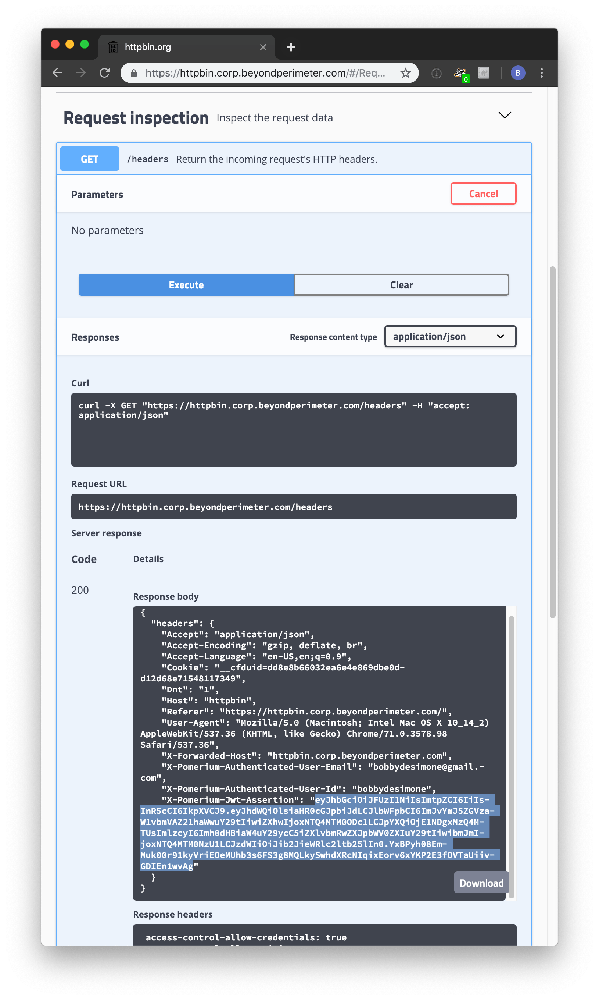
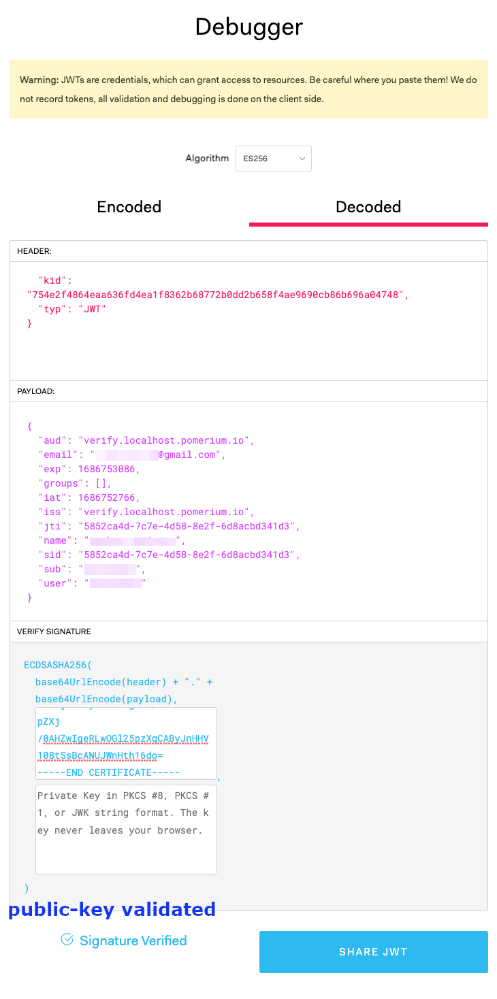

---
# cSpell:ignore Jklds, Tpai, Ibvjq, ecparam, pubout
title: JWT Verification
description: This guide provides several methods to validate the Pomerium JWT in an upstream application.
sidebar_label: JWT Verification
---

import Tabs from '@theme/Tabs'; import TabItem from '@theme/TabItem'; import GoApp from '../../examples/go-sdk/go-app.md'; import ReactApp from '../../examples/js-sdk/react-app.md';

This guide provides several methods to verify and validate the Pomerium JWT forwarded in signed the `X-Pomerium-Jwt-Assertion` header:

- Verification in a [Go application](#verification-in-a-go-application)
- Verification in a [single-page application](#verification-in-a-single-page-application)
- [Manual verification](#manual-verification)

## JWT validation requirements

Before trusting any user identity information in the JWT, your application should verify:

1. The JWT has a valid signature from a trusted source.
2. The JWT has not expired.
3. The JWT audience and issuer match your application's domain.

See [JWT validation](/docs/capabilities/getting-users-identity#jwt-validation) for specific instructions on validating each of these requirements.

## Verification in a Go application

For an application written in Go, you can use the [Go SDK](https://github.com/pomerium/sdk-go) to perform the necessary verification steps. For example:

<GoApp />

## Verification in a single-page application

Pomerium's [JavaScript SDK](https://github.com/pomerium/js-sdk) provides a client-side solution to verify JWTs issued by the authorization service.

### Requirements to use the JavaScript SDK

The JavaScript SDK is available as an [NPM package](https://www.npmjs.com/package/@pomerium/js-sdk) and can be imported using CommonJS or ECMAScript modules.

To use the JavaScript SDK, you need:

- [Node.js](https://nodejs.org/en/download/) (version 18+)
- [NPM](https://www.npmjs.com/) (to install Node.js and Yarn)
- [Yarn](https://classic.yarnpkg.com/lang/en/docs/install/#mac-stable) (preferred package manager)

The following code provides a minimum working example of how JWT verification works using the JavaScript SDK in a React app:

<ReactApp />

<details>
  <summary>Trust on first use (TOFU)</summary>
  <div>

The `issuer` and `audience` parameters are optional. If you don’t define them, `PomeriumVerifier` applies `firstUse` by default to the JWT provided by the identity provider. `PomeriumVerifier` verifies subsequent requests with these claims.

If you define the `issuer` and `audience` parameters, `PomeriumVerifier` verifies their values against the claims provided by the identity provider.

The `issuer` and `audience` parameters should both be set to the domain of the **upstream application** without the prefixed protocol (for example, `httpbin.corp.example.com`).

<b>Note:</b> We strongly recommend that you explicitly define the expected issuer and audience claims. Relying on a TOFU policy is dangerous in ephemeral serverless environments (such as AWS Lamda or Cloud Run), where applications are typically short-lived. 

  </div>
</details>

### PomeriumVerifier reference

The `PomeriumVerifier` class is the easiest way to verify JWTs. See the reference below for more information:

#### Parameters

| Parameters | Description | Value |
| :-- | :-- | --- |
| issuer | The domain of the upstream application (for example, `httpbin.corp.example.com`). | String |
| audience | The same value as `issuer`. | String |
| expirationBuffer | Adds padding in seconds to prevent throwing errors for expired JWTs that may have differing server times. Defaults to `0` | Integer |
| firstUse | Decides whether or not to trust the first JWT. | Boolean |
| jwtData | The JSON payload containing JWT claims. | Object |
| verifiedJwtData | The verified JSON payload containing JWT claims. | Object |

#### Methods

| Method | Description |
| :-- | :-- |
| getClientJwt | Fetches client JWT from the `/.pomerium/jwt` endpoint. |
| parseJWT | Decodes JWT token. |
| getJWKsData | Fetches JWKs data from the `/.well-known/pomerium/jwks.json` endpoint. |
| verifyPomeriumJWT | Verifies JWT using the `jwt`, `authenticateBaseUrl`, `issuer`, and `audience` parameters. |
| withHttps | Prepends the URL with the `https://` protocol. |
| signOut | Signs user out and redirects them with the `/.pomerium/sign_out` endpoint. |

## Manual verification

Though you will likely verify signed headers programmatically in your application's middleware with a third-party JWT library, if you are new to JWT it may be helpful to show what manual verification looks like.

1. Provide Pomerium with a base64-encoded Elliptic Curve ([NIST P-256](https://csrc.nist.gov/csrc/media/events/)) Private Key. In production, you'd likely want to get these from your key management service (KMS).

   ```bash
   openssl ecparam -genkey -name prime256v1 -noout -out ec_private.pem
   openssl ec -in ec_private.pem -pubout -out ec_public.pem
   # careful! this will output your private key in terminal
   cat ec_private.pem | base64
   ```

   Copy the base64 encoded value of your private key to Pomerium's environmental configuration variable `SIGNING_KEY`.

   ```bash
   SIGNING_KEY=LS0tLS1CRUdJTiBQUklWQVRFIEtFWS0tLS0tCk1JR0hBZ0VBTUJNR0J5cUdTTTQ5QWdFR0NDcUdTTTQ5QXdFSEJHMHdhd0lCQVFRZzBQdk1VeVZGeWxTbGZ3eDgKSDBxMUVyOHZlOXBnY3ZzNkV6ZnR5OHlxNnFLaFJBTkNBQVM5ZC96TC9aSXd5ZGQ1RXZMb0xGMytHblVIUS9wdQpQaU45NDV1Y1RpTFRqMDhZalo3U0NJV2JHc2tiK0RIMzJ2aUc2KzRnb0FvWlFUM1R6b2kzRVl6OAotLS0tLUVORCBQUklWQVRFIEtFWS0tLS0tCg==
   ```

1. Reload Pomerium. Navigate to httpbin (by default, `https://httpbin.corp.${YOUR-DOMAIN}.com`), and log in as usual. Click **request inspection**. Select `/headers`. Click **try it out** and then **execute**. You should see something like the following.

   

1. `X-Pomerium-Jwt-Assertion` is the signature value. It's less scary than it looks, and is basically just a compressed, JSON blob as described above. Navigate to [jwt.io](https://jwt.io/), which provides a helpful user interface to manually verify JWT values.

1. Paste the value of `X-Pomerium-Jwt-Assertion` header token into the `Encoded` form. You should notice that the decoded values look much more familiar.

   

1. Finally, we want to cryptographically verify the validity of the token. To do this, we will need the signer's public key. You can simply copy and paste the output of `cat ec_public.pem`.

   

**Voila!** Hopefully walking through a manual verification has helped give you a better feel for how signed JWT tokens are used as a secondary validation mechanism in pomerium.
