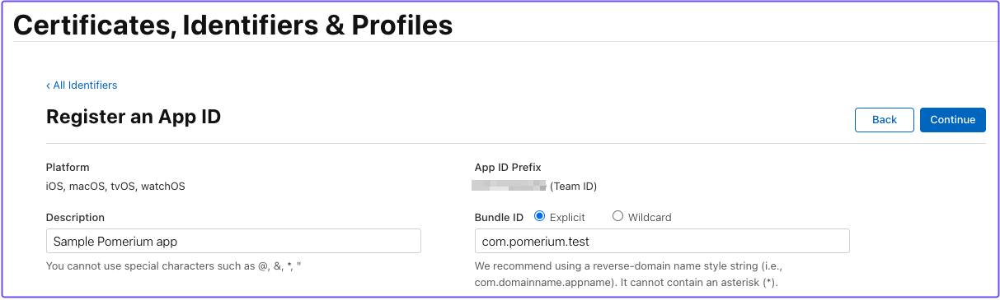
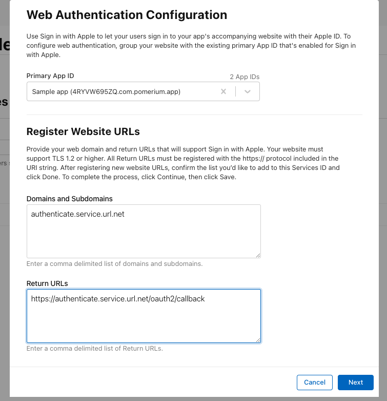
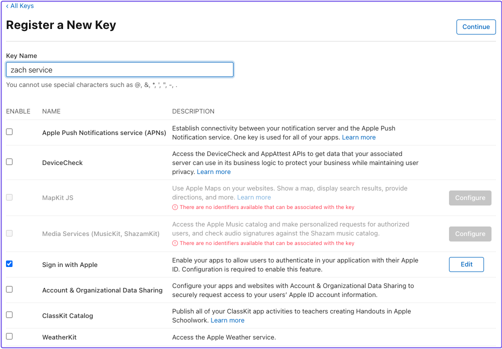
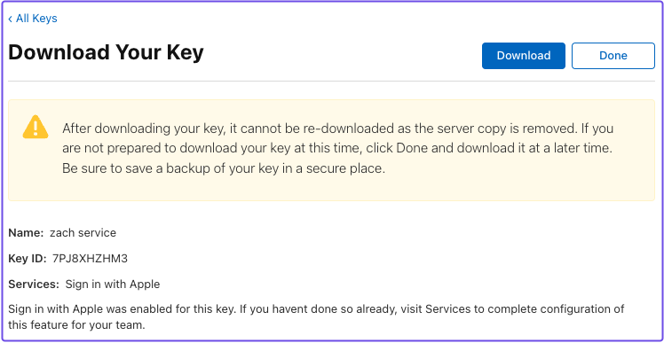
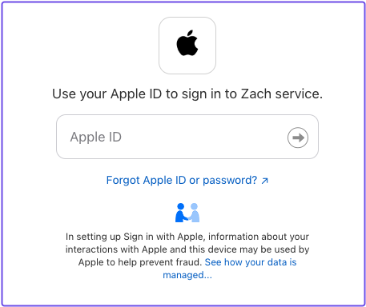

# Apple

Integrate Apple as an identity provider with Pomerium using Apple's **Sign in with Apple** authentication service. 

To complete this guide:
- [Install Pomerium](/docs/deploying)
- Enroll in Apple's [Developer Program](https://apps.apple.com/us/app/wwdc/id640199958)

## Set up Apple

In your Account dashboard, go to **Certificates, IDs, & Profiles**.

### Register an App ID

1. Select **Identifiers**
1. Create a new Identifier (**+**) and select **App IDs**
1. For app type, select **App**
1. Enter a **Description**
1. For **Bundle ID**, select **Explicit** and enter a domain (for example, `com.app.test`)
1. Under **Capabilities**, select **Sign In with Apple**

  

### Register a Services ID

1. Go back to **Certificates, Identifiers & Profiles**
1. Select **+** and **Services IDs**
1. Enter a **Description** and **Identifier** (for example, `com.app.test.dev-service`)
1. Register your Services ID

Edit your **Services ID Configuration**:
1. Under the **App ID** dropdown, select **Services IDs**
1. Select your **Services ID**
1. Enable **Sign In with Apple** and select **Configure**

In the **Web Authentication Configuration** window:
1. Select the **Primary App ID**
1. In **Domains and Subdomains**, enter your authenticate service URL (for example, `authenticate.service.url.net`)
1. In **Return URLs**, enter your authenticate service URL and the `/oauth2/callback` path (for example, `https://authenticate.service.url.net/oauth2/callback`)
1. Select **Continue** and save your Service ID configuration



### Create a signing key

1. Go back to the **Certificates, Identifiers & Profiles** page
1. From the sidebar, select **Keys**
1. Create a new key (**+**)
1. Under **Register a New Key**, enter a **Key Name**
1. Select **Sign in with Apple** and **Configure**
1. In **Configure Key**, select the **Primary App ID**



After successfully creating a signing key, Apple will prompt you to download your key. 



Download the key and store it somewhere safe. You can only download it once and must pass in the key in order to generate your **Client Secret** (JWT). 

## Generate a signed JWT

Apple requires a signed JWT for the client secret.

You can use any library to generate and sign the JWT. At a minimum, the JWT should include the following claims, fields, and values (per [Apple's docs](https://developer.apple.com/documentation/sign_in_with_apple/generate_and_validate_tokens#3262048)):

| **Header** |
| :--- | :--- |
| `alg` | The algorithm used to sign the token. For Sign in with Apple, use `ES256`. |
| `kid`| A 10-character key identifier generated for the Sign in with Apple private key associated with your developer account. |

| **Payload Claims** |
| :--- | :--- |
| `iss`| 10-character Team ID associated with your Developer Account. |
| `exp` | Expiration time; must not exceed 15777000 (6 months in seconds) from Current UNIX Time. |
| `aud` | Use `https://appleid.apple.com`. The audience claim identifies the intended recipient of the client secret. |
| `sub` | Use `client_id`. The subject identifies the principal that is the subject of the client secret. |

**Note:** Your `client_id` must be the value of either **Service ID** or **App ID**. 

To sign your JWT, use the [signing key](#create-a-signing-key) you downloaded earlier. 

Once you've generated a signed JWT, you can configure Pomerium.

## Set up Pomerium

In your Pomerium configuration file, add the following identity provider settings:

```yaml title=pomerium-config
idp_provider: apple
idp_client_id: app_or_service_id
idp_client_secret: signed_apple_jwt
```

Access a route defined in your configuration file. 

Apple should prompt you to sign in:



:::tip

If you get a `403` response when accessing a route, but should be permitted access based on your policy, check that the expected claims are included in your Apple JWT. 

For example, the minimal claims defined by Apple exclude `email` as a claim. If your policy only grants access to users with a certain email address or domain, Pomerium would still deny access because the claim isn't included in Apple's JWT.

:::


