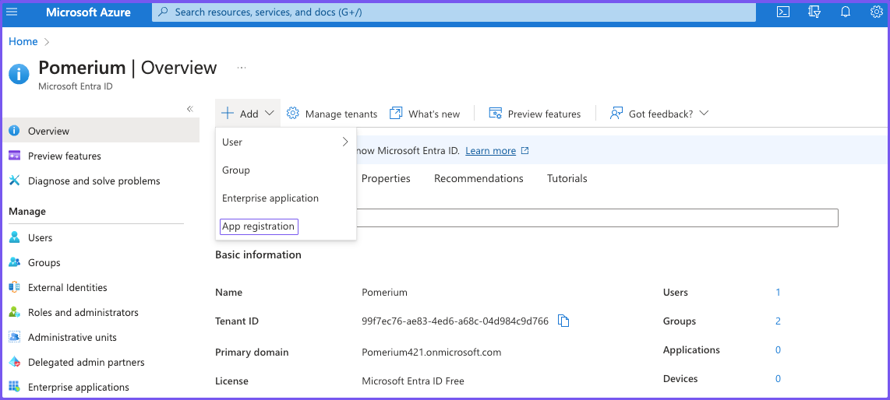
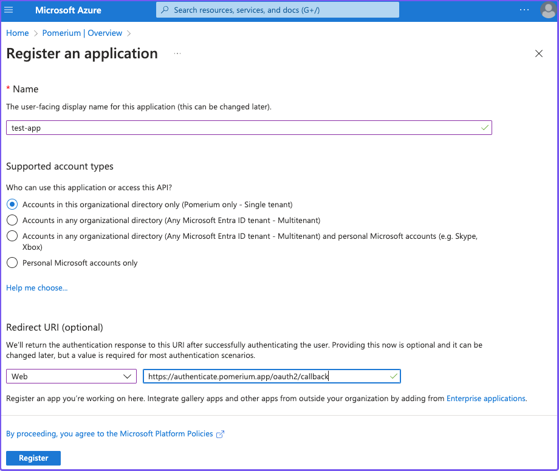
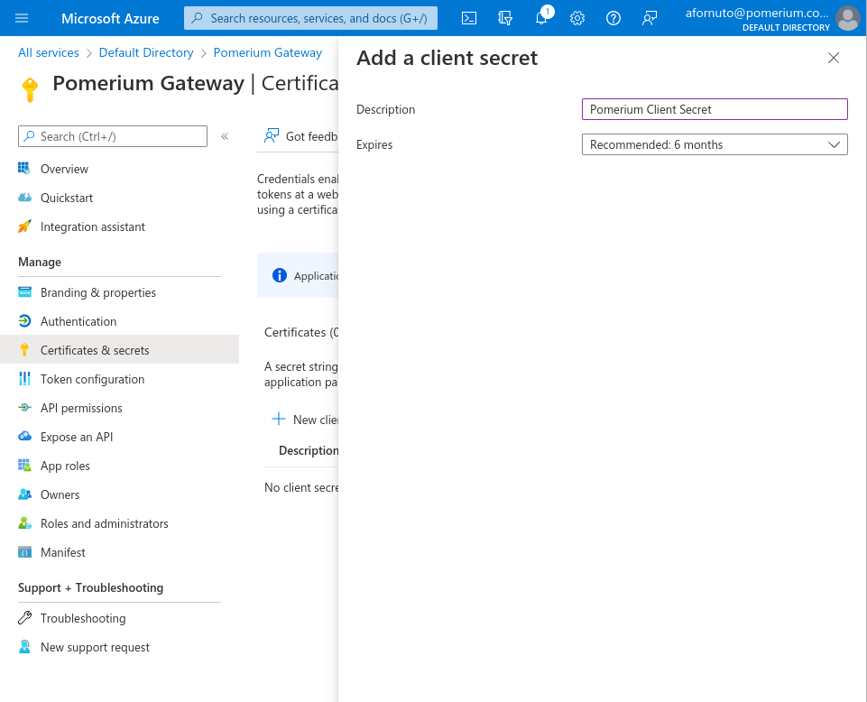
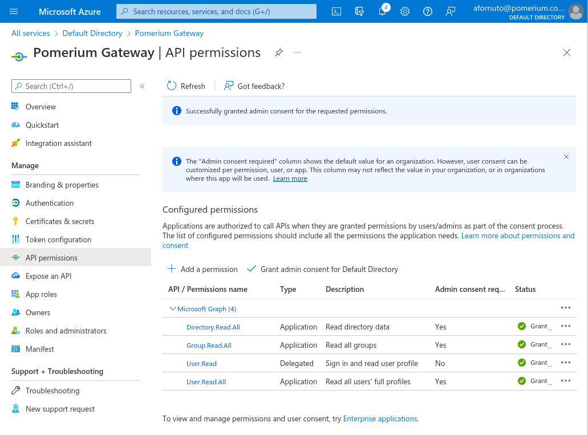
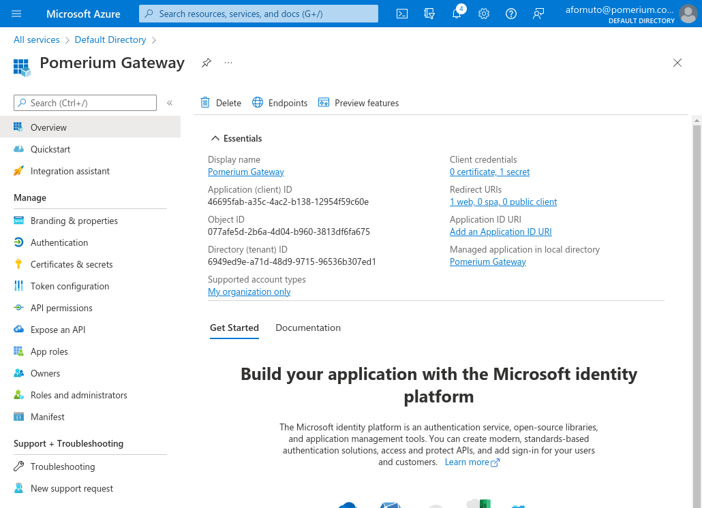
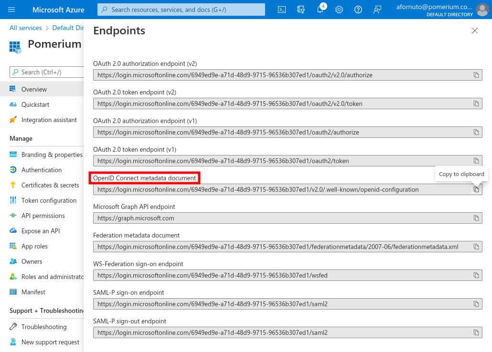
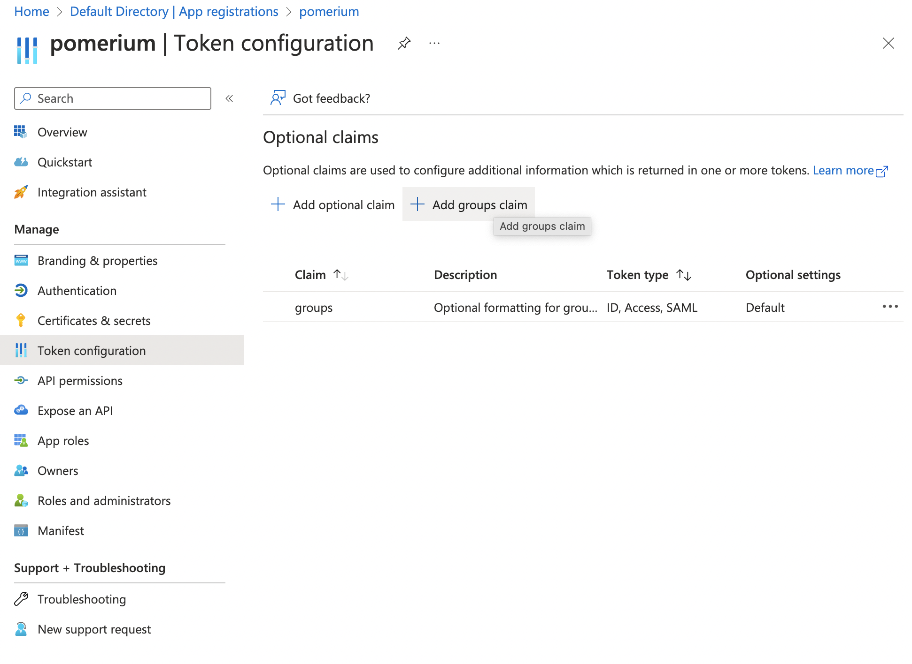
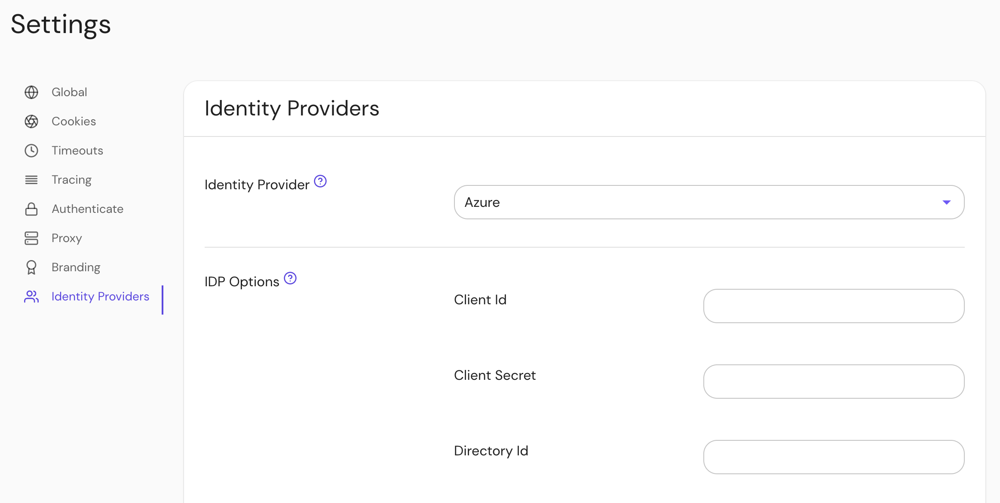

import Tabs from '@theme/Tabs';
import TabItem from '@theme/TabItem';

# Microsoft Entra ID (Azure Active Directory)

Learn how to configure Pomerium to use **Microsoft Entra ID** (formally Azure Active Directory) as an identity provider.

:::caution

While we do our best to keep our documentation up to date, changes to third-party systems are outside our control. Refer to [Quickstart: Register an application with the Microsoft identity platform](https://docs.microsoft.com/en-us/azure/active-directory/develop/quickstart-register-app) from Microsoft's documentation as needed, or [let us know](https://github.com/pomerium/documentation/issues/new?assignees=&labels=&template=doc-error.md) if we need to re-visit this page.

:::

## Before you begin

To complete this guide, you must:

- Install [Pomerium](/docs/deploy/core)
- Create a free [Microsoft 365 admin account](https://www.microsoft.com/en-us/microsoft-365/business) (or have admin privileges with an existing Microsoft 365 account)

## Access Entra ID

If you want users to sign in to an application using a Microsoft Entra ID account, either from your organization or from external directories, you must register the application through the Microsoft Azure portal.

You can access the Azure management portal from your Microsoft service, or visit [the Azure portal](https://portal.azure.com) and sign in to Azure using the global administrator account used to create the Microsoft 365 (formally Office 365) organization.

:::tip

There is no way to create an application that integrates with Microsoft Azure AD without having **your own** Microsoft Azure AD instance.

:::

If you have a Microsoft 365 account, you can use the account's Entra ID instance instead of creating a new one. You can access Entra ID from the **Microsoft 365 admin center** or directly from the **Azure portal**.

To find your Microsoft 365 Entra ID instance from the Microsoft 365 admin center:

1. [Sign in](https://login.microsoftonline.com/) to Microsoft 365
1. In the sidebar, select **Admin**
1. In the **admin center** sidebar, select **Identity**

To find your Microsoft 365 Entra ID instance from the Azure portal:

1. [Sign in](https://azure.microsoft.com/en-us/free) to Azure
1. Select the sidebar menu to expand It
1. Select **Microsoft Entra ID**

Either of these instructions will take you to the Entra ID backing your Microsoft 365 account.

## Create a new application

Once you're in the Entra ID dashboard, register an application:

1. In the Microsoft Entra ID dashboard, register a new app:

  

1. Enter a name for the application. Under **Redirect URI**, select **Web** and set the value to `https://${authenticate_service_url}/oauth2/callback`.

  

   After you register the application, note the Application (client) ID, and Directory (tenant) ID.

1. Under Client credentials, click **Add a certificate or secret**. The secret you create will be used as the **[Client Secret]** in Pomerium's configuration settings.

1. Under **Client secrets** click **+ New client secret**. Enter a name for the key and choose the desired duration.

   

   :::tip

   If you choose an expiring key, make sure to record the expiration date in your calendar, as you will need to renew the key (get a new one) before that day to ensure users don't experience a service interruption.

   :::

   Click on **Add** and the key will be displayed. **Make sure to copy the value of this key before leaving this screen**, otherwise you may need to create a new key.

   :::note

   Confirm you are copying the **Value**, and not the **ID**.

   :::

### API Permissions

In order to retrieve group information from Active Directory, we need to enable the necessary permissions for the [Microsoft Graph API](https://docs.microsoft.com/en-us/graph/auth-v2-service#azure-ad-endpoint-considerations).

Please note, [Group ID](https://docs.microsoft.com/en-us/graph/api/group-get?view=graph-rest-1.0&tabs=http) not group name will be used to affirm group membership.

1. From the application page, click **API permissions**.

   - Click the **+ Add a permission** button and select **Microsoft Graph API**.
   - Select **Application permissions**.
   - Use the filter to select the checkboxes for **Directory.Read.All**, **Group.Read.All** and **User.Read.All**, then click **Add permissions**.

   

   You can also optionally select **Grant admin consent for Default Directory** which will suppress the permission screen on first login for users.

1. The most unique step to Azure AD provider, is to take note of your specific endpoint. Navigate to **Azure Active Directory** -> **Apps registrations** and select your app.

   

   Click on **Endpoints**

   

The **OpenID Connect Metadata Document** value will form the basis for Pomerium's **Provider URL** setting.

For example if the **Azure OpenID Connect** url is:

```bash
https://login.microsoftonline.com/0303f438-3c5c-4190-9854-08d3eb31bd9f/v2.0/.well-known/openid-configuration`
```

**Pomerium Identity Provider URL** would be

```bash
https://login.microsoftonline.com/0303f438-3c5c-4190-9854-08d3eb31bd9f/v2.0
```

## Pomerium Configuration

Configure Pomerium with the identity provider settings retrieved in the previous steps.

<Tabs>
<TabItem value="config.yaml" label="config.yaml">

```yaml
idp_provider: 'azure'
idp_provider_url: 'https://login.microsoftonline.com/{REPLACE-ME-SEE-ABOVE}/v2.0'
idp_client_id: 'REPLACE-ME'
idp_client_secret: 'REPLACE-ME'
```

</TabItem>
<TabItem value="Environment Variables" label="Environment Variables">

```bash
IDP_PROVIDER="azure"
IDP_PROVIDER_URL="https://login.microsoftonline.com/{REPLACE-ME-SEE-ABOVE}/v2.0"
IDP_CLIENT_ID="REPLACE-ME"
IDP_CLIENT_SECRET="REPLACE-ME"
```

</TabItem>
</Tabs>

## Getting Groups

<Tabs>
<TabItem value="Custom Claim (Open Source)" label="Custom Claim (Open Source)">

### Custom Claim (Open Source)

To authorize users based on their group membership, Azure supports adding a `group` claim to the identity token:



Now when users login they will have a claim named `groups` that contains their groups and the `claim` PPL criterion can be used for authorization:

```yaml
routes:
  - from: 'https://verify.localhost.pomerium.io'
    to: 'https://verify.pomerium.com'
    policy:
      - allow:
          and:
            - claim/groups: 'e14f56fd-b956-4009-b06c-dc8a5e9207c8'
```

:::tip

The `groups` claim contains group IDs, not group names.

:::

</TabItem>
<TabItem value="Directory Sync (Enterprise)" label="Directory Sync (Enterprise)">

### Directory Sync (Enterprise)

Azure uses the same Client ID and Client Secret used in [Pomerium Core](/docs/identity-providers).

### Configure Pomerium Enterprise Console

Under **Settings → Identity Providers**, select "Azure" as the identity provider and set the Client ID, Client Secret and Directory (Tenant) ID.



## Troubleshooting

- In our testing, we found that users could be created in an Active Directory without an email address as part of their user claim. Pomerium user identity depends largely on the associated email address.
- If your default user in the Active Directory is unauthorized (403) even when specified as allowed in a policy by user, you can mitigate by creating a group membership and corresponding policy.

</TabItem>
</Tabs>

[client id]: /docs/reference/identity-provider-settings#identity-provider-client-id
[client secret]: /docs/reference/identity-provider-settings#identity-provider-client-secret
[environmental variables]: https://en.wikipedia.org/wiki/Environment_variable
[oauth2]: https://oauth.net/2/
