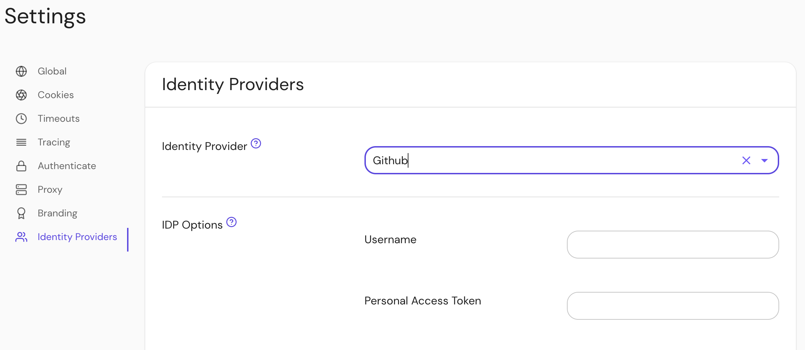

import Tabs from '@theme/Tabs';
import TabItem from '@theme/TabItem';

This document describes the use of GitHub as an identity provider for Pomerium. It assumes you have already [installed Pomerium](/docs/install/)

:::caution

The [GitHub API] does not support [OpenID Connect], just [OAuth 2.0]. For this reason, it was challenging to implement revocation of a user's **Access Token** (a string representing the granted permissions) when they sign out from Pomerium's user info endpoint.

:::

## Create a GitHub OAuth 2.0 Application

1. Log in to [Github](https://github.com/login) or create an account.

1. Navigate to your profile using the avatar on the navigation bar, and select **Settings**:

1. Navigate to **Developer settings ➞ OAuth Apps** and select **New OAuth App**.


1. Create a new OAuth2 application by filling the form fields above with the following parameters:

   | Field | Description |
   | --- | --- |
   | Application name | The name of your web app. |
   | Homepage URL | The homepage URL of the application to be integrated with Pomerium. |
   | Authorization callback URL | `https://${authenticate_service_url}/oauth2/callback`, `authenticate_service_url` from your Pomerium configuration. |

1. After creating the application, select **Generate a new client secret** and save **Client Secret** along with the **Client ID**.

## Pomerium Configuration

After creating your GitHub OAuth application, update the **Pomerium** configuration:

<Tabs>
<TabItem value="config.yaml" label="config.yaml">

```bash
idp_provider: "github"
idp_client_id: "REDACTED"       // github application ID
idp_client_secret: "REDACTED"   // github application secret
```

</TabItem>
<TabItem value="Environment Variables" label="Environment Variables">

```bash
IDP_PROVIDER="github"
IDP_CLIENT_ID="REDACTED"       // github application ID
IDP_CLIENT_SECRET="REDACTED"   // github application secret
```

</TabItem>
</Tabs>

Whenever a user tries to access your application integrated with Pomerium, they will be presented with a sign-on page as below:


### Getting groups

<Tabs>
<TabItem value="Custom Claim (Open Source)" label="Custom Claim (Open Source)">

### Custom Claim (Open Source)

The [GitHub API] does not support [OpenID Connect], just [OAuth 2.0] and it is not possible to get groups using a custom identity (`id_token`) claim. A full directory sync is required.

</TabItem>
<TabItem value="Directory Sync (Enterprise)" label="Directory Sync (Enterprise)">

### Directory Sync (Enterprise)

In order for Pomerium to validate group membership, we'll also need to configure a [Personal Access Token](https://docs.github.com/en/authentication/keeping-your-account-and-data-secure/creating-a-personal-access-token) in GitHub.

Create a new token at [github.com/settings/tokens/new](https://github.com/settings/tokens/new). It needs the `read:org` and `user:email` permissions.


### Configure Pomerium Enterprise Console

Under **Settings → Identity Providers**, select "Github" as the identity provider and set the Username and Personal Access Token.



</TabItem>
</Tabs>

[github api]: https://developer.github.com/v3/#oauth2-token-sent-in-a-header
[openid connect]: https://en.wikipedia.org/wiki/OpenID_Connect
[oauth 2.0]: https://auth0.com/docs/protocols/oauth2
