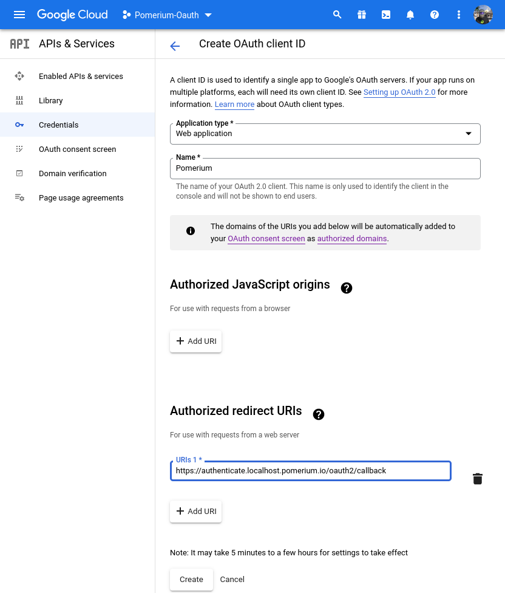
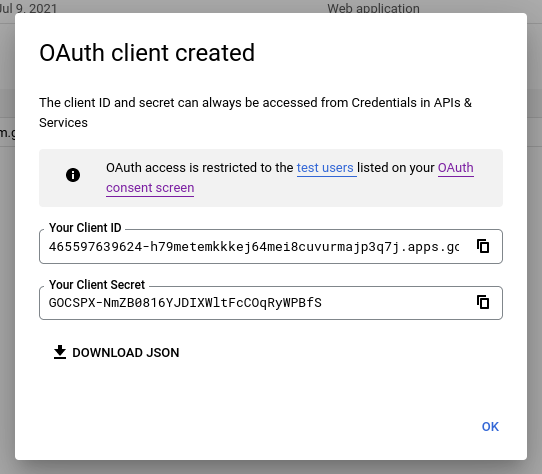
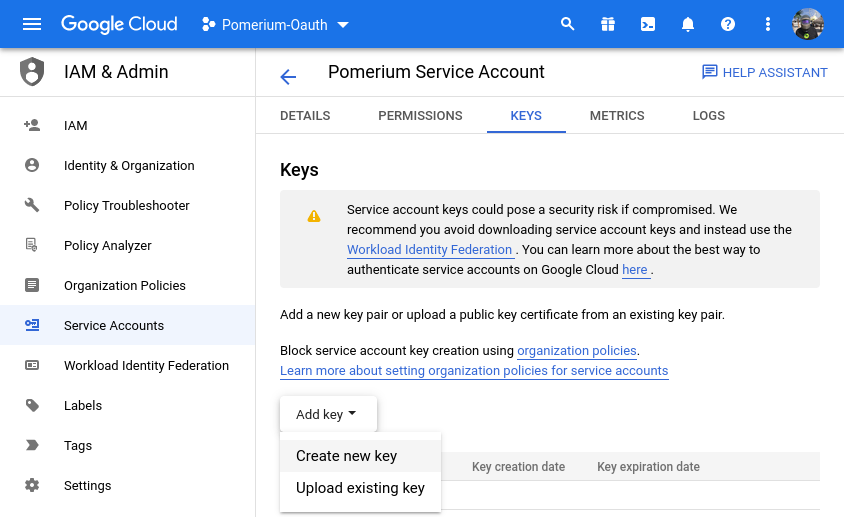
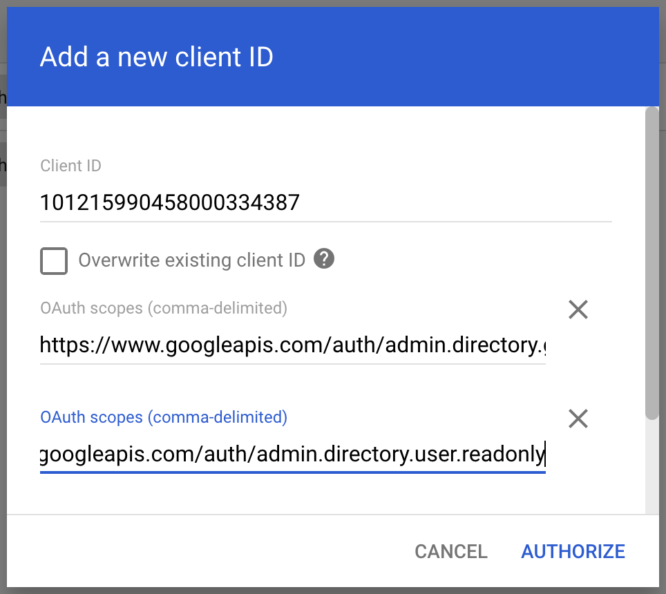
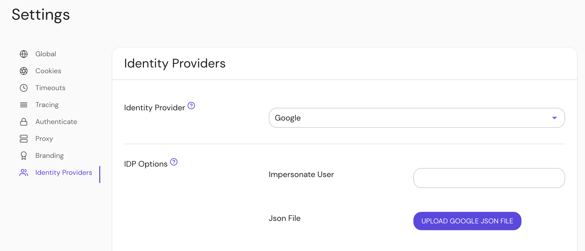

import Tabs from '@theme/Tabs';
import TabItem from '@theme/TabItem';

This guide covers the basics of setting up Pomerium to use GCP and Google Workspace / G Suite as your identity provider.

:::caution

Google changes their configuration screens frequently. Please refer to Google's documentation for authoritative instructions.

- [Setting up OAuth 2.0](https://developers.google.com/identity/protocols/oauth2/openid-connect)
- [Perform Google Workspace Domain-Wide Delegation of Authority](https://developers.google.com/admin-sdk/directory/v1/guides/delegation)

:::

## Setting up OAuth 2.0

You need [OAuth 2.0 credentials](https://developers.google.com/identity/protocols/oauth2/openid-connect), including a client ID and client secret, to authenticate users.

### Create OAuth 2.0

Log in to your Google account and go to the [APIs & services](https://console.developers.google.com/projectselector/apis/credentials).

1. Navigate to **Credentials** using the left-hand menu. If you're not already in a project, you can select one here.

1. On the **Credentials** page, click **Create credentials** and choose **OAuth [Client ID]**.


:::caution

If you don't currently have an OAuth consent page configured, Google will not allow you to create credentials until this is completed. Please follow Google's [instructions](https://developers.google.com/identity/protocols/oauth2/openid-connect#consentpageexperience) for doing so.

:::

1. For the **Application type** choose **Web application**.

1. Give the client ID a Name, and add an **Authorized redirect URI**. The redirect URI format is `https://${authenticate_service_url}/oauth2/callback` (e.g.`https://authenticate.localhost.pomerium.io/oauth2/callback`).



Click **Create** once complete.

1. The Google Cloud Console will display your Client ID and Client Secret. Temporarily save these values to import into Pomerium later.



## Configure Pomerium

Edit `config.yaml` or set your [environment variables] to connect Pomerium to Google:

<Tabs>
<TabItem value="config.yaml" label="config.yaml">

```yaml title=/etc/pomerium/config.yaml
idp_provider: 'google'
idp_client_id: 'yyyy.apps.googleusercontent.com'
idp_client_secret: 'xxxxxx'
```

</TabItem>
<TabItem value="Environment Variables" label="Environment Variables">

```bash
IDP_PROVIDER="google"
IDP_CLIENT_ID="yyyy.apps.googleusercontent.com"
IDP_CLIENT_SECRET="xxxxxx"
```

</TabItem>
</Tabs>

## Getting Groups

<Tabs>
<TabItem value="Custom Claim (Open Source)" label="Custom Claim (Open Source)">

Unfortunately, Google does not yet support getting groups data using a custom claim. Groups must be loaded by using a plugin to fetch directory information (see Enterprise's Directory Sync).

</TabItem>

<TabItem value="Directory Sync (Enterprise)" label="Directory Sync (Enterprise)">

## Setting Up Directory Sync

### Create a service account

In order for Pomerium to validate group membership, we'll also need to configure a [service account](https://console.cloud.google.com/iam-admin/serviceaccounts) with [G-suite domain-wide delegation](https://developers.google.com/admin-sdk/directory/v1/guides/delegation) enabled.

1. Open the [**Service accounts** page](https://console.developers.google.com/iam-admin/serviceaccounts). If prompted, select a project.

1. Click **+ Create Service Account**, enter a name and description for the service account. You can use the default service account ID, or choose a different, unique one. When done click **Create and continue**.

1. The next sections, labeled **Grant this service account access to project** and **Grant users access to this service account**, are not required. Click **Continue** to both, and then **Create**.

1. Select your new service account, and click on the **KEYS** tab. Select **Add key**, then **Create new key**:



In the side panel that appears, select the format for your key: **JSON**.

1. Click **Create**. Your new public/private key pair is generated and downloaded to your machine; it serves as the only copy of this key. For information on how to store it securely, see [Managing service account keys](https://cloud.google.com/iam/docs/understanding-service-accounts#managing_service_account_keys).

1. Click **Close** on the **Private key saved to your computer** dialog, then click **←** to return to the table of your service accounts.

Next, we need to enable enable G Suite domain-wide delegation:

1. Locate the newly-created service account in the table. Under **Actions**, click **Manage Details**.

1. In the service account details, click **Advanced settings**. **Show domain-wide delegation**, then ensure the **Enable G Suite Domain-wide Delegation** checkbox is checked.

   :::caution

   Domain-wide delegation may not be possible from here, depending on what type of Google account you have, as well as Google's updates to their interface. Consult their documentation on [Domain-Wide Delegation of Authority] as needed.

   If you haven't yet configured your app's OAuth consent screen, you must do so before you can enable domain-wide delegation. Follow the on-screen instructions to [configure the OAuth consent screen](https://support.google.com/cloud/answer/10311615?hl=en&ref_topic=3473162#), then repeat the above steps and re-check the checkbox.

   :::

1. Click **Save** to update the service account, and return to the table of service accounts. A new column, **Domain-wide delegation**, can be seen. Click **View Client ID**, to obtain and make a note of the client ID.

### Set directory permissions for Workspaces

Next, we need to give that service account permissions on the GSuite / Workspace side of the house.

1. From your Google Workspace domain's [Admin console](http://admin.google.com/) Main menu, go to **Security** > **Access and data control** > **API controls**.

1. In the **Domain wide delegation** pane, select **Manage Domain Wide Delegation**.

1. Click **Add new**.

1. In the **Client ID** field, enter the client ID obtained from the service account creation steps above.

1. In the **OAuth Scopes** field, enter a comma-delimited list of the scopes required for your application (for a list of possible scopes, see [Authorize requests](https://developers.google.com/admin-sdk/directory/v1/guides/authorizing)).

Include at a minimum the following list of scopes:

- `https://www.googleapis.com/auth/admin.directory.group.readonly`
- `https://www.googleapis.com/auth/admin.directory.user.readonly`

1. Click the **Authorize** button.



### Configure Pomerium Enterprise Console

Under **Settings → Identity Providers**, select "Google" as the identity provider and set the Impersonate User and JSON file.



</TabItem>
</Tabs>

[client id]: /docs/reference/identity-provider-client-id
[client secret]: /docs/reference/identity-provider-client-secret
[domain-wide delegation of authority]: https://developers.google.com/admin-sdk/directory/v1/guides/delegation
[environment variables]: https://en.wikipedia.org/wiki/Environment_variable
[oauth2]: https://oauth.net/2/
[openid connect]: https://en.wikipedia.org/wiki/OpenID_Connect
[so-answer]: https://stackoverflow.com/questions/48585700/is-it-possible-to-call-apis-from-service-account-without-acting-on-behalf-of-a-u/48601364#48601364
