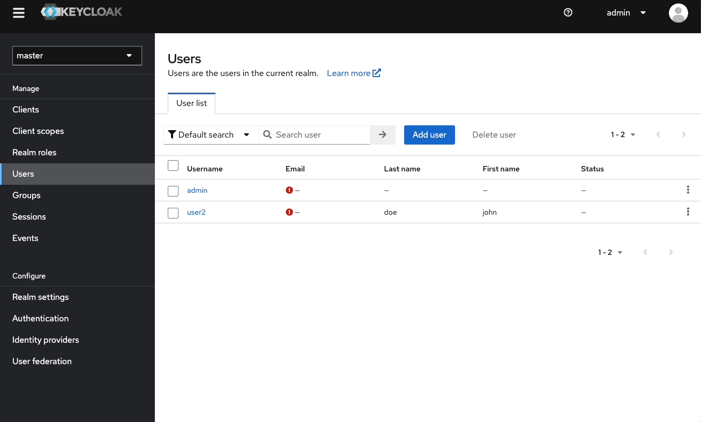
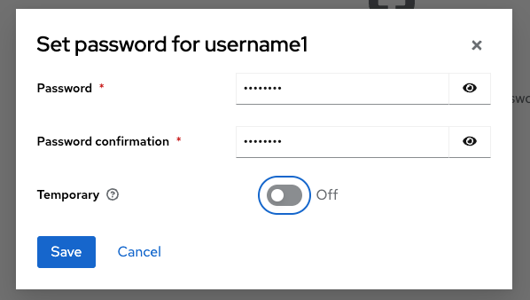
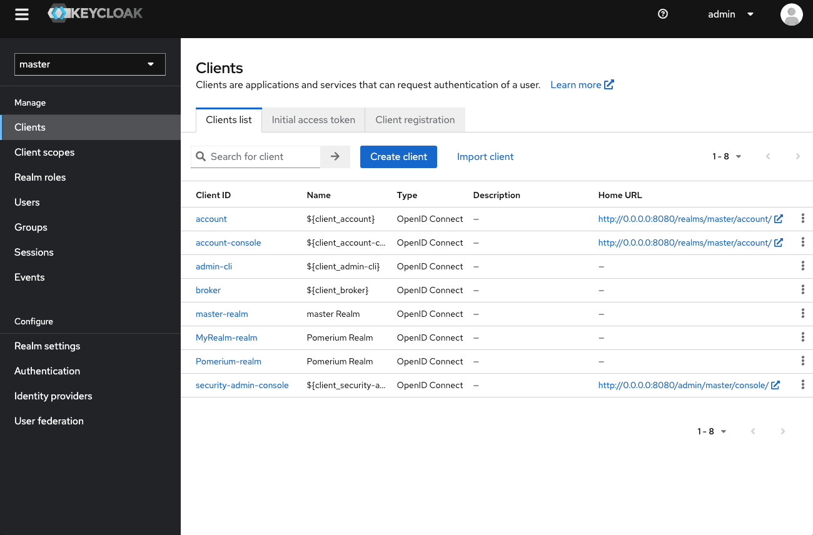
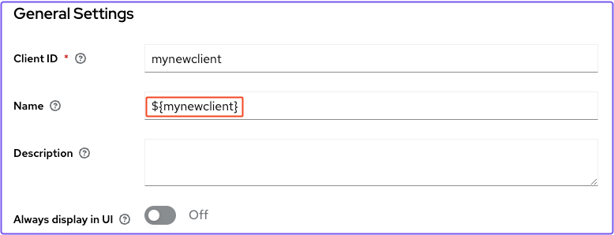
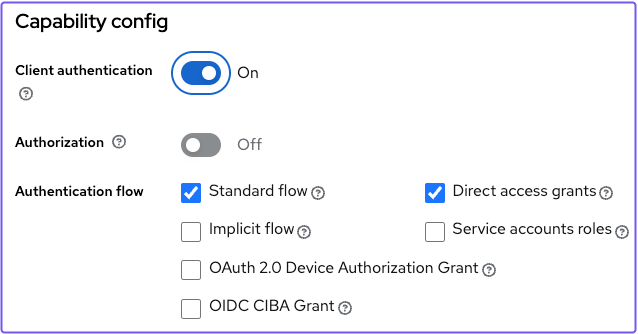
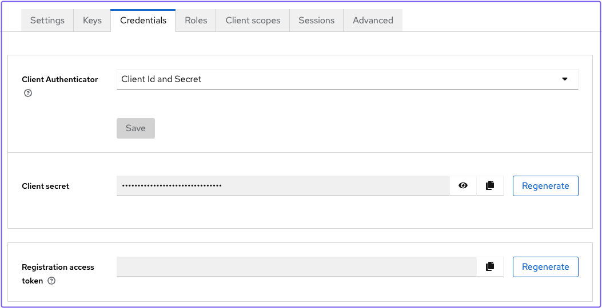
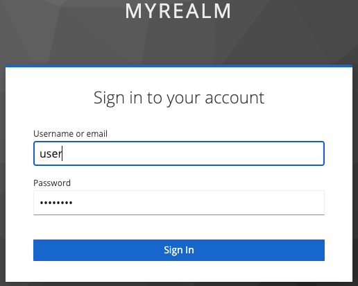
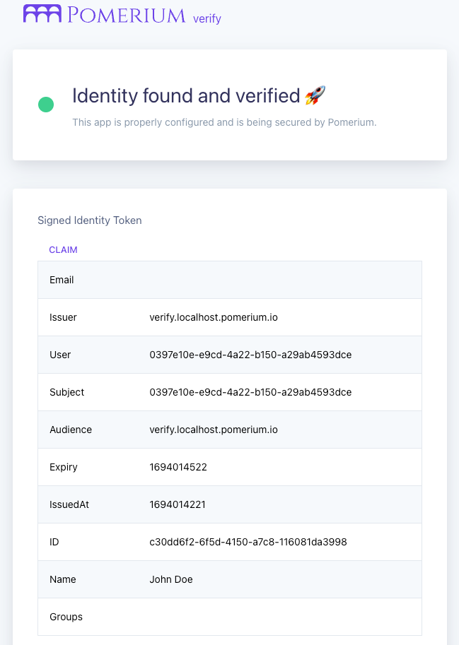

---
# cSpell:ignore keycloak, mykeycloak, mynewclient
id: oidc
title: OIDC
description: Learn how integrate a generic OIDC provider with Pomerium.
keywords: [keycloak, pomerium, oidc, generic oidc]
lang: en-US
---

import SelfSignedCertWarning from '@site/content/docs/admonitions/_handle-self-signed-certificate-warning.mdx';

# Generic OIDC

This guide covers how to configure a generic OpenID Connect (**OIDC**) provider to work with Pomerium.

## Background

Pomerium provides default [identity provider settings](/docs/reference/identity-provider-settings) that allow you to seamlessly connect with a number of well-known identity provider (**IdP**) solutions. However, Pomerium can also connect with any generic OIDC provider if both Pomerium and the OIDC provider are properly configured.

To learn how a generic [OIDC](https://openid.net/specs/openid-connect-core-1_0.html) implementation works with Pomerium, you will configure [Keycloak](https://www.keycloak.org/) as your OIDC provider.

## Before you start

This guide requires you to self-host the Keycloak server. To minimize set up time, you will deploy Pomerium, Keycloak, and the Pomerium Verify service in Docker containers.

To complete this guide, you need:

- [Docker](https://docs.docker.com/install/)
- [Docker Compose](https://docs.docker.com/compose/install/)

## Set up Docker Compose

Create a `docker-compose.yaml` file and add the following configuration:

```yaml title="docker-compose.yaml"
services:
  mykeycloak:
    image: quay.io/keycloak/keycloak:22.0.1
    command:
      - start-dev
    environment:
      - KEYCLOAK_ADMIN=admin
      - KEYCLOAK_ADMIN_PASSWORD=admin
    ports:
      - 8080:8080
    networks:
      default:
        aliases:
          - keycloak.localhost.pomerium.io
  pomerium:
    image: cr.pomerium.com/pomerium/pomerium:latest
    volumes:
      - ./config.yaml:/pomerium/config.yaml:ro
    ports:
      - 443:443
  verify:
    image: cr.pomerium.com/pomerium/verify:latest
    environment:
      JWKS_ENDPOINT: https://pomerium/.well-known/pomerium/jwks.json
```

Note the following points about this configuration:

- `start-dev` runs the Keycloak server in Development mode
- The admin console username and password are both `admin`
- The Keycloak server is assigned a network alias (`keycloak.localhost.pomerium.io`) so Pomerium can generate a sign-in redirect URL that resolves to the Keycloak container on the host machine

## Set up Keycloak

In your terminal, run Docker Compose:

```yaml
docker compose up
```

When Keycloak is ready, navigate to [http://localhost:8080](http://localhost:8080) to access the **Administration Console:**


Sign in with the admin credentials.

### Create a realm

Keycloak uses realms to manage sets of users, credentials, roles, and groups. When you start Keycloak, your instance comes with an admin realm called `master`.

To create a new non-admin group, create a new realm in the admin dashboard:

1. Select the **master** dropdown
1. Select **Create Realm**
1. In the **Realm name** field, enter a name, like "Pomerium"
1. Select **Create**


### Create a user

Your realm has no users at first. To add a user:

1. Go to the admin console ([http://localhost:8080/admin](http://localhost:8080/admin))
1. Select **Users**
1. Select **Add users**
1. Enter a **Username**, a **First name**, and **Last name**
1. Select **Create**



Now, assign the user a password:

1. Select the **Credentials** tab
1. Select **Set password**
1. Enter a password and confirm it
1. Set **Temporary** to **Off** so the user doesn't have to reset the password at the first login
1. Select **Save**



### Create a client

Lastly, you need to create a **Client** for the realm you just created:

1. Go to the admin console ([http://localhost:8080/admin](http://localhost:8080/admin))
1. Select **Clients**, then **Create client**
1. Keep **Client type** as **OpenID Connect**
1. In the **Client ID** field, enter a name like `mynewclient`
1. In the **Authentication flow** field, select **Standard flow** and **Direct access grants**
1. Leave **Login settings** empty, and select **Save**



Update the client you created:

1. Under **General Settings** in the **Name** field, enter your Client ID in template literals (for example, `${mynewclient}`) 
1. Go to **Access settings**
1. In **Root URL**, enter `${authBaseUrl}`
1. In **Home URL**, enter `/realms/<your_realm>/<your_client_id>/`
1. In **Valid redirect URIs**, enter `https://authenticate.localhost.pomerium.io/oauth2/callback`
1. In **Web Origins**, enter `https://authenticate.localhost.pomerium.io` 
1. Under **Capabilities config**, turn on **Client authentication** 

Save your settings.

### Get the client secret

In the client details page:

1. select the **Credentials** tab
1. Copy the **Client secret** 

You need to include the client secret in your Pomerium configuration file.

## Set up Pomerium

Create a YAML file and add the following configuration:

```yaml title="config.yaml"
authenticate_service_url: https://authenticate.localhost.pomerium.io

idp_provider: oidc
idp_client_id: 'mynewclient'
idp_client_secret: 'your_client_secret' # enter your client secret here
idp_provider_url: 'http://keycloak.localhost.pomerium.io:8080/realms/Pomerium'

signing_key: LS0tLS1CRUdJTiBFQyBQUklWQVRFIEtFWS0tLS0tCk1IY0NBUUVFSVA2TUN5UFI5OUNmSEVkU0s4cVdzbk51Q0RyMVZ3ay93RER1RVhyQitELzZvQW9HQ0NxR1NNNDkKQXdFSG9VUURRZ0FFQ0JTK3gyQnJRNVJqNHJFcU5PSEVsUFVESXJiRlNhRitoWEhEL1RYby9rQWVKU1lJSjJHVwpZMnE0a0NPNTU4RmdoYmxDTUplYVdjV1luT3JuZkpxeXRnPT0KLS0tLS1FTkQgRUMgUFJJVkFURSBLRVktLS0tLQo=

routes:
  - from: https://verify.localhost.pomerium.io
    to: http://verify:8000
    allow_any_authenticated_user: true
    pass_identity_headers: true
```

First, add your **client secret** to the configuration file.

Note the following points:

- The `idp_provider_url` should match the Keycloak network alias in your Docker Compose file. So that it's valid, add the protocol (`http://`) and the correct path (`/realms/<your_realm>`) to the URL.
- The `signing_key` is used by Pomerium to cryptographically sign the user's JWT, and is required for [identity verification](/docs/capabilities/getting-users-identity)
- The [`pass_identity_headers`](/docs/reference/routes/pass-identity-headers-per-route) setting forwards the JWT Assertion Header to the upstream application

:::caution

Do not use the **signing key** in the example above in a production environment. See [**Signing Keys**](/docs/reference/signing-key-settings#signing-key) for more information on generating and using signing keys.

:::

### Access the Verify app

Access the **Verify URL** in your configuration file.

:::tip

<SelfSignedCertWarning />

:::

Pomerium should redirect you to the sign-in page of the Keycloak realm you created. Sign in with your user's credentials.



Once you sign in, you can verify that Pomerium handled the JWT and included the OIDC claims from Keycloak:


