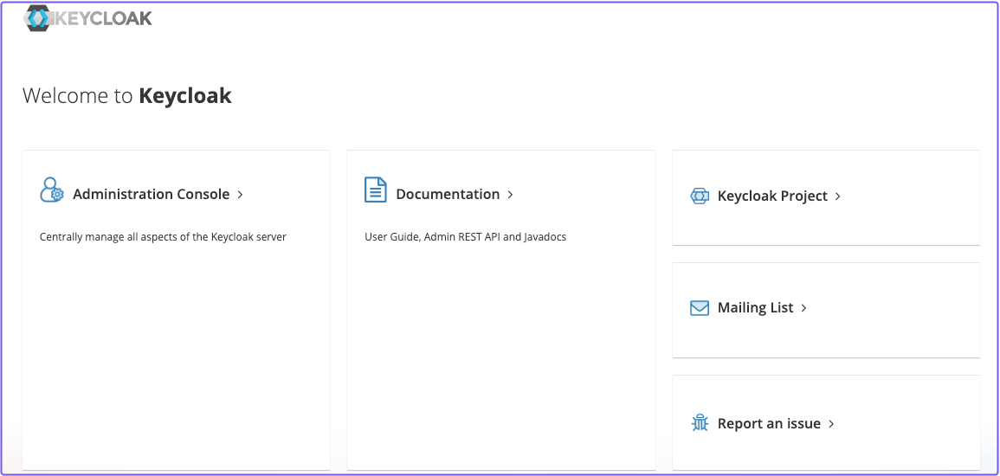
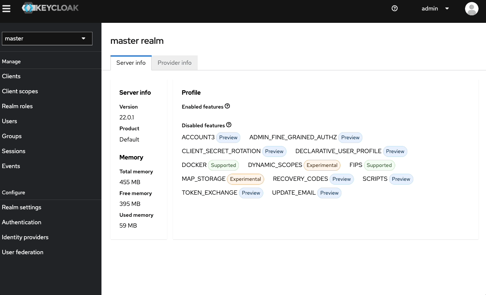

# Generic OIDC

This guide covers how to configure a generic OpenID Connect (**OIDC**) provider to work with Pomerium.

## Background

Pomerium provides default [identity provider settings](/docs/reference/identity-provider-settings) that allow you to seamlessly connect with a number of well-known identity provider (**IdP**) solutions. However, Pomerium can also connect with any OIDC-compliant provider if both Pomerium and the IdP are properly configured.

To demonstrate how a generic [OIDC](https://openid.net/specs/openid-connect-core-1_0.html) implementation would work with Pomerium, you will configure [Keycloak](https://www.keycloak.org/) to authenticate your users.

## Before you start

This implementation requires you to self-host Keycloak. To minimize set up time, you will deploy Pomerium, Keycloak, and the Pomerium Verify service in Docker containers.

To complete this guide, you need:
- [Docker](https://docs.docker.com/install/)
- [Docker Compose](https://docs.docker.com/compose/install/)

## Set up Docker Compose

Create a `docker-compose.yaml` file and add the following configuration:

```yaml title="docker-compose.yaml"
version: '3'
services:
  mykeycloak:
    image: quay.io/keycloak/keycloak:22.0.1
    command:
      - start-dev
    environment:
      - KEYCLOAK_ADMIN=admin
      - KEYCLOAK_ADMIN_PASSWORD=admin
    ports:
      - 8080:8080
    networks:
      default:
        aliases:
          - keycloak.localhost.pomerium.io
  pomerium:
    image: pomerium/pomerium:v0.23.0
    volumes:
      - ./config.yaml:/pomerium/config.yaml:ro
    ports:
      - 443:443
  verify:
    image: pomerium/verify:latest
    expose:
      - 8000
    environment:
      JWKS_ENDPOINT: https://pomerium/.well-known/pomerium/jwks.json
```

Note the following points about this configuration:

- `start-dev` runs the Keycloak server in Development mode
- The admin console username and password are both `admin`
- The Keycloak server is assigned a network alias (`keycloak.localhost.pomerium.io`) so Pomerium can connect with a sign-in request


## Set up Keycloak

In your terminal, run Docker Compose:

```yaml
docker compose up
```

When Keycloak is ready, navigate to `0.0.0.0:8080` to access the **Administration Console:**



Sign in with the admin credentials.

### Create a realm

Keycloak uses realms to manage sets of users, credentials, roles, and groups. When you start Keycloak, your instance comes with an admin realm called `master`.

To create a new non-admin group, create a new realm in the admin dashboard:

1. Select the **master** dropdown
2. Select **Create Realm**
3. In the **Realm name** field, enter a name
4. Select **Create**



### Create a user

Your realm starts out with no users. To create a user:

1.


## Set up Pomerium

Create a YAML file and add the following configuration:

```yaml title="config.yaml"
authenticate_service_url: https://authenticate.localhost.pomerium.io

idp_provider: oidc
idp_client_id: 'account'
idp_provider_url: 'http://keycloak.localhost.pomerium.io:8080/realms/MyRealm'

signing_key: LS0tLS1CRUdJTiBFQyBQUklWQVRFIEtFWS0tLS0tCk1IY0NBUUVFSVA2TUN5UFI5OUNmSEVkU0s4cVdzbk51Q0RyMVZ3ay93RER1RVhyQitELzZvQW9HQ0NxR1NNNDkKQXdFSG9VUURRZ0FFQ0JTK3gyQnJRNVJqNHJFcU5PSEVsUFVESXJiRlNhRitoWEhEL1RYby9rQWVKU1lJSjJHVwpZMnE0a0NPNTU4RmdoYmxDTUplYVdjV1luT3JuZkpxeXRnPT0KLS0tLS1FTkQgRUMgUFJJVkFURSBLRVktLS0tLQo=

routes:
  - from: https://verify.localhost.pomerium.io
    to: http://verify:8000
    allow_any_authenticated_user: true
    pass_identity_headers: true
```


