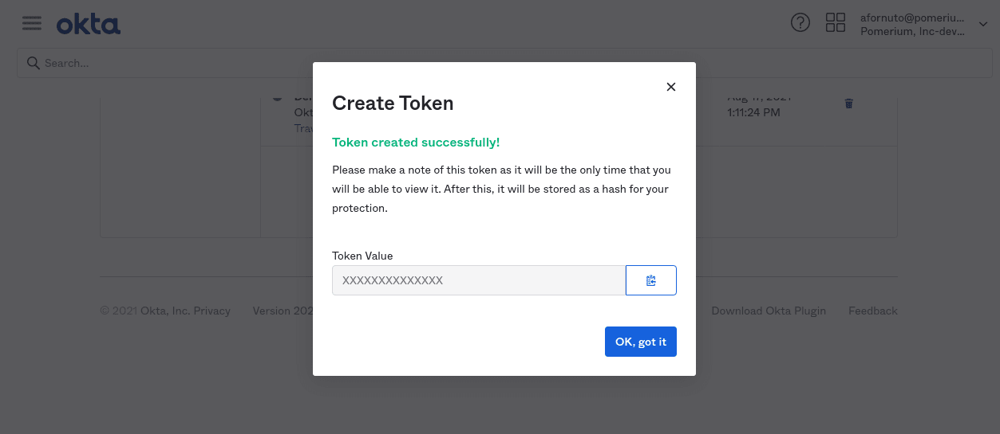
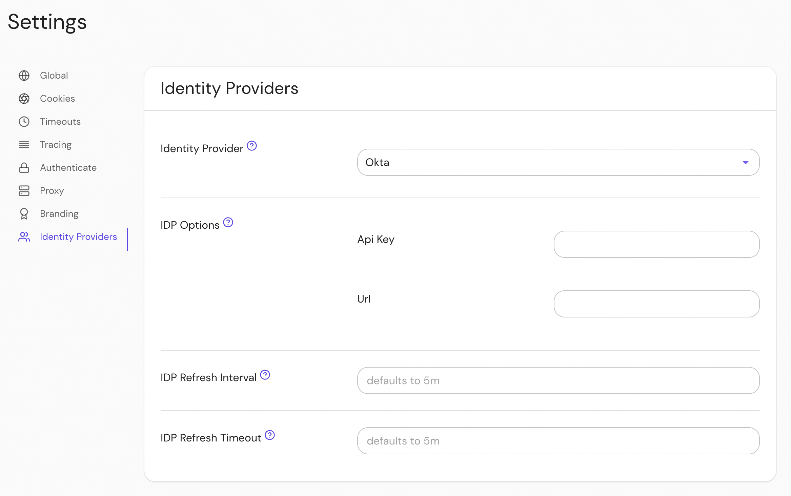

import Tabs from '@theme/Tabs';
import TabItem from '@theme/TabItem';

# Okta

Okta is a popular identity provider used by businesses of all sizes. Integrating Pomerium with Okta allows you to use the identity Okta provides to apply context-driven policies from Pomerium to your infrastructure.

This page covers configuring Okta to communicate with Pomerium as an [IdP](/docs/internals/glossary#identity-provider). It assumes you have already [installed Pomerium][pomerium-install] before you begin.

:::caution

While we do our best to keep our documentation up to date, changes to third-party systems are outside our control. Refer to [Okta's developer docs](https://developer.okta.com/docs/guides/sign-in-overview/main/) as needed, or [let us know](https://github.com/pomerium/documentation/issues/new?assignees=&labels=&template=doc-error.md) if we need to re-visit this page.

:::

## Create OpenID Connect Application

1. [Log in to your Okta account](https://login.okta.com) From the left-hand menu, Select **Applications → Applications** on the top menu.

   

1. Click the **Create App Integration** button. Select **OIDC** as the sign-in method. and **Web Application** as the application type:

   

   Click **Next** to continue.

1. Provide the following information for your application settings:

   | Field | Description |
   | --- | --- |
   | Name | The name of your application. |
   | Grant type allowed | **You must enable Refresh Token.** |
   | Base URIs | **Optional**: The domain(s) of your application. |
   | Sign-in redirect URIs | Redirect URL (e.g.`https://${authenticate_service_url}/oauth2/callback`). |
   | Controlled Access | The user groups that can sign in to this application. See [Group ID] for more information. |

   

   Click **Save** to proceed. You'll be taken to the **General** tab of your app.

1. From the **General** tab, scroll down to the **Client Credentials** section. This section contains the **[Client ID]** and **[Client Secret]**. Temporarily save these values to apply to the Pomerium configuration.

   

## Configure Pomerium

Finally, configure Pomerium with the identity provider settings retrieved in the previous steps. Your [environmental variables] should look something like this.

<Tabs queryString="configuration-settings">
<TabItem value="config-file-keys" label="config.yaml">

```yaml
idp_provider: 'okta'
idp_provider_url: 'https://awesomecompany.okta.com'
idp_client_id: 'REPLACE ME'
idp_client_secret: 'REPLACE ME'
```

</TabItem>
<TabItem value="environment-variables" label="Environment Variables">

```bash
IDP_PROVIDER="okta"
IDP_PROVIDER_URL="https://dev-108295.okta.com"
IDP_CLIENT_ID="REPLACE_ME"
IDP_CLIENT_SECRET="REPLACE_ME"
```

</TabItem>
</Tabs>

<Tabs queryString="get-groups">
<TabItem value="custom-claim" label="Custom Claim (Open Source)">

### Custom Claim (Open Source)

## Groups

A `groups` claim can be added to tokens returned from Okta by following the [Okta documentation](https://developer.okta.com/docs/guides/customize-tokens-groups-claim/main/).

Now when users login they will have a claim named `groups` that contains their groups and the `claim` PPL criterion can be used for authorization:

```yaml
routes:
  - from: 'https://verify.localhost.pomerium.io'
    to: 'https://verify.pomerium.com'
    policy:
      - allow:
          and:
            - claim/groups: admin
```

</TabItem>
<TabItem value="directory-sync" label="Directory Sync (Enterprise)">

### Directory Sync (Enterprise)

## Setting Up Directory Sync

### Create an Okta Token

In order for Pomerium to validate group membership, we'll also need to configure a [Token](https://help.okta.com/en-us/Content/Topics/Security/API.htm?cshid=Security_API#Security_API) in Okta.

1. From the main menu, navigate to **Security → API**. Select the **Tokens** tab, and click the **Create Token** button. Name the token, then save the value to apply to our Pomerium configuration:

   

### Configure Pomerium Enterprise Console

Under **Settings → Identity Providers**, select "Okta" as the identity provider and set the API Key and URL.



</TabItem>
</Tabs>

[client id]: /docs/reference/identity-provider-settings#identity-provider-client-id
[client secret]: /docs/reference/identity-provider-settings#identity-provider-client-secret
[environmental variables]: https://en.wikipedia.org/wiki/Environment_variable
[oauth2]: https://oauth.net/2/
[openid connect]: https://en.wikipedia.org/wiki/OpenID_Connect
[pomerium-install]: /docs/deploy/
[group id]: https://developer.okta.com/docs/reference/api/groups/
