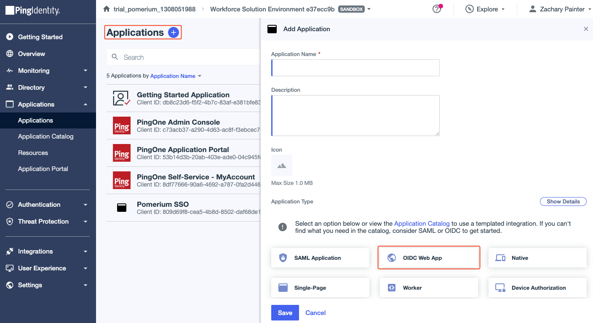
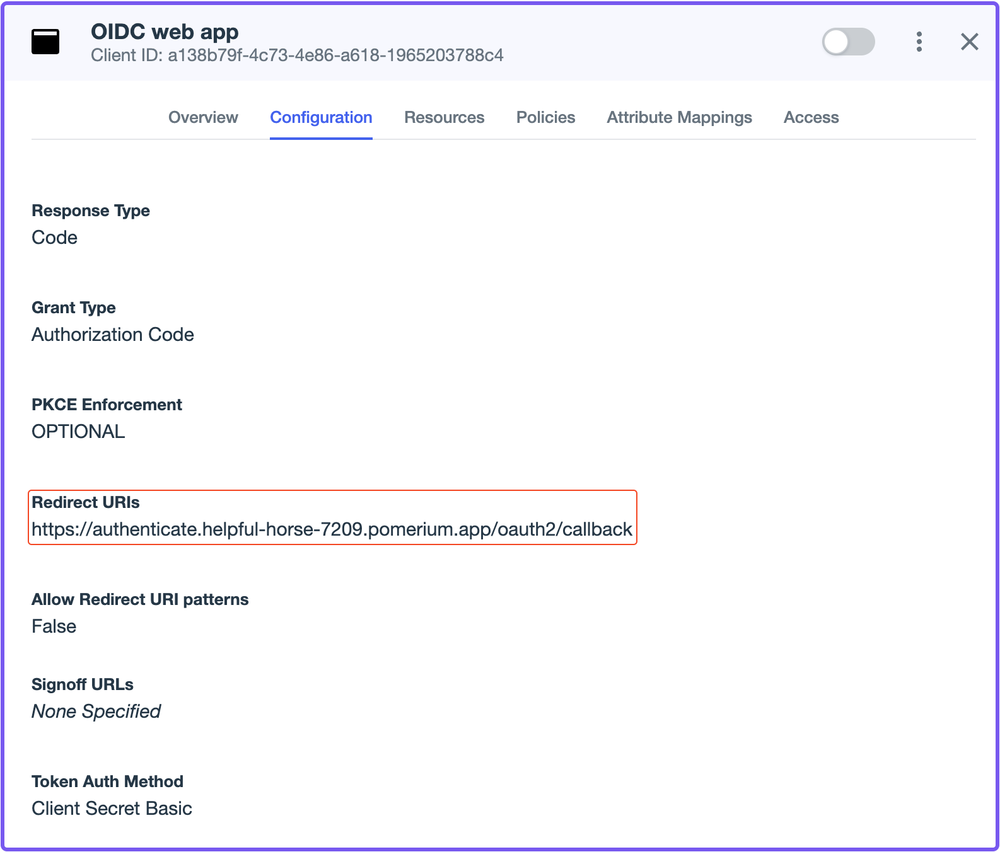
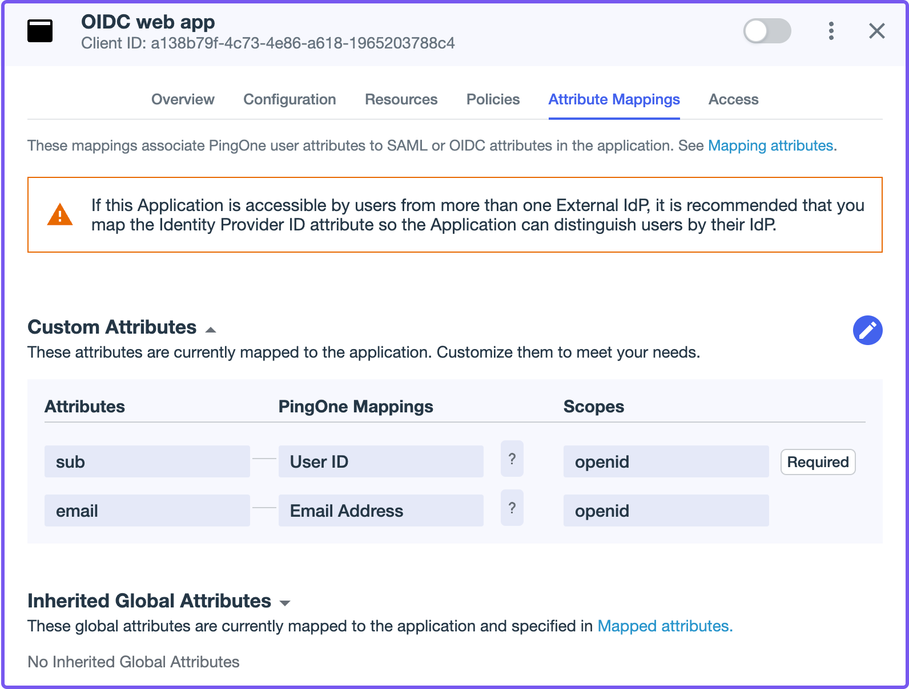
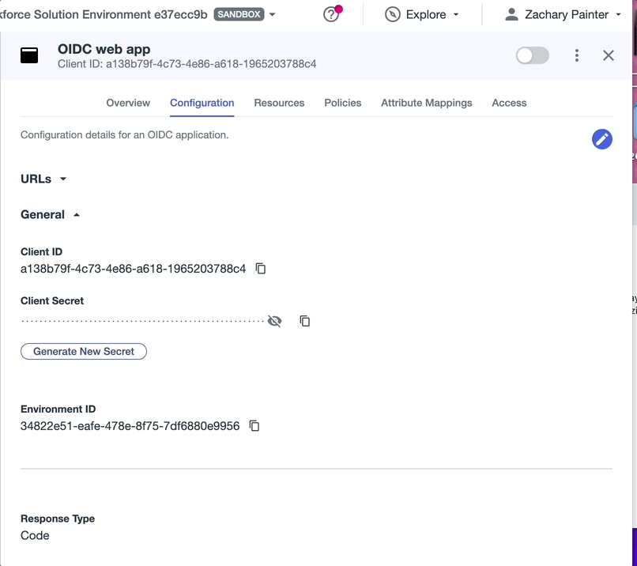
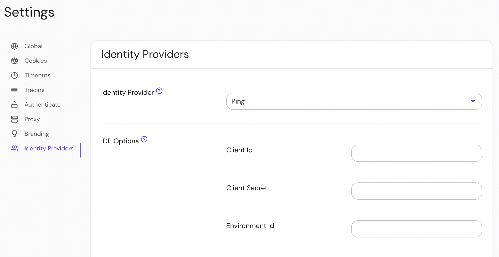
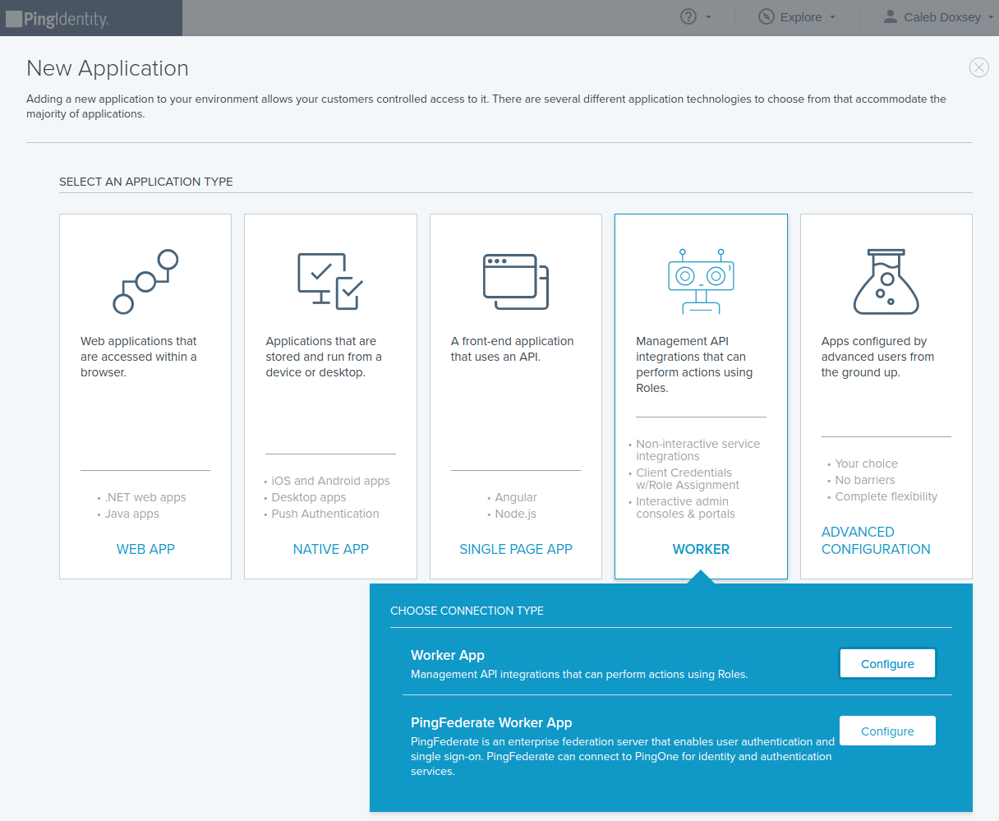
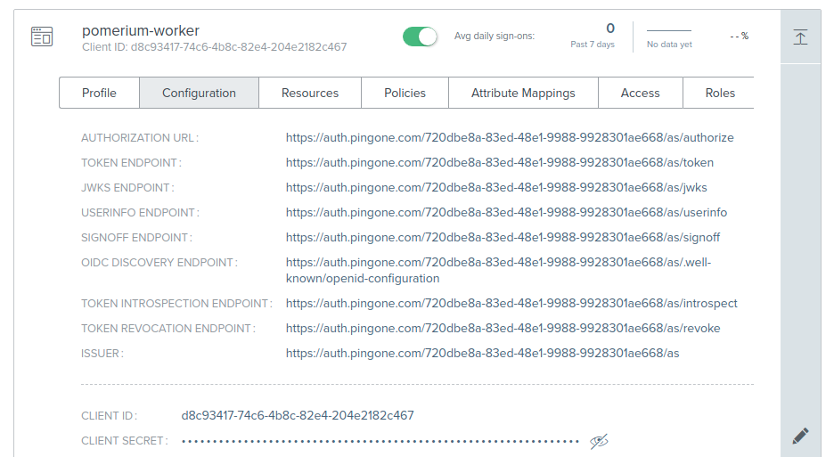

import Tabs from '@theme/Tabs';
import TabItem from '@theme/TabItem';

# Ping Identity

Learn how to configure Ping Identity as an identity provider (IdP) to work with Pomerium.

:::note

While we do our best to keep our documentation up to date, changes to third-party systems are outside of our control. Refer to [Adding an application](https://docs.pingidentity.com/r/en-us/pingone/p1_add_app_worker) from Ping's documentation as needed, or [let us know](https://github.com/pomerium/documentation/issues/new?assignees=&labels=&template=doc-error.md) if we need to update this page.

:::

## Before you start

To complete this guide, you must:

- Install [Pomerium](/docs/zero).
- Create a free [PingOne account](https://www.pingidentity.com/en/try-ping.html). (This guide uses a [PingOne for Workforce](https://www.pingidentity.com/en/platform/solutions/pingone-for-workforce.html) account.)

After creating a PingOne account, you'll be directed to the PingOne console.

### Create an OIDC web app

In the PingOne console:

1. From the **Applications** sidebar menu, select **Applications** and create a new application (**+**).
1. Enter an **Application Name** and an optional description or logo.
1. Select **OIDC web app** and **Save**.



### Configure the OIDC web app

After saving, a new screen will open with information related to your OIDC web app.

In the app screen:

1. Select the **Configuration** tab, then select the edit icon.
1. In the **Redirect URIs** field, enter your [authenticate service URL](/docs/reference/service-urls#authenticate-service-url) with the `/oauth2/callback` path appended to it.
1. Select **Save**.

  

Next, configure attribute mappings:

1. Select the **Attribute Mappings** tab, then select the edit icon.
1. Select **+Add**.
1. In the **Attributes** field, enter **email**.
1. In the **PingOne Mappings** dropdown menu, select **Email Address**.
1. Select **Save**.

  

Save the following details from the **Configuration** tab (you need these to configure Pomerium):

- **Client ID**
- **Client Secret**
- **Issuer** URL



## Pomerium Configuration

Update your Pomerium configuration to use Ping as the IdP:

<Tabs queryString="configuration-settings">
<TabItem value="config-file-keys" label="config.yaml">

```yaml
idp_provider: 'ping'
idp_provider_url: 'https://auth.pingone.com/720dbe8a-83ed-48e1-9988-9928301ae668/as'
idp_client_id: 'CLIENT_ID'
idp_client_secret: 'CLIENT_SECRET'
```

</TabItem>
<TabItem value="environment-variables" label="Environment Variables">

```bash
IDP_PROVIDER="ping"
IDP_PROVIDER_URL="https://auth.pingone.com/720dbe8a-83ed-48e1-9988-9928301ae668/as"
IDP_CLIENT_ID="CLIENT_ID"
IDP_CLIENT_SECRET="CLIENT_SECRET"
```

</TabItem>
</Tabs>

## Groups



<Tabs queryString="get-groups">
<TabItem value="custom-claim" label="Custom Claim (Open Source)">

### Custom Claim (Open Source)

A `groups` claim can be added to tokens returned from Ping by adding it to the "Attribute Mappings":


Now when users login they will have a claim named `groups` that contains their groups and the `claim` PPL criterion can be used for authorization:

```yaml
routes:
  - from: 'https://verify.localhost.pomerium.io'
    to: 'https://verify.pomerium.com'
    policy:
      - allow:
          and:
            - claim/groups: 49dfb9e6-f81f-4a1c-b4a3-d0122ebe4aab
```

:::tip

The `groups` claim contains group IDs, not group names.

:::

</TabItem>
<TabItem value="directory-sync" label="Directory Sync (Enterprise)">

### Directory Sync (Enterprise)

#### Create a Ping Worker Application

In order for Pomerium to validate group membership, we'll also need to configure a [Worker Application](https://docs.pingidentity.com/bundle/pingdirectory-73/page/lfm1564011499001.html) in Ping.

1. Click **Add Application**, and select **Worker → Worker App**.

   

1. Toggle the green slider to enable your new application.

1. This application's **Client ID** and **Client Secret** will be used in the Pomerium Enterprise Console.

   

#### Configure Pomerium Enterprise Console

Under **Settings → Identity Providers**, select "Ping" as the identity provider and set the Client ID, Client Secret and Environment ID. The Environment ID can be found in Ping under **Environment → Properties**.


</TabItem>
</Tabs>
