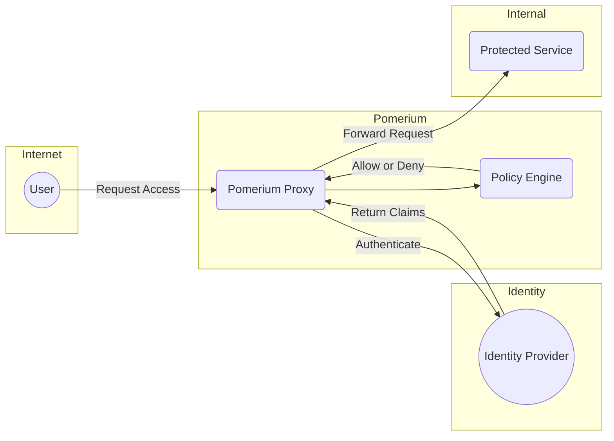

# What is Pomerium?

Pomerium is an open source identity-aware proxy built around the principles of [BeyondCorp](https://research.google/pubs/pub43231) and [zero trust](https://www.nist.gov/publications/zero-trust-architecture). It secures your internal applications by continually verifying a user's identity, device state, and context before granting access.

Unlike VPN or tunnel-based approaches, Pomerium provides a scalable, modern alternative that centralizes access policy without requiring client software.

Key benefits:

- **Seamless, clientless access**: No corporate VPN to install or maintain.
- **Granular enforcement**: Every request is authenticated and authorized.
- **Adaptable**: Works across multiple environments (cloud, on-prem, hybrid).
- **Open source pedigree**: Built on the BeyondCorp model. Transparent, with an active community.

## How does it work?

Pomerium intercepts and routes user traffic to protected services through an identity-aware access layer, ensuring every request is validated against your configured identity provider, policies, and device context.

In practice:

1. **Authenticate**: Users sign in through your identity provider.
2. **Authorize**: Pomerium checks policies to decide who gets access.
3. **Proxy**: Traffic to internal apps flows through a secure, policy-enforced route.

This approach simplifies managing access to internal services—no more network-level trust. Instead, trust is tied to identity, context, and a dynamic access policy.

## Why Pomerium?

- **Streamlined**: No need to juggle separate VPN clients or network ACLs.
- **Future-proof**: Native zero trust posture that's ready for remote work, BYOD, or multi-cloud.
- **Fast**: Deploy where your apps run; no heavy routing or hardware dependencies.
- **Secure by default**: Continuous authentication and authorization ensures only valid requests get through.

## Community

- **Get updates**: Join [pomerium-announce](https://groups.google.com/forum/#!forum/pomerium-announce) or follow us on [Twitter](https://twitter.com/pomerium_io).
- **Get help**: Visit [Discuss](https://discuss.pomerium.com/) for Q&A and best practices.
- **Report bugs**: Search [GitHub issues](https://github.com/pomerium/pomerium/issues) or open a new one if you don't see yours listed.
- **Suggest features**: Check for existing feature requests, then open a new issue if needed.

## Next steps

Ready to try it out? [Check out the Quick Start](https://www.pomerium.com/docs/quick-start) to spin up Pomerium and secure your first application.
