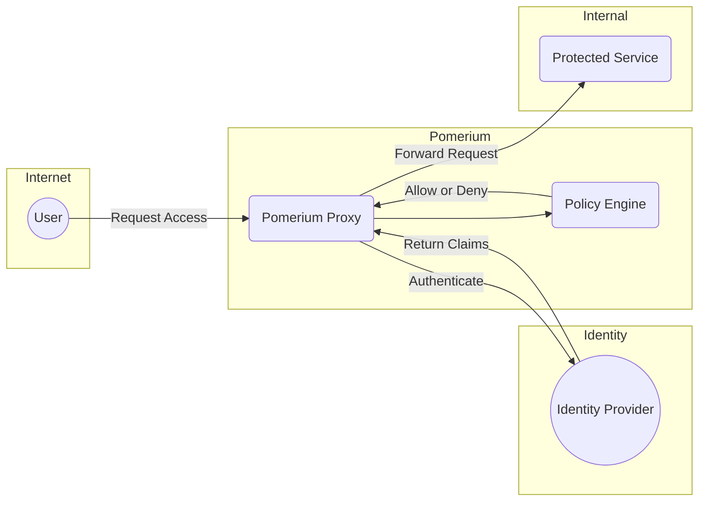

# What is Pomerium?

Pomerium is an open source identity-aware proxy built around the principles of [BeyondCorp](https://research.google/pubs/pub43231) and [zero trust](https://www.nist.gov/publications/zero-trust-architecture). It secures your internal applications, servers, services, and workloads by continually verifying a user's **identity**, **device state**, and **request context** before granting access.

Unlike VPN or tunnel-based approaches, Pomerium provides a scalable, modern alternative that centralizes access policy **without requiring client software**.

Key benefits:

- **Seamless, clientless access**: No corporate VPN to install or maintain.
- **Granular enforcement**: Every request is authenticated and authorized.
- **Extensible**: Works across multiple environments (cloud, on-prem, hybrid).
- **Open source**: Built on the BeyondCorp model. Transparent, with an active community.

## Choose how to manage Pomerium

- **Pomerium Core** is the self-managed Pomerium server and the data-plane engine for every deployment model. Core gives you direct ownership of configuration, identity provider integration, TLS and DNS, storage, and scaling. Choose Core when you want to install, configure, and operate Pomerium yourself.
- **Pomerium Zero** is Pomerium's managed control plane for Core clusters. Zero connects to the Core cluster running in your environment and manages onboarding, configuration, starter domains, certificates, the Zero API, API users, service accounts, organizations, quotas, cluster health, and multi-replica scaling. Choose Zero when you want Pomerium to operate the control plane while you run the data plane.
- **Pomerium Enterprise** is the self-hosted control plane for Core clusters. Enterprise keeps the control plane in your environment while adding the Enterprise Console, Enterprise API, centralized configuration, namespaces and RBAC, audit and deployment history, directory sync, external data, service accounts, sessions, metrics, and other governance, compliance, and scale capabilities. Choose Enterprise when you need those controls in an environment you operate.

## How does it work?

Pomerium intercepts and routes user traffic to protected services through an identity-aware access layer, ensuring every request is validated against your configured identity provider, policies, and device context.

```mermaid
flowchart LR
    subgraph Internet
        U((User))
    end

    subgraph Identity
        IdP((Identity Provider))
    end

    subgraph Pomerium
        Proxy(Pomerium Proxy)
        Policy(Policy Engine)
        Proxy --> Policy
    end

    subgraph Internal
        S(Protected Service)
    end

    U -->|Request Access| Proxy
    Proxy -->|Authenticate| IdP
    IdP -->|Return Claims| Proxy
    Policy -->|Allow or Deny| Proxy
    Proxy -->|Forward Request| S
```

In practice:

1. **Authenticate**: Users sign in through your identity provider.
2. **Authorize**: Pomerium checks policies to decide who gets access.
3. **Proxy**: Traffic to internal apps flows through a secure, policy-enforced route.

This approach simplifies managing access to internal services—no more network-level trust. Instead, trust is tied to identity, context, and a dynamic access policy.

## Why Pomerium?

- **Streamlined**: No need to juggle separate VPN clients or network ACLs.
- **Future-proof**: Native zero trust posture that's ready for remote work, BYOD, or multi-cloud.
- **Fast**: Deploy where your apps run; no heavy routing or hardware dependencies.
- **Secure by default**: Continuous authentication and authorization ensures only valid requests get through.

## Community

- **Get updates**: Join [pomerium-announce](https://groups.google.com/forum/#!forum/pomerium-announce) or follow us on [Twitter](https://twitter.com/pomerium_io).
- **Get help**: Visit [Discuss](https://discuss.pomerium.com/) for Q&A and best practices.
- **Report bugs**: Search [GitHub issues](https://github.com/pomerium/pomerium/issues) or open a new one if you don't see yours listed.
- **Suggest features**: Check for existing feature requests, then open a new issue if needed.

## Next steps

Ready to try it out? [Check out the Quick Start](/docs/get-started/quickstart) to spin up Pomerium and secure your first application.
