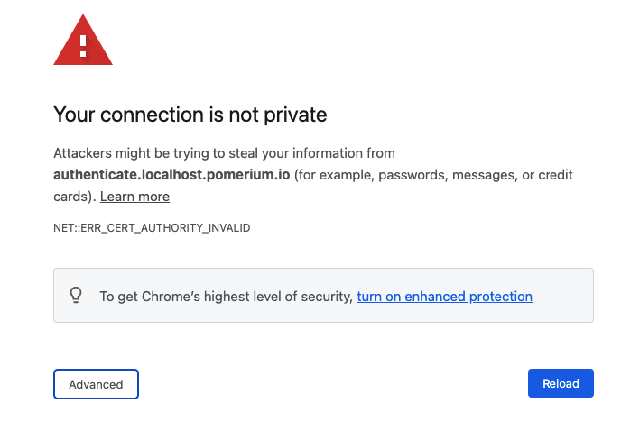
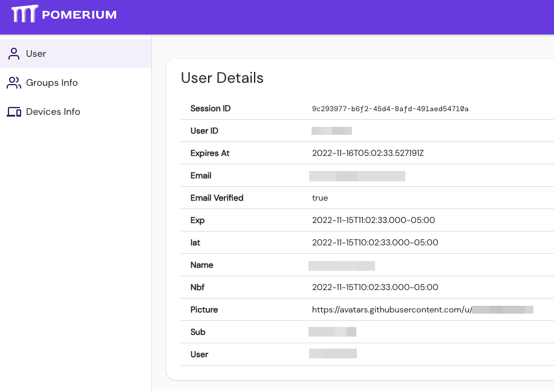

import ConfigDocker from '@site/content/examples/config/config.docker.yaml.md'
import DockerCompose from '@site/content//examples/docker/basic.docker-compose.yml.md'

In this quick-start document, we'll create a minimal but complete environment for running Pomerium with containers.

## Prerequisites

- A configured [identity provider]
- [Docker] and [docker-compose]

## Configure

1. Create a [configuration file] (e.g. `config.yaml`) for defining Pomerium's configuration settings, routes, and access policies. Consider the following example:

  <ConfigDocker/>

   Keep track of the path to this file, relative to the `docker-compose.yaml` file created in the next step. `docker-compose.yaml` will need the correct relative path to your `config.yaml`.

1. Create or copy the following `docker-compose.yaml` file and modify it to match your configuration, including the correct paths to your `config.yaml` and certificate files:

   <DockerCompose/>

## Run

Run docker compose:

```bash
docker-compose up
```

Docker will automatically download the required [container images] for Pomerium and [verify]. Then, Pomerium will run with the configuration details set in the previous steps.

You should now be able to access the routes (e.g. `https://verify.localhost.pomerium.io`) as specified in your policy file.

### Handle self-signed certificate warning
When navigating to the `https://verify.localhost.pomerium.io` route defined in your policy, you may encouter the following self-signed certificate warning:



To resolve this error:
1. Click anywhere inside the browser window
2. Type **thisisunsafe**
3. Make sure **Reload** is selected
3. Press **ENTER**

Your browser will redirect you to the route defined in your policy: 



## Next Steps

Now, you can experiment with adding services to Docker and defining routes and policies for them in Pomerium. See [Guides](/docs/guides) for help or inspiration.

:::caution This is a test environment!
If you followed all the steps in this doc your Pomerium environment is not using trusted certificates. Remember to use a valid certificate solution before moving this configuration to a production environment. See [Certificates][tls certificates] for more information.
:::

[configuration file]: /docs/reference
[container images]: https://hub.docker.com/r/pomerium/pomerium
[docker]: https://docs.docker.com/install/
[docker-compose]: https://docs.docker.com/compose/install/
[verify]: https://verify.pomerium.com/
[identity provider]: /docs/identity-providers
[tls certificates]: ../topics/certificates
[fqdn]: https://en.wikipedia.org/wiki/Fully_qualified_domain_name
[mkcert]: https://github.com/FiloSottile/mkcert
[Self-signed wildcard certificate]: /docs/topics/certificates#self-signed-wildcard-certificate