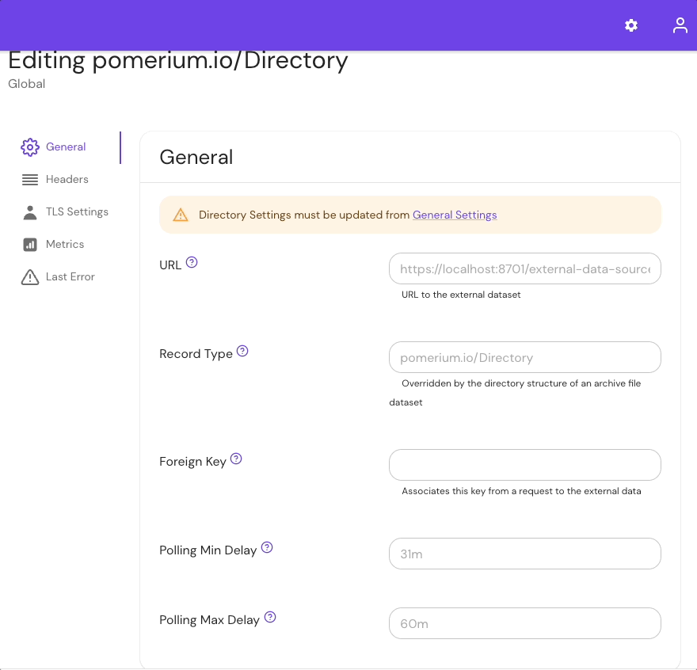

:::enterprise

This article describes a use case only available to [Pomerium Enterprise](/docs/deploy/enterprise) customers.

:::

<iframe
  width="100%"
  height="415"
  src="https://www.youtube.com/embed/AJHvF2vdfh8"
  title="YouTube video player"
  frameborder="0"
  allow="accelerometer; autoplay; clipboard-write; encrypted-media; gyroscope; picture-in-picture; web-share"
  allowfullscreen></iframe>

If you believe decisions should be informed by data, then security decisions should be informed by **all** the data. Today, most applications are limited to using user identity when making access decisions — which leaves systems blind to the multi-faceted forms of attack vectors being exploited in the threat landscape. It turns out an access control system is only as good as the data used in policy decisions.

For more information on how context enriches access decisions, read our [blog post here](https://www.pomerium.com/blog/context-drives-full-access-decision-making/).

Pomerium Enterprise Console's external data feature allows you to collect data from sources other than your identity provider (**IdP**) to make context-aware policy decisions. Pomerium provides several data sources as examples, but we encourage you to create (and share with the community) your own integrations to expand your data-driven policies.

See the pages in this section for more information on our example data sources, or learn how to create your own by reviewing our [datasource](https://github.com/pomerium/datasource) repository.

## Integrate external data sources in the Console



Any external data source integration requires the following settings:

### URL

The path to the external data.

Supported external data formats include:

A **JSON file** containing an array of objects. Each object **must** contain an `id` field.

For example:

```json title="example JSON"
[
  {"id": "id4@example.com", "user.id": "user4"},
  {"id": "id5@example.com", "user.id": "user5"},
  {"id": "id6@example.com", "user.id": "user6"}
]
```

A **CSV file** where the first row indicates the field names and subsequent rows are records. One of the fields **must** be an `id`.

For example:

```json title="example CSV"
id,user.id
id1@example.com,user1
id2@example.com,user2
id3@example.com,user3
```

**tar or ZIP files**

A `.tar` or `.zip` file containing files of one of the formats above. The file path within the `.tar` file specifies the record type, if not defined in the configuration.

For example, in an archive containing the following structure:

```bash
example.com/geoip.csv
devices/jamf.json
devices/tanium.json
```

The Pomerium Databroker would be updated with types `example.com/geoip`, `devices/jamf`, and `devices/tanium`.

Compressed versions are supported using `gz` format.

### Record Type

Unless defined by the directory structure of a supplied archive file, the Record Type field defines how the records will be stored and accessed in the Databroker.

### Foreign Key

**Foreign Key** is used to map an authorization evaluation to the corresponding record. The supported values are:

- `user.id` (Also the default if no value is provided)
- `user.email`
- `request.ip`
- `device.id`

#### IP range lookup support

Pomerium supports Classless Inter-Domain Routing (CIDR) indexing when filtering a list of records with the `request.ip` foreign key. This allows you to match against IP address ranges instead of manually importing records for individual IP addresses.

To filter with CIDR indexing, add a special `$index` key to your external data source records. For example:

```json
{
  "$index": {"cidr": "10.1.2.3/24"}
}
```

See the [GeoIP Ranges](/docs/integrations/geoip) and [Well-Known IP Ranges](/docs/integrations/ip-ranges) guides for specific examples.

### Headers

Headers defined here will be used when connecting to the external data source.

### Allow Insecure TLS

If set, allows the import of external data from sources using untrusted TLS certificates.

### Polling Min/Max Delay

Defines the minimum and maximum delay times between requests to the external data source. The job would be scheduled to run within `min delay` intervals.

:::tip **Note**

If a job may not complete within the `min delay` period, it would be interrupted and restarted. If a job is interrupted by timeout or due to an error, it would be restarted with increasing intervals up to the `max delay` period.

:::

### Client TLS Key

For data sources using mTLS, you can select a [client certificate](/docs/concepts/certificates) (added under **Manage** → **Certificates**) to provide to the data source.
