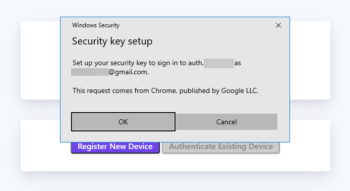

import Tabs from '@theme/Tabs';
import TabItem from '@theme/TabItem';

A core component of Pomerium's zero trust security model is **device identity**, which is the ability for a device to have a unique, unclonable identity string that can be authenticated and factored into access control decisions. This topic page covers the concept of device identity, and how it applies to the zero trust model. To understand how Pomerium's device identity feature works, see our [documentation here](/docs/integrations/device-context/device-identit).

## Why Device Identity Is Important

The history of IT security has, until recently, mostly focused on user identity verification. In this model, access to a service is granted only after verifying a user's identity and authorization to that service. This was usually sufficient in scenarios where the user's access was physically limited to trusted devices in trusted physical and network spaces; a PC sitting in an office in the company headquarters on a local network, for example.

Hardware-backed device identity is becoming more widely discussed as more products begin to implement or require it across all tech industries. For example, Windows 11 generated a lot of news by [requiring TPM 2.0][win11-reqs], and Apple is taking steps to [eliminate passwords][apple-passkeys] :

|  |
| :-- |
| **Sources:** - https://www.theverge.com/2021/6/25/22550376/microsoft-windows-11-tpm-chips-requirement-security - https://developer.apple.com/videos/play/wwdc2021/10106 |

Device identity protects a trusted user from accessing sensitive data from a potentially unsafe device, like their personal computer or phone. Think of it as similar to multi-factor authentication (**MFA**); where MFA covers "what you know" (password) and "who you are" (biometrics, face recognition, etc), device identity asks "is this device safe?" by confirming that the device you are using to access a system is trusted.

Device identity is similar but unique to MFA. Where MFA is an additional layer of protection on user identity, hardware-backed device identity can be used to enhance and augment authorization decisions beyond the initial authentication flow. Where MFA increases the trust-level of a user, device identity provides trust for the device being used. More importantly, it denies access for non-trusted, potentially insecure devices.

## What Is Device Identity

> When you remove "[the perimeter]" as the source of trust to your infrastructure, you must replace it with a level of trust for every person, **device**, and hop in the communication path. Where the other, more commonly implemented facets of zero trust validates the user and traffic, device identity (through WebAuthn) validates the end user's device.

Device ID is a unique identifying key that can only be created by the specific combination of hardware and software present on a specific device. How this is accomplished is largely dependent on the tools available on the user hardware, which we've detailed below.

### Authenticated Device Types

Device identity is made possible through trusted execution environment (**TEE**) devices that provide a hardware-attested identity. The specific implementation of this general concept is different across the devices that provide device identity, but they generally fall into two categories: [secure enclaves and cross-platform security keys].

#### Secure Enclaves

Also called platform or internal authenticators, a secure enclave is physically bound to a specific computing device.

- TPM (Trusted Platform Module): These devices are usually built into a product's mainboard, or can be installed in devices with a TPM header, as shown [here][toms-hardware-tpm]. They include a small processor to carry out cryptographic functions on the device, instead of on the system's processor where it could be interfered with. Trust is usually derived from a private key or certificate signed by a trusted manufacturer's certificate authority.

- Mobile devices: Most newer Apple and Android devices include a [Secure Enclave][apple-enclave] or [Hardware-backed Keystore][android-keystore]

#### Hardware Security Keys

Also known as cross-platform or roaming authenticators, these are authentication devices which can move with the user across different computers.

- FIDO U2F: This [open standard][fido-spec] is used by many products like Yubico's [Yubikey][yubikey-products] and Google's [Titan Security Key](https://support.google.com/titansecuritykey/answer/9115487?hl=en). They usually secure a private key used to decrypt information signed by an accessible public key.

:::tip Note

The nature of cross-platform keys mean they are not associated with a single end-user device. Pomerium policies can be written to allow these keys, or specified to only accept secure enclaves.

:::

Device identity is the unique ID associated with a device. In the context of zero trust, device identity can be used to authenticate and authorize users and to determine if a device can be trusted before granting a user access to a protected application or service.

<iframe
  width="100%"
  height="500"
  src="https://www.youtube.com/embed/aJzgnaXEpLo?rel=0"
  frameBorder="0"
  allow="accelerometer; clipboard-write; encrypted-media; gyroscope; picture-in-picture"
  allowFullScreen
/>

## Device identity with Pomerium

Pomerium versions [0.16.0](/docs/core/upgrading#policy-for-device-identity) and up support the use of device identity as a criteria in authorization policies. Pomerium uses the [Web Authentication](https://www.w3.org/TR/webauthn-2/#registration-extension) (WebAuthn) API to bring authentication and authorization based on device identity into your security framework. With Pomerium's device identity support, users can register devices and administrators can limit access to devices they trust.

## Device identity features

Pomerium Enterprise and Core both support device identity, but Enterprise users can enroll and manage devices in the Enterprise Console.

| Features (Enterprise) | Device Identity |
| --- | :-: |
| **Pre-approved device enrollment** | Administrators can enroll a new device and generate a registration link for a specific user. |
| **Device management** | Administrators can view and manage approved and pending devices in the Enterprise Console. |
| **User-initiated device enrollment** | Users can register their device if a route requires device identity authentication, but can only access the route if their device is approved in the Enterprise Console. |
| **Features (Core)** | **Device Identity** |
| **User-initiated device enrollment** | Users can register their device if a route requires device identity authentication and access the route without device approval. |

## New enrollment (Enterprise)

Device identity with Pomerium relies on a [trust on first use](https://en.wikipedia.org/wiki/Trust_on_first_use) (TOFU) authentication scheme:

- Administrators can enroll a device and generate a custom registration link for a specific user. (Registration links are only valid for the selected user.)
- When a user registers their device with a registration link, the device will automatically be approved following the TOFU authentication scheme.

## Manage devices (Enterprise)

When an administrator enrolls a device, the Enterprise Console displays the device's status as **Pending Enrollment**.

When a user visits the registration link and registers their device, the Enterprise Console updates the device's status to **Approved**.

If an administrator deletes a device, the device will be revoked and the link becomes invalid.

## Enroll devices as an administrator (Enterprise)

Enterprise users can build policies that only grant access to a route if a user's device is approved in the Enterprise Console. (See [Device Matcher](/docs/capabilities/ppl#device-matcher) for more information.)

The Enterprise Console's **Manage Devices** GUI provides a dashboard where administrators can enroll devices and generate custom registration links for users in their directory.

:::enterprise

Before you can generate device registration links for users within your directory, you must sync your directory data first.

See [**Directory Sync**](/docs/capabilities/directory-sync) for more information.

:::

To enroll a new device:

1. In the Console sidebar, select **Devices**

2. Select **NEW ENROLLMENT**

3. In the **New Enrollment** window:

**Select Users**: Select a user to send a registration link (the link is only valid for the selected user)   **Route**: Enter a pre-configured route from your Console; Pomerium will use this route to create the custom registration link   **Redirect URL** (optional): Enter a route that users will redirect to after registering their device   **Enrollment Type**:

- Select **Any** to allow a user to register any device
- Select **Secure Enclave Only** to restrict the user to secure enclaves

4. Select **SUBMIT** to get the registration link

Give the link to the user.

## Enroll device as a user

If a Pomerium route [requires device authentication](/docs/capabilities/ppl#device-matcher), the user must register a [trusted execution environment](/docs/concepts/device-identity#authenticated-device-types) (**TEE**) device before accessing the route. Registration differs depending on the device.

The steps below cover enrollment of a device by a user. This is available for both Pomerium Core and [Pomerium Enterprise](/docs/deploy/enterprise/install) installations. However, Enterprise users may also receive registration links [generated by their administrators](/docs/integrations/device-context/device-identit), which will mark the newly enrolled device as approved in the Enterprise Console.

1. Users are prompted to register a new device when accessing a route that requires device authentication:

   

   Users can also access the registration page from the special `.pomerium` endpoint available on any route at the bottom of the page:

   

1. Select **Register New Device**. Your browser will prompt you to provide access to a device. This will look different depending on the browser, operating system, and device type:

   <Tabs>

   <TabItem value="Windows"  label="Windows">

   

   </TabItem>

   <TabItem value="Chrome"  label="Chrome">

   

   </TabItem>

   <TabItem value="Firefox"  label="Firefox">

   

   </TabItem>

   <TabItem value="ChromeOS"  label="ChromeOS">

   

   </TabItem>

   </Tabs>

### Find the device ID

If a route's policy is configured to only allow specific device IDs, you will see a `450` error even after registering:

From the `.pomerium` endpoint you can copy your device ID to provide to your Pomerium administrator.

You can also delete the ID for devices that should no longer be associated with your account.

[android-keystore]: https://source.android.com/security/keystore
[apple-enclave]: https://support.apple.com/guide/security/secure-enclave-sec59b0b31ff/web
[apple-passkeys]: https://developer.apple.com/documentation/authenticationservices/public-private_key_authentication/supporting_passkeys
[fido-spec]: https://fidoalliance.org/specifications/
[secure enclaves and cross-platform security keys]: https://developers.yubico.com/WebAuthn/WebAuthn_Developer_Guide/Platform_vs_Cross-Platform.html
[the perimeter]: https://www.microsoft.com/security/blog/2019/10/23/perimeter-based-network-defense-transform-zero-trust-model/
[toms-hardware-tpm]: https://www.tomshardware.com/reviews/tpm-trusted-platform-module-header,5766.html
[verge-tpm]: https://www.theverge.com/2021/6/25/22550376/microsoft-windows-11-tpm-chips-requirement-security
[webauthn-api]: https://www.w3.org/TR/webauthn-2/#registration-extension
[win11-reqs]: https://www.microsoft.com/en-us/windows/windows-11-specifications
[yubikey-products]: https://www.yubico.com/products/
