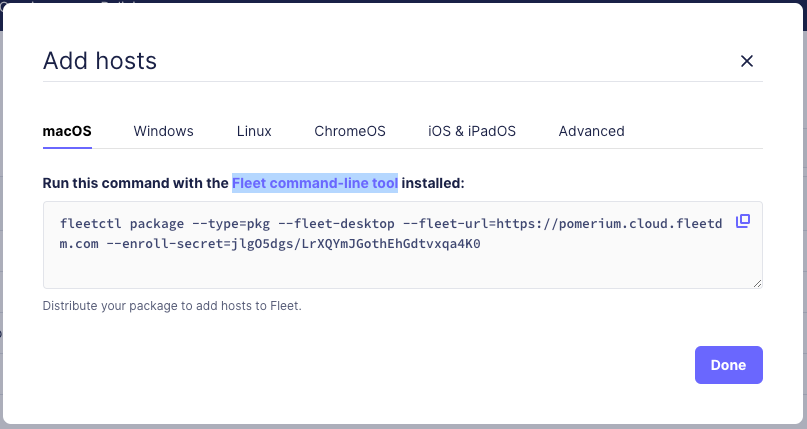
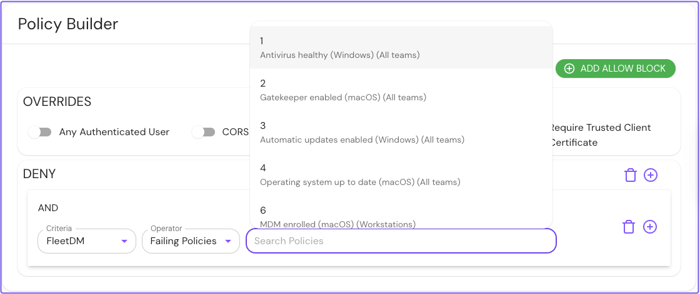

---
# cSpell:ignore fleetdm, fleetd, osquery, changeit
title: FleetDM Integration
sidebar_label: FleetDM
description: Learn how to integrate FleetDM with Pomerium Enterprise.
---

FleetDM provides an open-source, scalable device management (MDM) solution that supports all major operating systems, including macOS, Linux, and Windows.

The FleetDM integration with Pomerium Enterprise enables you to build policies in Pomerium that express Fleet conditions as Pomerium policy language (PPL).

When Pomerium receives a request from a Fleet-managed device, Pomerium will make an authorization decision based on the device's state and the applied policy criteria.

## Video Demo

<iframe
  width="100%"
  height="500"
  src="https://www.youtube.com/embed/My4qpknfr3c?si=T2ch4ggitbznNuGr"
  title="YouTube video player"
  frameborder="0"
  webkitallowfullscreen="true"
  mozallowfullscreen="true"
  allowfullscreen="true"></iframe>

## How Pomerium works with FleetDM

FleetDM provides a dedicated web service (Fleet UI) where administrators can manage teams, issued devices (”enrolled hosts”), Fleet policies, and more.

The Fleet agents periodically query hosts to gather updated host data, and push the information to Fleet servers. Administrators can view host data in Fleet UI.

Pomerium can integrate your Fleet instance as an external data source (the “FleetDM plugin”) in the Enterprise Console. You can use custom PPL criteria to build policies in Pomerium that enforce Fleet conditions before authorizing or denying access to services behind Pomerium. For example, Pomerium can deny access if:

- A device fails a [policy](https://fleetdm.com/securing/what-are-fleet-policies) defined in Fleet.
- A device is affected by a [vulnerability](https://fleetdm.com/guides/vulnerability-processing).

### Host matching with client certificates

Integrating the FleetDM plugin returns the following records in the Enterprise Console:

- `fleetdm.com/CertificateSHA1Fingerprint`: represents a client certificate SHA-1 fingerprint that maps to a Fleet host ID
- `fleetdm.com/Host`: represents the state of a Fleet host
- `fleetdm.com/Policy`: represents a Fleet policy

Pomerium matches an incoming request with a Fleet-managed host by requiring the user to present a valid client certificate in the browser.

Pomerium receives the client certificate, generates its SHA-1 fingerprint, and matches it with the host ID stored in the FleetDM plugin.

Pomerium Enterprise continuously syncs [host](https://fleetdm.com/docs/rest-api/rest-api#example33) data from FleetDM. The host data represents its compliance to Fleet policies and exposure to vulnerabilities.

### FleetDM PPL criteria

Pomerium provides a custom FleetDM criterion that points to records collected from the FleetDM plugin.

Custom FleetDM operators enable you to build policies that enforce Fleet conditions. Only [deny](/docs/capabilities/ppl#actions) actions are supported.

Custom FleetDM operators include:

| **Key name** | **Value type** | **Description** |
| --- | --- | --- |
| `last_seen_over` | string | Denies access if a Fleet agent hasn't updated host data in the specified time. |
| `vulnerabilities` | array(string) | Denies access if a host is affected by a specific CVE. |
| `failing_policies` | array(int) | Denies access if a host fails a specific Fleet policy. |
| `failing_critical_policy` | boolean | Denies access if a host fails any critical Fleet policies. |
| `failing_any_policy` | boolean | Denies access if a host fails any Fleet policy. |

## Configure FleetDM

This guide shows you how to configure FleetDM to work with the FleetDM plugin in Pomerium Enterprise. After integrating the plugin, you'll build authorization policies in the PPL builder with custom FleetDM criteria.

To complete this guide, you need:

- [Pomerium Enterprise](https://www.pomerium.com/docs/deploy/enterprise)
- [Pomerium Core](https://www.pomerium.com/docs/core)
- A deployed [Fleet instance](https://github.com/fleetdm/fleet/tree/main/infrastructure/render)
- A configured certificate authority (CA) and client certificate
- A test environment to install a Fleet agent

:::note Before you start

For the purposes of this guide, we recommend that you:

- Install the Fleet agent in a VM running macOS. You can install and run a macOS VM for free with Tart. See the [**Tart Quickstart**](https://tart.run/quick-start/) for more information.

- Use locally trusted certificates to test this implementation. This guide uses [**mkcert**](https://github.com/FiloSottile/mkcert) to install a local CA that issues self-signed client certificates. However, this option is **not suitable for production environments**.

Lastly, this is not a production configuration. A production configuration requires a private CA integration with FleetDM, which is out of scope for this guide.

:::

### Enroll a host

After you [deploy Fleet](https://github.com/fleetdm/fleet/tree/main/infrastructure/render), you can access the Fleet dashboard. This is where you can enroll and manage hosts, build queries, and more.


Fleet [gathers host information](https://fleetdm.com/guides/enroll-hosts) by installing an [osquery](https://github.com/osquery/osquery) agent (”Fleet agent”) on each host.

To enroll a host, download the Fleet agent:

1. In the navigation bar, select **Hosts.**
1. Select **Add hosts**.
1. Select the operating system of the host you want to add. (This guide assumes **macOS.**)
1. Enter the provided command with the [Fleet command-line tool](https://fleetdm.com/guides/fleetctl).

   

   Running this command generates a `fleetd` installation package:

   ```bash
   Generating your fleetd agent...

   Success! You generated fleetd at /Users/<username>/fleet-osquery.pkg

   To add this device to Fleet, double-click to install fleetd.

   To add other devices to Fleet, distribute fleetd using Chef, Ansible, Jamf, or Puppet. Learn how: https://fleetdm.com/learn-more-about/enrolling-hosts
   ```

1. Run your macOS VM and install the `fleet-osquery.pkg`.

   If you check your Fleet dashboard, you should see the VM listed as an enrolled host:

   

1. Install your client certificate on the VM where you installed the Fleet agent (see the mkcert [Advanced options](https://github.com/FiloSottile/mkcert?tab=readme-ov-file#advanced-options) if you don't know how to generate a client certificate). Once you've installed the client certificate, you must import it into the VM's local Keychain.

   To import the client certificate, run the [security import](https://ss64.com/mac/security.html) command below inside the VM. Make sure you replace the `client-cert-location` parameter with the location of the client certificate in the VM.

   ```bash
   security import <client-cert-location>  -A -P changeit -k ~/Library/Keychains/login.keychain-db
   ```

### Configure certificate query

Fleet agents provide a [certificates](https://fleetdm.com/tables/certificates) query that scans a device's local key store for installed certificates. This query exposes certificates data, including the client certificate SHA-1 fingerprint installed on an enrolled host.

To configure the certificate query, in the Fleet dashboard:

1. Select **Queries.**
1. Select **Add query.**
1. Enter the following SQL command in the query field:

   ```sql
   SELECT * FROM certificates where ca != 1;
   ```

1. Select **Save** and enter a **Name**, **Description**, and **Frequency**.

   

In the Fleet dashboard, you can review a host's certificate details on the **Queries** page:

1. Select **Queries**.
1. Select the certificate query.
1. Find a host to review its certificate data.

   

### Create a Fleet policy

In the Fleet dashboard:

1. Select **Policies**.
1. Select **Add policy**.
1. Select a policy template, like **Gatekeeper enabled (macOS).**
1. Save your policy.

At this point, you can add as many policies as you like. You can also mark a policy as critical by selecting the **Critical** checkbox.


:::note

See the Fleet [policies](https://fleetdm.com/docs/rest-api/rest-api#policies) documentation to learn about how policies work.

:::

## Configure the FleetDM plugin

The following sections show you how to configure the FleetDM plugin in the Enterprise Console.

### Configure the external data source

Next, add the FleetDM plugin as an external data source in the Enterprise Console.

This step requires you to run the [FleetDM plugin](https://github.com/pomerium/datasource/tree/main) with its Docker image.

:::note

These instructions assume a local testing environment using [Docker Compose](https://docs.docker.com/compose/). Adjust as needed for your deployment environment.

:::

1. Add the FleetDM plugin Docker image to Docker Compose:

   ```yaml
   services:
     fleetdm:
       image: docker.cloudsmith.io/pomerium/datasource/datasource:main
       command:
         - fleetdm
         - --api-url=https://pomerium.cloud.fleetdm.com/
         - --api-token=<YOUR_FLEETDM_API_TOKEN>
         - --cert-query-id=<YOUR_FLEETDM_CERT_QUERY_ID>
         - --address=:8080
       container_name: fleetdm
       restart: always
       expose:
         - 8080
   ```

1. Run the container:

   ```bash
   docker compose up
   ```

In the Enterprise Console:

1. Select **External Data**.
1. Select **ADD EXTERNAL DATA SOURCE**.
1. In the **URL** field, enter the URL to the external data source.
1. Select **SAVE EXTERNAL DATA SOURCE**.

### Import Certificate Authority (CA)

In the Enterprise Console:

1. Select **Certificates**.
1. Select **ADD CERTIFICATE**.
1. Add the root CA file (`rootCA.pem`). 

### Create a route

Next, create a route you want to protect. This guide will use Pomerium's [Verify](https://github.com/pomerium/verify) service as an example.

In the Enterprise Console:

1. Select **Routes**.
1. Select **New Route** and name it.
1. In **From:**, enter the externally accessible URL.
1. In the **To:** field, enter the destination URL.

   

Now, configure the route to require a client certificate issued by a CA:

1. Under route settings, select **TLS Settings**.
1. In the field [**TLS Downstream Client Certificate Authority**](/docs/reference/routes/tls#tls-downstream-client-certificate-authority), select **Downstream CA**.

   

### Create policies in Pomerium

Create policies that deny access based on FleetDM criteria:

1. Select **Policies,** create a **New Policy**, and name it.
1. Select the **Builder** tab.
1. Select **Add Deny Block**.
1. In the **Criteria** field, select **FleetDM**.
1. In the **Operator** field, select **Failing Policies**.
1. In the **Search Policies** bar, Pomerium will list Fleet policies. Select the policy you want to apply.

   

You can also deny access based on vulnerabilities:

1. In the **Operator** field, select **Vulnerabilities**.
1. Enter the vulnerability by its CVE ID. For example, `CVE-2020-10735`.

   

Save your policies.

### Attach policies

Next, attach these policies to your route:

1. Select the route.
1. In the **Policies** field, select your policies.

   

Save your changes. When you access a Pomerium route with a Fleet-managed host, Pomerium will authorize access based on the host's compliance to Fleet policies and vulnerability status.
