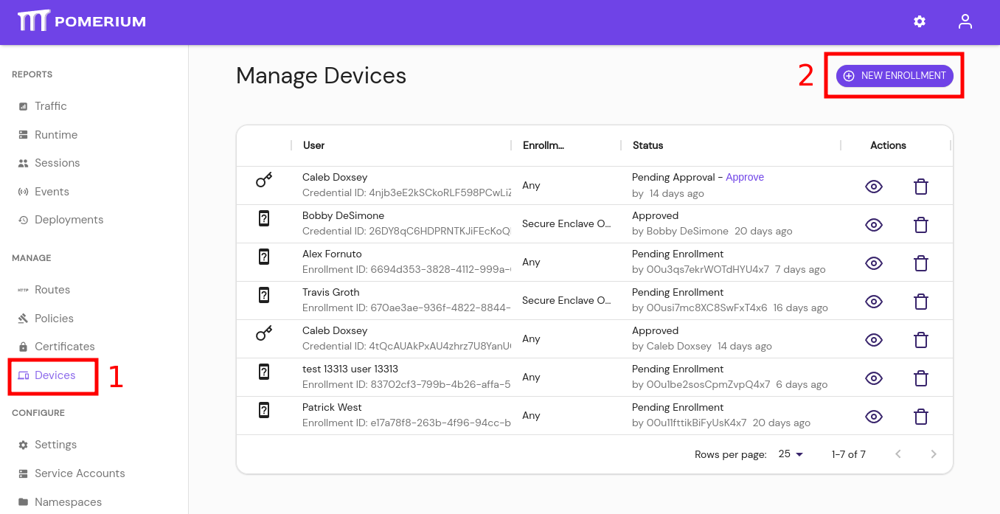
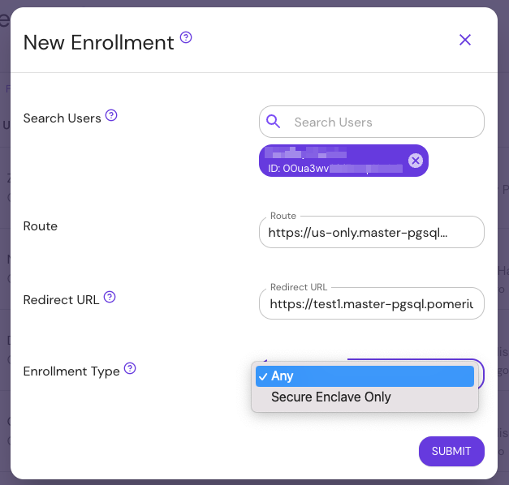
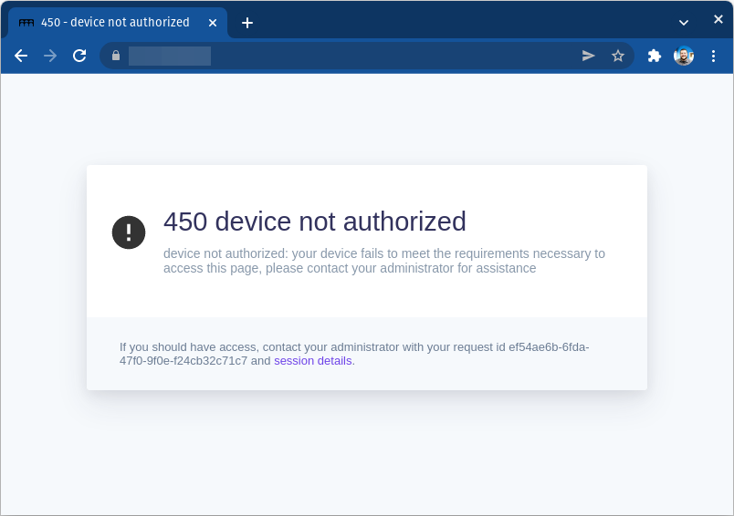

import Tabs from '@theme/Tabs';
import TabItem from '@theme/TabItem';

# WebAuthn Device Identity

Device identity links a cryptographically unique ID to each device, letting you enforce zero-trust principles by verifying _who_ a user is logging in as **and** _which device_ they're using. Pomerium uses [WebAuthn](https://www.w3.org/TR/webauthn-2/#registration-extension) to enable **clientless zero trust device identity**, so you can authenticate devices without requiring an agent or proprietary driver.

- **Clientless**: No additional agent or client software needed.
- **Hardware & TPM-backed**: Ideal for strong hardware security modules like TPM, Secure Enclave, or YubiKey.
- **Open Standards**: Uses the W3C WebAuthn spec, bridging broad browser support with modern authentication.
- **Privacy-protecting**: Because WebAuthn is designed for user authentication, direct “device identity” is partially obfuscated, which can be both a feature (protecting user privacy) and a limitation (less direct correlation to a single OS/hardware setup).

<iframe
  width="100%"
  height="500"
  src="https://www.youtube.com/embed/aJzgnaXEpLo?rel=0"
  frameBorder="0"
  allow="accelerometer; clipboard-write; encrypted-media; gyroscope; picture-in-picture"
  allowFullScreen></iframe>

## Device Identity with Pomerium

As of [Pomerium v0.16.0](/docs/deploy/upgrading.mdx#policy-for-device-identity) and higher, you can require [WebAuthn](https://www.w3.org/TR/webauthn-2) for device identity checks. This means:

- Users can register their devices as a [trusted execution environment](/docs/concepts/device-identity#authenticated-device-types).
- Admins can configure policy restricting route access to _only_ devices that have been authenticated through WebAuthn.
- In **Enterprise**, enrollment can be self-service or admin-driven, with optional device approvals.

> **Note**: Because WebAuthn is designed primarily for user/browser authentication, it has robust privacy protections. This can limit direct OS-level or hardware-level “fingerprinting.” While beneficial for end-user privacy, it means purely WebAuthn-based flows may not _always_ match a 1:1 device identity. Organizations needing deeper OS-level posture checks might consider separate or complementary solutions.

## Comparing Device Enrollment Methods

**Agent-based solutions** typically rely on proprietary software installed on each endpoint, providing full OS posture checks but increasing maintenance overhead.

**Mobile device management (MDM)** offers wide insight and control but can be intrusive and complex.

**WebAuthn** stands out for:

- **Clientless Zero Trust**: No agent required; the browser implements WebAuthn.
- **Hardware & TPM**: Leverages built-in security keys (e.g., Windows Hello, YubiKey, Touch ID, TPM) for cryptographic assurance.
- **Open & Standardized**: Works across major browsers and platforms.
- **Privacy-Focused**: The user's real device hardware details are masked behind ephemeral keys, limiting tracking but also reducing direct device fingerprinting.

As a result, WebAuthn-based device identity can be a sweet spot for many zero-trust deployments: strong security, minimal friction, wide compatibility. But it _is_ more “browser identity” than a fully OS-level solution.

## Device Identity Features

Pomerium **Core** and **Enterprise** support WebAuthn-based device identity. However, Enterprise provides additional management features:

| Features (Enterprise) | WebAuthn Device Identity |
| --- | :-: |
| **Pre-approved device enrollment** | Admins can enroll a new device, generating a user-specific registration link. |
| **Device management** | View, approve, or delete devices in the Enterprise Console. |
| **User-initiated device enrollment** | Users can register their device if a route requires device identity. The device remains pending until approved. |

| Features (Core) | Device Identity |
| --- | :-: |
| **User-initiated device enrollment** | Users can register and immediately access routes that require device identity (no approval flow). |

## New Enrollment (Enterprise)

Pomerium implements a **trust on first use** (TOFU) approach for device identity:

- Admins generate a registration link for a specific user.
- When a user registers a device via the link, that device is automatically approved (TOFU).

## Manage Devices (Enterprise)

Administrators can track device status in the **Enterprise Console**. New devices begin as **Pending Enrollment** and become **Approved** upon successful registration.

If a device is **Deleted**, it's effectively revoked. Any associated link becomes invalid.

## Enroll Devices as an Administrator (Enterprise)

In **Enterprise**, you can enforce policies that only allow routes to approved devices. (See [Device Matcher](/docs/internals/ppl#device-matcher).)

The **Manage Devices** GUI lets you create enrollment links for directory-synced users.

:::enterprise Ensure [directory sync](/docs/integrations/user-standing/directory-sync) is configured to populate user data. :::

**Steps**:

1. In the Console sidebar, select **Devices**.
2. Click **NEW ENROLLMENT**:

   

3. Fill out **New Enrollment**:

   - **Select Users**: A user from your directory (the link is only valid for them).
   - **Route**: Choose a Pomerium route; your custom link will point here.
   - **Redirect URL**: (Optional) A route to send users after enrollment.
   - **Enrollment Type**:
     - **Any**: Any WebAuthn-compatible device (hardware keys, OS biometrics).
     - **Secure Enclave Only**: Limit registration to platform-based secure enclaves (e.g. iOS Secure Enclave, Windows Hello TPM).

   

4. Select **SUBMIT** to generate the enrollment link, then share it with the user:

   

## Enroll Device as a User

If a Pomerium route [requires device identity](/docs/internals/ppl#device-matcher), users will be prompted to register a device. This flow is similar in **Core** and **Enterprise** (though Enterprise can also allow admin pre-approval).

1. When visiting a route requiring device identity, users see a device registration screen:

   

2. Users can also open the `.pomerium` endpoint for any route to access **Device Credentials**:

   

3. Select **Register New Device**. The browser prompts for hardware or biometric verification. The prompts vary by OS or browser:

   <Tabs>
     <TabItem value="Windows" label="Windows">
       
     </TabItem>
     <TabItem value="Chrome" label="Chrome">
       
     </TabItem>
     <TabItem value="Firefox" label="Firefox">
       
     </TabItem>
     <TabItem value="ChromeOS" label="ChromeOS">
       
     </TabItem>
   </Tabs>

---

### Find the Device ID

If a route policy specifically requires a certain device ID, you might see a `450 device not authorized` error even after registering:

From the `.pomerium` endpoint, you can copy your device ID and share it with your admin:

You can also remove any device you no longer want associated with your account.

---

## Summary

WebAuthn enables **clientless zero trust device identity** in Pomerium:

- **No agent**: Achieve strong hardware-backed verification with standard browsers.
- **TPM/Enclave**: Tied to user gestures (PIN, biometric) or physical tokens (YubiKey).
- **Privacy-Focused**: WebAuthn conceals hardware details, limiting direct OS posture checks.
- **Enterprise**: Gain streamlined enrollment, approval, and device management in the Console.
- **Core**: Basic user-driven enrollment.

With WebAuthn, you balance user privacy and security convenience while raising the trust level of your routes—an excellent fit for zero-trust approaches.

## Related Links

- [**WebAuthn specification**](https://www.w3.org/TR/webauthn-2)
- [**Trusted Platform Module (TPM)**](https://docs.microsoft.com/en-us/windows/security/information-protection/tpm/tpm-recommendations)
- [**Secure enclaves** and cross-platform keys](https://developers.yubico.com/WebAuthn/WebAuthn_Developer_Guide/Platform_vs_Cross-Platform.html)
- [**Apple passkeys**](https://developer.apple.com/documentation/authenticationservices/public-private_key_authentication/supporting_passkeys)
- [**FIDO Alliance** specs](https://fidoalliance.org/specifications/)
- [**Pomerium Device Concepts**](/docs/integrations/device-context/device-identity.mdx)

[android-keystore]: https://source.android.com/security/keystore
[apple-enclave]: https://support.apple.com/guide/security/secure-enclave-sec59b0b31ff/web
[apple-passkeys]: https://developer.apple.com/documentation/authenticationservices/public-private_key_authentication/supporting_passkeys
[fido-spec]: https://fidoalliance.org/specifications/
[secure enclaves and cross-platform security keys]: https://developers.yubico.com/WebAuthn/WebAuthn_Developer_Guide/Platform_vs_Cross-Platform.html
[toms-hardware-tpm]: https://www.tomshardware.com/reviews/tpm-trusted-platform-module-header,5766.html
[verge-tpm]: https://www.theverge.com/2021/6/25/22550376/microsoft-windows-11-tpm-chips-requirement-security
[webauthn-api]: https://www.w3.org/TR/webauthn-2/#registration-extension
[win11-reqs]: https://www.microsoft.com/en-us/windows/windows-11-specifications
[yubikey-products]: https://www.yubico.com/products/
