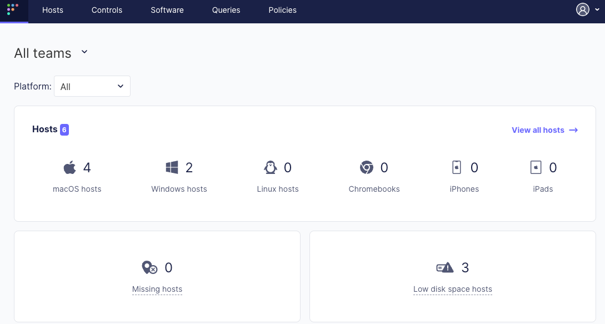
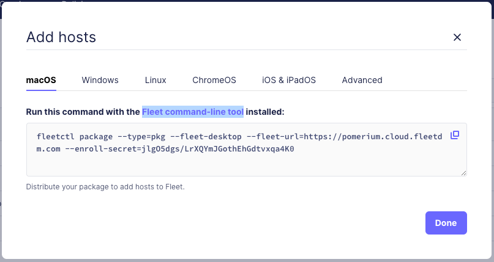
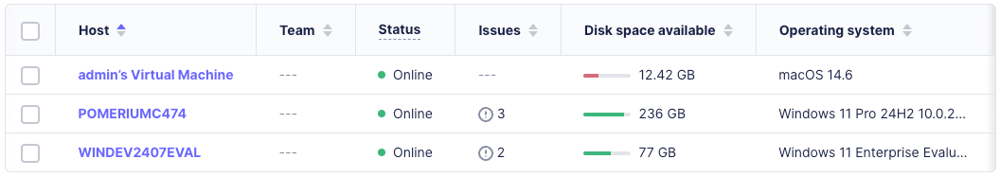
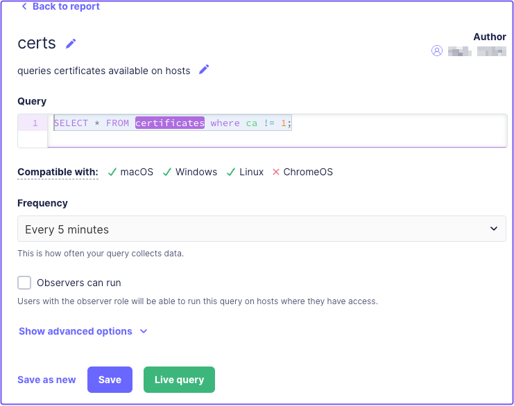
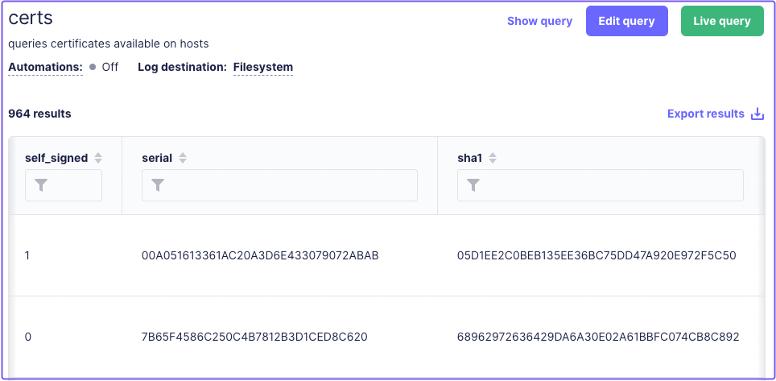
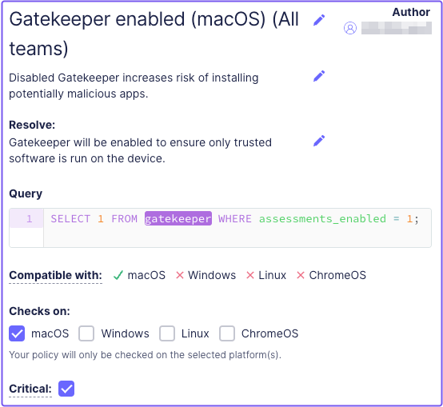
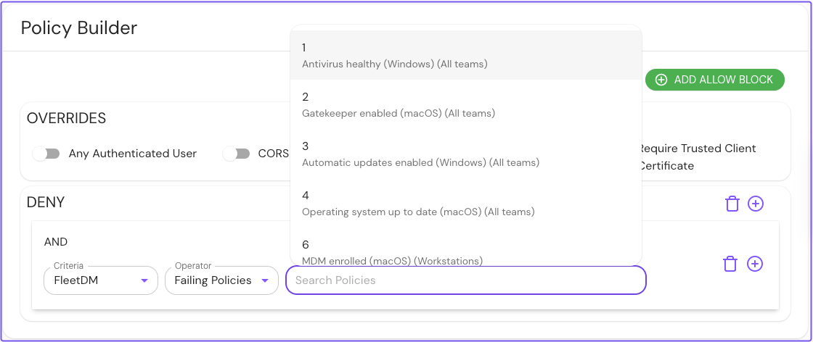
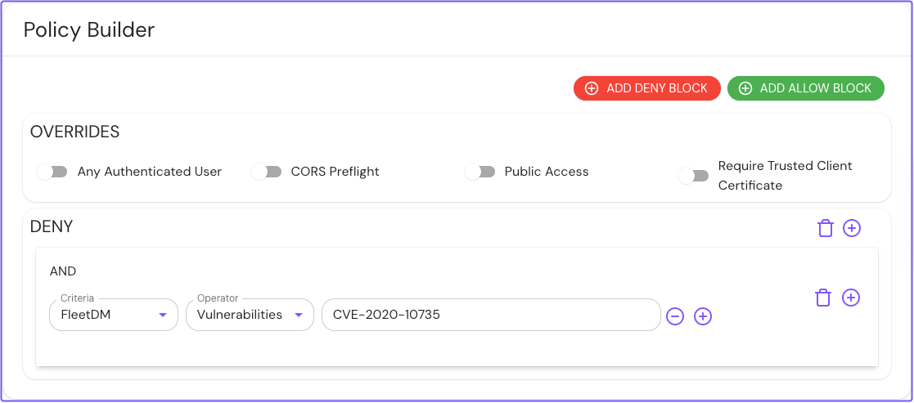

---
# cSpell:ignore fleetdm, fleetd, osquery
title: FleetDM Integration
sidebar_label: FleetDM
description: Learn how to integrate FleetDM with Pomerium Enterprise.
---

## FleetDM Integration

FleetDM provides an open-source, scalable device management (MDM) solution that supports all major operating systems and devices, including iPads, iPhones, and Chromebooks.

The FleetDM integration with Pomerium Enterprise enables you to build policies in Pomerium that express Fleet conditions as Pomerium policy language (PPL).

When Pomerium receives a request from a Fleet-managed device, Pomerium will make an authorization decision based on the device’s state and the applied policy criteria.

## How Pomerium works with FleetDM

Fleet provides a dedicated web service (Fleet UI) where administrators can manage teams, issued devices (”enrolled hosts”), Fleet policies, and more.

In Fleet UI, administrators can install Fleet agents on remote hosts. The Fleet agents periodically query hosts to gather updated host data, and push the information to Fleet servers. Administrators can review reports in Fleet UI to monitor hosts for security vulnerabilities.

Pomerium can integrate your Fleet instance as an external data source (the “FleetDM plugin”) in the Enterprise Console. You can use custom PPL criteria to build policies in Pomerium that enforce Fleet conditions before authorizing or denying access to services behind Pomerium. For example, Pomerium can deny access if:

- A device fails a [policy](https://fleetdm.com/docs/rest-api/rest-api#policies) defined in Fleet.
- A device is affected by a [vulnerability](https://fleetdm.com/docs/rest-api/rest-api#vulnerabilities).

### Host matching with client certificates

Integrating the FleetDM plugin returns the following records in the Enterprise Console:

- `fleetdm.com/CertificateSHA1Fingerprint`: represents a client certificate SHA-1 fingerprint that maps to a Fleet host ID
- `fleetdm.com/Host`: represents the state of a Fleet host
- `fleetdm.com/Policy`: represents a Fleet policy

Pomerium matches an incoming request with a Fleet-managed host by requiring the user to present a valid client certificate in the browser.

Pomerium receives the client certificate, generates its SHA-1 fingerprint, and matches it with the host ID stored in the FleetDM plugin.

### Host data

Using the host ID, Pomerium can periodically fetch [host](https://fleetdm.com/docs/rest-api/rest-api#example33) data from Fleet. The host data provides an updated [report](https://fleetdm.com/docs/rest-api/rest-api#get-query-report) of a host’s state, including its compliance to Fleet policies and vulnerability status.

<details>
  <summary>Example host response:</summary>
  <div>
    ```
        {
          "host":
          {
            ...
          "software": [
              {
                "id": 408,
                "name": "osquery",
                "version": "4.5.1",
                "source": "rpm_packages",
                "browser": "",
                "generated_cpe": "",
                "vulnerabilities": null,
                "installed_paths": ["/usr/lib/some-path-1"]
              },
              {
                "id": 1146,
                "name": "tar",
                "version": "1.30",
                "source": "rpm_packages",
                "browser": "",
                "generated_cpe": "",
                "vulnerabilities": null
              },
              {
                "id": 321,
                "name": "SomeApp.app",
                "version": "1.0",
                "source": "apps",
                "browser": "",
                "bundle_identifier": "com.some.app",
                "last_opened_at": "2021-08-18T21:14:00Z",
                "generated_cpe": "",
                "vulnerabilities": null,
                "installed_paths": ["/usr/lib/some-path-2"]
              }
              ...
          "policies": [
              {
                "id": 2,
                "name": "SomeQuery2",
                "query": "SELECT * FROM bar;",
                "description": "this is another query",
                "resolution": "fix with these other steps...",
                "platform": "darwin",
                "response": "fail",
                "critical": false
              },
              {
                "id": 3,
                "name": "SomeQuery3",
                "query": "SELECT * FROM baz;",
                "description": "",
                "resolution": "",
                "platform": "",
                "response": "",
                "critical": false
              },
              {
                "id": 1,
                "name": "SomeQuery",
                "query": "SELECT * FROM foo;",
                "description": "this is a query",
                "resolution": "fix with these steps...",
                "platform": "windows,linux",
                "response": "pass",
                "critical": false
              }
            ],
            ...
        }
    ```
  </div>
</details>

### FleetDM matcher and PPL criteria

Pomerium provides a custom FleetDM matcher, which is an object that uses operators as keys. The matcher points to records collected from the FleetDM plugin.

Custom FleetDM operators enable you to build policies that enforce Fleet conditions. Only [deny](/docs/capabilities/ppl#actions) actions are supported.

Custom FleetDM operators include:

| **Key name** | **Value type** | **Description** |
| --- | --- | --- |
| `last_seen_over` | string | Denies access if a Fleet agent hasn’t updated host data in the specified time. |
| `vulnerabilities` | string | Denies access if a host is affected by a specific CVE. |
| `failing_policies` | string | Denies access if a host fails a specific Fleet policy. |
| `failing_critical_policy` | boolean | Denies access if a host fails any critical Fleet policies. |
| `failing_any_policy` | boolean | Denies access if a host fails any Fleet policy. |

## Configure the FleetDM plugin

This guide shows you how to:

- Deploy a Fleet instance.
- Configure the FleetDM plugin in Pomerium Enterprise.
- Create authorization policies in Pomerium with FleetDM criteria.

To complete this guide, you need:

- [Pomerium Enterprise](https://www.pomerium.com/docs/enterprise)
- [Pomerium Core](https://www.pomerium.com/docs/core)
- A deployed [Fleet instance](https://github.com/fleetdm/fleet/tree/main/infrastructure/render)
- A configured certificate authority (CA) and client certificate
- An environment to install a Fleet agent

:::note

For the purposes of this guide, we recommend installing the Fleet agent in a VM running macOS. You can install and run a macOS VM for free with Tart. See the [Tart Quickstart](https://tart.run/quick-start/) for more information.

:::

### Configure FleetDM

To quickly set up FleetDM, see the [Fleet deployment guide](https://github.com/fleetdm/fleet/tree/main/infrastructure/render). After you deploy a Fleet instance, you should have the following services:

- Fleet web service
- Fleet MySQL database
- Fleet Redis service

Fleet provides a URL to access the dashboard of your Fleet instance:



### Enroll a host

Fleet [gathers host information](https://fleetdm.com/guides/enroll-hosts) by installing an [osquery](https://github.com/osquery/osquery) agent (”Fleet agent”) on each host.

To enroll a host, download the Fleet agent:

1. In the navigation bar, select **Hosts.**
1. Select **Add hosts**.
1. Select the operating system of the host you want to add. (This guide assumes **macOS.**)
1. Enter the provided command with the [Fleet command-line tool](https://fleetdm.com/guides/fleetctl).

   

   Running this command generates a `fleetd` installation package:

   ```bash
   Generating your fleetd agent...

   Success! You generated fleetd at /Users/<username>/fleet-osquery.pkg

   To add this device to Fleet, double-click to install fleetd.

   To add other devices to Fleet, distribute fleetd using Chef, Ansible, Jamf, or Puppet. Learn how: https://fleetdm.com/learn-more-about/enrolling-hosts
   ```

1. Run your macOS VM and install the `fleet-osquery.pkg`.

   If you check your Fleet dashboard, you should see the VM listed as an enrolled host:

   

1. Lastly, install the CA bundle, which includes the client certificate, on the VM where you installed the Fleet agent.

### Configure certificate query

Fleet agents provide a [certificates](https://fleetdm.com/tables/certificates) query that scans a device’s local key store for installed CA bundles. This query exposes certificates data, including the client certificate SHA-1 fingerprint installed on an enrolled host.

To configure the certificate query, in the Fleet dashboard:

1. Select **Queries.**
1. Select **Add query.**
1. Enter the following SQL command in the query field:

   ```sql
   SELECT * FROM certificates where ca != 1;
   ```

1. Select **Save** and enter a **Name**, **Description**, and **Frequency**.

   

In the Fleet dashboard, you can review a host's certificate details on the **Queries** page:

1. Select **Queries**.
1. Select the certificate query.
1. Find a host to review its certificate data.

   

### Create a Fleet policy

In the Fleet dashboard:

1. Select **Policies**.
1. Select **Add policy**.
1. Select a policy template, like **Gatekeeper enabled (macOS).**
1. Save your policy.

At this point, you can add as many policies as you like. You can also mark a policy as critical by selecting the **Critical** checkbox.



:::note

See the Fleet [policies](https://fleetdm.com/docs/rest-api/rest-api#policies) documentation to learn about how policies work.

:::

### Configure Pomerium Enterprise

Next, add the FleetDM plugin as an external data source in the Enterprise Console:

1. Select **External Data**.
2. Select **ADD EXTERNAL DATA SOURCE**.
3. In the **URL** field, enter the URL to the external data source.

### Create a policy in Pomerium

In the Enterprise Console:

1. Select **Policies,** create a **New Policy**, and name it.
2. Select the **Builder** tab.
3. Select **Add Deny Block**.
4. In the **Criteria** field, select **FleetDM**.
5. In the **Operator** field, select **Failing Policies**.
6. In the **Search Policies** bar, Pomerium will list Fleet policies. Select the policy you want to apply.

   

You can also deny access based on vulnerabilities:

1. In the **Operator** field, select **Vulnerabilities**.
2. Enter the vulnerability by its CVE ID. For example, `CVE-2020-10735`.

   

Save your policy. When you access a Pomerium route with a Fleet-managed host, Pomerium will authorize access based on the host’s compliance to Fleet policies and vulnerability status.
