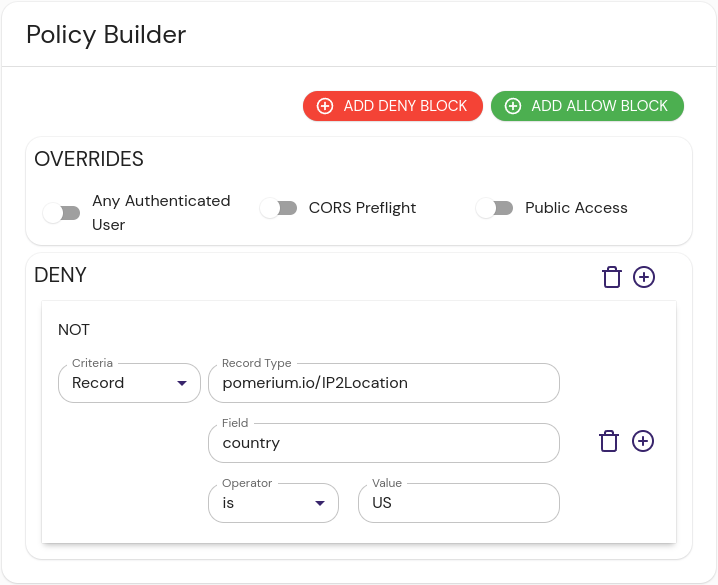

import Tabs from '@theme/Tabs';
import TabItem from '@theme/TabItem';

The GeoIP integration provides provides a list of IP address ranges and their country of origin. This data provider could allow an administrator to restrict, or allow access based on a users' known GeoIP fingerprint.

```json title="Example"
[
  {
    "$index": {"cidr": "1.0.0.0/24"},
    "id": "1.0.0.0/24",
    "country": "US",
    "state": "",
    "city": "",
    "zip": "",
    "timezone": ""
  },
  {
    "$index": {"cidr": "1.0.1.0/24"},
    "id": "1.0.1.0/24",
    "country": "CN",
    "state": "",
    "city": "",
    "zip": "",
    "timezone": ""
  }
]
```

:::caution

The external data sources we provide are meant to be examples and inspiration for users to create their own data sources. We won't maintain these integrations in perpetuity, and changes to the APIs they interact with may break them in the future.

The [datasource](https://github.com/pomerium/datasource) project is open-source, and if the community wishes to provide contributions to keep it working in the future, we will shepherd those updates.

:::

## Install

<Tabs>
<TabItem value="compose" label="Docker Compose">

These instructions assume a local testing environment using [Docker Compose]. Adjust as needed for your deployment environment.

1. Download the IP2Location CSV GeoIP database from [ip2location.com].

1. Add the datasource docker image to Docker Compose:

```yaml title="docker-compose.yaml"
services:
  ip2location:
    image: docker.cloudsmith.io/pomerium/datasource/datasource:main
    container_name: ip2location
    command:
      - ip2location
      - /var/ip2location.csv.zip
    ports:
      - 8080:8080
    volumes:
      - ${PWD}/IP2LOCATION-LITE-DB1.CSV.ZIP:/var/ip2location.csv.zip
```

1. Bring up the new container.

</TabItem>
<TabItem value="binary" label="Local Binary">

1. Download the latest [release] of the [Pomerium datasource] project and extract it.

1. Change directory and run the binary:

```sh
cd pomerium-datasource-*
./pomerium-datasource ip2location ../IP2LOCATION-LITE-DB1.CSV.ZIP
```

The output should resemble:

```sh
<nil> INF starting ip2location http server address=:8080 file=../IP2LOCATION-LITE-DB1.CSV.ZIP
```

</TabItem>
</Tabs>

## Configure External Data Source

Create an external data source:

1. In the Pomerium Enterprise Console, navigate to **CONFIGURE** → **External Data** and click **+ ADD EXTERNAL DATA SOURCE**.

1. Fill out the following fields:

| Field | Content | Notes |
| :-- | :-- | :-- |
| URL | http://localhost:8080 | If you configured the service in Docker Compose with a set container name, you can use that instead. |
| Record type | pomerium.io/GeoIP |  |
| Foreign Key | request.ip |  |
| Polling Min Delay | `30m` | Minimum poll interval |
| Polling Max Delay | `4h` | Maximum poll interval |

1. Click **SAVE EXTERNAL DATA SOURCE**.

## Configure Pomerium Enterprise Console

An example policy to restrict access to IP addresses within the United States would look something like this:

<Tabs>
<TabItem value="builder" label="Builder">



</TabItem>
<TabItem value="editor" label="Editor">

```yaml showLineNumbers
allow:
  and:
    - record:
        field: country
        is: US
        type: pomerium.io/GeoIP
```

</TabItem>
</Tabs>

This policy looks at the `country`, and allows access only from IP addresses purportedly in the US.

## Reference

- The ip2location datasource expects one argument when running the binary, the path to the GeoIP database.
- It has an optional flag `--address`, to change the listening port from the default `:8080`.

[pomerium datasource]: https://github.com/pomerium/datasource
[docker compose]: https://docs.docker.com/compose/
[ip2location.com]: https://www.ip2location.com/
[pomerium datasource]: https://github.com/pomerium/datasource
[release]: https://github.com/pomerium/datasource/releases
