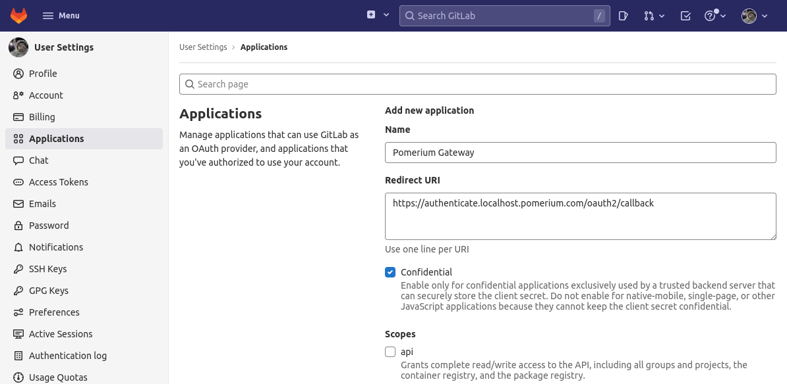
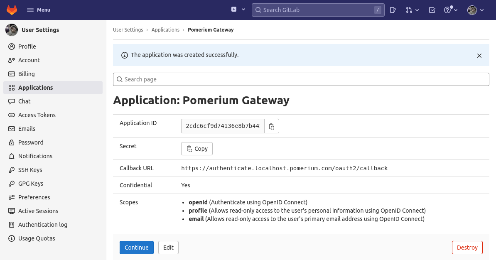
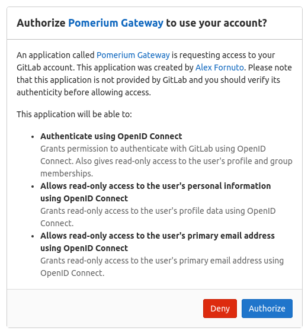
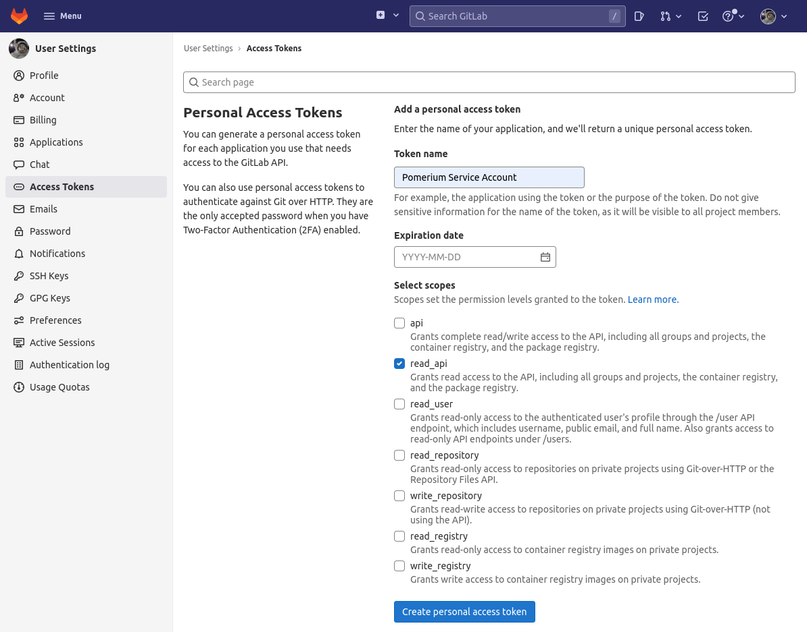

import Tabs from '@theme/Tabs';
import TabItem from '@theme/TabItem';

This document details how to use GitLab as an identity provider with Pomerium. It assumes you have already [installed Pomerium](/docs/zero/install).

:::caution

While we do our best to keep our documentation up to date, changes to third-party systems are outside our control. Refer to [GitLab as an OAuth 2.0 authentication service provider](https://docs.gitlab.com/ee/integration/oauth_provider.html) from GitLab's docs as needed, or [let us know](https://github.com/pomerium/documentation/issues/new?assignees=&labels=&template=doc-error.md) if we need to re-visit this page.

:::

## Setting up GitLab OAuth2 for your Application

1. Log in to your GitLab account or create one [here](https://gitlab.com/users/sign_in). If you're using a self-hosted instance, log in to your custom GitLab domain.

1. From the User Settings area, select [**Applications**](https://gitlab.com/-/profile/applications). Create a new application:

   

1. Add a new application by setting the following parameters:

   | Field        | Description                                           |
   | ------------ | ----------------------------------------------------- |
   | Name         | The name of your web app                              |
   | Redirect URI | `https://${authenticate_service_url}/oauth2/callback` |
   | Scopes       | `openid`, `profile`, `email`                          |

   Click **Save application**.

1. Your **Application ID** and **Secret** will be displayed:

   

   Note the ID and Secret to apply in Pomerium's settings.

## Pomerium Configuration

Edit your Pomerium configuration to provide the Client ID, secret, and domain (for self-hosted instances):

### GitLab.com

<Tabs queryString="configuration-settings">
<TabItem value="config-file-keys" label="Config file keys">

```yaml
idp_provider: 'gitlab'
idp_client_id: 'REDACTED' # gitlab application ID
idp_client_secret: 'REDACTED' # gitlab application secret
```

</TabItem>
<TabItem value="environment-variables" label="Environment Variables">

```bash
IDP_PROVIDER="gitlab"
IDP_CLIENT_ID="REDACTED" # gitlab application ID
IDP_CLIENT_SECRET="REDACTED" # gitlab application secret
```

</TabItem>
</Tabs>

### Self-Hosted GitLab

Self-hosted CE/EE instances should be configured as a generic OpenID Connect provider:

<Tabs queryString="configuration-settings">
<TabItem value="config-file-keys" label="config.yaml">

```yaml
idp_provider: oidc
idp_client_id: 'REDACTED'
idp_client_secret: 'REDACTED'
idp_scopes: openid,profile,email
idp_provider_url: https://gitlab.example.com # Base URL of GitLab instance
```

</TabItem>
<TabItem value="environment-variables" label="Environment Variables">

```bash
IDP_PROVIDER="oidc"
IDP_CLIENT_ID="REDACTED"
IDP_CLIENT_SECRET="REDACTED"
IDP_SCOPES="openid,profile,email"
IDP_PROVIDER_URL="https://gitlab.example.com" # Base URL of GitLab instance
```

</TabItem>
</Tabs>

---

When a user first uses Pomerium to login, they are presented with an authorization screen:



<Tabs queryString="get-groups">
<TabItem value="custom-claim" label="Custom Claim (Open Source)">

### Custom Claim (Open Source)

Unfortunately, Gitlab does not support OpenID Connect, and does not support custom identity (`id_token`) group claims.

</TabItem>
<TabItem value="directory-sync" label="Directory Sync (Enterprise)">

### Directory Sync (Enterprise)

In order for Pomerium to validate group membership, we'll also need to configure a [Personal Access Token](https://gitlab.com/-/profile/personal_access_tokens) in Gitlab.



### Configure Pomerium Enterprise Console

Under **Settings → Identity Providers**, select "Gitlab" as the identity provider and set the Private Token.


</TabItem>
</Tabs>
