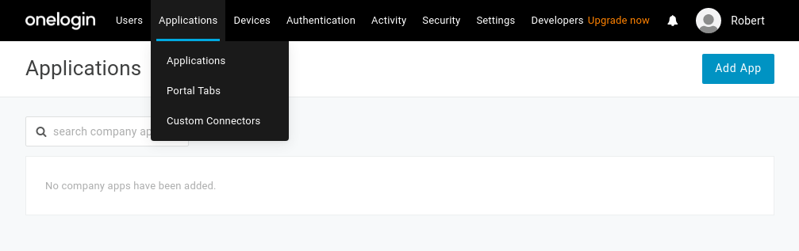
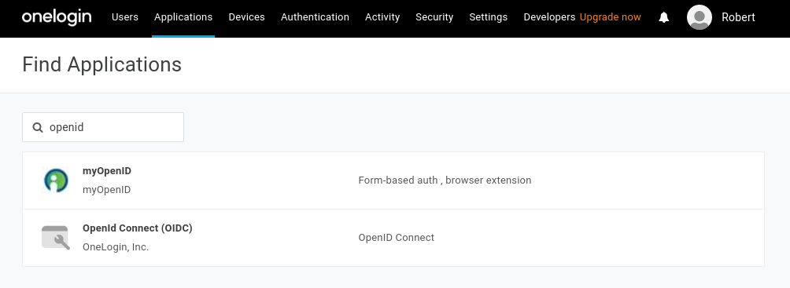
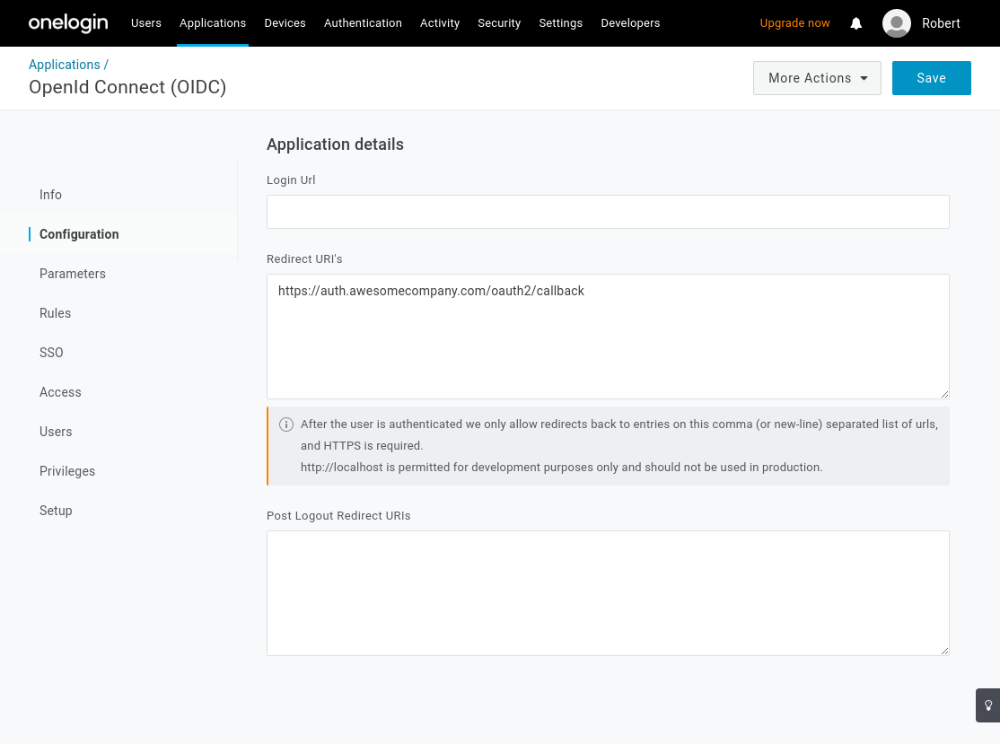
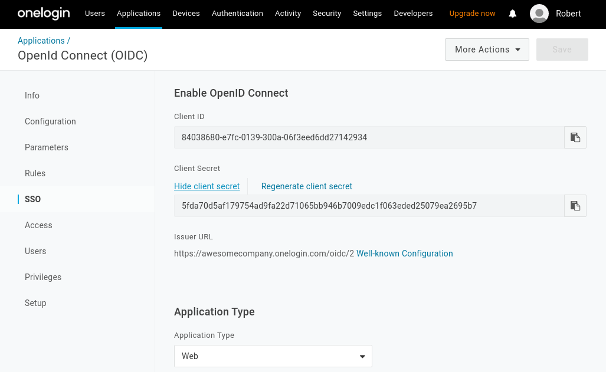
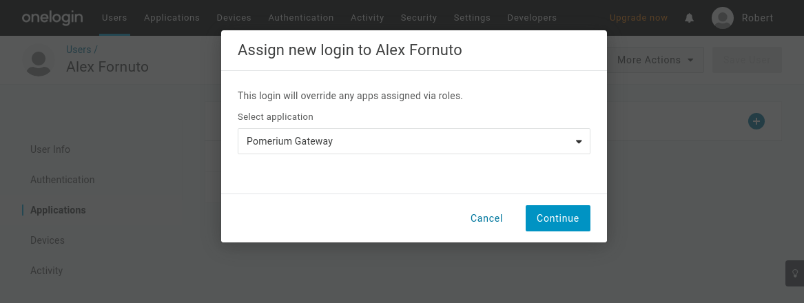
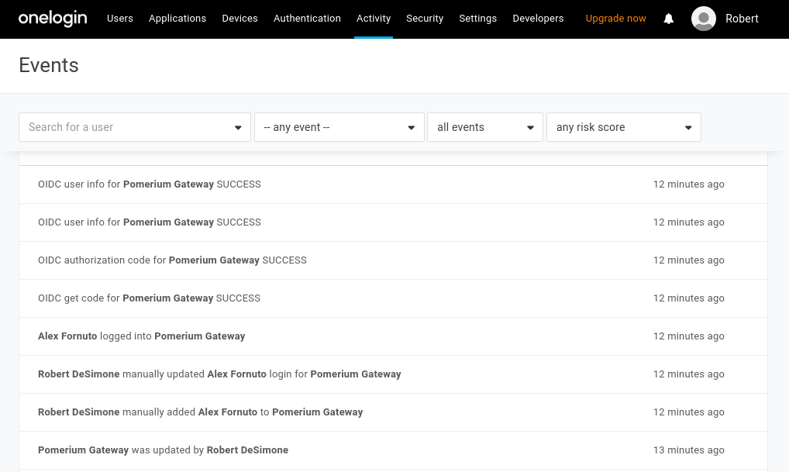
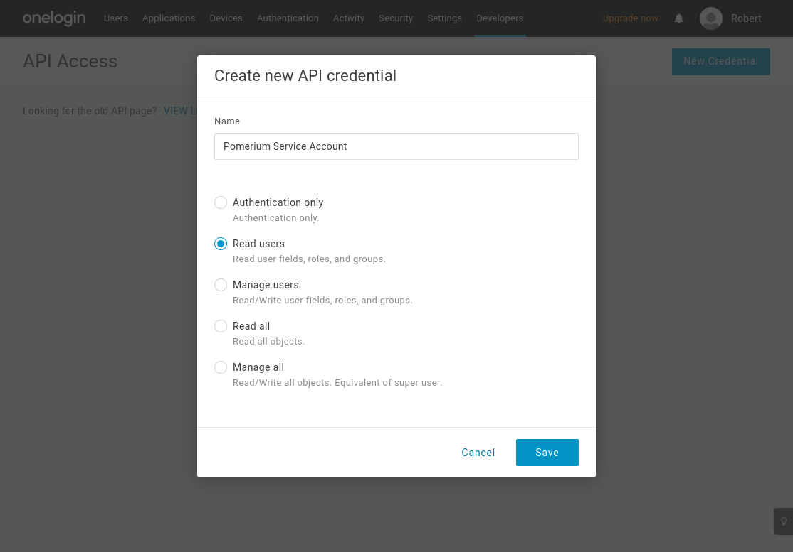
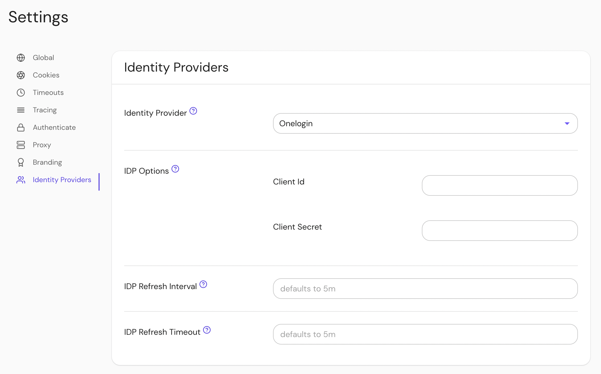

import Tabs from '@theme/Tabs';
import TabItem from '@theme/TabItem';

This doc describes how to create an OIDC app in [OneLogin] for Pomerium and connect to it. It assumes you have already [installed Pomerium].

:::caution

While we do our best to keep our documentation up to date, changes to third-party systems are outside our control. Refer to [Connect an OIDC enabled app](https://developers.onelogin.com/openid-connect/connect-to-onelogin) from OneLogin's documentation as needed, or [let us know](https://github.com/pomerium/documentation/issues/new?assignees=&labels=&template=doc-error.md) if we need to re-visit this page.

:::

## Create OpenID Connect App

1. Log in to your [OneLogin](https://www.onelogin.com/) account and click on **Administration** at the top.

1. Navigate to **Applications** on the top menu. Click the **Add App** button:

   

1. On the **Find Application** page, search for **openid**. Select **Openid Connect** by OneLogin, Inc.

   

1. On the App Configuration page, name the app and select a logo:

   

   Select **Save**.

1. From the **Configuration** tab, set set the **Redirect URI's** to Pomerium's redirect url (`https://${authenticate_service_url}/oauth2/callback`):

   

   Select **Save**.

1. Navigate to the **SSO** page. This section contains the **[Client ID]**, **[Client Secret]** and **[Identity Provider URL]** you'll use to configure Pomerium:

   

1. Set the application type to **Web** and the token endpoint to be **POST**.

1. Under **Token Timeout settings** set **Refresh Token** to 60 minutes (or whatever value makes sense for your organization). Note, however, if you don't enable refresh tokens the user will be prompted to authenticate whenever the access token expires which can result in a poor user experience.

   Select **Save** to complete the application configuration.

### Add Users

OneLogin will not make your new application accessible to members of your organization automatically. You can assign access to individual users (as shown below).



## Pomerium Configuration

Update your Pomerium configuration:

<Tabs queryString="configuration-settings">
<TabItem value="config-file-keys" label="config.yaml">

```yaml
idp_provider: 'onelogin'
idp_provider_url: 'https://awesomecompany.onelogin.com/oidc/2'
idp_client_id: 'REDACTED' # Your OneLogin application ID
idp_client_secret: 'REDACTED' # Your OneLogin application secret
```

</TabItem>
<TabItem value="environment-variables" label="Environment Variables">

```bash
IDP_PROVIDER="onelogin"
IDP_PROVIDER_URL="https://awesomecompany.onelogin.com/oidc/2"
IDP_CLIENT_ID="REDACTED" # Your OneLogin application ID
IDP_CLIENT_SECRET="REDACTED" # Your OneLogin application secret
```

</TabItem>
</Tabs>

After reloading Pomerium, you should be able to see any login events from your OneLogin events dashboard.



## Groups

A `groups` claim can be added to tokens returned from Okta by following the [Okta documentation](https://developer.okta.com/docs/guides/customize-tokens-groups-claim/main/).

Now when users login they will have a claim named `groups` that contains their groups and the `claim` PPL criterion can be used for authorization:

```yaml
routes:
  - from: 'https://verify.localhost.pomerium.io'
    to: 'https://verify.pomerium.com'
    policy:
      - allow:
          and:
            - claim/groups: admin
```

<Tabs queryString="get-groups">
<TabItem value="custom-claim" label="Custom Claim (Open Source)">

### Custom Claim (Open Source)

Unfortunately, OneLogin does not yet support getting groups data using a custom claim. Groups must be loaded by using a plugin to fetch directory information (see Enterprise's Directory Sync).

</TabItem>
<TabItem value="directory-sync" label="Directory Sync (Enterprise)">

### Directory Sync (Enterprise)

#### Create OneLogin Credentials

In order for Pomerium to validate group membership, we'll also need to configure [API Credentials](https://developers.onelogin.com/api-docs/1/getting-started/working-with-api-credentials) in OneLogin.

1. From the **Administration** dashboard, navigate to **Developers → API Credentials** and select **New Credential**.

1. Name the new credential and give it "Read users" access:



A [Group's ID](https://developers.onelogin.com/openid-connect/api/user-info) will be used to affirm a user's group membership.

#### Configure Pomerium Enterprise Console

Under **Settings → Identity Providers**, select "Onelogin" as the identity provider and set the Client ID and Client Secret.



</TabItem>
</Tabs>

[client id]: /docs/reference/identity-provider-settings#identity-provider-client-id
[client secret]: /docs/reference/identity-provider-settings#identity-provider-client-secret
[identity provider url]: /docs/reference/identity-provider-settings#identity-provider-url
[environmental variables]: https://en.wikipedia.org/wiki/Environment_variable
[oauth2]: https://oauth.net/2/
[openid connect]: https://en.wikipedia.org/wiki/OpenID_Connect
[onelogin]: https://www.onelogin.com/
[installed pomerium]: /docs/zero/install
