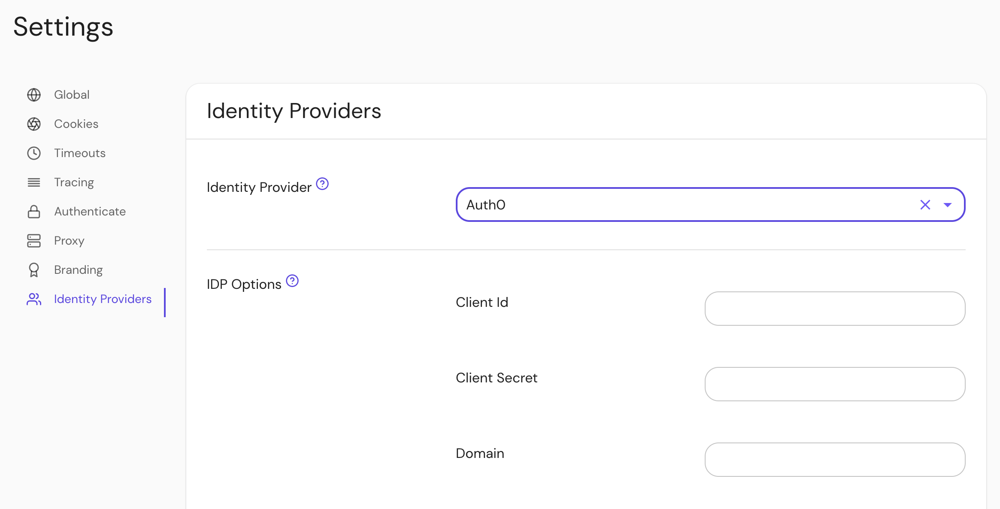

import Tabs from '@theme/Tabs';
import TabItem from '@theme/TabItem';

This page documents how to configure an [Auth0] application for use with Pomerium. It assumes you have already [installed Pomerium](/docs/get-started/quickstart).

:::caution

While we do our best to keep our documentation up to date, changes to third-party systems are outside our control. Refer to [Applications in Auth0](https://auth0.com/docs/applications) from Auth0's docs as needed, or [let us know](https://github.com/pomerium/documentation/issues/new?assignees=&labels=&template=doc-error.md) if we need to re-visit this page.

:::

## Create an Auth0 Application

1. [Log in to your Auth0 account](https://manage.auth0.com/) and head to your dashboard. Select **Applications → Applications** on the left menu. On the Applications page, click the **Create Application** button.

   

1. On the **Create New Application** page, name your application and select the type **Native**, then click **Create**. This is the application that your users will log in to.

   

1. Switch to the **Settings** tab, and note the **Domain**, **Client ID**, and **Client Secret** values. We'll need these later to configure Pomerium.

1. Provide the following information for your application settings:

   | Field | Description |
   | --- | --- |
   | Name | The name of your application. |
   | Application Login URI | [Authenticate Service URL] (e.g. `https://auth.example.com`) |
   | Allowed Callback URLs | Redirect URL (e.g. `https://auth.example.com/oauth2/callback`). |
   | Allowed Logout URLs | Sign Out URL (e.g. `https://auth.example.com/.pomerium/signed_out`). |

1. In pomerium versions 0.31.X and below, if you want to use Pomerium's [**native SSH access**](/docs/capabilities/native-ssh-access): scroll down to **Advanced Settings** near the bottom of the page, then select the **Grant Types** tab. Make sure the **Device Code** box is checked:

   

The device code support is not needed in 0.32.0 and above.

1. Click **Save** at the bottom of the page when you're done.

## Configure Pomerium

You can now configure Pomerium with the identity provider settings retrieved in the previous steps. Your `config.yaml` keys or [environmental variables] should look something like this.

<Tabs queryString="configuration-settings">
<TabItem value="config-file-keys" label="Config file keys">

```yaml
idp_provider: 'auth0'
idp_provider_url: 'https://awesome-company.auth0.com'
idp_client_id: 'REPLACE_ME' # from the web application
idp_client_secret: 'REPLACE_ME' # from the web application
```

</TabItem>
<TabItem value="environment-variables" label="Environment Variables">

```bash
IDP_PROVIDER="auth0"
IDP_PROVIDER_URL="https://awesome-company.auth0.com"
IDP_CLIENT_ID="REPLACE_ME" # from the web application
IDP_CLIENT_SECRET="REPLACE_ME" # from the web application
```

</TabItem>
</Tabs>

:::tip

Remember to prepend the Auth0 **Domain** with `https://` to get the provider URL.

:::

## Groups

<Tabs queryString="get-groups">
<TabItem value="custom-claim" label="Custom Claim (Open Source)">

### Custom Claim

To authorize users based on their group membership (roles in Auth0), a claim can be added to the identity token with a [login action](https://auth0.com/docs/customize/actions).

1. Create an action named `add groups` with the following code:

   ```javascript
   exports.onExecutePostLogin = async (event, api) => {
     if (event.authorization) {
       api.idToken.setCustomClaim(
         'pomerium.io/groups',
         event.authorization.roles,
       );
     }
   };
   ```

1. Deploy the action:

   

1. Add it to the login flow:

   

Now when users login they will have a claim named `pomerium.io/groups` that contains their groups (Auth0 roles) and the `claim` PPL criterion can be used for authorization:

```yaml
routes:
  - from: 'https://verify.localhost.pomerium.io'
    to: 'https://verify.pomerium.com'
    policy:
      - allow:
          and:
            - claim/pomerium.io/groups: admin
```

</TabItem>
<TabItem value="directory-sync" label="Directory Sync (Enterprise)">

### Setting Up Directory Sync

1. Create a **Machine to Machine Application**. A different application is used for grabbing roles to keep things more secure.

   

   Click **Create**.

1. On the next page select **Auth0 Management API** from the dropdown. Under **Permissions** use the filter on the right to narrow things down to `role`, and choose the `read:roles`, `read:role_members`, `read:users`, and `read:user_idp_tokens` roles.

   

   Then click **Authorize**.

1. Retrieve the **Client ID** and **Client Secret** from the **Settings** tab.

### Configure Pomerium Enterprise Console

Under **Settings → Identity Providers**, select "Auth0" as the identity provider and set the Client ID, Client Secret and Domain.



[auth0]: https://auth0.com/
[authenticate service url]: /docs/reference/service-urls#authenticate-service-url
[environmental variables]: https://en.wikipedia.org/wiki/Environment_variable

</TabItem>
</Tabs>

[auth0]: https://auth0.com/
[authenticate service url]: /docs/reference/service-urls#authenticate-service-url
[environmental variables]: https://en.wikipedia.org/wiki/Environment_variable
