import Tabs from '@theme/Tabs';
import TabItem from '@theme/TabItem';

# Microsoft Entra ID (formerly Azure Active Directory)

Learn how to configure Pomerium to use **Microsoft Entra ID** (formerly Azure Active Directory) as an identity provider.

:::caution

While we do our best to keep our documentation up to date, changes to third-party systems are outside our control. Refer to [Quickstart: Register an application with the Microsoft identity platform](https://docs.microsoft.com/en-us/azure/active-directory/develop/quickstart-register-app) from Microsoft's documentation as needed, or [let us know](https://github.com/pomerium/documentation/issues/new?assignees=&labels=&template=doc-error.md) if we need to re-visit this page.

:::

## Before you begin

To complete this guide, you must:

- Install [Pomerium](/docs/get-started/quickstart)
- Create a free [Microsoft 365 administration account](https://www.microsoft.com/en-us/microsoft-365/business/office-365-administration) (or have admin privileges with an existing Microsoft 365 account)

## Access your Entra ID instance

If you want users to sign in to an application using a Microsoft Entra ID account, either from your organization or from external directories, you must register the application through the Microsoft Azure portal.

If you have a Microsoft 365 account (formerly Office 365), you can use your account's Entra ID instance instead of creating a new one. You can access Entra ID from the **Microsoft 365 admin center** or directly from the **Azure portal**.

To find your Microsoft 365 Entra ID instance from the Microsoft 365 admin center:

1. [Sign in](https://login.microsoftonline.com/) to Microsoft 365
1. In the sidebar, select **Admin**
1. In the admin center sidebar, select **Identity**

To find your Microsoft 365 Entra ID instance from the Azure portal:

1. [Sign in](https://azure.microsoft.com/en-us/free) to Azure
1. Select the sidebar menu to expand It
1. Select **Microsoft Entra ID**

Either of these instructions will take you to the Entra ID backing your Microsoft 365 account.

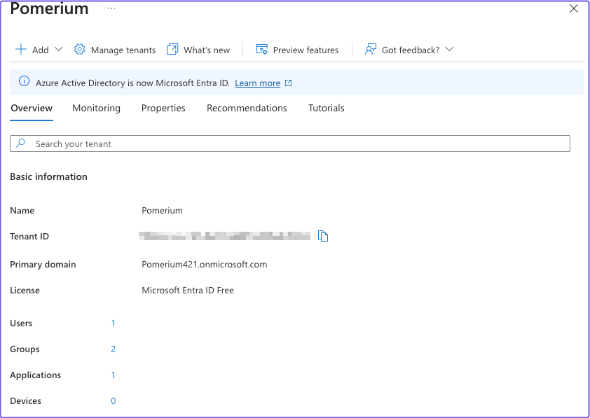

## Register a new application

Once you're in the Entra ID dashboard, register an application:

1. Select **+ Add** and **App registration**. 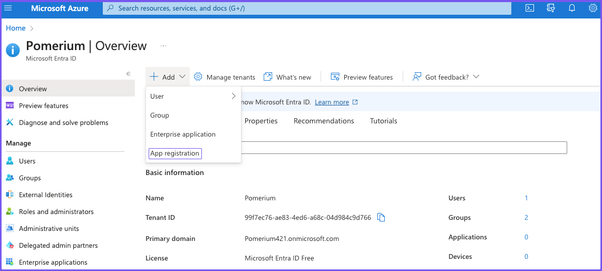

1. Enter a name for the application. Under **Redirect URI**, select **Web** and set the value to `https://${authenticate_service_url}/oauth2/callback`. Select **Register**. 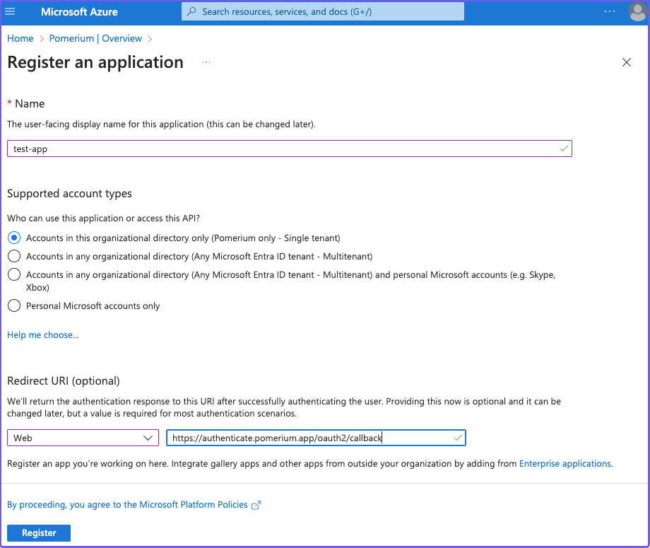

1. After you register the application, save the **Application (client) ID** and **Directory (tenant) ID** for later. Under **Client credentials**, select **Add a certificate or secret**. 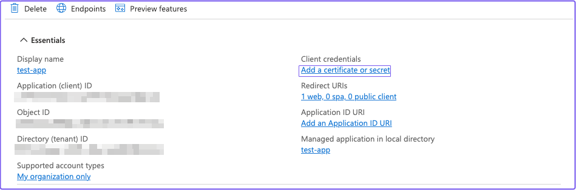

1. In the **Certificates & secrets** screen, select the **Client secrets** tab, then **+ New client secret**. In the **Add a new client secret** panel, give the key a description and expiry time. (You will use this key as your [Client Secret](/docs/reference/identity-provider-settings#identity-provider-client-secret) later.) 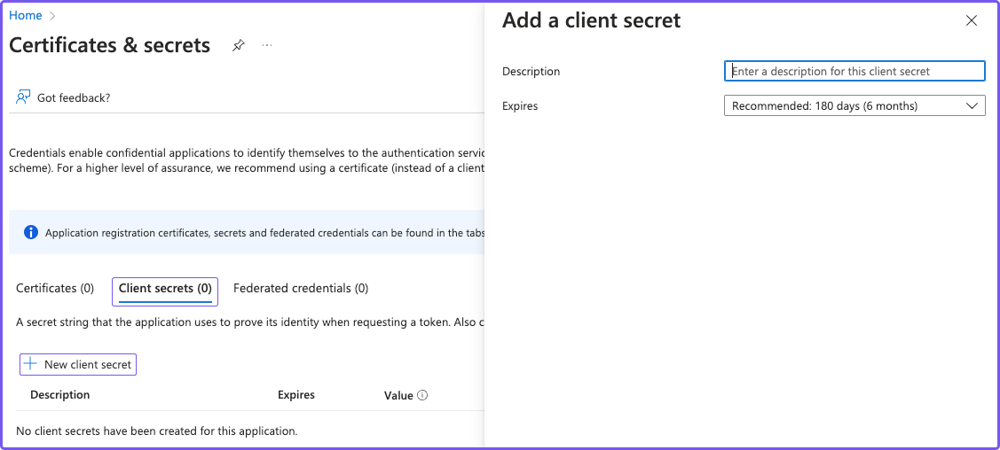

   :::note

   Make sure you save the client secret **Value** and not the **Secret ID**. After you generate the secret and leave the screen, you can't view or copy the secret value unless you delete the secret and generate a new one.

   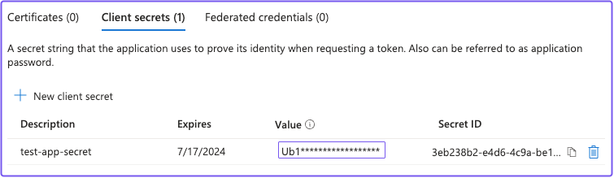

   :::

### API Permissions

To get group information from Entra ID, you must enable the necessary [Microsoft Graph API](https://docs.microsoft.com/en-us/graph/auth-v2-service#azure-ad-endpoint-considerations) permissions.

:::note

You will use the [**Group ID**](https://docs.microsoft.com/en-us/graph/api/group-get?view=graph-rest-1.0&tabs=http) to affirm group membership (not the [**Group Display Name**](https://learn.microsoft.com/en-us/graph/api/resources/group?view=graph-rest-1.0#properties)).

:::

1. From the **App registrations** page, select **API permissions**:

   - Select **+ Add a permission**, then **Microsoft Graph API**
   - Select **Application permissions**
   - Use the filter to select the checkboxes for **Directory.Read.All**, **Group.Read.All** and **User.Read.All**, then select **Add permissions**

   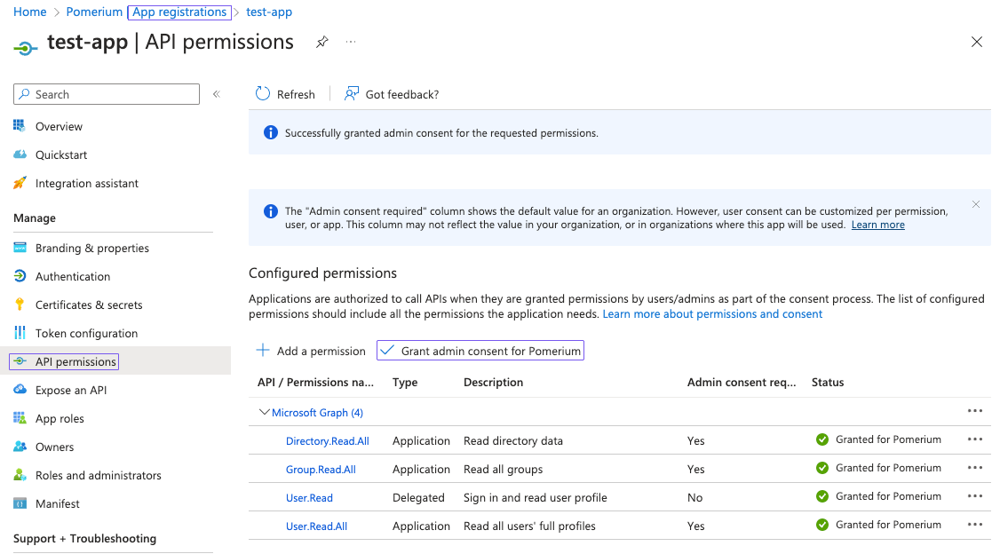

   You can also optionally select **Grant admin consent for Default Directory**, which suppresses the permission screen on first sign-in for users.

1. Go back to the **App registrations** page and select your app. Select the **Endpoints** tab. 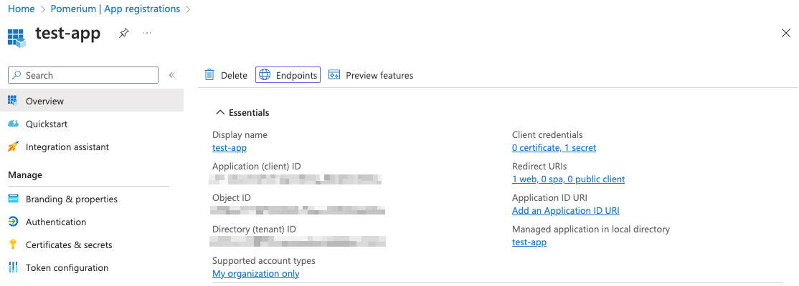

   Copy the value under the **OpenID Connect metadata document** field:

   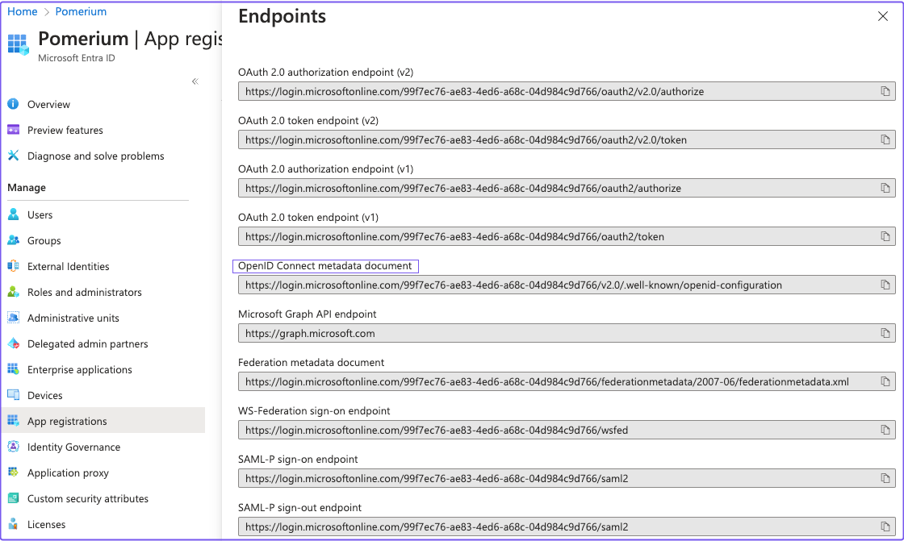

The **OpenID Connect metadata document** value will form the basis for Pomerium's **[Provider URL](/docs/reference/identity-provider-settings#identity-provider-url)** setting.

For example, if the **Entra ID OpenID Connect** URL is:

```bash
https://login.microsoftonline.com/0303f438-3c5c-4190-9854-08d3eb31bd9f/v2.0/.well-known/openid-configuration`
```

Then the **Pomerium Identity Provider URL** would be:

```bash
https://login.microsoftonline.com/0303f438-3c5c-4190-9854-08d3eb31bd9f/v2.0
```

## Pomerium Configuration

Configure Pomerium with the identity provider settings you saved in the previous steps:

<Tabs queryString="configuration-settings">
<TabItem value="config-file-keys" label="Config file keys">

```yaml
idp_provider: 'azure'
idp_provider_url: 'https://login.microsoftonline.com/{REPLACE-WITH-OIDC-METADATA-STRING}/v2.0'
idp_client_id: 'REPLACE-WITH-CLIENT-ID'
idp_client_secret: 'REPLACE-WITH-CLIENT-SECRET'
```

</TabItem>
<TabItem value="environment-variables" label="Environment variables">

```bash
IDP_PROVIDER="azure"
IDP_PROVIDER_URL="https://login.microsoftonline.com/{REPLACE-WITH-OIDC-METADATA-STRING}/v2.0"
IDP_CLIENT_ID="REPLACE-WITH-CLIENT-ID"
IDP_CLIENT_SECRET="REPLACE-WITH-CLIENT-SECRET"
```

</TabItem>
</Tabs>

:::note

Pomerium currently uses **`azure`** as the **`idp_provider`** name to refer to Microsoft Entra ID.

:::

## Getting Groups

<Tabs queryString="get-groups">
<TabItem value="custom-claim" label="Custom Claim (Open Source)">

### Custom Claim (Open Source)

To authorize users based on their group membership, add a `group` claim to the identity token:

1. Go to **App registrations** and select **Token configuration**, then **+ Add groups claim**. 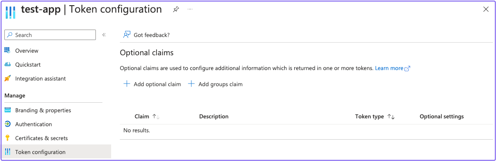
1. In the **Edit groups claim** panel, select the appropriate group types. Under **Customize token properties by type**, select **Group ID** for **ID**, **Access**, and **SAML**. 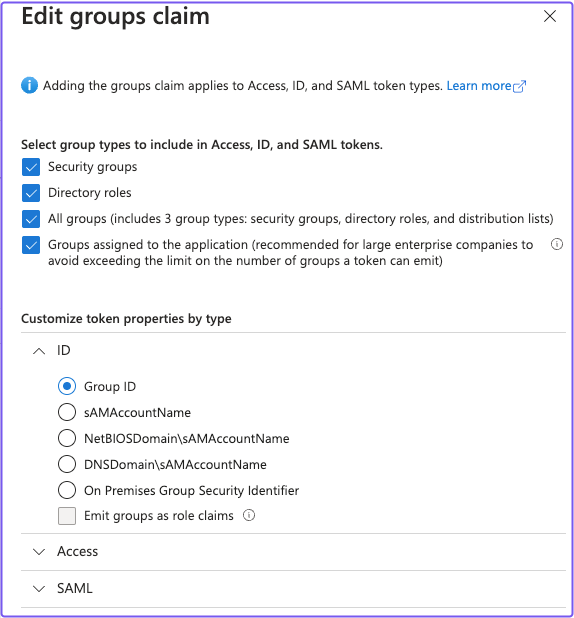

### Apply custom claims to a policy

You can use the [Claim PPL criterion](/docs/internals/ppl#criteria) to factor in the `groups` value in your authorization policy.

For example:

```yaml
routes:
  - from: 'https://verify.localhost.pomerium.io'
    to: 'https://verify.pomerium.com'
    policy:
      - allow:
          and:
            - claim/groups: 'e14f56fd-b956-4009-b06c-dc8a5e9207c8'
```

:::note

The **`groups`** claim contains group IDs, not group names.

:::

</TabItem>
<TabItem value="directory-sync" label="Directory Sync (Enterprise)">

### Directory Sync (Enterprise)

Entra ID uses the same Client ID and Client Secret used in [Pomerium Core](/docs/deploy/core).

### Configure Pomerium Enterprise Console

Under **Settings > Identity Providers**, select "Azure" as the identity provider and set the Client ID, Client Secret, and Directory (Tenant) ID.

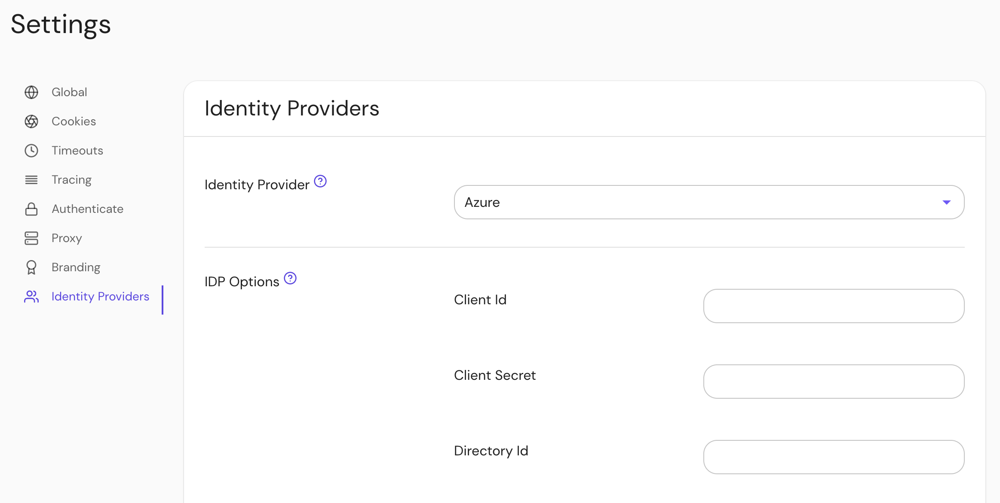

## Troubleshooting

- In our testing, we found that users could be created in an Entra ID directory without an email address as part of their user claim. Pomerium user identity depends largely on the associated email address.
- If your default user in the Entra ID directory is unauthorized (`403`) even when specified as allowed in a policy by the user claim, you can mitigate this behavior by creating a group membership and corresponding policy.

</TabItem>
</Tabs>

[client id]: /docs/reference/identity-provider-settings#identity-provider-client-id
[client secret]: /docs/reference/identity-provider-settings#identity-provider-client-secret
[environmental variables]: https://en.wikipedia.org/wiki/Environment_variable
[oauth2]: https://oauth.net/2/
