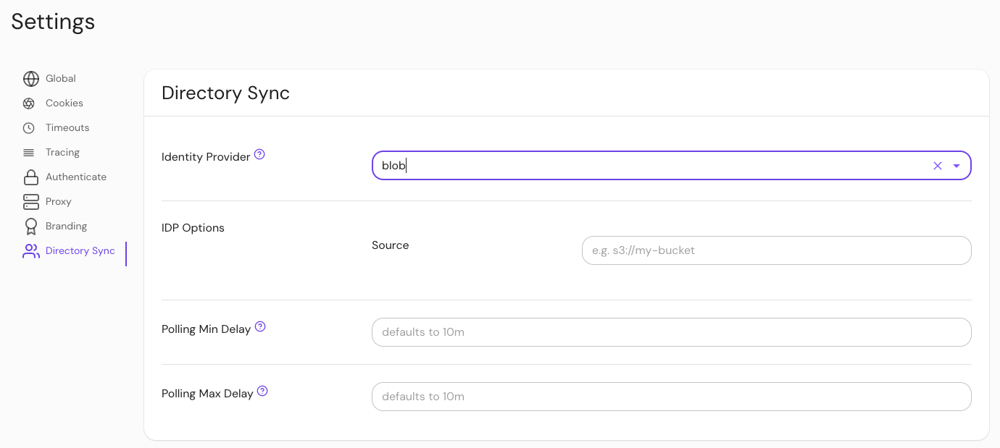

---
# cSpell:ignore azblob

title: Blob Directory Provider
sidebar_label: Blob
description: Learn how to configure blob storage as a directory provider in Enterprise.
lang: en-US
keywords: [blob, directory provider, identity provider, idp]
pagination_prev: null
pagination_next: null
---

# Blob Directory Provider

Learn how to configure Enterprise to use **blob storage** as a directory provider.

## Supported Blob Storage Services

Starting in v0.30, the following blob storage services are supported:

- Google Cloud Storage: `gs://my-bucket`
- Amazon S3: `s3://my-bucket?region=us-west-1`
- Azure Blob Storage: `azblob://my-container`
- Local Storage: `file:///path/to/dir`

Directory data is expected to be in a zip file named `bundle.zip` containing two files:

- `pomerium.io/DirectoryGroup.json`: a JSON array of group objects containing `id` and `name` fields. For example:
  ```json
  [
    {"id": "g1", "name": "Group 1"},
    {"id": "g2", "name": "Group 2"},
    {"id": "g3", "name": "Group 3"}
  ]
  ```
- `pomerium.io/DirectoryUser.json`: a JSON array of user objects containing `id`, `display_name`, `email`, and `group_ids` fields. For example:

  ```json
  [
    {
      "id": "u1",
      "display_name": "User 1",
      "email": "u1@example.com",
      "group_ids": ["g1", "g2"]
    }
  ]
  ```

## Upload Directory Data

The [datasource](https://github.com/pomerium/datasource) repository has an application which can populate this data from any of Pomerium's supported directory providers.

For example, to create a `bundle.zip` containing Microsoft Entra directory data, you could run the following:

```bash
mkdir -p "/tmp/blob-example"
docker run \
    -v /tmp/blob-example:/tmp/blob-example \
    pomerium/datasource:main \
    directory azure upload \
    --debug \
    --client-id="$CLIENT_ID" \
    --client-secret="$CLIENT_SECRET" \
    --directory-id="$DIRECTORY_ID" \
    --destination='file:///tmp/blob-example?no_tmp_dir=1'
```

## Configure Pomerium Enterprise Console

Under **Settings > Directory Sync**, select "Blob" as the identity provider and set the source to one of the supported providers.


