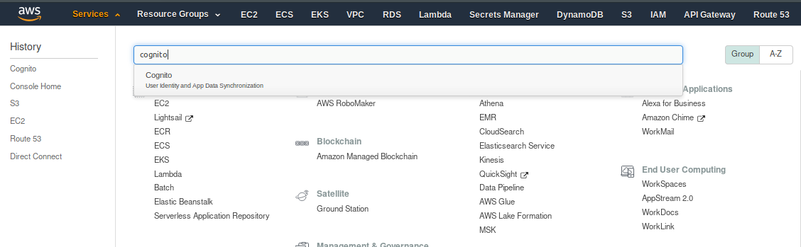
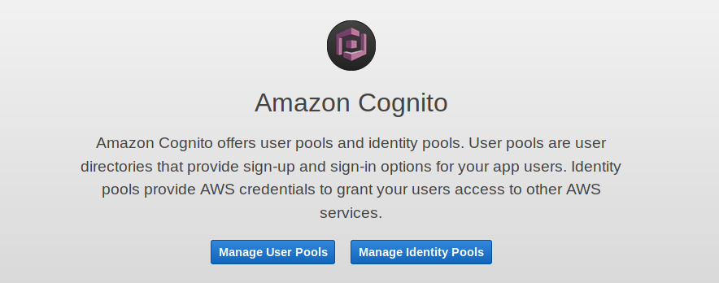
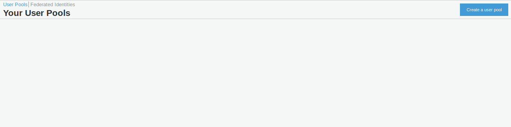
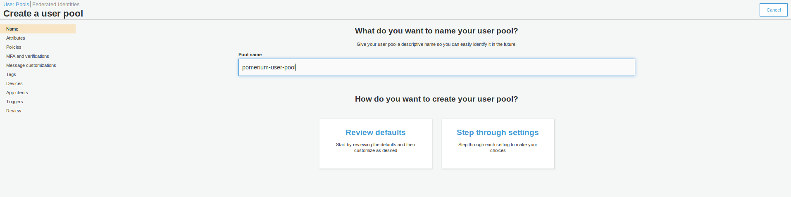
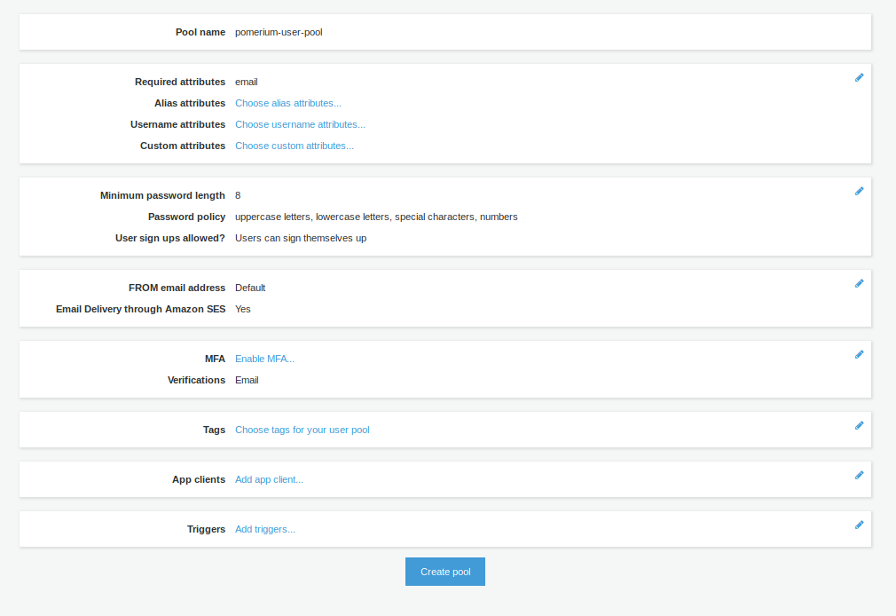
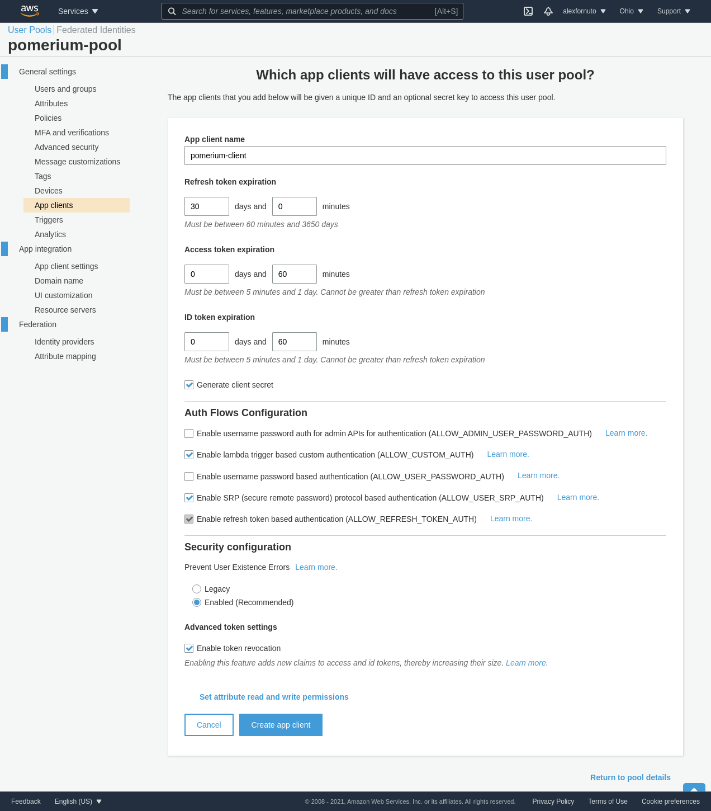
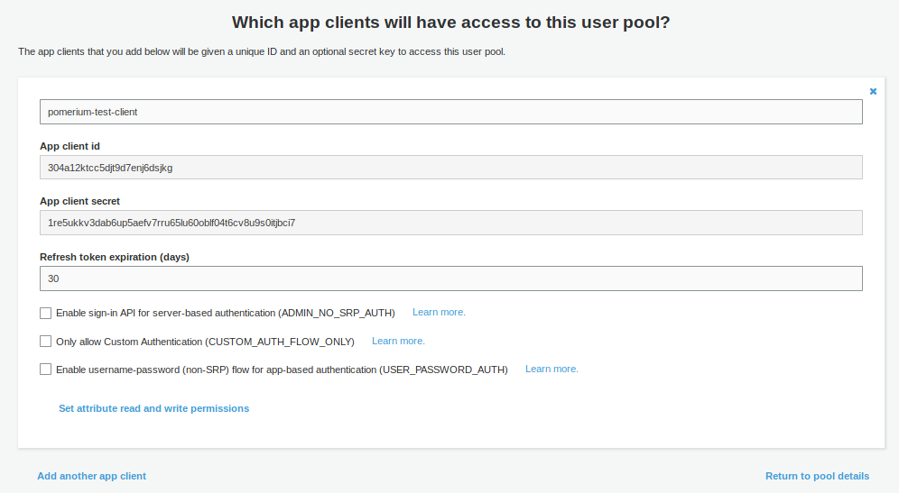
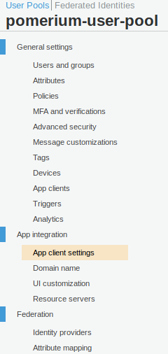
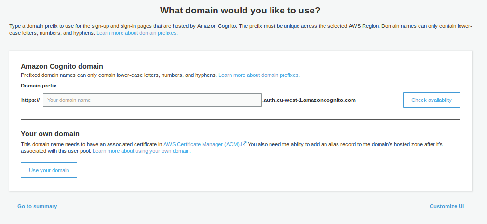
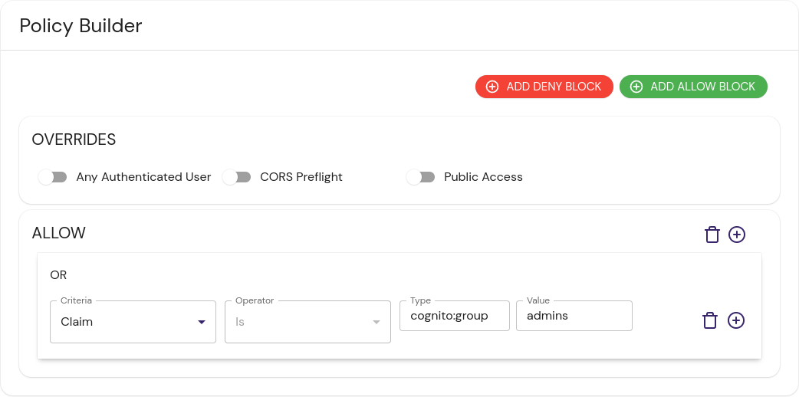

---
# cSpell:ignore 304a12ktcc5djt9d7enj6dsjkg 1re5ukkv3dab6up5aefv7rru65lu60oblf04t6cv8u9s0itjbci7

title: Cognito
lang: en-US
# keywords: [amazon, aws, cognito, openid, oidc, identity provider, idp]pagination_prev: null
pagination_prev: null
pagination_next: null
---

import Tabs from '@theme/Tabs';
import TabItem from '@theme/TabItem';

This document describes the use of AWS Cognito as an identity provider with Pomerium. It assumes you have already [installed Pomerium](/docs/get-started/quickstart)

:::caution

While we do our best to keep our documentation up to date, changes to third-party systems are outside our control. Refer to [Amazon Cognito Documentation](https://docs.aws.amazon.com/cognito/index.html) as needed, or [let us know](https://github.com/pomerium/pomerium/issues/new?assignees=&labels=&template=bug_report.md) if we need to re-visit this page.

:::

## Setting up AWS Cognito

If you're following this doc you likely already have a Cognito user pool. If not, expand the section below to learn how to create a user pool.

<details>
<summary>Create a User Pool</summary>

1. Log in to the [AWS Console](https://console.aws.amazon.com) account. Go to **Services** on the top menu, and search for **Cognito**:

   

1. Once you have selected **Cognito**, you will be presented with the option of **Manage User Pools** or **Manage Identity Pools**. Pick **Manage User Pools**:

   

1. The next page shows any User Pools you have already created, or the option to **Create a User Pool**:

   

1. Give the pool a name, then choose to either **Review defaults** or **Step through settings**. It is up to you whether you choose to Review the defaults (and make some customization) or set up every setting individually.

   

1. Assuming you selected **Review defaults**, you will see the following:

   

   You can enable Multi-Factor Authentication (MFA), change your Password requirements, Tag the pool, among many other settings.

:::tip

If you need to make changes after creating your pool, be aware that some settings will recreate the pool rather than update the existing pool. This will also generate new **Client IDs** and **Client Secrets**. An example would be changing _How do you want your end users to sign in?_ in **Attributes** from **Username** to **Email address or phone number**.

:::

</details>

### Create an App Client

1. From the user pool, create an **App Client** under **General settings**. This is where you configure the Pomerium application settings. Choose **Add an App Client**. You can configure the values to match your needs, or use the default settings:

   

1. Once the client is created, retrieve the **Client ID**, and the **Client Secret** by clicking **Show Details**.

   

1. Go to **App client settings** (in the Side menu under **App Integration**)

   

   In the settings for **Pomerium** app, enter the following details (replace `{AUTHENTICATE_DOMAIN}` with the actual domain you will use for the [Authenticate Service URL](/docs/reference/service-urls#authenticate-service-url))

   | **Field** | **Description** |
   | --- | --- |
   | Enabled Identity Providers | Choose **Cognito User Pool**, unless you have set up another **Identity Provider** (eg SAML) |
   | Allowed callback URLs | `https://{AUTHENTICATE_DOMAIN}/oauth2/callback` |
   | Allowed sign-out URLs | `https://{AUTHENTICATE_DOMAIN}/.pomerium/signed_out` |
   | Allowed OAuth Flows | Authorization code grant |
   | Allowed OAuth Scopes | Email, OpenID, Profile |

1. **IMPORTANT**: For OAuth2 to work correctly with AWS Cognito, you must configure a **Domain name**. This is under **App integration** in the side menu

   

You can choose whether to use your own **Domain Name**, or use an AWS-provided one. The AWS-provided domain names are in the format `https://${DOMAIN-PREFIX}.auth.${AWS-REGION}.amazoncognito.com`

## Pomerium Configuration

Once you have configured AWS Cognito, configure Pomerium to connext to it:

<Tabs queryString="configuration-settings">
<TabItem value="config-file-keys" label="Config file keys">

```yaml
idp_provider: 'oidc'
idp_provider_url: 'https://cognito-idp.${AWS-REGION}.amazonaws.com/${USER-POOL-ID}'
idp_client_id: '304a12ktcc5djt9d7enj6dsjkg'
idp_client_secret: '1re5ukkv3dab6up5aefv7rru65lu60oblf04t6cv8u9s0itjbci7'
idp_scopes: 'openid,profile,email'
```

</TabItem>
<TabItem value="environment-variables" label="Environment Variables">

```bash
IDP_PROVIDER="oidc"
IDP_PROVIDER_URL="https://cognito-idp.${AWS-REGION}.amazonaws.com/${USER-POOL-ID}"
IDP_CLIENT_ID="304a12ktcc5djt9d7enj6dsjkg"
IDP_CLIENT_SECRET="1re5ukkv3dab6up5aefv7rru65lu60oblf04t6cv8u9s0itjbci7"
IDP_SCOPES="openid,profile,email"
```

</TabItem>
<TabItem value="kubernetes-config-map" label="Kubernetes ConfigMap">

```yaml
apiVersion: v1
data:
  config.yaml: |
    # Main configuration flags : https://www.pomerium.io/reference/
    authenticate_service_url: https://k8s-auth-prod.example.com # The URL you have set up for the Pomerium Authentication service
    authorize_service_url: https://pomerium-authorize-service.default.svc.cluster.local

    idp_provider: oidc
    idp_provider_url: https://cognito-idp.${AWS-REGION}.amazonaws.com/${USER_POOL_ID}
    idp_client_id: 304a12ktcc5djt9d7enj6dsjkg
    idp_client_secret: "1re5ukkv3dab6up5aefv7rru65lu60oblf04t6cv8u9s0itjbci7"
    idp_scopes: ["openid", "email", "profile"]
kind: ConfigMap
metadata:
  name: pomerium-config
```

</TabItem>
</Tabs>

To retrieve the **User Pool ID**, go to **General Settings** in the Cognito Side menu within your pool. The **Pool ID** is just above the **Pool ARN**.

## Getting Groups

Cognito embeds group membership into the access token. To create policies based on group membership, use the `allowed_idp_claims` key. Replace `admins` in the examples below with your group:

<Tabs queryString="get-groups">
<TabItem value="custom-claim" label="Custom Claim (Open Source)">

### Custom Claim (Open Source)

```yaml
- from: http://from.example.com
  to: http://to.example.com
  allowed_idp_claims:
    cognito:groups:
      - admins
```

</TabItem>
<TabItem value="directory-sync" label="Directory Sync (Enterprise)">

### Directory Sync (Enterprise)



</TabItem>
</Tabs>
