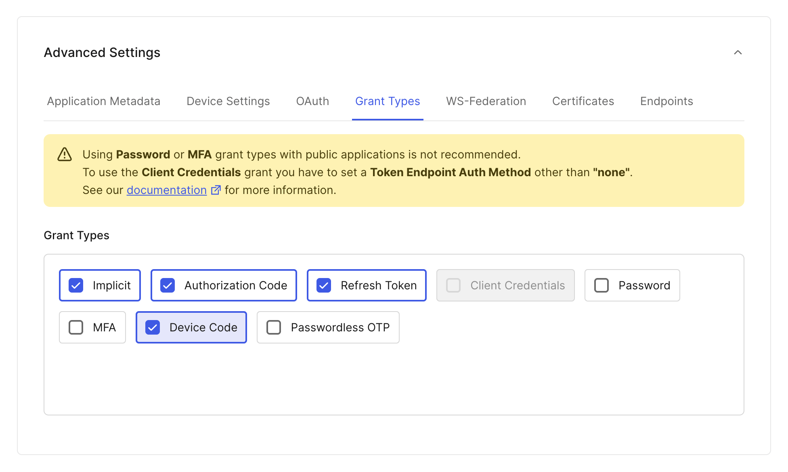
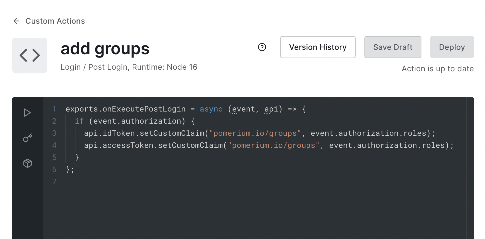
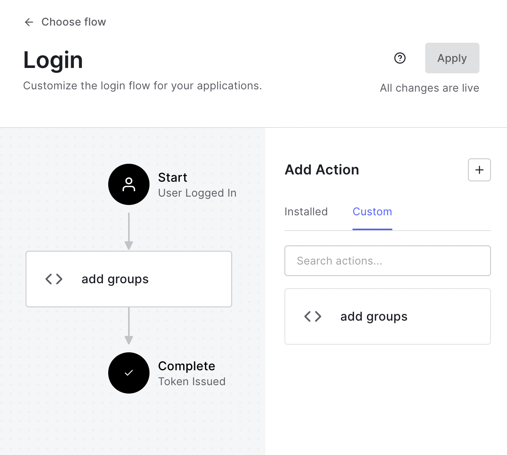
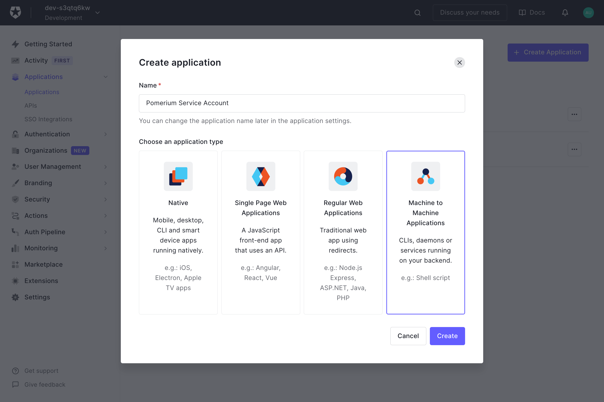
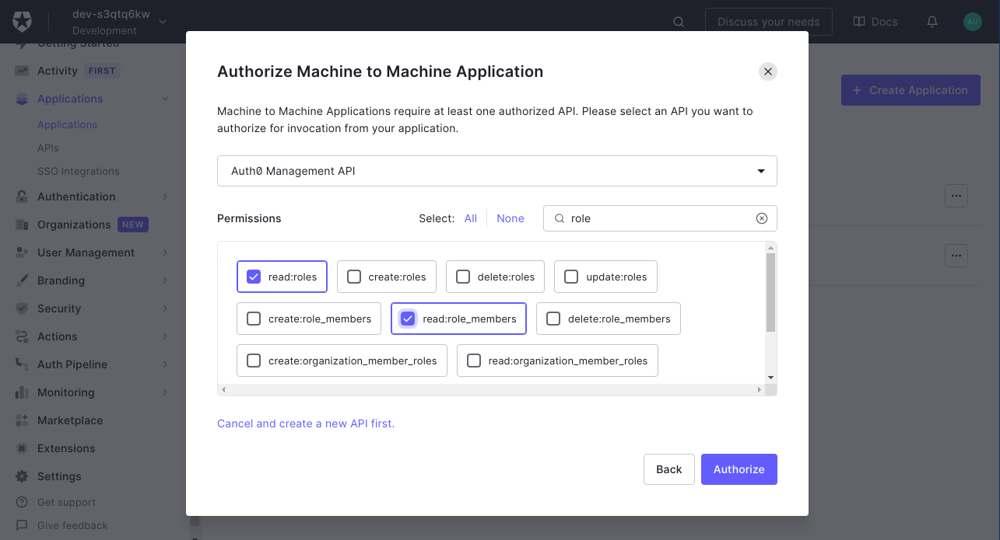
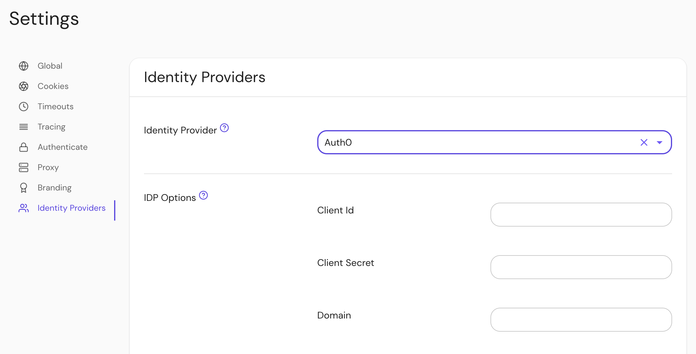

import TabItem from '@theme/TabItem';
import Tabs from '@theme/Tabs';

This page documents how to configure a [Descope](https://descope.com) Application for use with Pomerium. It assumes you have already [installed Pomerium](/docs/get-started/quickstart).

:::caution

While we do our best to keep our documentation up to date, changes to third-party systems are outside our control. Refer to [OIDC Applications in Descope](https://docs.descope.com/identity-federation/applications/oidc-apps) from Descope's docs as needed, or [let us know](https://github.com/pomerium/documentation/issues/new?assignees=&labels=&template=doc-error.md) if we need to re-visit this page.

:::

## Create a Descope OIDC Application

1. [Log in to your Descope console](https://app.descope.com) and select [Federated Apps](https://app.descope.com/applications) in the left sidebar. On the Applications page,
    you can use the default OIDC application configured out of the box, or  click the **+ Application** button to create a new application. From the app library, select **Generic OIDC Application**. 
    Provide an **Application Name** and optionally an **Application ID** and **Description**, and then click **Create**.

   

1. Under the **IdP Configuration** tab, note the **Issuer** URL value, which will later become the **Identity Provider URL** when configuring Pomerium.

    

    Here you can also customize the exact [Flow](https://docs.descope.com/flows) which users will use to authenticate, along with **Supported Claims** and an option to force re-authentication.

1. Under the **SP Configuration** menu, select **Confidential** under **Client Authentication**, ensuring that your application can act as a confidential client and maintain a client secret. Note the **Client ID** 
and **Client Secret** values. We will need these later when configuring Pomerium. 

    

1. In pomerium versions 0.31.X and below, if you want to use Pomerium's [**native SSH access**](/docs/capabilities/native-ssh-access): scroll down to **Advanced Settings** near the bottom of the page, then select the **Grant Types** tab. Make sure the **Device Code** box is checked:

   

The device code support is not needed in 0.32.0 and above.

Click **Save** at the bottom of the page when you're done.

## Configure Pomerium

You can now configure Pomerium with the identity provider settings retrieved in the previous steps. Your `config.yaml` keys or [environmental variables] should look something like this.

<Tabs queryString="configuration-settings">
<TabItem value="config-file-keys" label="Config file keys">

```yaml
idp_provider: 'descope'
idp_provider_url: 'https://api.descope.com/<Project ID>'
idp_client_id: 'REPLACE_ME' # from the Descope OIDC application
idp_client_secret: 'REPLACE_ME' # from the Descope OIDC application
```

</TabItem>
<TabItem value="environment-variables" label="Environment Variables">

```bash
IDP_PROVIDER="descope"
IDP_PROVIDER_URL="https://api.descope.com/<Project ID>"
IDP_CLIENT_ID="REPLACE_ME" # from the Descope OIDC application
IDP_CLIENT_SECRET="REPLACE_ME" # from the Descope OIDC application
```

</TabItem>
</Tabs>

## Groups

<Tabs queryString="get-groups">
<TabItem value="custom-claim" label="Custom Claim (Open Source)">

### Custom Claim

To authorize users based on their group membership ([RBAC roles](https://docs.descope.com/authorization/role-based-access-control) in Descope), a claim can be added to the identity token with a [login action](https://auth0.com/docs/customize/actions).

1. Create an action named `add groups` with the following code:

   ```javascript
   exports.onExecutePostLogin = async (event, api) => {
     if (event.authorization) {
       api.idToken.setCustomClaim(
         'pomerium.io/groups',
         event.authorization.roles,
       );
     }
   };
   ```

1. Deploy the action:

   

1. Add it to the login flow:

   

Now when users login they will have a claim named `pomerium.io/groups` that contains their groups (Auth0 roles) and the `claim` PPL criterion can be used for authorization:

```yaml
routes:
  - from: 'https://verify.localhost.pomerium.io'
    to: 'https://verify.pomerium.com'
    policy:
      - allow:
          and:
            - claim/pomerium.io/groups: admin
```

</TabItem>
<TabItem value="directory-sync" label="Directory Sync (Enterprise)">

### Setting Up Directory Sync

1. Create a **Machine to Machine Application**. A different application is used for grabbing roles to keep things more secure.

   

   Click **Create**.

1. On the next page select **Auth0 Management API** from the dropdown. Under **Permissions** use the filter on the right to narrow things down to `role`, and choose the `read:roles`, `read:role_members`, `read:users`, and `read:user_idp_tokens` roles.

   

   Then click **Authorize**.

1. Retrieve the **Client ID** and **Client Secret** from the **Settings** tab.

### Configure Pomerium Enterprise Console

Under **Settings → Identity Providers**, select "Auth0" as the identity provider and set the Client ID, Client Secret and Domain.



[auth0]: https://auth0.com/
[authenticate service url]: /docs/reference/service-urls#authenticate-service-url
[environmental variables]: https://en.wikipedia.org/wiki/Environment_variable

</TabItem>
</Tabs>

[auth0]: https://auth0.com/
[authenticate service url]: /docs/reference/service-urls#authenticate-service-url
[environmental variables]: https://en.wikipedia.org/wiki/Environment_variable
