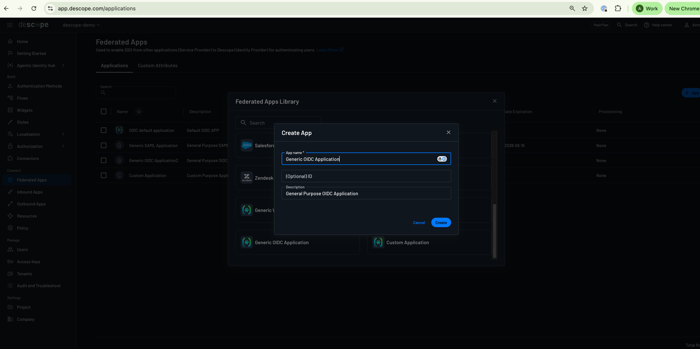
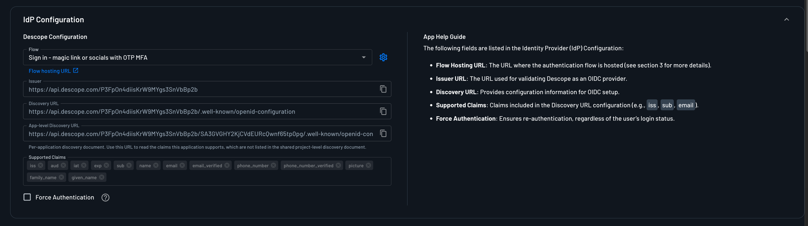
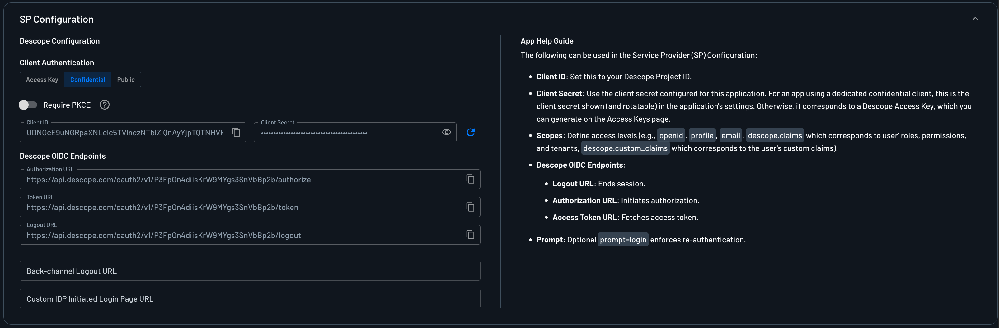

import TabItem from '@theme/TabItem';
import Tabs from '@theme/Tabs';

This page documents how to configure a [Descope](https://descope.com) Application for use with Pomerium. It assumes you have already [installed Pomerium](/docs/get-started/quickstart).

:::caution

While we do our best to keep our documentation up to date, changes to third-party systems are outside our control. Refer to [OIDC Applications in Descope](https://docs.descope.com/identity-federation/applications/oidc-apps) from Descope's docs as needed, or [let us know](https://github.com/pomerium/documentation/issues/new?assignees=&labels=&template=doc-error.md) if we need to re-visit this page.

:::

## Create a Descope OIDC Application

1. [Log in to your Descope console](https://app.descope.com) and select [Federated Apps](https://app.descope.com/applications) in the left sidebar. On the Applications page,
    you can use the default OIDC application configured out of the box, or  click the **+ Application** button to create a new application. From the app library, select **Generic OIDC Application**. 
    Provide an **Application Name** and optionally an **Application ID** and **Description**, and then click **Create**.

   

1. Under the **IdP Configuration** tab, note the **Issuer** URL value, which will later become the **Identity Provider URL** when configuring Pomerium.

    

    Here you can also customize the exact [**Flow**](https://docs.descope.com/flows) which users will use to authenticate, along with **Supported Claims** and an option to force re-authentication.

1. Under the **SP Configuration** menu, select **Confidential** under **Client Authentication**, ensuring that your application can act as a confidential client and maintain a client secret. Note the **Client ID** 
and **Client Secret** values. We will need these later when configuring Pomerium. 

    

Click **Save** at the bottom of the page when you're done.

## Configure Pomerium

You can now configure Pomerium with the identity provider settings retrieved in the previous steps. Your `config.yaml` keys or [environmental variables] should look something like this.

<Tabs queryString="configuration-settings">
<TabItem value="config-file-keys" label="Config file keys">

```yaml
idp_provider: 'descope'
idp_provider_url: 'https://api.descope.com/<Project ID>'
idp_client_id: 'REPLACE_ME' # from the Descope OIDC application
idp_client_secret: 'REPLACE_ME' # from the Descope OIDC application
idp_scopes: 'openid, profile, email, offline_access, descope.claims, descope.custom_claims' # optionally include custom claims
```

</TabItem>
<TabItem value="environment-variables" label="Environment Variables">

```bash
IDP_PROVIDER="descope"
IDP_PROVIDER_URL="https://api.descope.com/<Project ID>"
IDP_CLIENT_ID="REPLACE_ME" # from the Descope OIDC application
IDP_CLIENT_SECRET="REPLACE_ME" # from the Descope OIDC application
IDP_SCOPES="openid, profile, offline_access, email, descope.claims, descope.custom_claims" # optionally include custom claims 
```

</TabItem>
</Tabs>

## Role-Based Access Control and Custom Claims

To authorize users' access based on [roles and permissions managed in Descope](https://docs.descope.com/authorization/role-based-access-control), 
append the `descope.claims` scope to the default scopes in your Pomerium configuration. Pomerium will include this scope in the OIDC authorization request to Descope.

```yaml
idp_provider: 'oidc'
idp_provider_url: 'https://api.descope.com/<Project ID>'
idp_client_id: '<APPLICATION_CLIENT_ID>' 
idp_client_secret: '<APPLICATION_CLIENT_SECRET>' 
idp_scopes: 'openid, profile, email, offline_access, descope.claims'
```

The `descope.claims` scope automatically makes sure the returned ID token contains the user’s authorization information, such as Descope roles, permissions, and tenant authorization information.
No other additional actions need to be taken in the Descope console. 

You can reference these claims directly using Pomerium’s claim policy criterion. For example, the following policy allows access only when the user’s roles claim contains the admin role:

```yaml
routes:
  - from: 'https://verify.localhost.pomerium.io'
    to: 'https://verify.pomerium.com'
    policy:
      - allow:
          and:
            - claim/roles: admin
```

Replace admin with the exact Descope role that should grant access to the route. 
Pomerium evaluates the configured value against the claims contained in the authenticated user’s session.

You can similarly authorize based on a Descope permission:
```yaml
policy:
  - allow:
      and:
        - claim/permissions: users.read
```

#### Custom Claims
You can also include any additional [custom claims](https://docs.descope.com/management/token) in your Descope token by adding them with a with a [Custom Claims Flow Action](https://docs.descope.com/flows/actions/custom-claims) in your auth flow, or by configuring a 
[JWT template](https://docs.descope.com/management/token/jwt-templates). To ensure Pomerium receives these custom claims in the returned ID token, make sure it requests the `descope.custom_claims` scope.

```yaml
idp_scopes: 'openid, profile, email, offline_access, descope.claims, descope.custom_claims'
```

For example, if the issued token contains a custom department claim:
```json
{
  "department": "engineering"
}
```

You can then reference it directly in a Pomerium policy:
```yaml
policy:
  - allow:
      and:
        - claim/department: engineering
```

[authenticate service url]: /docs/reference/service-urls#authenticate-service-url
[environmental variables]: https://en.wikipedia.org/wiki/Environment_variable
