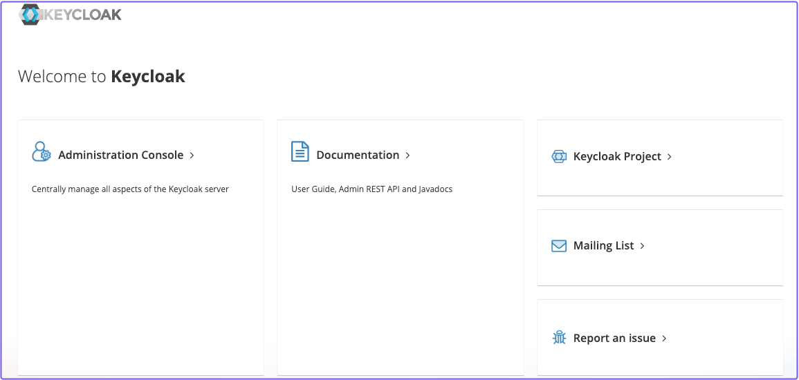
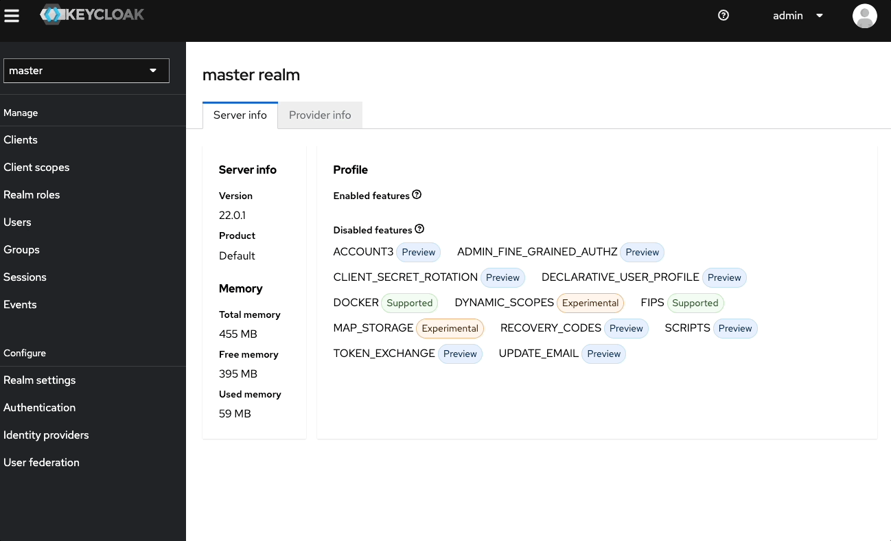
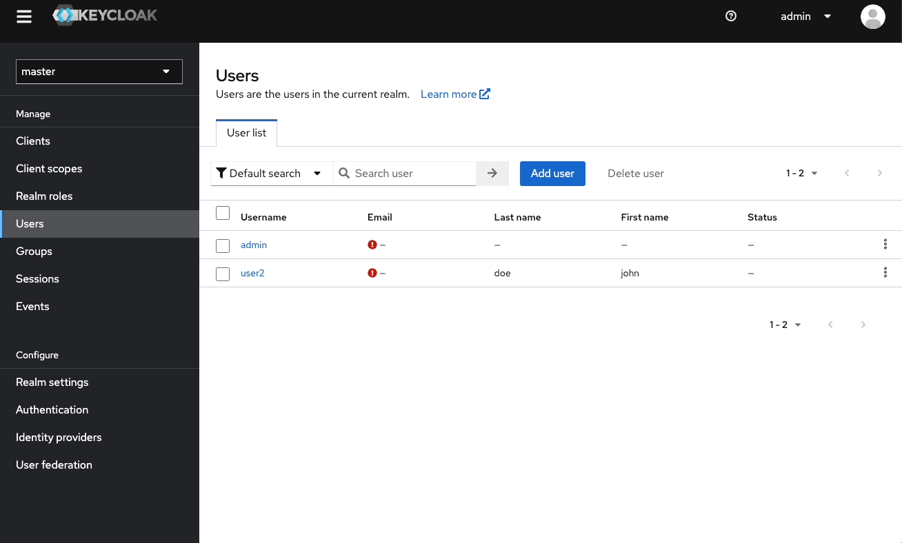
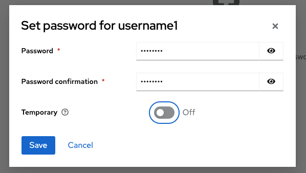
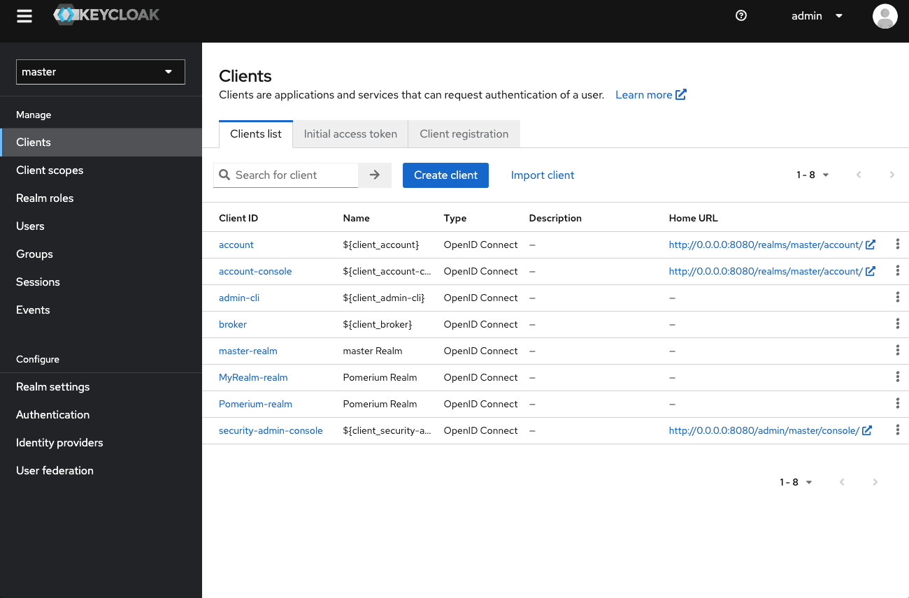
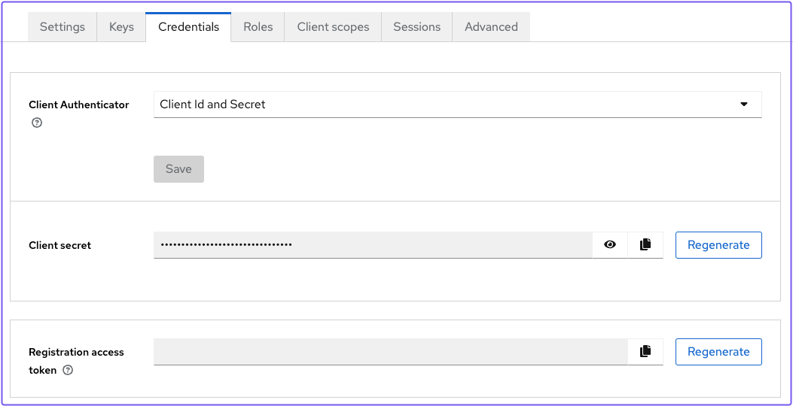
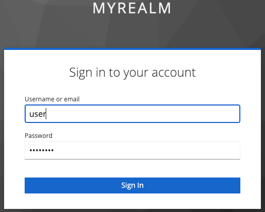
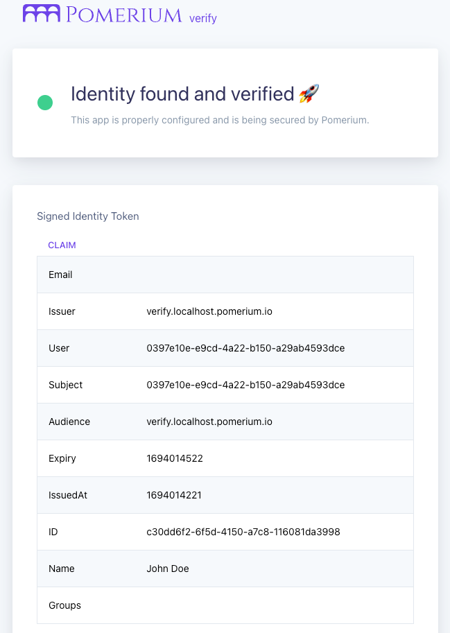

import SelfSignedCertWarning from '@site/content/docs/admonitions/_handle-self-signed-certificate-warning.mdx';

# Keycloak + Pomerium (OIDC)

[Keycloak](https://www.keycloak.org/) is an open-source identity and access management solution that supports the [OpenID Connect (OIDC) specification](https://openid.net/specs/openid-connect-core-1_0.html). With [Pomerium](https://www.pomerium.com/) as your identity-aware proxy, you can authenticate and authorize requests to your applications while letting Keycloak handle user sign-in, tokens, and sessions.

This guide shows how to integrate a self-hosted Keycloak instance as your OIDC provider for Pomerium. The steps focus on Keycloak but apply to most [generic OIDC](https://openid.net/specs/openid-connect-core-1_0.html) providers.

## Prerequisites

- [Docker](https://docs.docker.com/install/)
- [Docker Compose](https://docs.docker.com/compose/install/)


## Docker Compose Configuration

Create a file named `docker-compose.yaml`:

```yaml title="docker-compose.yaml"
services:
  mykeycloak:
    image: quay.io/keycloak/keycloak:22.0.1
    command:
      - start-dev
    environment:
      - KEYCLOAK_ADMIN=admin
      - KEYCLOAK_ADMIN_PASSWORD=admin
    ports:
      - 8080:8080
    networks:
      default:
        aliases:
          - keycloak.localhost.pomerium.io

  pomerium:
    image: pomerium.com/pomerium/pomerium:latest
    volumes:
      - ./config.yaml:/pomerium/config.yaml:ro
    ports:
      - 443:443

  verify:
    image: pomerium.com/pomerium/verify:latest
    environment:
      JWKS_ENDPOINT: https://pomerium/.well-known/pomerium/jwks.json
```

Run `docker compose up`. When Keycloak starts, visit [http://localhost:8080](http://localhost:8080) to open the **Keycloak Admin Console**.

## Keycloak Setup



Sign in with `admin` / `admin`.

### Create a Realm

1. Select **master** (top-left) and **Create Realm**.
1. Enter a name (for example, `Pomerium`) and select **Create**.



### Create a User

1. Go to **Users** and **Add users**.
1. Enter a username and **Create**.
1. Select **Credentials**, then **Set password** and disable **Temporary**.




### Create a Client

1. Go to **Clients** > **Create client**.
1. **Client type**: **OpenID Connect**.  
1. **Client ID**: `mynewclient`.
1. Enable **Standard flow** and **Direct access grants**.
1. **Save**.



In **Access settings**:

- **Valid redirect URIs**: `https://authenticate.localhost.pomerium.io/oauth2/callback`
- **Web Origins**: `https://authenticate.localhost.pomerium.io`
- Turn on **Client authentication**.

Save. Under **Credentials**, copy the **Client secret**:



## Pomerium Configuration

Create `config.yaml`:

```yaml title="config.yaml"
authenticate_service_url: https://authenticate.localhost.pomerium.io

idp_provider: oidc
idp_client_id: 'mynewclient'
idp_client_secret: 'your_client_secret'  # Replace with the actual secret
idp_provider_url: 'http://keycloak.localhost.pomerium.io:8080/realms/Pomerium'

signing_key: LS0tLS1CRUdJTiBFQyBQUklWQVRFIEtFWS0tLS0tCk1IY0NBUUVFSVA2TUN5UFI5OUNmSEVkU0s4cVdzbk51Q0RyMVZ3ay93RER1RVhyQitELzZvQW9HQ0NxR1NNNDkKQXdFSG9VUURRZ0FFQ0JTK3gyQnJRNVJqNHJFcU5PSEVsUFVESXJiRlNhRitoWEhEL1RYby9rQWVKU1lJSjJHVwpZMnE0a0NPNTU4RmdoYmxDTUplYVdjV1luT3JuZkpxeXRnPT0KLS0tLS1FTkQgRUMgUFJJVkFURSBLRVktLS0tLQo=

routes:
  - from: https://verify.localhost.pomerium.io
    to: http://verify:8000
    allow_any_authenticated_user: true
    pass_identity_headers: true
```

:::caution
Do **not** reuse this sample `signing_key` in production.
:::

## Test the Integration

Visit [https://verify.localhost.pomerium.io](https://verify.localhost.pomerium.io).

:::tip
<SelfSignedCertWarning />
:::

You’ll be redirected to Keycloak to sign in, then back to the Verify service:




You can see user claims from Keycloak in the JWT payload, confirming that Pomerium has authenticated and authorized your request.

## Additional Resources

- [Identity Provider Settings](/docs/reference/identity-provider-settings)
- [Signing Keys](/docs/reference/signing-key)
- [Routes and Policies](/docs/reference/routes)
- [Keycloak Documentation](https://www.keycloak.org/documentation/)
- [Pomerium Verify](https://github.com/pomerium/verify)