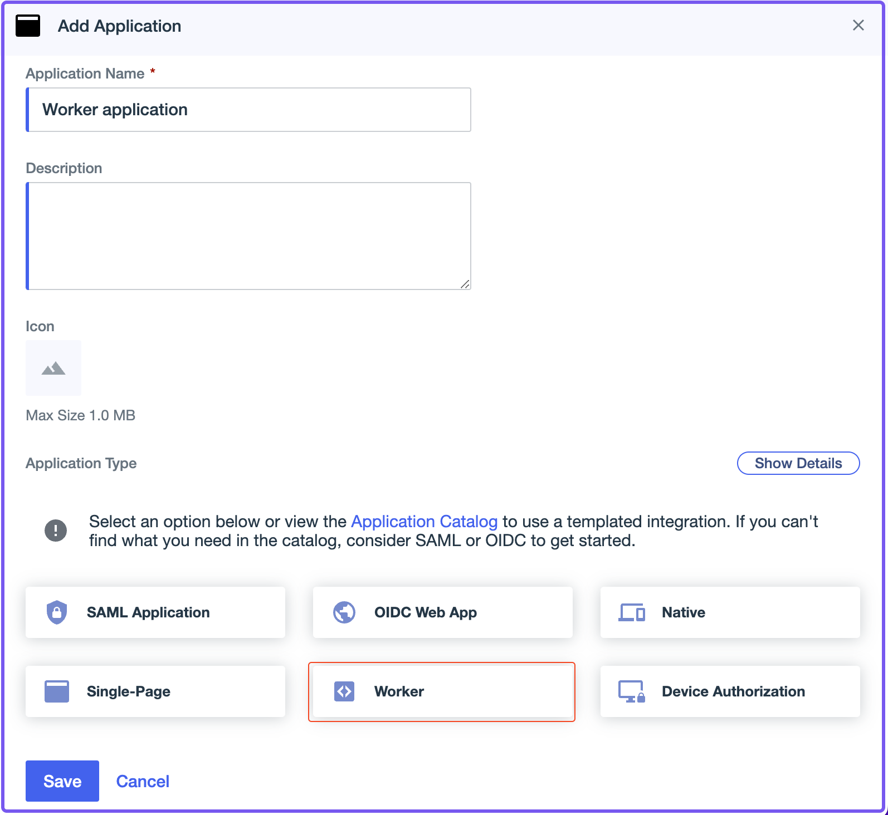

import Tabs from '@theme/Tabs';
import TabItem from '@theme/TabItem';

# Ping Identity

Learn how to configure Ping Identity as an identity provider (IdP) to work with Pomerium.

:::note

While we do our best to keep our documentation up to date, changes to third-party systems are outside of our control. Refer to [Adding an application](https://docs.pingidentity.com/r/en-us/pingone/p1_add_app_worker) from Ping's documentation as needed, or [let us know](https://github.com/pomerium/documentation/issues/new?assignees=&labels=&template=doc-error.md) if we need to update this page.

:::

## Before you start

To complete this guide:

- Install [Pomerium](/docs/zero).
- Create a free [PingOne account](https://www.pingidentity.com/en/try-ping.html). (This guide uses a [PingOne for Workforce](https://www.pingidentity.com/en/platform/solutions/pingone-for-workforce.html) account.)

## Configure PingOne

After creating a PingOne account and signing in, you'll be directed to the PingOne console.

### Create an OIDC web app

In the PingOne console:

1. From the **Applications** sidebar menu, select **Applications** and create a new application (**+**).
1. Enter an **Application Name** and an optional description or logo.
1. Select **OIDC web app** and **Save**.


### Configure the OIDC web app

To configure your OIDC web app:

1. Select the **Configuration** tab, then select the edit icon.
1. In the **Redirect URIs** field, enter your [authenticate service URL](/docs/reference/service-urls#authenticate-service-url) with the `/oauth2/callback` path appended to it.
1. Select **Save**.


Next, configure attribute mappings:

1. Select the **Attribute Mappings** tab, then select the edit icon.
1. Select **+Add**.
1. In the **Attributes** field, enter **email**.
1. In the **PingOne Mappings** dropdown menu, select **Email Address**.
1. Select **Save**.


Enable the OIDC web app with the toggle button:


Save the following details from the **Configuration** tab (you need these to configure Pomerium):

- **Client ID**
- **Client Secret**
- **Issuer** URL

## Configure Pomerium

Update your Pomerium configuration to use Ping as the IdP:

<Tabs>
<TabItem value="pomerium-zero" label="Zero">


</TabItem>
<TabItem value="pomerium-core" label="Core">

```yaml
idp_provider: 'ping'
idp_provider_url: 'https://auth.pingone.com/720dbe8a-83ed-48e1-9988-9928301ae668/as'
idp_client_id: 'CLIENT_ID'
idp_client_secret: 'CLIENT_SECRET'
```

</TabItem>
<TabItem value="pomerium-enterprise" label="Enterprise">

See [Groups - Directory Sync](#groups) below for Enterprise configuration steps.

</TabItem>
</Tabs>

## Configure Groups

<Tabs>
<TabItem value="custom-claim" label="Custom Claim (Zero, Core)">

### Custom Claim (Zero, Core)

A `groups` claim can be added to tokens returned from Ping by adding the claim to the "Attribute Mappings":


Now, when a user signs in their token will include a custom `groups` claim that contains groups they are a member of. You can use the `claim` PPL criterion in your authorization policy:

```yaml
allow:
  and:
    - claim/groups: 49dfb9e6-f81f-4a1c-b4a3-d0122ebe4aab
```

:::note

The `groups` claim contains group IDs, not group names.

:::

</TabItem>
<TabItem value="directory-sync" label="Directory Sync (Enterprise)">

### Directory Sync (Enterprise)

:::enterprise

[Directory Sync](/docs/integrations/user-standing/directory-sync) is a feature available only in Pomerium Enterprise.

:::

#### Create a Ping Worker application

In order for Pomerium to validate group membership, you need to configure a [Worker application](https://docs.pingidentity.com/bundle/pingdirectory-73/page/lfm1564011499001.html).

In the PingOne console:

1. From the **Applications** sidebar menu, select **Applications** and create a new application (**+**).
1. Enter an **Application Name** and an optional description or logo.
1. Select **Worker** and **Save**.



In the **Overview** tab, save the following configuration details:

- **Client ID**
- **Client Secret**
- **Environment ID**

#### Configure Pomerium Enterprise Console

In the Enterprise console:

1. Select **Settings**.
1. Select **Identity Providers**.
1. Select **Ping** and enter the Client ID, Client Secret, and Environment ID.


</TabItem>
</Tabs>
