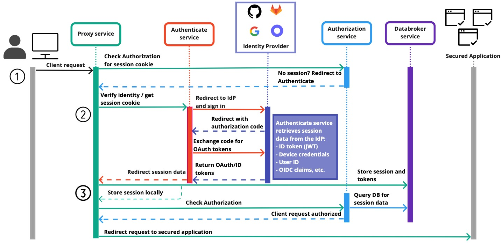

---
# cspell:ignore Authorization
title: Architecture
lang: en-US
description: Pomerium verifies identity with your IdP and uses a configurable policy to route requests and decide if a user is authorized to access the service.
keywords: [pomerium, architecture]
---

## System Level

Pomerium sits between end users and services requiring strong authentication. After verifying identity with your identity provider (IdP), Pomerium uses a configurable policy to decide how to route your user's request and if they are authorized to access the service. ([What's the difference between Authentication and Authorization?](https://www.pomerium.com/blog/authentication-v-authorization/))

## Component Level

Pomerium is composed of 4 logical components:

- Proxy Service ([What is a proxy?](https://www.pomerium.com/blog/proxy-vs-reverse-proxy/))

  - All user traffic flows through the proxy
  - Verifies all requests with Authentication service
  - Directs users to Authentication service to establish session identity
  - Processes policy to determine external/internal route mappings
  - Receives user OIDC tokens and session data from Authentication service and stores in Databroker service

- Authentication Service

  - Handles authentication flow to your IdP as needed
  - Handles identity verification after initial Authentication
  - Establishes user session cookie
  - Stores user OIDC tokens in Proxy service

- Authorization Service

  - Processes policy to determine permissions for each service
  - Handles authorization check for all user sessions
  - Directs Proxy service to initiate Authentication flow as required
  - Provides additional security related headers for upstream services to consume

- Databroker Service

  - Retrieves identity provider related data such as group membership
  - Stores and refreshes identity provider access and refresh tokens
  - Provides streaming authoritative session and identity data to Authorize service
  - Stores session and identity data in persistent storage

In production deployments, it is recommended that you deploy each component [separately](/docs/reference/service-mode). This allows you to limit external attack surface, as well as scale and manage the services independently.

In test deployments, all four components may run from a [single binary and configuration](/docs/reference#all-in-one-vs-split-service-mode).

## The lifecycle of a request

The diagram below shows how Pomerium's components communicate when authenticating a user.

After initial authentication to provide a session token, only the authorization check interactions occur.

**Step 1:** Unauthenticated client

The client sends a request to access a secured application, which prompts the Proxy to send the request over a gRPC call to the Authorization service.

Because the client has not authenticated, the Authorization service can't locate the session ID in the Databroker service. It sends the client to the Authenticate service, which prompts the client to sign in to the IdP.

**Step 2:** Authenticating the client

After the client signs in, the IdP exchanges an authorization code with the Authentication service. The Authentication service uses the code to get OAuth tokens and OIDC claims from the IdP.

The Authentication service redirects the request to the Proxy with the session data.

**Step 3:** Authorizing the request

The Proxy saves the session data locally and sends it to the Databroker service over a gRPC call. The Databroker persists the session data and manages the session, and the Authorizaton service queries the Databroker for session data by way of on-demand caching.

Now that the client is authenticated, the Proxy sends the request again to the Authorization service. The Authorization service can now locate the session in the Databroker.

The Authorization service factors in IdP scopes and policy to determine if the client can access the secured application. Assuming the client has sufficient permissions, the Authorization service authorizes the request, and the Proxy sends the client to the route defined in the policy.
