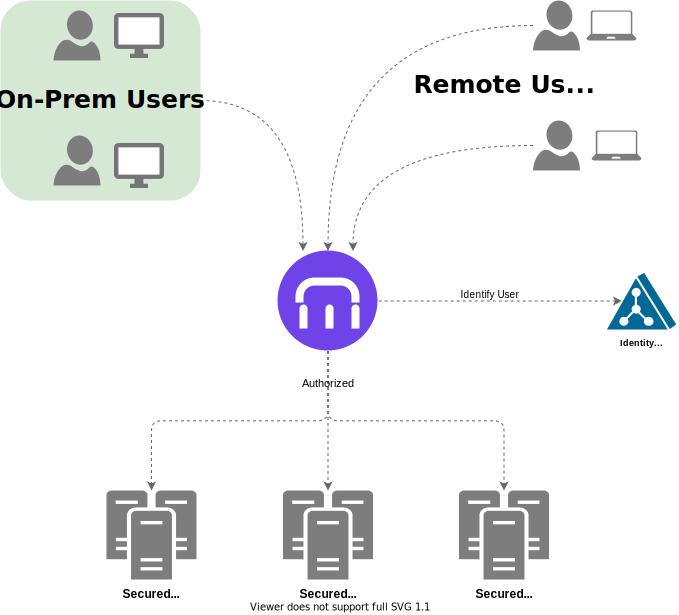
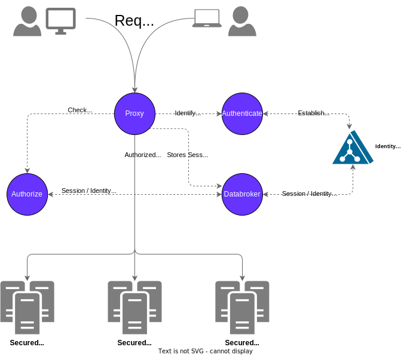
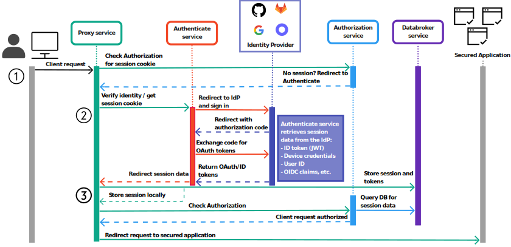

## System Level

Pomerium sits between end users and services requiring strong authentication. After verifying identity with your identity provider (IdP), Pomerium uses a configurable policy to decide how to route your user's request and if they are authorized to access the service. ([What's the difference between Authentication and Authorization?](https://www.pomerium.com/blog/authentication-v-authorization/))

## Component level

Pomerium is composed of four logical components:

### Proxy service

The Proxy service receives requests from the client and routes requests between the client, upstream services, and other Pomerium components.

The following steps outline how the Proxy service handles a request at a high level:

1. The client makes a request to access the target resource
1. The Proxy service receives the request and sends a gRPC call to the Authorization service, which evaluates policy
1. If the Authorization service doesn't see a session cookie, the Proxy service redirects the request to the Authentication service to verify the client's identity
1. After the Authentication service verifies the client's identity and saves a local session cookie, the Proxy service sends the session data to the Databroker service over a gRPC call
1. Before redirecting the client to the target resource, the Proxy service checks permissions with the Authorization service, then maps a route based on the internal and external routes defined in the route's policy

### Authentication service

The Authentication service is responsible for authenticating users against an Identity Provider (IdP) and establishing user sessions. By incorporating OAuth 2.0 and OIDC protocols into the authentication flow, the Authentication service provides single sign-on authentication that enables it to extract user identity details and session data necessary for managing Pomerium sessions.

At a high level, when the Authentication service first receives a request from the Proxy service, it:

1. Redirects the client to the IdP to sign in
1. Completes the authentication flow with the IdP and extracts relevant session data, such as device credentials, user ID, issuance and expiration times, OAuth tokens, and any OIDC claims (scopes) provided by the IdP
1. Saves session data to a local session cookie and redirects the client with session data encrypted in URL parameters to the Proxy service
1. Signs the user in after the session expires

### Authorization service

The Authorization service processes policies to determine what permissions the client has. Each request sent by the client must first go through an authorization check before the Proxy service proxies the request.

When the Authorization service receives a request from the Proxy service, the following actions take place:

1. The Authorization service first looks for a session cookie, which contains the client's JWT. If no session cookie is present, the Authorization service returns a redirect response, prompting the browser to authenticate through the Authentication service to establish session identity.
1. Once a session cookie is in place, the Proxy service makes a gRPC call to the Authorization service so it can determine permissions based on JWT claims and policy.
1. The Authorization service then constructs security headers based on JWT claims, which the Proxy service forwards to upstream applications.
1. With each subsequent request, the Authorization service employs on-demand caching to query the Databroker service for updates to session state.

### Databroker service

The Databroker service persists session and identity-related data. It also functions as an identity manager in that it's responsible for refreshing user sessions against the IdP until a Pomerium session has expired.

The points below outline the Databroker's role in the request and session lifecycle:

- Once a client is authenticated, the Proxy server makes a gRPC call to the Databroker to persist session data and identity information.
- The Authorization service queries the Databroker on-demand to keep the two services in sync.

In production deployments, it is recommended that you deploy each component [separately](/docs/reference/service-mode). This allows you to limit external attack surface, as well as scale and manage the services independently.

In test deployments, all four components may run from a [single binary and configuration](/docs/internals/configuration#all-in-one-vs-split-service-mode).

## The lifecycle of a request

The diagram below shows how Pomerium's components communicate when authenticating a user.

After initial authentication to provide a session token, only the authorization check interactions occur.

**Step 1:** Unauthenticated client

The client sends a request to access a secured application, which prompts the Proxy to send the request over a gRPC call to the Authorization service.

Because the client has not authenticated, the Authorization service can't locate the session ID in the Databroker service. It sends the client to the Authenticate service, which prompts the client to sign in to the IdP.

**Step 2:** Authenticating the client

After the client signs in, the IdP exchanges an authorization code with the Authentication service. The Authentication service uses the code to get OAuth tokens and [OIDC claims](https://openid.net/specs/openid-connect-basic-1_0.html) from the IdP.

The Authentication service redirects the request to the Proxy with the session data.

**Step 3:** Authorizing the request

The Proxy saves the session data locally and sends it to the Databroker service over a gRPC call. The Databroker persists the session data and manages the session, and the Authorization service queries the Databroker for session data by way of on-demand caching.

Now that the client is authenticated, the Proxy sends the request again to the Authorization service. The Authorization service can now locate the session in the Databroker.

The Authorization service factors in IdP scopes and policy to determine if the client can access the secured application. Assuming the client has sufficient permissions, the Authorization service authorizes the request, and the Proxy sends the client to the route defined in the policy.
