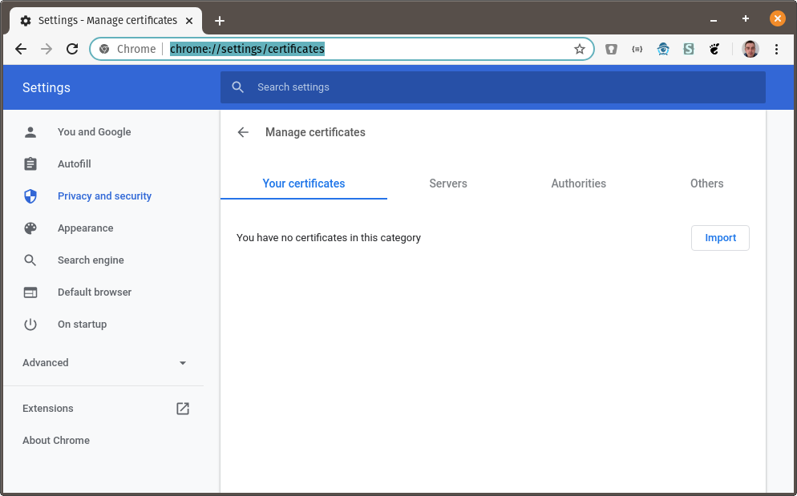
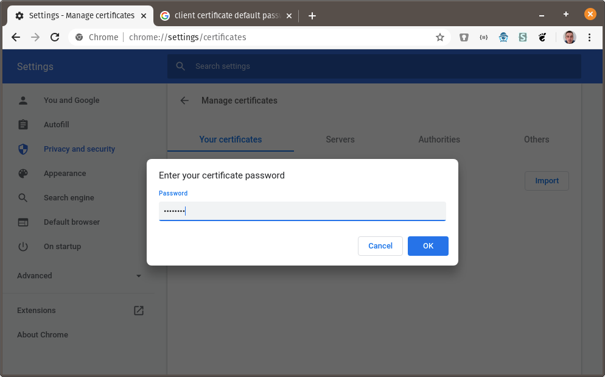
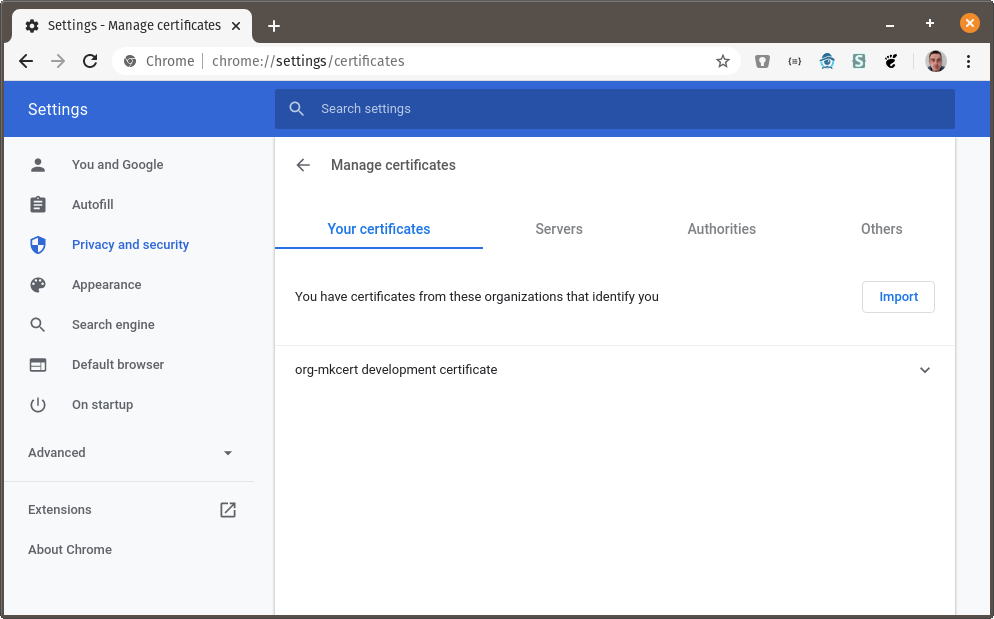
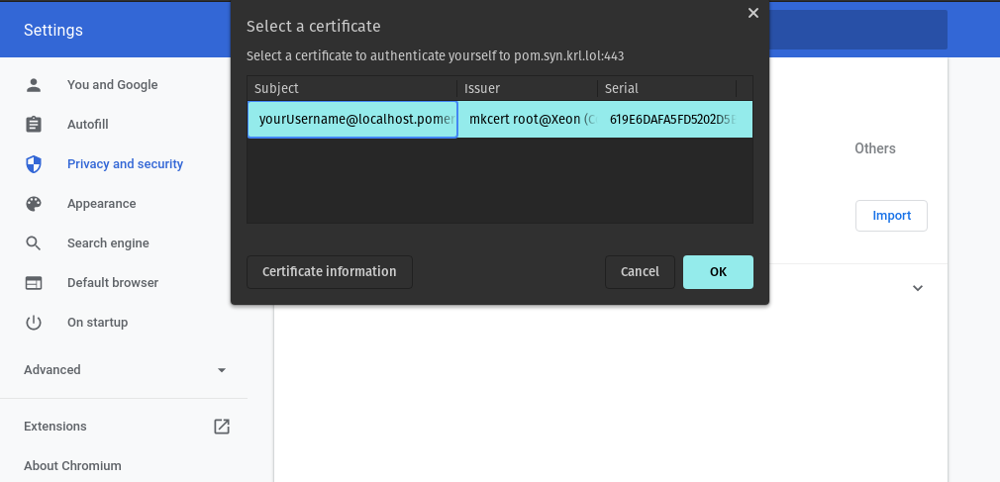
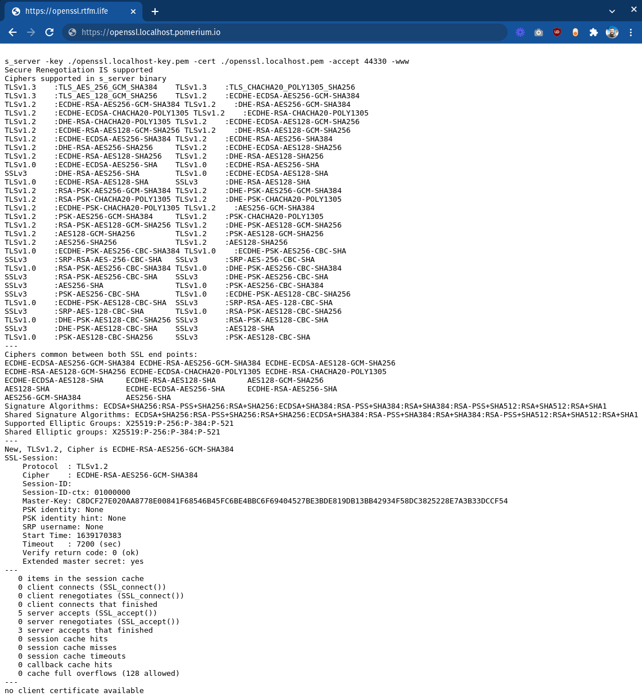
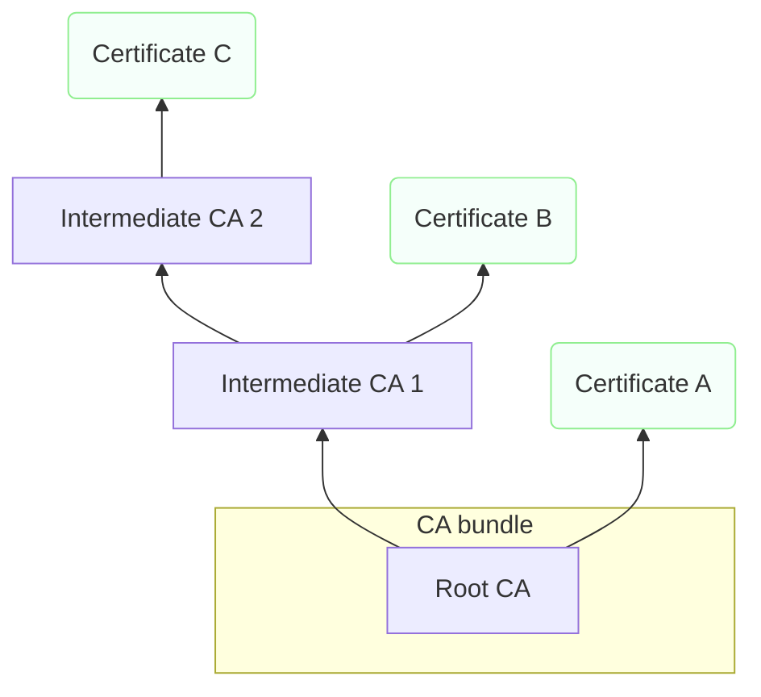

# Certificates and TLS with Pomerium

This page covers **downstream TLS** (the connection between end users and Pomerium) and **upstream TLS** (the connection between Pomerium and the services behind it). Both can leverage mutual TLS (mTLS) for additional security in a zero-trust environment.

## Downstream TLS

Downstream mTLS refers to a requirement that **end users present a trusted client certificate** when connecting to services secured by Pomerium. With ordinary TLS, only the server presents a certificate. With mTLS, the client must also present a certificate, and the server will only allow requests if the client's certificate is trusted.

:::note

Pomerium uses the term “downstream mTLS” for the client-to-Pomerium connection, and **“upstream mTLS”** for the connection between Pomerium and protected services. See [Upstream TLS](#upstream-tls) below for details on securing the connection to your upstream services.

:::

### Why use downstream mTLS?

- **Stronger Client Authentication**: Each connecting user or device has its own certificate.
- **Zero-Trust**: Certificates verify user identity at the network level, not just via credentials/SSO.
- **Compliance**: Many security standards (e.g., PCI-DSS, HIPAA) recommend or require mutual authentication for sensitive data transport.

### Before You Begin (Downstream TLS)

You will need:

- A working Pomerium instance. Complete the [Pomerium Core quickstart](/docs/get-started/quickstart) with Docker for a quick proof of concept.
- [`mkcert`](https://github.com/FiloSottile/mkcert#installation), to issue certificates from a locally-trusted certificate authority (CA).

:::caution

`mkcert` is designed for local testing. Production environments require a more advanced certificate management system.

:::

### Configure Pomerium with a server certificate

If Pomerium already has a server certificate configured, you can skip to [Create a client certificate](#create-a-client-certificate).

1. **Create a Root CA**  
   Install `mkcert`, then run:

   ```bash
   mkcert -install
   ```

   This creates a trusted root CA for local development.

2. **Create a Wildcard TLS Certificate**

   ```bash
   mkcert '*.localhost.pomerium.io'
   ```

   This produces `_wildcard.localhost.pomerium.io.pem` (certificate) and `_wildcard.localhost.pomerium.io-key.pem` (key).

3. **Update Pomerium Configuration**  
   Point `certificate_file` and `certificate_key_file` to these files:
   ```yaml
   certificate_file: '_wildcard.localhost.pomerium.io.pem'
   certificate_key_file: '_wildcard.localhost.pomerium.io-key.pem'
   ```
   Make sure the paths align with your environment (e.g., Docker bind mounts).

### Create a client certificate

```bash
mkcert -client -pkcs12 "yourUsername@localhost.pomerium.io"
```

This produces a file like `yourUsername@localhost.pomerium.io-client.p12`, containing both the client certificate and its private key.

### Require mTLS in Pomerium

Add the `downstream_mtls` key to your `config.yaml` or environment variables, pointing to the `rootCA.pem` created by `mkcert`:

```yaml
downstream_mtls:
  ca_file: '/YOUR/MKCERT/CAROOT/rootCA.pem'
```

Pomerium now requires a client certificate for any route. Browsers without a valid client certificate will see a Pomerium error page.

### Installing the client certificate (example: Chrome on Linux)

1. Navigate to `chrome://settings/certificates`.
2. Under **Your Certificates**, click **Import** and select `yourUsername@localhost.pomerium.io-client.p12`.
3. Enter the default password **`changeit`** (from mkcert).
4. A new “org-mkcert development certificate” entry appears in your certificate list.

When you visit a route like `https://verify.localhost.pomerium.io`, Chrome should prompt you to select the newly imported certificate. If everything is correct, you'll be granted access.










## Upstream TLS

Upstream TLS ensures that **Pomerium and your protected services authenticate each other**. By default, Pomerium authenticates user traffic but does not require or verify the identity of the upstream service. For zero-trust consistency, the upstream service should also present a valid TLS certificate, and Pomerium can optionally present its own client certificate (mTLS) to the service.

<iframe
  width="100%"
  height="450"
  src="https://www.youtube.com/embed/ndYMzRRgLiA"
  title="YouTube video player"
  frameborder="0"
  allow="accelerometer; autoplay; clipboard-write; encrypted-media; gyroscope; picture-in-picture; web-share"
  allowfullscreen></iframe>

### How Pomerium verifies upstream services

- **Custom CA**: Point Pomerium to a trusted certificate authority using [`tls_custom_ca_file` or `tls_upstream_server_name`](/docs/reference/routes/tls). This ensures Pomerium will only trust upstreams signed by your preferred internal CA or other recognized CAs.
- **Client Certificate**: If required by the upstream, Pomerium can present its own certificate and key (`tls_client_cert_file` and `tls_client_key_file`) to complete an mTLS handshake.

### Example: mkcert + OpenSSL

This guide demonstrates a proof-of-concept using `mkcert` to generate self-signed certificates and an [OpenSSL s_server](https://www.openssl.org/docs/manmaster/man1/openssl-s_server.html) as the upstream application.

#### Prerequisites

- A root CA created by `mkcert` (as above).
- A Pomerium configuration already set up (in all-in-one mode).
- `openssl` installed on your system.

#### Steps

1. **Create Upstream Certificates**

   ```bash
   mkcert openssl.localhost
   mkcert -client "pomerium@localhost"
   ```

   Move the resulting files to appropriate locations (e.g., `/etc/pomerium/`) and adjust ownership as needed.

2. **Start an OpenSSL Server**

   ```bash
   openssl s_server \
     -key ./openssl.localhost-key.pem \
     -cert ./openssl.localhost.pem \
     -accept 44330 \
     -www
   ```

   This listens on port 44330 for TLS connections.

3. **Configure a Pomerium Route**

   ```yaml
   - from: https://openssl.localhost.pomerium.io
     to: https://localhost:44330
     tls_upstream_server_name: openssl.localhost
     policy:
       - allow:
           or:
             - email:
                 is: user@example.com
   ```

   Visiting `https://openssl.localhost.pomerium.io` should show the following notice in your browser:

   

   “no client certificate available” indicates that Pomerium is connecting but not supplying a certificate to the upstream yet.

4. **Require mTLS on the Upstream**  
   Restart the OpenSSL server with `-Verify 1`:

   ```bash
   openssl s_server \
     -Verify 1 \
     -key ./openssl.localhost-key.pem \
     -cert ./openssl.localhost.pem \
     -accept 44330 \
     -www
   ```

   Now the upstream expects a client certificate from its connection peer.

5. **Provide Pomerium's Client Certificate**  
   Update the route to include:
   ```yaml
   tls_client_cert_file: /etc/pomerium/pomerium@localhost-client.pem
   tls_client_key_file: /etc/pomerium/pomerium@localhost-client-key.pem
   ```
   Refresh `https://openssl.localhost.pomerium.io`. The OpenSSL server's output should now show a validated client certificate from Pomerium.

### More Resources

- [Mutual Authentication: A Component of Zero Trust](/docs/internals/mutual-auth)
- [Client-Side mTLS With Pomerium](/docs/internals/mutual-auth.md)
- [JWT Verification](/docs/capabilities/getting-users-identity)

With both **downstream TLS** and **upstream TLS** in place, Pomerium ensures secure connections at every hop—users prove their identity to Pomerium, and Pomerium proves its identity to the protected services (and vice versa, if the service requires a client certificate). This consistent end-to-end encryption and mutual authentication is a key building block for a robust zero-trust architecture.

## Global Certificate Settings

This reference covers all of Pomerium's **Certificates Settings**:

- [Certificates](#certificates)
- [Certificate Authority](#certificate-authority)

:::tip **Note**

All certificates supplied to Pomerium must be in **PEM** format.

Pomerium supports certificates with RSA or ECDSA keys. For server or client certificates with ECDSA keys, Pomerium supports only the **P-256** curve. For certificate authorities with ECDSA keys, Pomerium supports the P-384 and P-521 curves as well.

:::

### Certificates {#certificates}

**Certificates** are the X.509 _public-key_ and _private-key_ pair used to establish secure HTTP and gRPC connections. Any combination of these settings can be used together and are additive. You can also use any of these settings in conjunction with [`Autocert`](#autocert-settings) to get OCSP stapling.

Certificates loaded into Pomerium from these config values are used to attempt secure connections between end-users and services, between Pomerium services, and to upstream endpoints.

:::tip **Note**

Pomerium will check your system's trust/key store for valid certificates first. If your certificate solution imports into the system store, you don't need to also specify them with these configuration keys.

:::

#### How to configure {#certificates-how-to-configure}

<Tabs>
<TabItem value="Core" label="Core">

| **Config file keys** | **Environment variables** | **Type** | **Usage** |
| :-- | :-- | :-- | :-- |
| `certificates` | Not settable as environment variable | `string` (Array of relative file locations for multiple certificates) | **required** (if insecure not set) |
| `certificate` and `certificate_key` | `CERTIFICATE` and `CERTIFICATE_KEY` | `string` (base64-encoded string) | **required** (if insecure not set) |
| `certificate_file` and `certificate_key_file` | `CERTIFICATE_FILE` and `CERTIFICATE_KEY_FILE` | `string` (Relative file location for a single certificate) | **required** (if insecure not set) |

##### Examples {#certificates-examples}

Specify multiple certificates at once:

```yaml
# Array of relative file locations for multiple certs
certificates:
  - cert: '$HOME/.acme.sh/authenticate.example.com_ecc/fullchain.cer'
    key: '$HOME/.acme.sh/authenticate.example.com_ecc/authenticate.example.com.key'
  - cert: '$HOME/.acme.sh/verify.example.com_ecc/fullchain.cer'
    key: '$HOME/.acme.sh/verify.example.com_ecc/verify.example.com.key'
  - cert: '$HOME/.acme.sh/prometheus.example.com_ecc/fullchain.cer'
    key: '$HOME/.acme.sh/prometheus.example.com_ecc/prometheus.example.com.key'
```

Set a single certificate and key covering multiple domains and/or a wildcard subdomain:

```yaml
# Relative file location for a single cert
certificate_file: '$HOME/.acme.sh/*.example.com/fullchain.crt'
certificate_key_file: '$HOME/.acme.sh/*.example.com/*.example.com.key'
```

</TabItem>
<TabItem value="Enterprise" label="Enterprise">

Add **Certificates** in the Enterprise Console:


View **Certificates**:


</TabItem>
<TabItem value="Kubernetes" label="Kubernetes">

```yaml
certificates: pomerium/wildcard-localhost
```

See Kubernetes [TLS Certificates](/docs/deploy/k8s/ingress#tls-certificates) for more information.

</TabItem>
</Tabs>

:::note

All certificates supplied to Pomerium must be in **PEM** format.

:::

### Certificate Authority (CA) {#certificate-authority}

**Certificate Authority** defines a set of root certificate authorities (CAs) that Pomerium uses when communicating with other TLS-protected services.

:::tip **Note:**

Unlike route-specific CA settings, this setting augments (rather than replaces) the system's trust store. Routes that specify a CA will ignore those provided here.

:::

:::warning

Be sure to include the intermediary certificate.

:::

#### How to configure {#certificate-authority-how-to-configure}

<Tabs>
<TabItem value="Core" label="Core">

| **Config file keys** | **Environment variables** | **Type** | **Usage** |
| :-- | :-- | :-- | :-- |
| `certificate_authority` | `CERTIFICATE_AUTHORITY` | `string` | **optional** |
| `certificate_authority_file` | `CERTIFICATE_AUTHORITY_FILE` | `string` | **optional** |

##### Examples {#certificate-authority-examples}

```yaml
certificate_authority: 'base64-encoded-string'
```

```bash
CERTIFICATE_AUTHORITY_FILE=/relative/file/location
```

</TabItem>
<TabItem value="Enterprise" label="Enterprise">

Configure **Certificate Authority** in the Enterprise Console:


</TabItem>
<TabItem value="Kubernetes" label="Kubernetes">

Kubernetes does not support `certificate_authority`

</TabItem>
</Tabs>

## Autocert Settings {#autocert-settings}

The Autocert settings configure Pomerium to manage public-facing TLS certificates automatically, by integrating with a certificate authority (CA) that supports the [ACME protocol](https://datatracker.ietf.org/doc/html/rfc8555), such as [Let's Encrypt](https://letsencrypt.org/).

Autocert can be useful in situations where Pomerium may not be behind a TLS-terminating ingress controller, proxy, or load balancer that manages TLS certificates on behalf of your upstream services. Certificates provisioned by Autocert provide also [OCSP stapling](https://en.wikipedia.org/wiki/OCSP_stapling).

You must use the [Autocert Directory](#autocert-directory) setting with Autocert to store and share certificate data between Pomerium services.

Autocert can incorporate also certificates set manually in the Pomerium configuration. These certificates will take precedence over generated certificates when applicable to configured routes.

:::note Autocert support

The suite of Autocert settings listed below are supported only in [Pomerium Core](/docs/deploy/core) configurations. Here's what you should know about ACME support in other Pomerium products:

- Pomerium Enterprise users should note that Autocert cannot be configured in the [Enterprise Console](/docs/deploy/enterprise#enterprise-console) or the Pomerium Enterprise [configuration file](/docs/deploy/enterprise/configure). Autocert is a bootstrap setting, meaning it must be configured in Pomerium Core (either in a configuration file or as an environment variable) before running Pomerium Enterprise.

- Kubernetes users should refer to the [Cert-Manager integration](/docs/deploy/k8s/ingress#cert-manager-integration) section for more information on configuring automated certificate management in the Pomerium Ingress Controller.

- Pomerium Zero users should note that Pomerium automatically manages certificates for [starter domains](/docs/internals/clusters#starter-domain) and [custom domains](/docs/capabilities/custom-domains).

:::

### Autocert {#autocert}

The **Autocert** setting enables Pomerium to automatically retrieve, manage, and renew public-facing TLS certificates from the [Autocert CA](#autocert-ca). Pomerium uses these certificates to secure Pomerium-managed route domains and the authenticate service. If you don't configure Autocert CA, Pomerium will use Let's Encrypt by default.

When requesting or renewing a certificate, Pomerium performs either the HTTP-01 or TLS-ALPN-01 challenge (the DNS-01 challenge is not supported):

- The HTTP-01 challenge requires that you set up an HTTP redirect listener on port 80 (see [HTTP Redirect Address](/docs/reference/http-redirect-address)).
- The TLS-ALPN-01 challenge requires that the [Address](/docs/reference/address) setting specifies port 443.

:::caution Let's Encrypt usage limits

If you use Let's Encrypt as your CA, you agree to the [Let's Encrypt Subscriber Agreement](https://letsencrypt.org/documents/LE-SA-v1.4-April-3-2024.pdf). Let's Encrypt enforces [_strict_ usage limits](https://letsencrypt.org/docs/rate-limits/) per domain you should be aware of. Consider testing Autocert with [`autocert_use_staging`](#autocert-use-staging) first.

:::

[letsencrypt]: https://letsencrypt.org/

#### How to configure {#autocert-how-to-configure}

| **Config file keys** | **Environment variables** | **Type**  | **Usage**    |
| :------------------- | :------------------------ | :-------- | :----------- |
| `autocert`           | `AUTOCERT`                | `boolean` | **optional** |

##### Examples {#autocert-examples}

```yaml
autocert: true
```

```bash
AUTOCERT=TRUE
```

### Autocert CA {#autocert-ca}

**Autocert CA** is the directory URL of the ACME CA to use when requesting certificates.

:::note

If set, Autocert CA will override the [**Autocert Use Staging**](#autocert-use-staging) setting.

:::

#### How to configure {#autocert-ca-how-to-configure}

| **Config file keys** | **Environment variables** | **Type** | **Usage**    |
| :------------------- | :------------------------ | :------- | :----------- |
| `autocert_ca`        | `AUTOCERT_CA`             | `string` | **optional** |

##### Examples {#autocert-ca-examples}

```yaml
autocert_ca: https://acme.zerossl.com/v2/DV90
```

```bash
AUTOCERT_CA=https://acme.zerossl.com/v2/DV90
```

### Autocert Directory {#autocert-directory}

**Autocert Directory** is the path where [Autocert](#autocert) stores X.509 certificate data.

#### How to configure {#autocert-directory-how-to-configure}

| **Config file keys** | **Environment variables** | **Type** | **Usage** |
| :-- | :-- | :-- | :-- |
| `autocert_dir` | `AUTOCERT_DIR` | \*`string` | \*\* **optional** |

\* `string` must point to the directory path or URL of an S3 or GCS bucket.

\*\* If you don't specify an Autocert directory, Pomerium will generate a directory by default based on your runtime environment. See [Defaults](#autocert-directory-defaults) for more information.

##### Examples {#autocert-directory-examples}

###### S3 bucket

An S3 bucket can be used as storage by using a URL like:

```yaml
autocert_dir: s3://your-bucket.s3.us-east-1.amazonaws.com/some/prefix
```

Credentials are sourced from [the environment](https://pkg.go.dev/github.com/aws/aws-sdk-go-v2/config#EnvConfig).

###### GCS bucket

A Google Cloud Storage bucket can be used as storage by using a URL like:

```yaml
autocert_dir: gs://your-bucket/some/prefix
```

Credentials are sourced from [Google Application Default Credentials](https://cloud.google.com/docs/authentication/application-default-credentials).

#### Defaults {#autocert-directory-defaults}

| **Default paths** | **Value** |
| :-- | :-- |
| Docker images | `/data/autocert` |
| [OS packages](https://github.com/pomerium/pomerium/blob/5e3ae59658246bfe3d4cc5d12997c6e19350bf80/ospkg/pomerium.service#L8) | `/etc/pomerium/` (Must be manually set with environmental variables.) |
| XDG base directories | [$XDG_DATA_HOME](https://specifications.freedesktop.org/basedir-spec/basedir-spec-latest.html) |
| Home directories | `$HOME/.local/share/pomerium` |

### Autocert EAB Key ID {#autocert-eab-key-id}

**Autocert EAB Key ID** is the key identifier when requesting a certificate from a CA with External Account Binding (EAB) enabled.

#### How to configure {#autocert-eab-key-id-how-to-configure}

| **Config file keys**  | **Environment variables** | **Type** | **Usage**    |
| :-------------------- | :------------------------ | :------- | :----------- |
| `autocert_eab_key_id` | `AUTOCERT_EAB_KEY_ID`     | `string` | **optional** |

See [RFC8555-#7.3.4](https://datatracker.ietf.org/doc/html/rfc8555#section-7.3.4) for more information.

##### Examples {#autocert-eab-key-id-examples}

```yaml
autocert_eab_key_id: EAB_KID
```

```bash
AUTOCERT_EAB_KEY_ID=EAB_KID
```

### Autocert EAB MAC Key {#autocert-eab-mac-key}

**Autocert EAB MAC Key** is the base64-URL-encoded secret key corresponding to the [Autocert EAB Key ID](#autocert-eab-key-id).

The Autocert EAB MAC Key setting is required when Autocert EAB Key ID is set.

#### How to configure {#autocert-eab-mac-key-how-to-configure}

| **Config file keys**   | **Environment variables** | **Type** | **Usage**    |
| :--------------------- | :------------------------ | :------- | :----------- |
| `autocert_eab_mac_key` | `AUTOCERT_EAB_MAC_KEY`    | `string` | **optional** |

##### Examples {#autocert-eab-mac-key-examples}

```yaml
autocert_eab_key_id: base64-URL-encoded_secret_key
```

```bash
AUTOCERT_EAB_KEY_ID=base64-URL-encoded_secret_key
```

### Autocert Email {#autocert-email}

**Autocert Email** is the email address to use when requesting certificates from an ACME CA or registering an ACME account.

:::tip

The CA may contact you at this address when, for example, a certificate expires.

:::

#### How to configure {#autocert-email-how-to-configure}

| **Config file keys** | **Environment variables** | **Type** | **Usage**    |
| :------------------- | :------------------------ | :------- | :----------- |
| `autocert_email`     | `AUTOCERT_EMAIL`          | `string` | **optional** |

##### Examples {#autocert-email-examples}

```yaml
autocert_email: example@domain.com
```

```bash
AUTOCERT_EMAIL=example@domain.com
```

### Autocert Must Staple {#autocert-must-staple}

If true, **Autocert Must Staple** forces Autocert to request a certificate with the `status_request` extension (commonly called `Must-Staple`).

This allows the TLS client (your browser) to fail immediately if the TLS handshake doesn't include OCSP stapling information.

This setting is only used when [Autocert](#autocert) is set to `true`.

:::tip

The Autocert Must Staple setting will only take effect when you request or renew your certificates.

:::

#### How to configure {#autocert-must-staple-how-to-configure}

| **Config file keys** | **Environment variables** | **Type** | **Usage** | **Default** |
| :-- | :-- | :-- | :-- | :-- |
| `autocert_must_staple` | `AUTOCERT_MUST_STAPLE` | `boolean` | **optional** | `false` |

See [RFC7633](https://tools.ietf.org/html/rfc7633) for more information.

##### Examples {#autocert-must-staple-examples}

```yaml
autocert_must_staple: true
```

```bash
AUTOCERT_MUST_STAPLE=true
```

### Autocert Trusted Certificate Authority {#autocert-trusted-certificate-authority}

**Autocert Trusted Certificate Authority** is the X.509 CA (bundle) used when communicating with a CA supporting the ACME protocol.

If not set, the system trusted roots will be used to verify TLS connections to the ACME CA.

#### How to configure {#autocert-trusted-certificate-authority-how-to-configure}

| **Config file keys** | **Environment variables** | **Type** | **Usage** |
| :-- | :-- | :-- | :-- |
| `autocert_trusted_ca` | `AUTOCERT_TRUSTED_CA` | `string` | **optional** |
| `autocert_trusted_ca_file` | `AUTOCERT_TRUSTED_CA_FILE` | `string` | **optional** |

##### Examples {#autocert-trusted-certificate-authority-examples}

```yaml
autocert_trusted_ca: base64-encoded-string
```

```yaml
autocert_trusted_ca_file: /relative/file/location
```

```bash
AUTOCERT_TRUSTED_CA=base64-encoded-string
```

```bash
AUTOCERT_TRUSTED_CA_FILE=/relative/file/location
```

### Autocert Use Staging {#autocert-use-staging}

The **Autocert Use Staging** setting allows you to use Let's Encrypt's [staging environment](https://letsencrypt.org/docs/staging-environment/), which has more generous [usage limits](https://letsencrypt.org/docs/staging-environment/) than the production environment. If you're testing or using Autocert in development, you should use the staging environment so that you don't exceed Let's Encrypt's rate limits.

#### How to configure {#autocert-use-staging-how-to-configure}

| **Config file keys** | **Environment variables** | **Type** | **Usage** | **Default** |
| :-- | :-- | :-- | :-- | :-- |
| `autocert_use_staging` | `AUTOCERT_USE_STAGING` | `boolean` | **optional** | `false` |

##### Examples {#autocert-use-staging-examples}

```yaml
autocert_use_staging: true
```

```bash
AUTOCERT_USE_STAGING=true
```

## Downstream mTLS Settings {#downstream-mtls-settings}

Downstream mTLS settings control the client certificate requirements for end users connecting to Pomerium-managed routes. (To configure a client certificate presented by Pomerium to an _upstream_ service, see the [TLS Client Certificate](/docs/reference/routes/tls#tls-client-certificate) setting.)

These settings are grouped in the YAML configuration file under the key `downstream_mtls`.

### Certificate Authority (CA) {#ca}

**CA** is a bundle of PEM-encoded X.509 certificates that will be treated as trust anchors when verifying client certificates. Both root and intermediate CA certificates can be used as trust anchors.

Any per-route certificate authorities set using the (deprecated) [TLS Downstream Client CA](/docs/reference/routes/tls#tls-downstream-client-certificate-authority) option will be added to this CA bundle.

The Subject Name of all configured CA certificates will be advertised in the initial TLS handshake, and so should not include any sensitive information.

The CA setting is **required** for downstream mTLS.

#### How to configure {#ca-how-to-configure}

The CA bundle can be specified inline (with the `ca` key or the `DOWNSTREAM_MTLS_CA` environment variable) or as a path to a file on disk (with the `ca_file` key or the `DOWNSTREAM_MTLS_CA_FILE` environment variable). It is considered an error to specify both.

<Tabs groupId="deployment-type">
<TabItem value="Core" label="Core">

| **Config file keys** | **Environment variables** | **Type** |
| :-- | :-- | :-- |
| `downstream_mtls.ca` | `DOWNSTREAM_MTLS_CA` | string (base64-encoded PEM certificate bundle) |
| `downstream_mtls.ca_file` | `DOWNSTREAM_MTLS_CA_FILE` | string (path to PEM certificate bundle) |

##### Examples {#ca-examples}

```yaml
downstream_mtls:
  ca: LS0tLS1CRUdJTiBDRVJUSUZJQ0FURS0tLS0tCk...
```

```yaml
downstream_mtls:
  ca_file: /path/to/trusted/CAs.pem
```

```bash
DOWNSTREAM_MTLS_CA=LS0tLS1CRUdJTiBDRVJUSUZJQ0FURS0tLS0tCk...
```

```bash
DOWNSTREAM_MTLS_CA_FILE=/path/to/trusted/CAs.pem
```

</TabItem>
<TabItem value="Enterprise" label="Enterprise">

These settings are not configurable in the Enterprise Console.

</TabItem>
<TabItem value="Kubernetes" label="Kubernetes">

The Ingress Controller does not support these settings.

</TabItem>
</Tabs>

### Certificate Revocation List (CRL) {#crl}

:::caution

CRL support is a beta feature.

Please test thoroughly with your client certificate deployment before enabling this feature in your production environment.

:::

**CRL** is a bundle of PEM-encoded certificate revocation lists to be consulted during certificate validation. Any leaf certificates listed as revoked will not be trusted. (This setting cannot be used to revoke an intermediate CA certificate.) Delta CRLs are not supported.

Additionally, when [**Enforcement Mode**](#enforcement-mode) is set to `reject_connection`, any provided CRLs will be considered valid only for the time period between their `thisUpdate` and `nextUpdate` timestamps. If a provided CRL is no longer valid, _no certificates from the corresponding CA will be trusted_. When using CRLs in combination with this mode, you must be prepared to regularly update all provided CRLs.

#### How to configure {#crl-how-to-configure}

A CRL bundle can be specified inline (with the `crl` key or the `DOWNSTREAM_MTLS_CRL` environment variable) or as a path to a file on disk (with the `crl_file` key or the `DOWNSTREAM_MTLS_CRL_FILE` environment variable). It is considered an error to specify both.

<Tabs groupId="deployment-type">
<TabItem value="Core" label="Core">

| **Config file keys** | **Environment variables** | **Type** |
| :-- | :-- | :-- |
| `downstream_mtls.crl` | `DOWNSTREAM_MTLS_CRL` | string (base64-encoded PEM CRL bundle) |
| `downstream_mtls.crl_file` | `DOWNSTREAM_MTLS_CRL_FILE` | string (path to PEM CRL bundle) |

##### Examples {#crl-examples}

```yaml
downstream_mtls:
  crl: LS0tLS1CRUdJTiBYNTA5IENSTC0tLS0tCk...
```

```yaml
downstream_mtls:
  crl_file: /path/to/CRLs.pem
```

```bash
DOWNSTREAM_MTLS_CRL=LS0tLS1CRUdJTiBYNTA5IENSTC0tLS0tCk...
```

```bash
DOWNSTREAM_MTLS_CRL_FILE=/path/to/CRLs.pem
```

</TabItem>
<TabItem value="Enterprise" label="Enterprise">

These settings are not configurable in the Enterprise Console.

</TabItem>
<TabItem value="Kubernetes" label="Kubernetes">

The Ingress Controller does not support these settings.

</TabItem>
</Tabs>

### Enforcement Mode {#enforcement-mode}

**Enforcement Mode** controls Pomerium's behavior when a client does not present a trusted client certificate. There are three options:

1. `policy_with_default_deny` — Pomerium will serve an HTML error page when making a request to any user-defined route without a trusted client certificate. (This is the default behavior.)

   

   Note that in this mode, client certificates are not required for internal Pomerium routes, such as the authenticate URL (if using the self-hosted authenticate service) or the /.pomerium/ page (the page showing details of a user's current login session).

   Any requests without a trusted client certificate will be logged by the authorize service, with the deny reason `client-certificate-required` (if no certificate was presented) or `invalid-client-certificate` (if an untrusted or invalid certificate was presented).

2. `policy` — Pomerium will not require client certificates for any routes unless explicitly required by a route policy.

   This mode allows you to configure only certain routes to require a trusted client certificate. To configure a route to require client certificates, add a policy Deny rule with the `invalid_client_certificate` criterion. (See [Pomerium Policy Language](/docs/internals/ppl) for more information.)

   As in the previous mode, Pomerium will serve an HTML error page for any routes where client certificates are required but no trusted certificate is presented, and likewise these requests will be logged by the authorize service.

3. `reject_connection` — Pomerium will require a trusted client certificate during the initial TLS handshake. Any connection attempts that do not present a trusted client certificate will be rejected.

   Users will see a browser default error page. For example:

   

   This matches the default behavior of many popular reverse proxies, such as Apache httpd and Caddy.

   Note that this mode also:

   - Requires client certificates even for internal Pomerium routes, such as the authenticate URL (if using the self-hosted authenticate service) and the /.pomerium/ page (the page showing details of a user's current login session). In particular, any upstream services that perform [JWT verification](/docs/capabilities/getting-users-identity) will not be able to access the default [JWKS endpoint](/docs/reference/signing-key#how-to-use-signing-key). You may need to host your own JWKS endpoint, or provide some other means of distributing the JWT verification key(s).

   - Adds a requirement that any configured [**CRL**](#crl) is valid only between its `thisUpdate` and `nextUpdate` timestamps. _If an invalid CRL is provided for a certain CA, no certificates issued by that CA will be allowed._

   - Enables TLS connection failure logging. Any connection attempt that fails during the TLS handshake will be logged by the proxy service with the message `"listener connection failure"`. The log entry will include the client IP address, server hostname, and client certificate info (if a client certificate was presented), so you can monitor rejected connections. (Otherwise, when a connection is rejected due to mTLS requirements, the client would never have the opportunity to make any requests, and so there would be no entries in the [access log](/docs/reference/access-log-fields#access-log-behavior) or [authorize log](/docs/capabilities/audit-logs).)

#### How to configure {#enforcement-mode-how-to-configure}

<Tabs groupId="deployment-type">
<TabItem value="Core" label="Core">

| **Config file keys** | **Environment variables** | **Type** |
| :-- | :-- | :-- |
| `downstream_mtls.enforcement` | `DOWNSTREAM_MTLS_ENFORCEMENT` | string (one of `policy_with_default_deny`, `policy`, or `reject_connection`) |

##### Examples {#enforcement-mode-examples}

```yaml
downstream_mtls:
  enforcement: reject_connection
```

```bash
DOWNSTREAM_MTLS_ENFORCEMENT=reject_connection
```

</TabItem>
<TabItem value="Enterprise" label="Enterprise">

This setting is not configurable in the Enterprise Console.

</TabItem>
<TabItem value="Kubernetes" label="Kubernetes">

The Ingress Controller does not support this setting.

</TabItem>
</Tabs>

### Match Subject Alt Names {#match-sans}

**Match Subject Alt Names** can be used to add an additional constraint when validating client certificates: each certificate must contain a Subject Alternative Name (SAN) of a particular type, whose value matches the provided regular expression.

Client certificates satisfying _at least one_ of the provided match conditions will be allowed.

Supported SAN types include:

- `dns` — a DNS name
- `email` — an email address (this is the `rfc822Name` as specified in [RFC 5280 §4.2.1.6](https://datatracker.ietf.org/doc/html/rfc5280#section-4.2.1.6))
- `ip_address` — an IP address (either IPv4 or IPv6)
- `uri` — a Uniform Resource Identifier (URI)
- `user_principal_name` — a User Principal Name (UPN), commonly used with smart cards

The provided regular expression must match against the entire SAN entry. The regular expressions use Google's [RE2 syntax](https://github.com/google/re2/wiki/Syntax).

SAN IPv4 addresses will be expressed in dotted decimal notation (e.g. "127.0.0.1") when matching against the provided regular expression. SAN IPv6 addresses will be expressed as specified in [RFC 5952](https://datatracker.ietf.org/doc/html/rfc5952#section-4).

#### How to configure {#match-sans-how-to-configure}

<Tabs groupId="deployment-type">
<TabItem value="Core" label="Core">

| **Config file keys** | **Environment variables** | **Type** |
| :-- | :-- | :-- |
| `downstream_mtls.match_subject_alt_names` | n/a | array of mappings from SAN type to regular expression |

##### Examples {#match-sans-examples}

To require that all client certificates have a DNS SAN with a domain name ending in ".corp.example.com":

```yaml
downstream_mtls:
  match_subject_alt_names:
    - dns: '.*\.corp\.example\.com'
```

To require that all client certificates have _either_ a DNS SAN containing the string "beyondcorp" _or_ an email address SAN with the domain "example.com":

```yaml
downstream_mtls:
  match_subject_alt_names:
    - dns: '.*beyondcorp.*'
    - email: '.*@example\.com'
```

</TabItem>
<TabItem value="Enterprise" label="Enterprise">

This setting is not configurable in the Enterprise Console.

</TabItem>
<TabItem value="Kubernetes" label="Kubernetes">

The Ingress Controller does not support this setting.

</TabItem>
</Tabs>

### Max Verify Depth {#max-verify-depth}

**Max Verify Depth** sets a limit on the depth of a certificate chain presented by the client. The depth is defined as the number of certificates in the verified trust chain, _excluding_ the trust anchor. (The trust anchor can be any root or intermediate CA certificate included in the trusted [**CA**](#ca) bundle.) This limit does not override any `pathLenConstraint` set within the CA certificates themselves (see [RFC 5280 §4.2.1.9](https://datatracker.ietf.org/doc/html/rfc5280#section-4.2.1.9)).

When set to 0, no specific limit is enforced.

For compatibility with previous Pomerium releases, the default is 1. That is, only certificates _directly_ issued by a CA included in the trusted CA bundle are allowed.

:::caution

The default value for this setting may change in a future Pomerium release.

:::

The following diagram illustrates a CA setup with a root CA, an intermediate CA, and a second intermediate CA issued by the first intermediate CA:



In this scenario, with **Max Verify Depth** set to 1, only "Certificate A" would be allowed (as it is issued directly by the root CA). When set to 2, both "Certificate A" and "Certificate B" would be allowed, but not "Certificate C." When set to 3 or greater, then all of "Certificate A," "Certificate B," and "Certificate C" would be allowed.

Note that a client presenting "Certificate B" must also include the "Intermediate CA 1" certificate, as it is not part of the trusted CA bundle. Likewise, a client presenting "Certificate C" must also include both the "Intermediate CA 1" and "Intermediate CA 2" certificates.

#### How to configure {#max-verify-depth-how-to-configure}

<Tabs groupId="deployment-type">
<TabItem value="Core" label="Core">

| **Config file keys** | **Environment variables** | **Type** |
| :-- | :-- | :-- |
| `downstream_mtls.max_verify_depth` | `DOWNSTREAM_MTLS_MAX_VERIFY_DEPTH` | unsigned integer |

##### Examples {#max-verify-depth-examples}

To allow client certificate chains including the leaf certificate and at most one client-supplied intermediate CA certificate (before a trusted root or intermediate CA):

```yaml
downstream_mtls:
  max_verify_depth: 2
```

```bash
DOWNSTREAM_MTLS_MAX_VERIFY_DEPTH=2
```

To remove the default limit:

```yaml
downstream_mtls:
  max_verify_depth: 0
```

```bash
DOWNSTREAM_MTLS_MAX_VERIFY_DEPTH=0
```

</TabItem>
<TabItem value="Enterprise" label="Enterprise">

This setting is not configurable in the Enterprise Console.

</TabItem>
<TabItem value="Kubernetes" label="Kubernetes">

The Ingress Controller does not support this setting.

</TabItem>
</Tabs>
