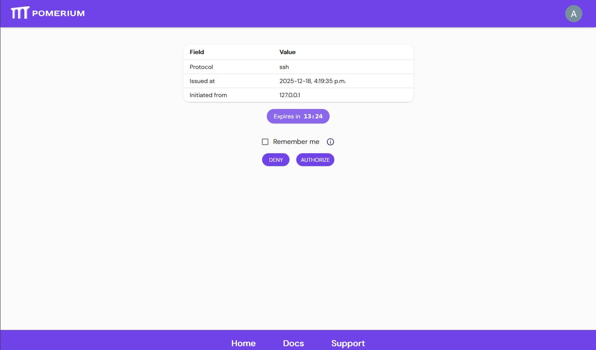
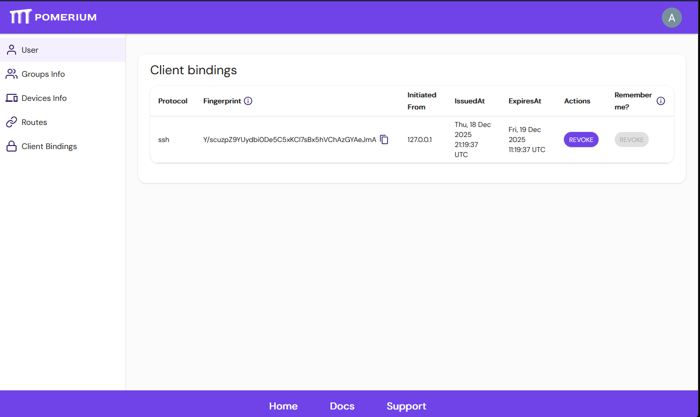

# Client bindings

This document describes bindings to non-HTTP clients in Pomerium

# Overview

Pomerium binds non-HTTP based protocols to Client bindings so that they can use the typical web authentication flows, like the Authorization Code flow.

# Example

When first authenticating via ssh:

```bash
ssh -p 2222 user@route@host
Please sign in to continue
<your-authenticate-service-URL>/.pomerium/sign_in?user_code=C6I3E-wUa1ne-TVtrORlQw
```

Will redirect you to a sign in page:



This page will provide you with several details to verify the authenticity of this binding request.

# Authorizing

Authorizing the request allows Pomerium to associate your OAuth user to a particular non-http client. This association is called a **Client binding**.

Client bindings cache credentials, which defaults to the smallest value between 48 hours or the configured session timeout (defaults to 14 hours; see [cookie expiration](https://docs.pomerium.com/docs/reference/cookies#cookie-expiration)).

Clicking "Remember me" will associate your binding with your OAuth user until your user's session expires. This means if you configure your cookie timeout to exceed 48 hours, or if you revoke your client binding, any subsequent authentication request will be automatically approved when opening the code link.

# Changing users

End users can visit `<your-authenticate-service-URL>/.pomerium/session_binding_info` to manage which keys are associated with their user.



Revoking a Client binding immediately terminates any associated client connection, and the client will be required to authenticate again, if it wishes to proceed.

If you wish to switch users, you also have to revoke the remember field if it is set.

# Logging out

If an end-user logs out from Pomerium, all of their client bindings will also be revoked, so all client connections associated to that user will be terminated.

# SSH

In the case of SSH, your OAuth user will be bound to the particular SSH key you used to connect to Pomerium's SSH address.

:::info

Multiple SSH keys may be associated with a particular user, but only one SSH key may be tied to a user!

::: :::warning Sharing the same SSH keys between machines means they will be automatically authenticated with Pomerium, and the connection will happen without sign in confirmation.

Similarly, revoking a client binding terminates all ssh connections initiated with that client key. :::
