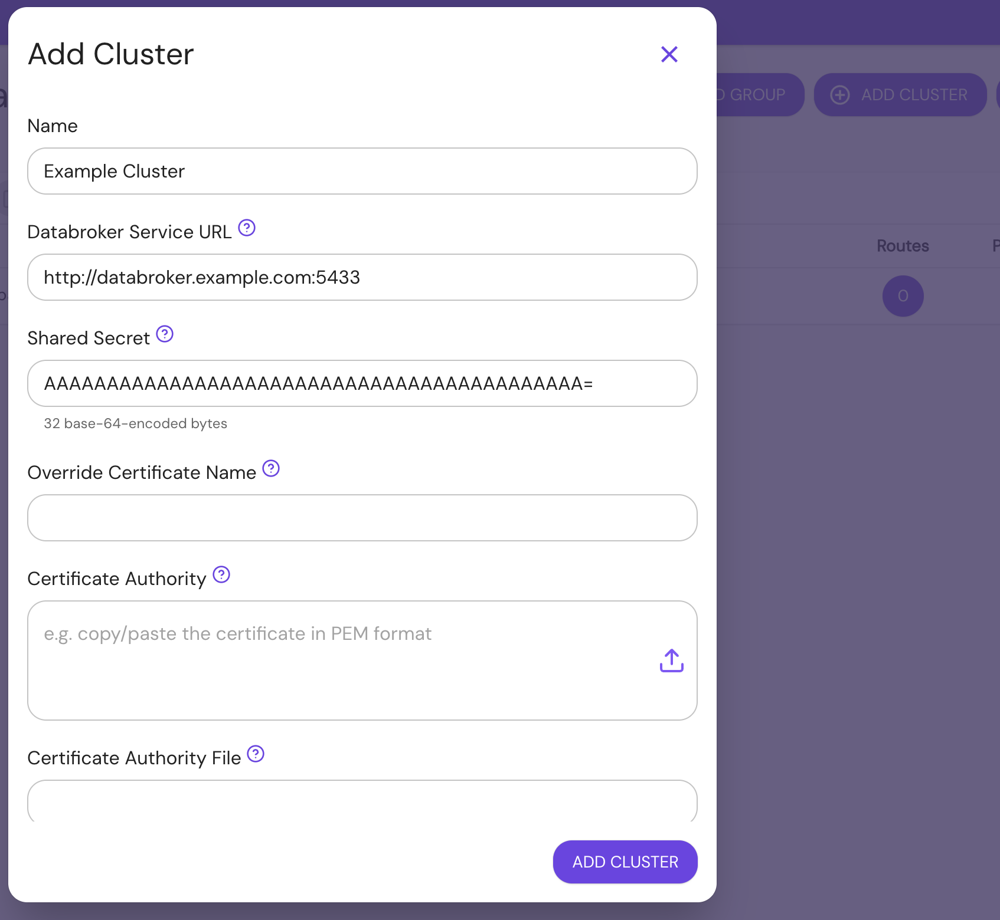

# Clusters for Enterprise

This document provides an overview of Clusters in Enterprise.

## Overview

Pomerium Enterprise can be configured to support multiple clusters. Each cluster is an independent installation of [Pomerium Core](/docs/deploy/core), the primary server component that secures your services.

## Why Clusters?

A cluster model reduces the complexity of managing Pomerium: All of a cluster's configuration, including settings, routes, policies, and certificates, are managed from a single installation of Pomerium Enterprise. This allows you to manage multiple isolated Pomerium Core deployments, each with its own configuration.

Configuration changes applied in the Enterprise Console are communicated over a streaming connection to your local cluster. Each cluster is connected to its own storage backend, which synchronizes state across replicas.

## Deploy Your Cluster

### Install

Each Pomerium Core installation needs to be configured with its own [shared secret](/docs/reference/shared-secret), [databroker service URL](/docs/reference/service-urls#databroker-service-url), and should use its own databroker storage database. See [Pomerium Core](/docs/deploy/core) and [Pomerium Enterprise](/docs/deploy/enterprise/install) for more details.

### Configure

A cluster can be added to the Enterprise Console from the **Namespaces** tab.

**Name**, **Databroker Service URL**, and **Shared Secret** are required. **Override Certificate Name**, **Certificate Authority**, and **Certificate Authority File** are only needed for [secure gRPC connections](/docs/reference/grpc) to the databroker.

## Routes, Policies, and Certificates

Routes, policies, and certificates defined in a cluster are scoped only to that cluster, and are not available in other clusters.
