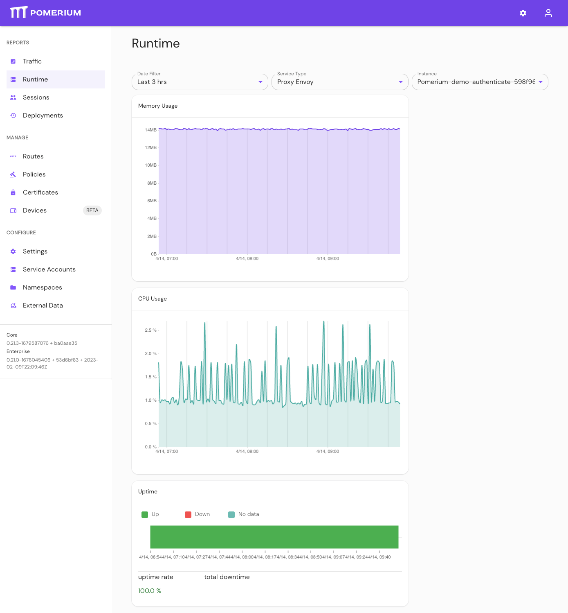

---
# cSpell:ignore XPOST tsdb

title: Telemetry & Metrics in Pomerium
sidebar_label: Telemetry & Metrics
description: Learn how Pomerium collects and displays metrics in Pomerium Zero and Pomerium Enterprise.
lang: en-US
keywords:
  [pomerium, pomerium enterprise, telemetry, metrics, prometheus, pomerium zero]
---

import Tabs from '@theme/Tabs'; import TabItem from '@theme/TabItem';

Metrics in Pomerium provide observability and monitoring data from your Pomerium deployment. Use metrics to review traffic and its effects on your system.

Pomerium exposes standard Prometheus metrics related to its operation. Open-source users must [configure](/docs/reference/metrics) metrics collection and visualization manually.

Pomerium Zero and Pomerium Enterprise provide simplified, built-in metrics collection and visualizations.

## Metrics definitions

- **Traffic**: requests proxied by Pomerium to routes defined in a Pomerium deployment.
- **Route**: the location of an upstream service protected behind Pomerium. At a minimum, a route consists of a [From](/docs/reference/routes/from) URL and a [To](/docs/reference/routes/to) URL.

## How metrics work

Pomerium collects and aggregates traffic data from your Pomerium deployment. This data includes the:

- request size, duration, and rate
- number of authorized and denied requests
- response code distribution

You can view and filter this data in your traffic dashboard to gauge how much demand is placed on your server.

### Filter metrics

#### Time range and routes

Pomerium stores traffic metrics up to the last 30 days of usage. You can filter traffic by time range and routes.

The following time ranges are supported:

- Last 30 days
- Last 2 weeks
- Last 7 days
- Last 24 hours
- Last 12 hours
- Last 3 hours
- Last hour
- Last 15 minutes (Enterprise only)

When filtering by route, select:

- **All Routes** to review aggregated traffic metrics across all routes defined in your Pomerium deployment.
- an individual route to review aggregated traffic metrics for that route.

<Tabs>
<TabItem label="Zero" value="zero">

</TabItem>
<TabItem label="Enterprise" value="enterprise">

</TabItem>
</Tabs>

## Traffic dashboard

<Tabs>
<TabItem value="zero" label="Zero">

Pomerium Zero collects traffic metrics at the [cluster](/docs/internals/clusters) level, which includes active replicas. To review the traffic dashboard in Pomerium Zero:

1. In the left-hand sidebar, select **Reports**.
1. Select **Traffic**.

</TabItem>
<TabItem value="enterprise" label="Enterprise">

When you access the Enterprise Console, you'll land on the traffic dashboard. Pomerium Enterprise organizes traffic metrics in your deployment with [namespaces](/docs/internals/namespacing).

Namespaces follow a hierarchical system. You can view traffic metrics for all namespaces, or a specific namespace, using the namespace dropdown menu. You can filter by:

- Global namespace, which encompasses all namespaces in your deployment.
- Parent namespace, which includes child namespaces (if any).
- Child namespace, which displays metrics only for that namespace.

:::enterprise

In Pomerium Enterprise, you must configure metrics before you can view them. Metrics are not enabled by default, and are not required to run Pomerium Enterprise. See the [Configure Metrics](/docs/deploy/enterprise/configure-metrics) guide to enable metrics in your Enterprise deployment.

:::

</TabItem>
</Tabs>

### Total and Authorized requests

<Tabs>
<TabItem value="zero" label="Zero">

The **Total requests** chart shows the total number of proxied requests. The **Authorized requests** chart shows the total number of requests Pomerium authorized and forwarded to an upstream service.

Both charts display the difference in requests between the selected and previous time ranges. 

The **Authorized Requests** pie chart displays the total number of authorized and denied requests. 

</TabItem>
<TabItem value="enterprise" label="Enterprise">

The **Total requests** chart shows the total number of proxied requests. The **Authorized requests** chart shows the total number of requests Pomerium authorized and forwarded to an upstream service.

The **Healthy Endpoints** chart displays the number of healthy upstream endpoints, and roughly correlates with the number of routes defined in your deployment.

For example, if a route's **To** definition includes [multiple upstream resources](/docs/reference/routes/to#target-multiple-upstream-resources), Pomerium includes these resources in the total sum of healthy endpoints. Pomerium excludes unhealthy endpoints from this total. See Load Balancing - [Active Health Checks](/docs/capabilities/routing#active-health-checks) and [Passive Health Checks](/docs/capabilities/routing#passive-health-checks) for more information.

The **Authorized Requests** pie chart displays the total number of authorized and denied requests.

The **Healthy Upstream Endpoints** graph shows you the number of healthy endpoints over time. A dip in the graph denotes unhealthy endpoints.

</TabItem>
</Tabs>

### Request durations

<Tabs>
<TabItem value="zero" label="Zero">

Request duration measures the amount of time it takes Pomerium to proxy a request in milliseconds (ms). Pomerium Zero provides two request duration charts:

The first chart organizes requests by duration ranges defined along the x-axis. Pomerium sums the total value of requests within each range and calculates the amount as a percentage value.

The second chart organizes requests by percentile ranges, date, and time.

</TabItem>
<TabItem value="enterprise" label="Enterprise">

Request duration measures the amount of time it takes Pomerium to proxy a request in milliseconds (ms). Pomerium Enterprise provides two request duration charts:

The first chart organizes requests by duration ranges defined along the x-axis. Pomerium sums the total value of requests within each range and calculates the amount as a percentage value.

The second chart organizes requests by percentile ranges, date, and time. You can select a specific percentile range to view more granular data in that range:

</TabItem>
</Tabs>

### Requests rate and response codes

<Tabs>
<TabItem value="zero" label="Zero">

The **Requests per second** chart calculates the average amount of proxied requests per second over the span of an hour. Requests are organized by date and time, and categorized by the following response status codes:

- **200s** (200-299): successful responses
- **300s** (300-399): redirection messages
- **400s** (400-499): client error responses
- **500s** (500-599): server error responses

</TabItem>
<TabItem value="enterprise" label="Enterprise">

The **Request Rate** chart calculates the average amount of proxied requests per second over the span of an hour.

The **Response Codes** chart organizes requests by date and time, and categorizes them with the following response status codes:

- **HTTP 2xx** (200-299): successful responses
- **HTTP 3xx** (300-399): redirection messages
- **HTTP 4xx** (400-499): client error responses
- **HTTP 5xx** (500-599): server error responses

</TabItem>
</Tabs>

### Bytes sent and received, request size

<Tabs>
<TabItem value="zero" label="Zero">

The **Bytes sent** and **Bytes received** charts display the average amount of bytes sent and received over the span of an hour.

</TabItem>
<TabItem value="enterprise" label="Enterprise">

The **Request Size** chart organizes requests based on their request size measured in kilobytes (KB).

</TabItem>
</Tabs>

## Runtime dashboard

<Tabs>
<TabItem value="zero" label="Zero">

Runtime metrics are not supported in Pomerium Zero.

</TabItem>
<TabItem value="enterprise" label="Enterprise">

In the **Runtime** dashboard, you can monitor how many system resources Pomerium is consuming. Filter by date range, service, and instance.

</TabItem>
</Tabs>
