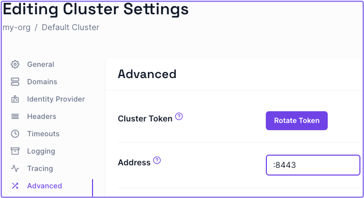
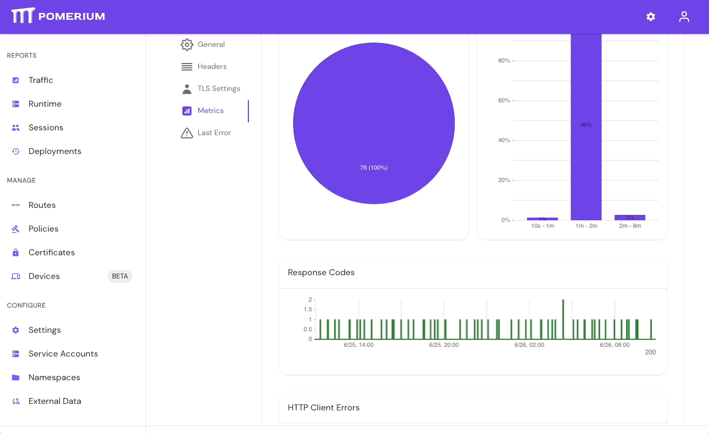
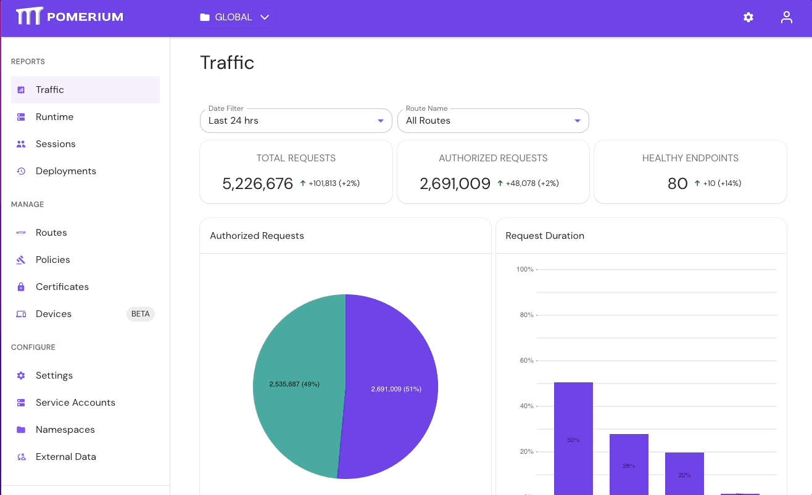
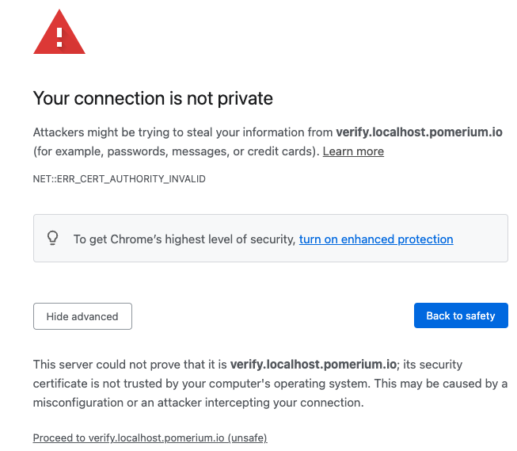

import Tabs from '@theme/Tabs';
import TabItem from '@theme/TabItem';
import GenerateRecoveryToken from '@site/content/docs/admonitions/_generate-recovery-token.md';

## Pomerium Zero

### Configure port 443 to allow inbound access

**Problem**

Whenever you deploy a cluster, the Pomerium Zero cloud sends an inbound request to the cluster on port 443 to establish a secure connection. This is the default behavior. If the port is unavailable (for example, another process is already listening on port 443, or you haven't allowed a non-root process to bind to port 443), Pomerium Zero won't be able to establish a connection to your cluster.

**Solution**

Open the port so that it grants Pomerium inbound access on port 443. (For example, you can do this in Linux systems with the `CAP_NET_BIND_SERVICE` capability.)

If you've reserved port 443 for something else, you can change the port Pomerium sends inbound requests to by specifying a different listening port (like `:8443`) in the [**Address**](/docs/reference/address) field of the Zero Console:

1. Select **Settings**
1. Select **Advanced**
1. Enter the preferred port address
1. Apply your changes



:::info

Pomerium Zero also makes several outbound connections to the following `pomerium.app` domains on port `443` to fetch a cluster's configuration and status:

- console.pomerium.app:443
- connect.pomerium.app:443
- telemetry.pomerium.app:443

:::

### Delete a cluster

At some point, you may want to delete a cluster. Currently, you can only delete a cluster if you have multiple clusters.

To delete a cluster:

1. Select the clusters dropdown in the Zero Console navigation bar
1. Select **Manage Clusters**
1. Select the checkbox next to the cluster you want to delete, then select the **Delete** button in the table
1. In the popup, select **Delete** to confirm

### Pomerium Zero loses configuration after upgrading

If you installed Pomerium using the Linux install script during the Pomerium Zero beta, you will need to re-run the install script the first time you upgrade Pomerium. (Subsequent upgrades will not require this step.)

1. First, find your current cluster token: look for a line beginning with `Environment=POMERIUM_ZERO_TOKEN=` in the file `/usr/lib/systemd/system/pomerium.service`.
1. Copy this token into the following command and run it:

```bash
$ curl https://console.pomerium.app/install.bash | \
  env POMERIUM_ZERO_TOKEN=<cluster_token> bash -s install
```

---

## Pomerium Core

### JWT Authentication

When securing the Pomerium Authenticate service with a certificate signed by Let's Encrypt, your upstream applications may reject the certificate when attempting to access the JWT signing key. Here's an example log line from [Grafana](/docs/guides/grafana):

```log
logger=context error=Get "https://grafana.localhost.pomerium.io/.well-known/pomerium/jwks.json": x509: certificate signed by unknown authority
```

This is often due to the recent expiration of the [DST Root CA X3](https://letsencrypt.org/docs/dst-root-ca-x3-expiration-september-2021/) certificate. Many default keystores used by docker images and less-frequently updated distributions still carry this expired certificate. Even though Let's Encrypt certs are cross-signed with the [ISRG Root X1](https://letsencrypt.org/certificates/) CA certificate, some applications will still reject them.

To clarify; this does not mean that the upstream service is rejecting the JWT signing key. Rather, it doesn't trust the Let's Encrypt certificate used by the Authorize service for TLS, and so it will not read the JWKS file.

For upstream applications that can use a local signing key file, you can circumvent this issue using `curl` or `wget` to download the signing key locally (relative to the upstream service). Using Grafana again as an example:

1.  Download the `jwks.json` file from the authenticate server:

    <Tabs>

    <TabItem value="curl" label="curl">

    ```bash
    curl https://grafana.localhost.pomerium.io/.well-known/pomerium/jwks.json > /etc/grafana/jwks.json
    ```

    </TabItem>

    <TabItem value="wget" label="wget">

    ```bash
    wget -O /etc/grafana/jwks.json https://grafana.localhost.pomerium.io/.well-known/pomerium/jwks.json
    ```

    </TabItem>

    </Tabs>

1.  Edit the upstream service configuration to use the local key to verify tokens:

    ```ini
    [auth.jwt]
    enabled = true
    header_name = X-Pomerium-Jwt-Assertion
    email_claim = email
    jwk_set_file = /etc/grafana/jwks.json
    cache_ttl = 60m
    ```

### Kubernetes Ingress Controller

#### View Event History

Pomerium Ingress Controller will add **events** to the Ingress objects as it processes them.

```
kubectl describe ingress/my-ingress
```

```log
Events:
  Type    Reason   Age   From              Message
  ----    ------   ----  ----              -------
  Normal  Updated  18s   pomerium-ingress  updated pomerium configuration
```

If an error occurs, it may be reflected in the events:

```log
Events:
  Type     Reason       Age                 From              Message
  ----     ------       ----                ----              -------
  Normal   Updated      5m53s               pomerium-ingress  updated pomerium configuration
  Warning  UpdateError  3s                  pomerium-ingress  upsert routes: parsing ingress: annotations: applying policy annotations: parsing policy: invalid rules in policy: unsupported conditional "maybe", only and, or, not, nor and action are allowed
```

### Shared Secret Mismatch

Pomerium's independent services communicate securely using a [shared secret](/docs/reference/shared-secret). If any services have mismatched secrets, Pomerium will fail.

Pomerium Core will log a shared secret mismatch with:

```json
{
  "level": "error",
  "syncer_id": "authorize",
  "syncer_type": "",
  "error": "rpc error: code = Unauthenticated desc = invalid JWT: go-jose/go-jose: error in cryptographic primitive",
  "time": "2022-03-22T07:26:14-04:00",
  "message": "sync"
}
```

Pomerium Enterprise will log a shared secret mismatch with:

```json
{
  "level": "error",
  "ts": "2022-03-22T07:21:02-04:00",
  "caller": "dashboard/server.go:187",
  "msg": "syncer",
  "error": "failed to sync all devices: rpc error: code = Unauthenticated desc = invalid JWT: go-jose/go-jose: error in cryptographic primitive",
  "stacktrace": "github.com/pomerium/pomerium-console/svc/dashboard.(*Server).Run.func2\n\t/PATH/TO/POMERIUM/CONSOLE/SERVICE/svc/dashboard/server.go:187\ngolang.org/x/sync/errgroup.(*Group).Go.func1\n\t/Users/tgroth/workspace/go/pkg/mod/golang.org/x/sync@v0.0.0-20210220032951-036812b2e83c/errgroup/errgroup.go:57"
}
{
  "level": "info",
  "ts": "2022-03-22T07:21:02-04:00",
  "caller": "dashboard/server.go:202",
  "msg": "stopping dashboard servers"
}
```

Update the [shared secret](/docs/reference/shared-secret) across all Pomerium services to match the one set for the Databroker.

### RPC Errors

#### certificate signed by unknown authority

When authenticating and authorizing a user for the first time, you may see the following in your Pomerium logs:

```log
ERR http-error error="401 Unauthorized: ..... rpc error: code = DeadlineExceeded desc = latest connection error: connection error: desc = "transport: authentication handshake failed: x509: certificate signed by unknown authority...."
```

**Why**

This error means that the proxy is rejecting the Authorize service's supplied certificate (used to establish a secure connection) because it doesn't know or trust the certificate authority that signed it.

**Solution**

Ensure that the Proxy service knows about and trusts the certificate authority that signed the Authorize service's certificate.

- Add the certificate authority directly into Pomerium using the [certificate authority](/docs/reference/certificates) config setting.
- Add the certificate authority to the system's underlying trust store.
- Replace your system / docker image certificate bundle.

  For Docker:

  ```docker
  COPY --from=builder /etc/ssl/certs/your-cert-bundle.crt /etc/ssl/certs/ca-certificates.crt
  ```

- Finally, ensure that you aren't being man-in-the-middle'd or that some eager router isn't injecting its own certificate along the way. Use openssl to verify that your Proxy service is getting the certificate you think it's getting.

  ```bash
  openssl s_client -servername pomerium.io -connect pomerium.io:443 </dev/null \
  | sed -ne '/-BEGIN CERTIFICATE-/,/-END CERTIFICATE-/p'
  ```

#### rpc error: code = DeadlineExceeded

When authenticating and authorizing a user for the first time, you may get the following in your Pomerium logs.

```log
{"level":"error",..."error":"rpc error: code = DeadlineExceeded desc = context deadline exceeded","http-message":"rpc error: code = DeadlineExceeded desc = context deadline exceeded","http-code":500,"message":"http-error"}
```

**Why**

The Proxy service is not able to create a connection with the authorization service to validate a user.

**Solution**

Usually, this is the result of either a routing issue or a configuration error. Make sure that you are using the _internally_ routable URL for the Authorize service. Many cloud load balancers _do not_ yet support gRPC transposing the ingress. So while your authenticate service URL might look like `https://authenticate.corp.example.com`, your authorize service URL might be `https://pomerium-authorize-service.default.svc.cluster.local` or `https://localhost:5443`.

### Pomerium exits on startup

**Problem**

If you first run the Pomerium process as one Unix user (e.g. `root`), and then later attempt to run Pomerium as a different user, Pomerium may refuse to start.

Look for a log entry containing an error message like the following:

> cannot open shared memory region /envoy_shared_memory_2068293160 check user permissions. Error: File exists

Or a log entry with an error message like this:

> cannot bind '/tmp/pomerium-envoy-admin.sock': Address already in use

**Solution**

Remove the files created while Pomerium was running as the other user:

```shell-session
$ sudo rm /dev/shm/envoy_shared_memory_*
$ sudo rm /tmp/pomerium-envoy-admin.sock
```

Then start Pomerium again.

---

## Pomerium Enterprise

### Generate Recovery Token

<GenerateRecoveryToken />

### Directory sync

**Problem:**

Enterprise Console directory sync fails to complete.

**Solution:**

If your directory sync fails, use the **External Data** > **Last Error** and **Metrics** dashboards to determine the source of the failure, and review your Console logs as well. If the failure is due to a timeout, increase the **IdP Polling Min/Max Delay** settings until the sync completes.

1. In the Console, go to **External Data** > **Last Error** to check for errors that may have caused the sync to fail. Go to **External Data** > **Metrics** to review request durations:



2. Select **Settings** > **Identity Providers** to see the **IdP Polling Min/Max Delay** settings. Increase the **Polling Min Delay** and **Polling Max Delay** settings before attempting to sync your directory again. Continue to monitor the sync; if it fails due to timeout, increase the durations.



See [**Identity Provider Polling Min/Max Delay**](/docs/reference/identity-provider-settings#identity-provider-polling-minmax-delay) for more information.

### Case sensitive values

Configuration file keys and environment variables of the type `string` are case sensitive. This is important when configuring the Enterprise Console or adding claims to your configuration file.

For example, the `administrators` key allows you to specify a list of names, email addresses, or user IDs as initial administrators to access and configure the Enterprise Console. These string values are case sensitive.

If you wanted to add an email address like `John.Admin@example.com` to the `administrators` file key, Pomerium wouldn't recognize an email like `john.admin@example` because the strings aren't an exact match.

---

## Upstream connection errors {#envoy-error-messages}

Upstream connection errors indicate that something is wrong with the upstream server, not Pomerium. Please refer to the list of errors below to learn more about a specific issue, and how you can resolve it.

:::note

Configuration errors in Pomerium itself can also cause upstream connection errors. In this case, you'd need to debug your Pomerium configuration to resolve the error.

:::

### No healthy upstream

The `no_healthy_upstream` error means that there is an issue with the upstream server that makes it unreachable from Pomerium. The error may be caused by or related to the upstream server's:

- Configuration or application code

  **Resolution**: Check that there are no errors in the server's configuration files or application code that prevent it from running as expected.

- Network or firewall settings

  **Resolution**: Check your network or firewall settings to make sure your server is reachable.

- DNS records

  **Resolution**: This error may be caused by unresolvable DNS records applied to the upstream server. Make sure the server's DNS records are pointing to the correct IP address.

- Failing health checks configured in Pomerium

  **Resolution**: If you've configured [Load Balancing Health Checks](/docs/reference/routes/load-balancing#health-checks) in Pomerium, the `no_healthy_upstream` could be the result of a failing health check from an upstream server. Please check the server's configuration for any errors.

### Upstream Max Stream Duration Reached

The `upstream_max_stream_duration_reached` error means that Pomerium cancelled the request because it exceeded the upstream server's maximum stream duration.

**Resolution**: By default, Pomerium sets a 10-second timeout for all requests. If your requests are taking longer than expected, see the [Connections - Timeouts](/docs/internals/connection#timeouts) page to learn how timeouts work with upstream connections, and how to configure timeouts to avoid this error.

### Upstream Per Try Timeout

The `upstream_per_try_timeout` error means that the final attempt to connect to the upstream server timed out.

**Resolution**: See the [Connections - Timeouts](/docs/internals/connection#timeouts) page to learn how timeouts work with upstream connections, and how to configure timeouts in Pomerium to avoid this error.

### Upstream Reset After Response Started

The `upstream_reset_after_response_started` error means that the upstream server reset the connection _after_ it began transmitting the response.

**Resolution**: See the [Connections - Timeouts](/docs/internals/connection#timeouts) page to learn how timeouts work with upstream connections, and how to configure timeouts in Pomerium to avoid this error.

### Upstream Reset Before Response Started

The `upstream_reset_before_response_started` error means the upstream server reset the connection _before_ it began transmitting the response.

**Resolution**: See the [Connections - Timeouts](/docs/internals/connection#timeouts) page to learn how timeouts work with upstream connections, and how to configure timeouts in Pomerium to avoid this error.

### Upstream Response Timeout

The `upstream_response_timeout` error means that the upstream server's response timed out.

**Resolution**: See the [Connections - Timeouts](/docs/internals/connection#timeouts) page to learn how timeouts work with upstream connections, and how to configure timeouts in Pomerium to avoid this error.

### Via Upstream

The `via_upstream` error means that the upstream service set the response code.

**Resolution**: To resolve this error, check the upstream service's application logs for more information about how the response status code is set.

---

## Miscellaneous

### Invalid Certificates from Command Line Tools

When using Let's Encrypt certificates, you must use the `fullchain.pem` file, not `cert.pem` in order to include intermediate certs. Browsers like Chrome will store intermediate certs for LE but other tools (like `curl`) don't, which is why your route might look fine in a web browser, but not when curl'd or used for TCP tunneling.

### Handle self-signed certificate warning

If you're testing Pomerium locally with self-signed certificates, you may encounter the following self-signed certificate warning:



To resolve this error:

1. Select **Advanced**
1. Select **Proceed to verify.localhost.pomerium.io (unsafe)**

If you don't see an **Advanced** option:

1. Click anywhere in the window
1. Type `thisisunsafe`
1. Make sure **Reload** is selected
1. Select **Enter**

Your browser will redirect you to the route defined in your policy.

---

## Cross-Origin Configuration

For applications that need to send requests across different domains (for example, a web app hosted at `https://app.example.com` making calls to `https://api.example.com`), you may need to configure Cross-Origin Resource Sharing (CORS). Below is a thorough guide for setting up Pomerium to accommodate cross-domain requests. For more details on CORS, see the [MDN Documentation](https://developer.mozilla.org/en-US/docs/Web/HTTP/CORS) or [Microsoft Docs on CORS](https://docs.microsoft.com/en-us/iis/configuration/system.webServer/security/cors).

Many applications, particularly single-page JavaScript applications or frameworks (React, Vue, Angular, Next.js, etc.), use multiple domains or subdomains when communicating with an API or service layer. The examples below illustrate how to configure Pomerium to support CORS, without modifying the underlying application code.

### Configuration

#### Pomerium

```yaml
authenticate_service_url: https://authenticate.localhost.pomerium.io

certificate_file: /pomerium/cert.pem
certificate_key_file: /pomerium/private-key.pem

idp_provider: REPLACE
idp_client_id: REPLACE
idp_client_secret: REPLACE

cookie_secret: V2JBZk0zWGtsL29UcFUvWjVDWWQ2UHExNXJ0b2VhcDI=

routes:
  - from: https://api.localhost.pomerium.io
    to: http://api:8000
    allow_any_authenticated_user: true
    cors_allow_preflight: true
    set_response_headers:
      'Access-Control-Allow-Credentials': 'true'
      'Access-Control-Allow-Origin': 'https://app.localhost.pomerium.io'
      'Access-Control-Allow-Headers': 'X-Pomerium-Authorization'
  - from: https://app.localhost.pomerium.io
    to: http://app:8000
    allow_any_authenticated_user: true
```

#### Web Application

```go
package main

import (
	"net/http"
)

func main() {
	http.Handle("/", http.FileServer(http.Dir(".")))
	http.ListenAndServe(":8000", nil)
}
```

```html
<!doctype html>
<html>
  <head>
    <title>Example Application</title>
    <script type="module" src="index.mjs"></script>
  </head>
  <body></body>
</html>
```

```javascript
(async () => {
  const result = await fetch('https://api.localhost.pomerium.io', {
    method: 'POST',
    headers: {
      Accept: 'application/json',
    },
  });
  const json = await result.json();
  console.log('RESULT', json);
})();
```

#### API Application

```go
package main

import (
	"io"
	"net/http"
)

func main() {
	http.HandleFunc("/", func(w http.ResponseWriter, r *http.Request) {
		w.Header().Set("Content-Type", "application/json")
		io.WriteString(w, `{ "message": "HELLO WORLD" }`)
	})
	http.ListenAndServe(":8000", nil)
}
```

#### Docker-Compose

```yaml
services:
  pomerium:
    image: pomerium/pomerium:latest
    ports:
      - 443:443
    volumes:
      - ./_wildcard.localhost.pomerium.io.pem:/pomerium/cert.pem:ro
      - ./_wildcard.localhost.pomerium.io-key.pem:/pomerium/private-key.pem:ro
      - ./config.yaml:/pomerium/config.yaml:ro

  app:
    image: golang:latest
    command: ['go', 'run', '.']
    environment:
      GO111MODULE: 'off'
    volumes:
      - ./app.go:/go/app.go:ro
      - ./index.html:/go/index.html:ro
      - ./index.mjs:/go/index.mjs:ro

  api:
    image: golang:latest
    command: ['go', 'run', '.']
    environment:
      GO111MODULE: 'off'
    volumes:
      - ./api.go:/go/api.go:ro
```

### Problem

When accessing `app.localhost.pomerium.io`, the browser returns a 401 error for requests to `api.localhost.pomerium.io`:

> URL: https://api.localhost.pomerium.io/ Status: 401 Unauthorized Source: Network Address: 127.0.0.1:443 Initiator: index.mjs:2

Because these domains differ, cookies may not be automatically sent, leading to authentication failures and CORS-related requests being denied.

### Solutions

#### Use a Single Domain

Rather than using different subdomains for your app and API, configure them on a single domain with different paths. For example:

```yaml
routes:
  - from: https://app.localhost.pomerium.io
    prefix: /api
    to: http://api:8000
    allow_any_authenticated_user: true
  - from: https://app.localhost.pomerium.io
    to: http://app:8000
    allow_any_authenticated_user: true
```

Then your requests can share domain cookies and avoid CORS complexities. Update the JavaScript to reference `location.origin + '/api'` instead of the separate `api.localhost.pomerium.io` domain.

#### Pass the Pomerium Credentials via a Header

If you must use different domains, you can pass the JWT in a custom header. For example:

```yaml
cookie_http_only: false
```

```javascript
(async () => {
  const result = await fetch('https://api.localhost.pomerium.io', {
    method: 'POST',
    headers: {
      Accept: 'application/json',
      'X-Pomerium-Authorization': document.cookie.substring(
        document.cookie.indexOf('=') + 1,
      ),
    },
  });
  const json = await result.json();
  console.log('RESULT', json);
})();
```

#### Share the Cookie

If both subdomains share a parent domain, you can set a cookie domain such as `cookie_domain: '.localhost.pomerium.io'`. The browser will then share cookies among subdomains. You'll still need to configure your JavaScript client to send credentials:

```javascript
(async () => {
  const result = await fetch('https://api.localhost.pomerium.io', {
    method: 'POST',
    headers: {
      Accept: 'application/json',
    },
    credentials: 'include',
  });
  const json = await result.json();
  console.log('RESULT', json);
})();
```

> For more details on how cookies and credentials work in fetch or XHR, refer to [XMLHttpRequest/withCredentials on MDN](https://developer.mozilla.org/en-US/docs/Web/API/XMLHttpRequest/withCredentials) and [fetch() API documentation](https://developer.mozilla.org/en-US/docs/Web/API/Fetch_API).
