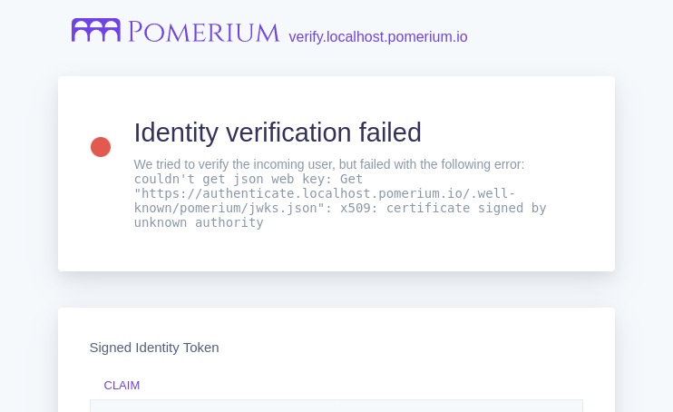

---
# cSpell:ignore customresourcedefinition serviceaccount clusterrole clusterrolebinding ingressclass whpnw cckv5 4pdkd kubeconfig

title: Kubernetes Quickstart
sidebar_label: Quickstart
sidebar_position: 1
lang: en-US
keywords:
  [
    pomerium,
    identity access proxy,
    oidc,
    kubernetes,
    kustomize,
    reverse proxy,
    ingress controller,
    k8s,
  ]
---

import Tabs from '@theme/Tabs';
import TabItem from '@theme/TabItem';
import InstallMkcert from '@site/content/_install-mkcert.md';
import GlobalExample from '@site/content/examples/kubernetes/pomerium-global-settings.md';

Deploy Pomerium Core with [Kubernetes].

This quickstart guide uses our [**Hosted Authenticate Service**](/docs/capabilities/hosted-authenticate-service) so you don't need to configure an identity provider or authenticate service URL.

If you want to self-host, see the [**Self-Hosted Authenticate Service**](/docs/capabilities/self-hosted-authenticate-service) page.

## Prerequisites

- [Install kubectl].
- A Kubernetes provider.
  - A cluster, with your local `kubectl` authorized to interact with it.
- A domain space. The steps below use `*.localhost.pomerium.io` as a placeholder value. We have set DNS records for this domain space to point to `127.0.0.1` (localhost), so you can use this domain space when testing Pomerium locally.
- [TLS certificates]. If you don't yet have a production environment with trusted certificates, this page will cover using [mkcert] to create locally trusted certificates.

## Certificates

This setup uses [mkcert] to generate certificates that are trusted by your local web browser for testing. If you already have a certificate solution, you can skip the steps below and move on to [the next stage](#install-pomerium).

### Install mkcert

1. <InstallMkcert />

1. Generate a wildcard certificate and key for Pomerium to use:

```sh
mkcert "*.localhost.pomerium.io"
```

## Install Pomerium

1. Install Pomerium to your cluster:

```sh
kubectl apply -k github.com/pomerium/ingress-controller/config/default\?ref=v0.27.1
```

This will create all the components of Pomerium in the `pomerium` namespace, as well as a bootstrap secret:

```sh
namespace/pomerium created
customresourcedefinition.apiextensions.k8s.io/pomerium.ingress.pomerium.io created
serviceaccount/pomerium-controller created
serviceaccount/pomerium-gen-secrets created
clusterrole.rbac.authorization.k8s.io/pomerium-controller created
clusterrole.rbac.authorization.k8s.io/pomerium-gen-secrets created
clusterrolebinding.rbac.authorization.k8s.io/pomerium-controller created
clusterrolebinding.rbac.authorization.k8s.io/pomerium-gen-secrets created
service/pomerium-metrics created
service/pomerium-proxy created
deployment.apps/pomerium created
job.batch/pomerium-gen-secrets created
ingressclass.networking.k8s.io/pomerium created
```

2. Add the certificate [created earlier](#certificates) and key to the cluster as a Secret:

```sh
kubectl create secret tls pomerium-wildcard-tls --namespace=pomerium \
  --cert=./_wildcard.localhost.pomerium.io.pem --key=./_wildcard.localhost.pomerium.io-key.pem
```

3. Define the global Pomerium settings:

<GlobalExample />

4. Apply the global settings:

```sh
kubectl apply -f pomerium.yaml
```

The Pomerium Proxy service should now be running in your cluster:

```sh {1}
kubectl describe pomerium
Name:         global
Namespace:
Labels:       <none>
Annotations:  <none>
API Version:  ingress.pomerium.io/v1
Kind:         Pomerium
Metadata:
  ...
```

You should now be able to access `https://authenticate.pomerium.app` which, after signing in with our hosted IdP, should redirect you to the `.pomerium` endpoint.

## Test Service

:::info

See the [**Verify examples**](https://github.com/pomerium/verify/blob/main/examples/ingress.yaml) repository to review additional example manifests.

:::

1. Define a test service. We'll use the Pomerium Verify app:

   ```yaml title=verify-service.yaml
   apiVersion: v1
   kind: Service
   metadata:
     name: verify
     labels:
       app: verify
       service: verify
   spec:
     ports:
       - port: 8000
         targetPort: 8000
         name: http
     selector:
       app: pomerium-verify
   ---
   apiVersion: apps/v1
   kind: Deployment
   metadata:
     name: verify
   spec:
     replicas: 1
     selector:
       matchLabels:
         app: pomerium-verify
     template:
       metadata:
         labels:
           app: pomerium-verify
       spec:
         containers:
           - image: docker.io/pomerium/verify
             imagePullPolicy: IfNotPresent
             name: httpbin
             ports:
               - containerPort: 8000
                 protocol: TCP
                 name: http
   ```

   Deploy it with `kubectl apply -f verify-service.yaml`

2. Define an Ingress for the new service:

   ```yaml title=verify-ingress.yaml {8} showLineNumbers
   apiVersion: networking.k8s.io/v1
   kind: Ingress
   metadata:
     name: verify
     annotations:
       ingress.pomerium.io/allowed_domains: |
         - example.com
       ingress.pomerium.io/pass_identity_headers: 'true'
   spec:
     ingressClassName: pomerium
     rules:
       - host: 'verify.localhost.pomerium.io'
         http:
           paths:
             - pathType: Prefix
               path: /
               backend:
                 service:
                   name: verify
                   port:
                     number: 8000
   ```

   Note that in **Line 8**, we include the [annotation](/docs/k8s/ingress#supported-annotations) `ingress.pomerium.io/pass_identity_headers`, which provides a [JWT](/docs/internals/glossary#json-web-token) to the Verify service.

   Deploy the service with `kubectl apply -f verify-ingress.yaml`, and visit the path in your browser:

   

   :::tip

   Identity verification fails because we're using an untrusted test certificate. Updating your deployment with a trusted certificate solution like Let's Encrypt through [cert-manager] will resolve this error.

   :::

## Next steps

Once Pomerium is configured, you should configure [persistence](/docs/internals/data-storage#persistence). This prevents the loss of user sessions if containers are restarted, and supports deployments with multiple replicas. See our Kubernetes [Reference](/docs/internals/data-storage) page for more information on configuring Databroker storage.

## Troubleshooting

Pomerium posts events to the `Ingress` and `Pomerium` objects, which may be inspected with the `kubectl describe` command:

```sh
kubectl describe pomerium
```

The **Spec** section provides details on the Pomerium configuration:

```yaml
Spec:
  Authenticate:
    URL: https://authenticate.localhost.pomerium.io
  Certificates: pomerium/pomerium-wildcard-tls
  Identity Provider:
    Provider: github
    Secret: pomerium/idp
  Secrets: pomerium/bootstrap
```

The **Status** section details what Ingresses are configured:

```yaml
Status:
  Ingress:
    pomerium/verify:
      Last Reconciled: 2022-07-13T16:38:39Z
      Reconciled: true
```

And the **Events** section will provide useful debug information about recent updates to the configuration:

```yaml
Events:
  Type    Reason   Age               From      Message
  ----    ------   ----              ----      -------
  Normal  Updated  3m28s  pomerium  Pomerium configuration updated
  Normal  Updated  42s    pomerium  pomerium/verify: Pomerium configuration updated
```

[cert-manager]: https://cert-manager.io/docs/
[identity provider]: /docs/identity-providers
[ingress controller]: ./ingress.md
[install kubectl]: https://kubernetes.io/docs/tasks/tools/install-kubectl/
[kubernetes]: https://kubernetes.io
[mkcert]: https://github.com/FiloSottile/mkcert
[organizing cluster access using kubeconfig files]: https://kubernetes.io/docs/concepts/configuration/organize-cluster-access-kubeconfig/
[tls certificates]: /docs/guides/certificates
