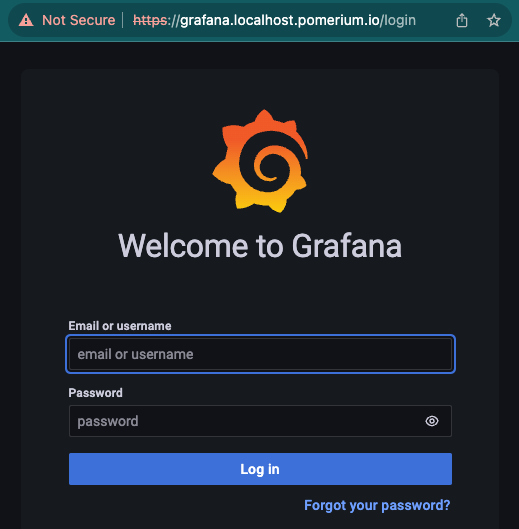

# Build a Simple Route

In this guide, you’ll learn about **Routing** in Pomerium. By the end, you’ll add a new service to Docker Compose and define a route to it.

:::note **Before You Start**

Make sure you’ve completed the [**Get Started**](/docs/learn-pomerium/get-started) tutorial.

If you already did, you should have:

- A Pomerium configuration file
- A Docker Compose configuration file

You’ll build on these configuration files in each tutorial.

:::

## Routing in Pomerium

In Pomerium, **Routing** tells the Proxy service where to listen for incoming requests _from_ the client and where to direct the origin server’s responses _to_ the client.

Put simply, routing makes it possible for Pomerium to manage requests and responses between the client and the upstream app.

Continuing our waiter-kitchen analogy, routing is when the client tells Pomerium, “Get me butter cookies. Topped with meringue, tastefully burnt.” and Pomerium forwards that to the kitchen, telling them, “Burnt meringue-topped butter cookies, table 5.” The client gets what they want without entering the kitchen, the kitchen knows what and where to send it, everyone’s happy.

### How Routing Works in Pomerium

Each Pomerium route consists of a **From** and **To** field:

- The **From** field defines the external, publicly accessible URL of a proxied request. It tells the Proxy service to listen for requests from this location.
- The **To** field defines the destination of the proxied request, and can be an internal or external resource

When someone sends a request to access an upstream service, they are accessing the **From** URL. Pomerium receives the request and redirects the origin server’s response to its destination – the value of the **To** URL.

## Define a Route in Pomerium

Now that you know how Routes work, let’s define one in your Pomerium configuration file. We will build a route to Grafana, an open-source analytics and monitoring tool.

Under the `routes:` key in your Pomerium configuration file, add the following route:

```yaml title="config.yaml"
authenticate_service_url: https://authenticate.pomerium.app

routes:
  - from: https://verify.localhost.pomerium.io
    to: http://verify:8000
    policy:
      - allow:
          or:
            - email:
                is: user@example.com
    pass_identity_headers: true
# Add Grafana route here: 
	- from: https://grafana.localhost.pomerium.io
	  to: http://grafana:3000
	  allow_any_authenticated_user: true
```

In your `docker-compose.yaml` file, add Grafana as a service:

```yaml title="docker-compose.yaml"
version: "3"
services:
  pomerium:
    image: pomerium/pomerium:latest
    volumes:
      - ./config.yaml:/pomerium/config.yaml:ro
    ports:
      - 443:443
  verify:
    image: pomerium/verify:latest
    expose:
      - 8000
  grafana:
    image: grafana/grafana:latest
    ports:
    - 3000:3000
```

### Understanding Your Route

Now, go back to your Pomerium configuration file. Let’s quickly discuss your new Grafana route:

The **from** field contains our **Fully Qualified Domain Name** (FQDN):

`grafana.localhost.pomerium.io`

If we break apart the FQDN, `grafana` is the **hostname**.

Because we’re using Docker Compose, the hostname references the name of the service as defined in your `docker-compose.yaml` file:

```
services:
  grafana:
    image: grafana/grafana:latest
    ports:
    - 3000:3000
```

The `localhost` part is a **subdomain**, and `pomerium.io` is the **domain name**.

:::note

We’ve hardcoded `localhost.pomerium.io` to always point to `127.0.0.1` so you can use it locally in your development environment.

:::

The **to** field tells the Proxy service where to send the origin server’s response (in this case, the origin server would be Grafana).

In our example, Pomerium will send responses to `grafana:3000`.

Again, this is because we’re using Docker Compose to power our services. `grafana` is the name of the service, and we’re exposing our host machine’s port `:3000` and mapping it to port `:3000` in the Grafana container.

Within our Docker environment, Pomerium knows exactly where to send the response to.

### Access Your New Route

Now that you understand more about routing, run your containers:

```bash
docker compose up
```

And access your route: https://grafana.localhost.pomerium.io



If you reach this after the authentication step, you’ve succeeded in setting up a route to Grafana! 

Awesome!

:::info 

In this tutorial, we won’t configure Grafana any further. But, if you’re curious how to set it up in a local testing environment, see our [**Grafana guide**](https://www.pomerium.com/docs/guides/grafana).

:::

## Summary

**In this tutorial, you**:

- Learned about routing in Pomerium
- Secured a new service behind Pomerium
- Built a route to access the new service

This is more or less the service part of a reverse proxy, but after you build a road you need to secure it.

Right now, the security is pretty lax; if you can authenticate, you’re in. So, it’s time to build an authorization policy that won’t just let _anyone_ in except for the right people.

**Next up**: Build a Simple Policy

### Configuration File State

By now, your configuration files should look similar to this:

```yaml
authenticate_service_url: https://authenticate.pomerium.app

routes:
  - from: https://verify.localhost.pomerium.io
    to: http://verify:8000
    policy:
      - allow:
          or:
            - email:
                is: user@example.com
    pass_identity_headers: true
  - from: https://grafana.localhost.pomerium.io
    to: http://grafana:3000
    allow_any_authenticated_user: true
```

Docker Compose:

```yaml
version: "3"
services:
  pomerium:
    image: pomerium/pomerium:latest
    volumes:
      - ./config.yaml:/pomerium/config.yaml:ro
    ports:
      - 443:443
  verify:
    image: pomerium/verify:latest
    expose:
      - 8000
  grafana:
    image: grafana/grafana:latest
    ports:
    - 3000:3000
```