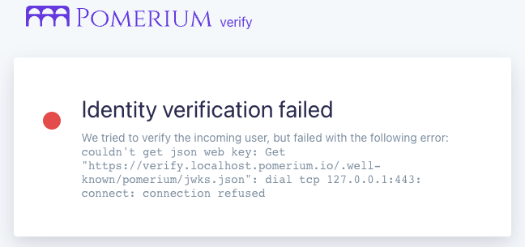

---
# cSpell:ignore thisisunsafe, genkey, noout

title: Run Pomerium Core With Docker
lang: en-US
sidebar_label: Quickstart
pagination_prev: null
pagination_next: null
description: Get Pomerium up and running quickly with Docker.
keywords:
  [
    pomerium,
    identity access proxy,
    oidc,
    docker,
    reverse proxy,
    containers,
    identity aware proxy,
    quickstart pomerium,
    docker,
    docker-compose,
  ]
---

import ConfigDocker from '@site/content/examples/config/config.docker.yaml.md';
import DockerCompose from '@site/content/examples/docker/basic.docker-compose.yml.md';

# Run Pomerium Core With Docker

Run Pomerium Core with Docker containers in **under 5 minutes**.

The Core quickstart uses Pomerium's [**Hosted Authenticate Service**](/docs/capabilities/hosted-authenticate-service), but you can also configure a [**self-hosted authenticate service**](/docs/capabilities/self-hosted-authenticate-service) to integrate with Pomerium.

## Prerequisites

[Docker] and [Docker Compose]

## Configure Pomerium

Create a `config.yaml` file in the root of your project.

Add the configuration below to `config.yaml`:

<ConfigDocker />

## Configure Docker

Create a `docker-compose.yaml` file in the root of your project.

Add the configuration below to `docker-compose.yaml`:

<DockerCompose />

## Run Docker Compose

```bash
docker compose up
```

Access the **verify route** you built in your policy: `https://verify.localhost.pomerium.io`

If you get a self-signed certificate warning, see [Handle Self-Signed Certificate Warning](/docs/internals/troubleshooting#handle-self-signed-certificate-warning) to bypass it.

You should be redirected to the **verify** service. You'll see a page like this:



Although identity verification failed, you successfully integrated Pomerium with the upstream verify service.

:::tip

Because this guide doesn't include a [signing key](/docs/reference/signing-key) in the configuration, identity verification will fail.

See [Identity Verification](/docs/capabilities/getting-users-identity) for more information on how Pomerium can use JWTs for authentication.

:::

## Next Steps

If you want to [try Enterprise](https://www.pomerium.com/enterprise-sales/), check out the [Enterprise with Docker quickstart](/docs/deploy/enterprise/quickstart).

If you want to try connecting Pomerium with other services, see some of our [Guides](/docs/guides).

**Did you finish this quickstart guide?** We'd love to hear what you think. Get in touch with us on our [Discuss forum](https://discuss.pomerium.com/), message us on [Twitter](https://twitter.com/pomerium_io), [LinkedIn](https://www.linkedin.com/company/pomerium-inc), or check out our [Community](https://www.pomerium.com/docs/community) page.

:::caution

This is a test environment! If you followed all the steps in this doc your Pomerium environment is not using trusted certificates. Remember to use a valid certificate solution before moving this configuration to a production environment. See [Certificates](/docs/concepts/certificates) for more information.

:::

[configuration file]: /docs/reference
[container images]: https://hub.docker.com/r/pomerium/pomerium
[docker]: https://docs.docker.com/install/
[docker compose]: https://docs.docker.com/compose/install/
