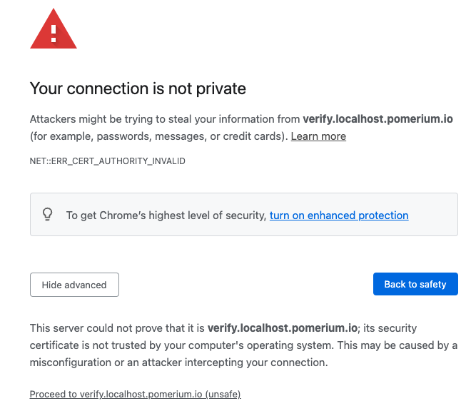
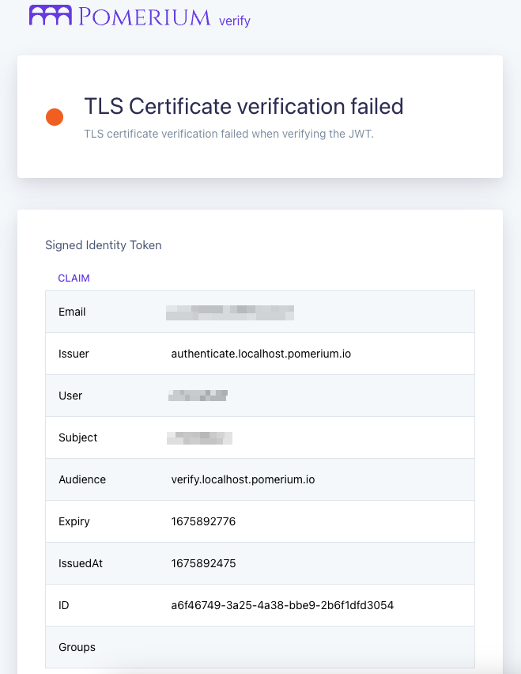

---
# cSpell:ignore thisisunsafe, genkey, noout

title: Pomerium Core using Docker
lang: en-US
sidebar_label: Quickstart
pagination_prev: null
pagination_next: null
description: Get Pomerium up and running quickly with Docker.
keywords:
  [
    pomerium,
    identity access proxy,
    oidc,
    docker,
    reverse proxy,
    containers,
    identity aware proxy,
    quickstart pomerium,
    docker,
    docker-compose,
  ]
---

import ConfigDocker from '@site/content/examples/config/config.docker.yaml.md';
import DockerCompose from '@site/content/examples/docker/basic.docker-compose.yml.md';

In this quickstart guide, you'll run Pomerium Core with Docker containers.

## Prerequisites

- A configured [identity provider]
- [Docker] and [Docker Compose]

## Configure

Create a [configuration file] (e.g. `config.yaml`) for defining Pomerium's configuration settings, routes, and access policies.

<ConfigDocker />

## Update signing key

Generate a [signing key](/docs/reference/signing-key):

```bash
# Generates an P-256 (ES256) signing key
openssl ecparam  -genkey  -name prime256v1  -noout  -out ec_private.pem
# Prints the base64 encoded value of the signing key
cat ec_private.pem | base64
```

Add the base64-encoded signing key to the `signing_key` variable in your `config.yaml` file.

:::tip **Note**

Keep track of the path to this file, relative to the `docker-compose.yaml` file created in the next step. `docker-compose.yaml` will need the correct relative path to your `config.yaml`.

:::

Copy the following `docker-compose.yaml` file and modify it to include the correct path to your `config.yaml` file:

<DockerCompose />

## Run

Run Docker Compose:

```bash
docker compose up
```

Docker will automatically download the required [container images] for Pomerium and [verify]. Then, Pomerium will run with the configuration details set in the previous steps.

You should now be able to access the routes (e.g. `https://verify.localhost.pomerium.io`) as specified in your policy file.

### Handle self-signed certificate warning

When navigating to the `https://verify.localhost.pomerium.io` route defined in your policy, you may encounter the following self-signed certificate warning:



To resolve this error:

1. Select **Advanced**
2. Select **Proceed to verify.localhost.pomerium.io (unsafe)**

Your browser will redirect you to the `verify` route.

Under **Signed Identity Token**, you will see a list of JWT claims with your user details:



## Next Steps

Now, you can experiment with adding services to Docker and defining routes and policies for them in Pomerium. See [Guides](/docs/guides) for help or inspiration.

:::caution

This is a test environment! If you followed all the steps in this doc your Pomerium environment is not using trusted certificates. Remember to use a valid certificate solution before moving this configuration to a production environment. See [Certificates][tls certificates] for more information.

:::

[configuration file]: /docs/reference
[container images]: https://hub.docker.com/r/pomerium/pomerium
[docker]: https://docs.docker.com/install/
[docker compose]: https://docs.docker.com/compose/install/
[verify]: https://verify.pomerium.com/
[identity provider]: /docs/identity-providers
[tls certificates]: /docs/concepts/certificates
[fqdn]: https://en.wikipedia.org/wiki/Fully_qualified_domain_name
[mkcert]: https://github.com/FiloSottile/mkcert
[self-signed wildcard certificate]: /docs/concepts/certificates#self-signed-wildcard-certificate
