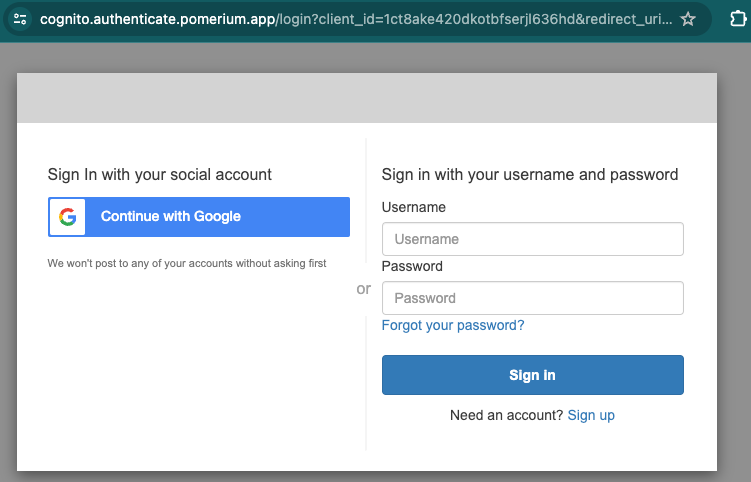

---
# cSpell:ignore thisisunsafe, genkey, noout

title: Run Pomerium Core With Docker
lang: en-US
sidebar_label: Quickstart
pagination_prev: null
pagination_next: null
description: This tutorial teaches you how to set up Pomerium Core to proxy requests to a web application using Docker and Docker Compose.
keywords:
  [
    pomerium,
    pomerium core,
    docker,
    reverse proxy,
    identity aware proxy,
    quickstart pomerium,
    docker,
    docker-compose,
  ]
---

import ConfigDocker from '@site/content/examples/config/config.docker.yaml.md';
import DockerCompose from '@site/content/examples/docker/basic.docker-compose.yml.md';

# Secure a web app with Pomerium

Welcome to the Pomerium Quickstart!

This quickstart shows you how to set up Pomerium Core to proxy requests to an internal web application in a containerized Docker environment.

## How it works

Pomerium Core is an open-source, identity access proxy that secures access to internal web applications and services.

In this tutorial, you’ll configure Pomerium Core and mount the configuration into a Docker Compose file.

You’ll use Docker Compose to run both Pomerium Core and our sample Verify service, an internal web application you’ll secure with Pomerium.

If configured correctly, your Pomerium Core instance will follow the steps described below when it receives a request to access the Verify service:

1. User accesses the Verify service
1. Pomerium redirects request to identity provider for authentication
1. After successful authentication, Pomerium checks authorization policy
1. After successful authorization, Pomerium redirects user to Verify service

## Before you start

Install [Docker] and [Docker Compose].

## Set up Pomerium

Create a `config.yaml` file in the root of your project.

Add the configuration below to `config.yaml`:

<ConfigDocker />

## Set up Docker Compose

Create a `docker-compose.yaml` file in the root of your project.

Add the configuration below to `docker-compose.yaml`:

<DockerCompose />

Run Docker Compose:

```bash
docker compose up
```

## Access the protected app

Go to the [Verify URL](https://verify.localhost.pomerium.io) you defined in `config.yaml`.

<details>
  <summary>Handle self-signed certificate warning</summary>
</details>

Pomerium will redirect you to a hosted identity provider to sign in.



After authenticating, Pomerium will redirect you to the **Verify** service.

You'll see a page like this:


Although identity verification failed, you successfully set up Pomerium to proxy requests to the Verify service.

## Next Steps

Now that you've completed the quickstart, you should configure [Identity Verification](/docs/capabilities/getting-users-identity).

:::caution

This is a test environment! If you followed all the steps in this guide, then your Pomerium environment is not using trusted certificates. Remember to use a valid certificate solution before moving this configuration to a production environment. See [Certificates](/docs/concepts/certificates) for more information.

:::

[configuration file]: /docs/reference
[container images]: https://hub.docker.com/r/pomerium/pomerium
[docker]: https://docs.docker.com/install/
[docker compose]: https://docs.docker.com/compose/install/
