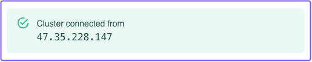
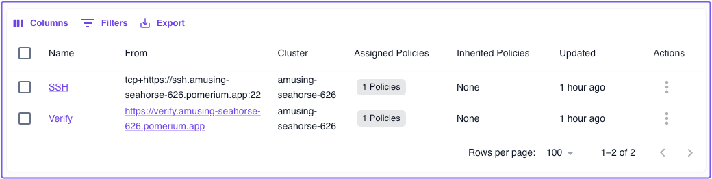
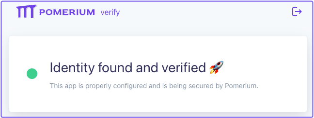
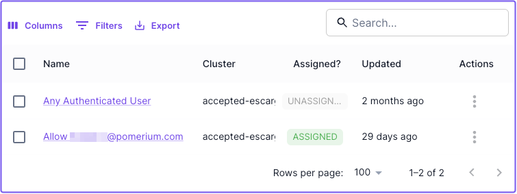
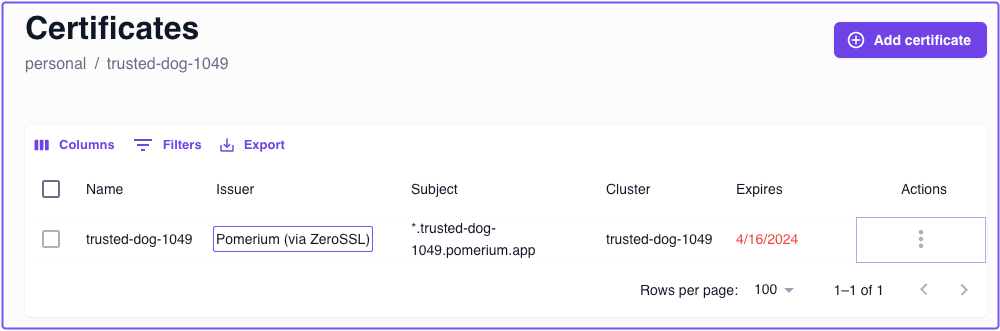

---
# cSpell:ignore thisisunsafe, genkey, noout

lang: en-US
sidebar_label: Quickstart
pagination_prev: null
pagination_next: null
description: Learn how to install and run Pomerium Zero in a Docker container.
keywords:
  [
    pomerium,
    identity access proxy,
    oidc,
    docker,
    reverse proxy,
    containers,
    identity aware proxy,
    quickstart pomerium,
    docker,
    docker-compose,
  ]
---

import Tabs from '@theme/Tabs';
import TabItem from '@theme/TabItem';

# Pomerium Zero Quickstart

The Zero Quickstart shows you how to install and run Pomerium Zero in a Docker container.

## Before you start

- Install [Docker](https://docs.docker.com/install/) and [Docker Compose](https://docs.docker.com/compose/install/)
- Create a (free) [**Pomerium Zero account**](https://console.pomerium.app/create-account)

## Get Pomerium Zero configuration

After you create an account, you'll be directed to the Zero onboarding screen. In the onboarding screen, select the **Docker** tab and copy the Docker Compose configuration.

(If you selected **Finish** before copying the Docker configuration, we've provided a copy below.)

Paste the configuration in a `compose.yaml` file:

```yaml title="compose.yaml" {8,15} showLineNumbers
services:
  pomerium:
    image: pomerium/pomerium:v0.27.0
    ports:
      - 443:443
    restart: always
    environment:
      POMERIUM_ZERO_TOKEN: <CLUSTER_TOKEN>
      XDG_CACHE_HOME: /var/cache
    volumes:
      - pomerium-cache:/var/cache
    networks:
      main:
        aliases:
          - verify.<CLUSTER_STARTER_SUBDOMAIN>.pomerium.app
  verify:
    image: cr.pomerium.com/pomerium/verify:latest
    networks:
      main:
        aliases:
          - verify

networks:
  main: {}

volumes:
  pomerium-cache:
```

Replace the following values:

- **Line 8**: Replace `CLUSTER_TOKEN` with the cluster token generated for you in the onboarding config
- **Line 15**: Replace `CLUSTER_STARTER_SUBDOMAIN` with your generated starter subdomain

:::tip Where's my **Starter Domain?**

You can find your **Starter Domain** at the top of the Zero Console navigation bar:


:::

## Connect to Pomerium Zero

Next, deploy Pomerium with the following command:

```bash
docker compose up -d
```

Pomerium will deploy and run in a special "Zero-managed" mode. In Zero-managed mode, Pomerium connects to the Pomerium Zero cloud service, a remote control plane where you can manage your deployments and configuration.

If your Pomerium deployment connects to the cloud successfully, Pomerium Zero will notify you in the onboarding screen:



Once you've connected, select **Finish**. You'll be directed to the Zero Console.

## Connect to upstream services

In the Zero Console, we've provisioned two starter routes, **SSH** and **Verify**, that come with their own DNS records and TLS certificates:



### Connect to Verify

The first service you'll access is the **Verify** app. This hosted demo app is designed to verify a user's identity, but it also serves as a way to validate that Pomerium is up and running as expected.

In the Zero Console, select the **From** URL for the Verify app.

You should land on the Verify page:



### Connect to SSH

The demo SSH route connects to a remote server that you can use to test SSH connections in Pomerium Zero.

:::note Install Pomerium CLI

You need the Pomerium CLI client to connect to services like **SSH** over a TCP connection. See the [**Pomerium CLI**](/docs/clients/pomerium-cli) page for installation instructions.

:::

In a terminal, enter the following command and replace `CLUSTER_STARTER_DOMAIN` with your own:

```bash
pomerium-cli tcp ssh.<CLUSTER_STARTER_DOMAIN>.app:22
```

Initiate the SSH connection:

```bash
ssh ssh-demo.pomerium.com -p 22
```

A successful request results in a response similar to the one below:

```bash
Warning: Permanently added 'ssh-demo.pomerium.com' (ED25519) to the list of known hosts.
This is an SSH honeypot. Everything is logged and monitored.
```

## Review authorization policy

Select the **Policies** tab. In the policies table, you'll notice the **Any Authenticated User** policy.



This is a simple policy that instructs Pomerium to allow all requests for authenticated users or service accounts. Because you authenticated successfully against our hosted identity provider, Pomerium granted you access to both the SSH and Verify services.

## Review certificates

Pomerium automatically provisions and manages TLS certificates issued by ZeroSSL to secure the starter routes in your cluster, and any routes you may build that use your cluster's starter domain.

To see certificates in your cluster, go to the **Certificates** tab:



## Next Steps

Now that you've completed the Pomerium Zero Quickstart, build your first route:

- **Pomerium Zero Fundamentals: Build Routes**
