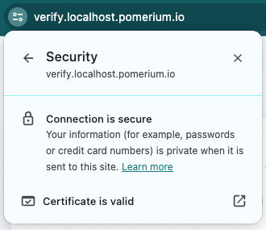

---
# cSpell:ignore thisisunsafe, genkey, noout

title: Secure a Web App With Pomerium Core
lang: en-US
sidebar_label: Quickstart
pagination_prev: null
pagination_next: null
description: In this quickstart guide, you'll learn how to run Pomerium Core in a Docker container and secure access to a web application.
keywords:
  [
    pomerium,
    identity access proxy,
    reverse proxy,
    containers,
    identity aware proxy,
    quickstart,
    docker,
    docker compose,
    core,
    pomerium core,
  ]
---

import ConfigDocker from '@site/content/examples/config/config.docker.yaml.md';
import DockerCompose from '@site/content/examples/docker/basic.docker-compose.yml.md';
import Tabs from '@theme/Tabs';
import TabItem from '@theme/TabItem';

# Secure a Web Application With Pomerium

Welcome to Pomerium! This quickstart shows you how to set up Pomerium Core to proxy requests to an internal web application in a containerized Docker environment.

**Steps to complete**:

1. Configure [Pomerium Core](/docs/deploy/core) and the [Verify](https://verify.pomerium.com/) web app to run in Docker containers
1. Generate certificates and secrets
1. Access the Verify web app behind Pomerium

**Time to complete:** 5 minutes

:::note

Check out [**Pomerium Fundamentals**](/docs/courses/fundamentals/get-started) for step-by-step instructions on how to configure and run Pomerium Core to protect your apps and services.

:::

## Before you start

To complete this guide, you need:

- [Docker] and [Docker Compose]
- [mkcert](https://mkcert.dev/)

:::info

While this guide uses Docker, Pomerium supports other [**architectures and deployment styles**](/docs/deploy), too.

:::

## Set up Pomerium

Create a `config.yaml` file in the root of your project.

Add the configuration below to `config.yaml`:

<ConfigDocker />

### Add a signing key

Pomerium requires a [signing key](/docs/reference/signing-key) to cryptographically sign a user's JWT for identity verification:

```bash
openssl ecparam  -genkey  -name prime256v1  -noout  -out ec_private.pem
cat ec_private.pem | base64
```

Replace `signing_key` in `config.yaml` with the output of these commands.

For example:

```yaml title="config.yaml"
signing_key: LS0tLS1CRUdJTiBFQyBQUklWQVRFIEtFWS0tLS0tCk1IY0NBUUVFSUFsSEdxZnFYYzVFTDUwSE1hbUFyOGdJckVYZ0cxaXI5NkQyb1o3aXVxTDlvQW9HQ0NxR1NNNDkKQXdFSG9VUURRZ0FFN0lSWWtFR1k0YjRjRHRvbXlWaVVlL3RrVVlseGZ4SFZLMUx0R0FHWWN0NEcvbTA1TkpBRwpxZWFBRDdmN3pwMEloeGFNRThEdGVoZHNrQXNKNFIxSG1RPT0KLS0tLS1FTkQgRUMgUFJJVkFURSBLRVktLS0tLQo=
```

### Create a wildcard TLS certificate

Generate locally trusted certificates with [mkcert](https://github.com/FiloSottile/mkcert):

1. Install [mkcert](https://github.com/FiloSottile/mkcert?tab=readme-ov-file#installation)
2. Create a trusted root certificate authority:

```bash
mkcert -install
```

3. Create a wildcard server certificate for `*.localhost.pomerium.io`:

```bash
mkcert "*.localhost.pomerium.io"
```

This creates two files in the current working directory:

- `_wildcard.localhost.pomerium.io.pem`
- `_wildcard.localhost.pomerium.io-key.pem`

## Run Pomerium and the Verify application

Create a `docker-compose.yaml` file in the root of your project.

Add the configuration below to `docker-compose.yaml`:

<DockerCompose />

**Run Docker Compose:**

```bash
docker compose up
```

## Access the protected web app

Go to the [Verify URL](https://verify.localhost.pomerium.io) you defined in `config.yaml`.

Pomerium will redirect you to our hosted identity provider to authenticate.

Then, it will redirect you to the **Verify** service. You'll see a page like this:


Identity verification was successful!

Let's check the certificate, too:



Congratulations! You successfully installed Pomerium and accessed your protected web app.

:::caution

This is a test environment! If you followed all the steps in this guide, then your Pomerium environment is not using trusted certificates. Remember to use a valid certificate solution before moving this configuration to a production environment. See [**TLS Certificates and Encryption**](/docs/concepts/certificates) for more information.

:::

## Next Steps

- [**Build Routes**](/docs/courses/fundamentals/build-routes) to access your services
- [**Build Policies**](/docs/courses/fundamentals/build-policies) to protect your services

:::info

For more information on routes and policies in Pomerium, see the following pages:

- [**Routing, Proxying, and Load Balancing**](/docs/capabilities/routing)
- [**Pomerium Policy Language**](/docs/capabilities/ppl) **(PPL)**

:::

[docker]: https://docs.docker.com/install/
[docker compose]: https://docs.docker.com/compose/install/
