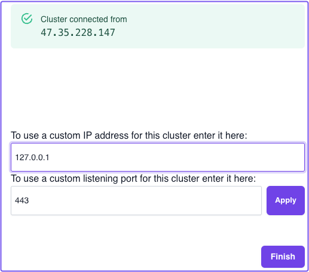
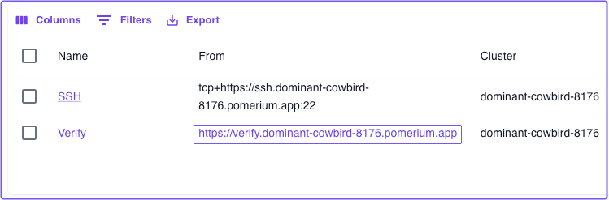
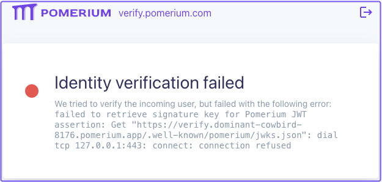
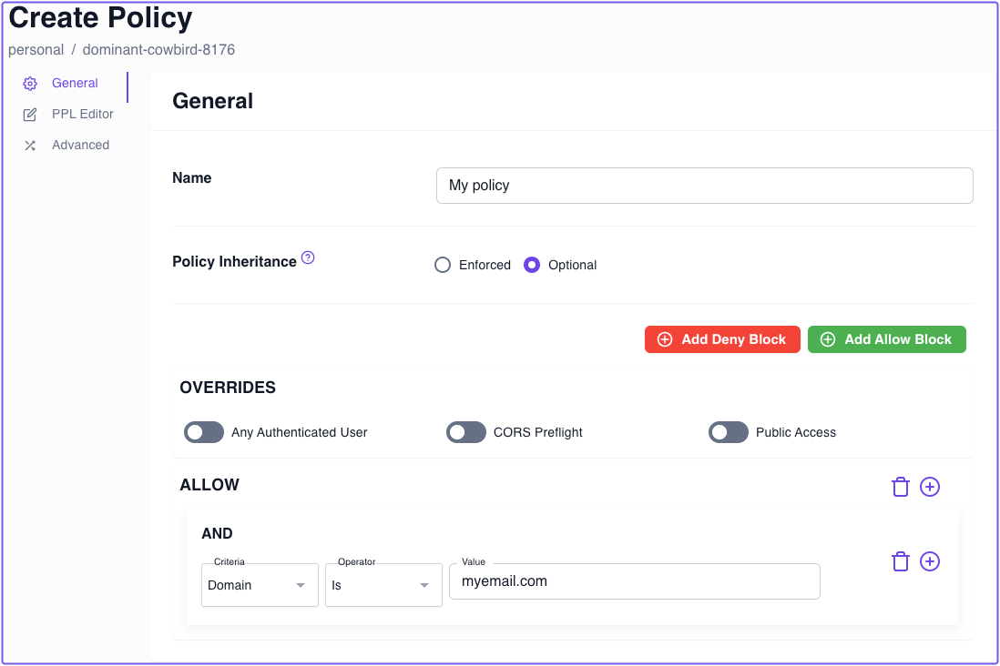
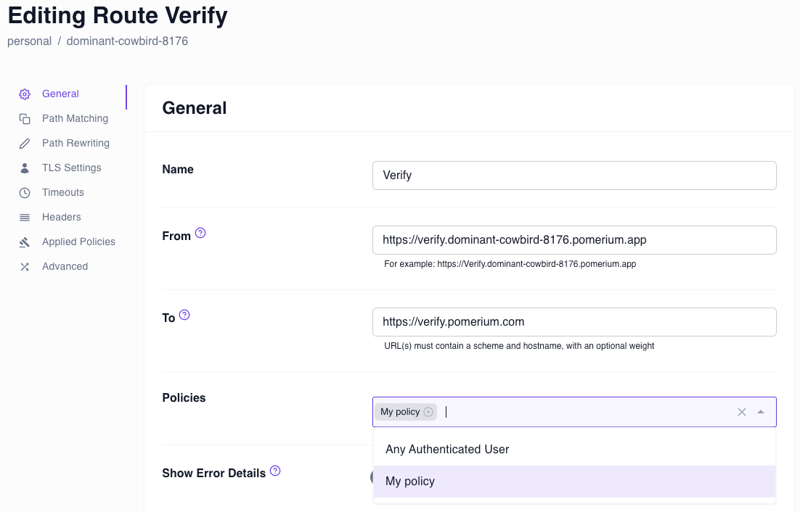

---
# cSpell:ignore thisisunsafe, genkey, noout

title: Run Pomerium Core With Docker
lang: en-US
sidebar_label: Quickstart
pagination_prev: null
pagination_next: null
description: Get Pomerium up and running quickly with Docker.
keywords:
  [
    pomerium,
    identity access proxy,
    oidc,
    docker,
    reverse proxy,
    containers,
    identity aware proxy,
    quickstart pomerium,
    docker,
    docker-compose,
  ]
---

import Tabs from '@theme/Tabs';
import TabItem from '@theme/TabItem';

# Pomerium Zero Quickstart

In this Quickstart, you'll install and run Pomerium Zero in a Docker container. By the end, you'll have a **personal account** and cluster where you can configure routes and policies to your own apps and services.

## Before you start

- Install [Docker](https://docs.docker.com/install/) and [Docker Compose](https://docs.docker.com/compose/install/)
- Create a [**free Pomerium Zero account**](https://console.pomerium.app/create-account)

## Get Pomerium Zero configuration

In the onboarding console, select the **Docker** tab and copy the Docker Compose configuration.

Paste the configuration in a `docker-compose.yaml` file:

```yaml title="docker-compose.yaml"
services:
  pomerium:
    image: pomerium/pomerium:v0.25.1
    ports:
      - 80:80
      - 443:443
    restart: always
    environment:
    // highlight-start
      POMERIUM_ZERO_TOKEN: <REPLACE_WITH_YOUR_TOKEN>
    // highlight-end
      XDG_CACHE_HOME: /var/cache
      AUTOCERT_DIR: /var/cache/autocert
    volumes:
      - pomerium-cache:/var/cache

volumes:
  pomerium-cache:
```

Replace the value of `POMERIUM_ZERO_TOKEN` with the one generated for you in the onboarding config. The token links this **Pomerium Zero Cluster** with your account.

<details>
  <summary>Clusters Overview</summary>
  <div>Include high-level summary of Clusters concept in PZ. Link to Clusters documentation.</div>
</details>

## Run Docker Compose

```bash
docker compose up -d
```

Pomerium Zero will attempt to detect your **public IP** address to connect you to your cluster.

But, it won't be able to because you're running Pomerium Zero in an isolated container with its own private network and IP address.

## Apply custom IP address

To connect Pomerium Zero to your cluster, you need to enter a **custom IP address** to override your detected one.

If you're testing with `localhost`, enter `127.0.0.1`, or enter your preferred IP address. You can also enter your preferred listening port.

Select **Apply** to connect to your cluster:



Once you've connected, select **Finish**.

## Connect to upstream services

In the Zero Console, we've provisioned two routes for you with the following names:

- **SSH**
- **Verify**

### Connect to SSH

In a terminal, enter the following command and replace `YOUR_CLUSTER_DOMAIN_NAME` with your own:

```bash
pomerium-cli tcp ssh.<YOUR_CLUSTER_DOMAIN_NAME>.app:22
```

A successful request results in a response similar to the one below:

```shell-session
$ pomerium-cli tcp ssh.dominant-cowbird-8176.pomerium.app:22
2024/03/25 16:18:45 listening on 127.0.0.1:52541
```

:::note

If you haven't, install [**Pomerium CLI**](/docs/deploy/clients/pomerium-cli) with any of the following methods:

<Tabs>
<TabItem value="docker" label="Docker">

```bash
docker run cr.pomerium.com/pomerium/cli:latest
```

</TabItem>
<TabItem value="yum" label="Yum">

```bash
[pomerium-pomerium]
name=pomerium-pomerium
baseurl=https://dl.cloudsmith.io/public/pomerium/pomerium/rpm/el/$releasever/$basearch
repo_gpgcheck=1
enabled=1
gpgkey=https://dl.cloudsmith.io/public/pomerium/pomerium/gpg.6E388440B94E1407.key
gpgcheck=1
sslverify=1
pkg_gpgcheck=1
```

</TabItem>
<TabItem value="deb" label="Deb">

```bash
curl -1sLf 'https://dl.cloudsmith.io/public/pomerium/pomerium/gpg.6E388440B94E1407.key' | apt-key add -
echo "deb https://dl.cloudsmith.io/public/pomerium/pomerium/deb/debian buster main" > /etc/apt/sources.list.d/pomerium-pomerium.list
```

</TabItem>
<TabItem value="binaries" label="Binaries">

```bash
ARCH=[your arch]
OS=[your os]
VERSION=[desired version]
curl -L https://github.com/pomerium/cli/releases/download/${VERSION}/pomerium-cli-${OS}-${ARCH}.tar.gz \
    | tar -z -x
```

</TabItem>
<TabItem value="homebrew" label="Homebrew">

```bash
brew tap pomerium/tap
brew install pomerium-cli
```

</TabItem>
<TabItem value="source" label="Source">

```bash
git clone git@github.com:pomerium/cli.git
cd pomerium
make build
./bin/pomerium-cli --help
```

</TabItem>

</Tabs>

:::

### Connect to Verify

In the Zero Console, select the **From** route for the Verify app.

For example:



:::note

Because the Verify service uses a publically accessible URL, Pomerium Zero won't be able to connect to the `jwks.json` endpoint to fetch the signing key used to verify the user's JWT.



:::


## Build your own policy

In the **Policy** tab, create a new policy that instructs Pomerim to grant access only if the user's email address ends the specified value.



### Attach the policy to a route

Attach your new policy to the Verify route:



Now, if you authenticate using an email address with a domain other than the one specified in the policy, Pomerium Zero will deny the user access.


