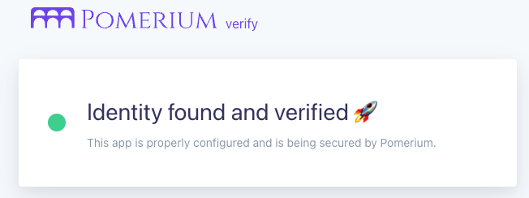

---
# cSpell:ignore thisisunsafe, genkey, noout

title: Secure a Web App With Pomerium Core
lang: en-US
sidebar_label: Quickstart
pagination_prev: null
pagination_next: null
description: In this quickstart guide, you'll learn how to run Pomerium Core in a Docker container and secure access to a web application.
keywords:
  [
    pomerium,
    identity access proxy,
    reverse proxy,
    containers,
    identity aware proxy,
    quickstart,
    docker,
    docker compose,
    core,
    pomerium core,
  ]
---

import ConfigDocker from '@site/content/examples/config/config.docker.yaml.md';
import DockerCompose from '@site/content/examples/docker/basic.docker-compose.yml.md';
import Tabs from '@theme/Tabs';
import TabItem from '@theme/TabItem';

# Secure a Web Application With Pomerium

Welcome to Pomerium! This quickstart shows you how to set up Pomerium Core to proxy requests to an internal web application in a containerized Docker environment.

**Steps to complete**:

1. Configure [Pomerium Core](/docs/deploy/core) and the [Verify](https://verify.pomerium.com/) web app to run in Docker containers
2. Access the Verify web app behind Pomerium

**Time to complete:** 5 minutes

:::note

Check out [**Pomerium Fundamentals**](/docs/courses/fundamentals/get-started) for step-by-step instructions on how to configure and run Pomerium Core to protect your apps and services.

:::

## Before you start

This quickstart requires [Docker] and [Docker Compose].

:::info

While this guide uses Docker, Pomerium supports other [**architectures and deployment styles**](/docs/deploy), too.

:::

## Set up Pomerium

Create a `config.yaml` file in the root of your project.

Add the configuration below to `config.yaml`:

<ConfigDocker />

:::caution

The `signing_key` above is intended to be used for testing purposes. Do not use this signing key in a production environment.

See the [**Signing Key**](/docs/reference/signing-key) reference page for instructions on how to generate your own secure signing key.

:::

## Set up Docker Compose

Create a `docker-compose.yaml` file in the root of your project.

Add the configuration below to `docker-compose.yaml`:

<DockerCompose />

## Run Docker Compose

```bash
docker compose up
```

## Access the protected web app

Go to the [Verify URL](https://verify.localhost.pomerium.io) you defined in `config.yaml`.

### Self-signed certificate warning

Because you don't have a valid certificate, Pomerium generates a self-signed one for you. This will prompt your browser to throw a self-signed certificate warning.

To bypass the warning:

<Tabs>
<TabItem value="Chrome" label="Chrome">

1. Select **Advanced**
1. Select **Proceed to verify.localhost.pomerium.io (unsafe)**

If you don't see an **Advanced** option:

1. Click anywhere in the window
1. Type "thisisunsafe" (no spaces)
1. Make sure **Reload** is selected
1. Select **Enter**

</TabItem>
<TabItem value="Safari" label="Safari">

1. Select **Show Details**
1. Select **visit this website**
1. In the confirmation popup, select **Visit Website**

</TabItem>
<TabItem value="Firefox" label="Firefox">

1. Select **Advanced**
1. Select **Accept the Risk and Continue**

</TabItem>
</Tabs>

Pomerium will redirect you to our hosted identity provider to authenticate.

Then, it will redirect you to the **Verify** service. You'll see a page like this:



Congratulations! You successfully installed Pomerium and accessed your protected web app.

:::caution

This is a test environment! If you followed all the steps in this guide, then your Pomerium environment is not using trusted certificates. Remember to use a valid certificate solution before moving this configuration to a production environment. See [**TLS Certificates and Encryption**](/docs/concepts/certificates) for more information.

:::

## Next Steps

- [**Build Routes**](/docs/courses/fundamentals/build-routes) to access your services
- [**Build Policies**](/docs/courses/fundamentals/build-policies) to protect your services

:::info

For more information on routes and policies in Pomerium, see the following pages:

- [**Routing, Proxying, and Load Balancing**](/docs/capabilities/routing)
- [**Pomerium Policy Language**](/docs/capabilities/ppl) **(PPL)**

:::

[docker]: https://docs.docker.com/install/
[docker compose]: https://docs.docker.com/compose/install/
