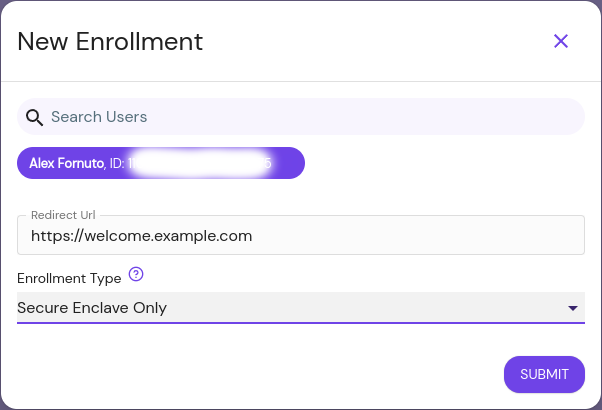

The **New Enrollment** button allows administrators to create a custom link for a specific user to use to register a new device, which will automatically be approved. This scheme is known as [Trust on First Use (TOFU)](https://en.wikipedia.org/wiki/Trust_on_first_use).

